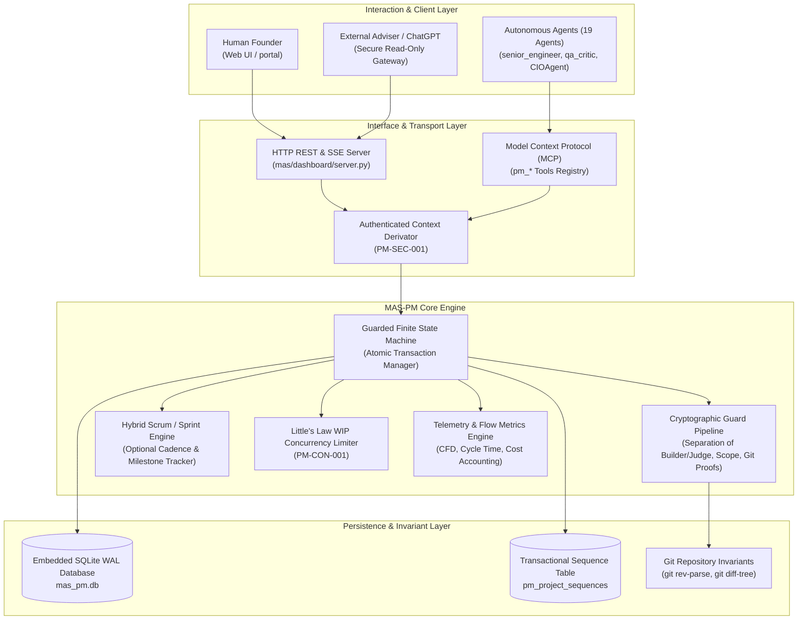

# MAS_PM_BOARD_ARCHITECTURE.md
## Technical Architecture, Component Design & Security Specification for MAS-PM Board

> **Acinonyx Enterprise Systems Engineering Directorate**  
> **Document Reference:** `MAS-ARCH-PM-001`  
> **Epic Reference:** `MAS-PM-BOARD-001`  
> **Authority:** Office of the Independent Reviewer, Chief Architect & Platform Engineering  
> **Baseline Commit:** `357dd4e2`  
> **Target Branch:** `Acinonyx_frontier`  
> **Status:** APPROVED ARCHITECTURAL SPECIFICATION  
> **Companion Documents:** [MAS_PM_BOARD_GAP_ANALYSIS.md](file:///home/acinonyx/Desktop/MAS/MAS_PM_BOARD_GAP_ANALYSIS.md) | [MAS_PM_BOARD_UX_SPEC.md](file:///home/acinonyx/Desktop/MAS/MAS_PM_BOARD_UX_SPEC.md) | [MAS_PM_BOARD_IMPLEMENTATION_PLAN.md](file:///home/acinonyx/Desktop/MAS/MAS_PM_BOARD_IMPLEMENTATION_PLAN.md)

---

### 1. System Vision & Component Topology

The MAS-PM Board architecture provides a self-hosted, agent-native project management system engineered specifically for autonomous agent collectives, the human founder, and external architectural advisers (such as ChatGPT).



---

### 2. Remediated Security Architecture (Blocking Findings)

The architecture natively incorporates the solutions to the six independent review findings before any operational board capabilities are deployed:

#### 2.1 PM-SEC-001: Authenticated Context Derivation (Anti-Impersonation)
* **Design:** An agent or caller cannot supply an arbitrary `caller_principal` string to bypass Separation of Duties.
* **Mechanism:**
  1. The MCP transport and HTTP request middleware extract the identity from the authenticated principal token (`PrincipalContext.current()`).
  2. For inter-agent tool calls, the identity is cryptographically bound to the agent's verified instance name in `mas.core.agent.BaseAgent`.
  3. If a tool argument attempts to pass an explicit `caller_principal` that does not match the execution context token, `ImpersonationAttemptError` is raised immediately.

```python
class SecurityContext:
    @staticmethod
    def get_authenticated_principal(request_context: Optional[Dict[str, Any]] = None) -> str:
        """Derives the verified principal identity. Fails closed if missing or forged."""
        if request_context and "authenticated_principal" in request_context:
            return request_context["authenticated_principal"]
        from mas.iam import CurrentTenantContext
        principal = CurrentTenantContext.get_principal()
        if not principal:
            raise SecurityPolicyViolation("Unauthenticated operation: Execution context lacks verified principal.")
        return principal
```

#### 2.2 PM-SEC-002: Fail-Closed Evidence & Git Verification
* **Design:** No transition to `VERIFICATION` or `JUDICIAL_REVIEW` is permitted without empirical proof verified against ground-truth systems.
* **Mechanism:**
  1. **Git Commit Verification:** `validate_evidence()` executes `git rev-parse --verify {commit_sha}` in the repository to guarantee the commit exists and is reachable.
  2. **Test Log Verification:** For `TEST_RUN_LOG`, the engine verifies that the referenced log file exists on disk, parses the exit code (`exit_code == 0`), and asserts that `sha256(file_content) == content_hash`.
  3. **Timestamp Invariant:** Asserts that the test execution timestamp is greater than or equal to the Git commit timestamp.

#### 2.3 PM-CON-001: Atomic WIP & State Serialization
* **Design:** Complete elimination of race conditions under high concurrency.
* **Mechanism:**
  The entire transition sequence in `FSMEngine.transition()` is wrapped inside an atomic `BEGIN IMMEDIATE` transaction on SQLite:
  ```python
  with self.db.atomic_transaction() as conn:
      issue = self._fetch_issue_for_update(conn, issue_id)
      self._evaluate_guards(conn, issue, target_state, caller_principal)
      self._check_wip_limits(conn, issue.project_id, target_state)
      self._update_state(conn, issue.id, target_state, caller_principal)
  ```
  Because `BEGIN IMMEDIATE` acquires a reserved write lock immediately, concurrent workers are serialized; no two agents can simultaneously pass `check_wip_limits()` for the final remaining slot.

#### 2.4 PM-SEC-003: Filesystem Scope Jailing via Git Changeset Inspection
* **Design:** Prevents unauthorized filesystem mutations from entering verification.
* **Mechanism:**
  During the transition from `IN_PROGRESS` to `VERIFICATION`, the engine inspects the actual Git changeset:
  ```bash
  git diff-tree --no-commit-id --name-only -r <commit_sha>
  ```
  Every modified file path is matched against `issue.path_whitelist` and checked against `issue.forbidden_paths`. If any file modified in the commit falls outside the whitelist, the transition fails with `ScopeJailViolationError`.

#### 2.5 PM-DATA-001: Transactional Sequence Key Allocation
* **Design:** Safe, zero-collision issue numbering (`CORE-1`, `CORE-2`, `CORE-3`).
* **Mechanism:**
  A dedicated sequence table is introduced:
  ```sql
  CREATE TABLE IF NOT EXISTS pm_project_sequences (
      project_key TEXT PRIMARY KEY,
      last_sequence INTEGER NOT NULL DEFAULT 0
  );
  ```
  Key allocation uses atomic SQL:
  ```sql
  INSERT INTO pm_project_sequences (project_key, last_sequence)
  VALUES (?, 1)
  ON CONFLICT(project_key) DO UPDATE SET last_sequence = last_sequence + 1
  RETURNING last_sequence;
  ```

#### 2.6 PM-GOV-001: Stale Approval Invalidation & Cycle Versioning
* **Design:** Rework cycles invalidate previous critic approvals.
* **Mechanism:**
  1. `pm_issues` tracks `rework_cycle INTEGER NOT NULL DEFAULT 0`.
  2. When an issue moves to `REJECTED_REWORK`, `rework_cycle` increments by 1.
  3. `pm_critic_verdicts` stores `rework_cycle INTEGER NOT NULL`.
  4. `validate_critic_verdicts()` strictly asserts:
     ```sql
     SELECT * FROM pm_critic_verdicts 
     WHERE issue_id = ? AND rework_cycle = ? AND verdict = 'PASS'
     ```
     Any verdict from a prior cycle is discarded as stale.

---

### 3. Extended Relational Data Model

To support Scrum capabilities, atomic sequences, and auditability without breaking existing models, the SQLite schema is extended:

```sql
-- Sequence Allocation Table (PM-DATA-001)
CREATE TABLE IF NOT EXISTS pm_project_sequences (
    project_key TEXT PRIMARY KEY,
    last_sequence INTEGER NOT NULL DEFAULT 0
);

-- Sprints / Iterations Table (Scrum Layer)
CREATE TABLE IF NOT EXISTS pm_sprints (
    id TEXT PRIMARY KEY,
    project_id TEXT NOT NULL,
    name TEXT NOT NULL,
    goal TEXT,
    state TEXT NOT NULL CHECK(state IN ('FUTURE', 'ACTIVE', 'CLOSED')),
    start_date TIMESTAMP,
    end_date TIMESTAMP,
    created_at TIMESTAMP DEFAULT CURRENT_TIMESTAMP,
    FOREIGN KEY(project_id) REFERENCES pm_projects(id) ON DELETE CASCADE
);

-- Schema Additions to pm_issues
-- ALTER TABLE pm_issues ADD COLUMN sprint_id TEXT REFERENCES pm_sprints(id) ON DELETE SET NULL;
-- ALTER TABLE pm_issues ADD COLUMN priority TEXT NOT NULL DEFAULT 'MEDIUM' CHECK(priority IN ('CRITICAL', 'HIGH', 'MEDIUM', 'LOW'));
-- ALTER TABLE pm_issues ADD COLUMN rework_cycle INTEGER NOT NULL DEFAULT 0;
-- ALTER TABLE pm_issues ADD COLUMN blocker_reason TEXT;

-- Schema Additions to pm_critic_verdicts
-- ALTER TABLE pm_critic_verdicts ADD COLUMN rework_cycle INTEGER NOT NULL DEFAULT 0;
-- ALTER TABLE pm_critic_verdicts ADD COLUMN commit_sha TEXT;

-- External Advisor Inspection Tokens Table
CREATE TABLE IF NOT EXISTS pm_external_tokens (
    token_hash TEXT PRIMARY KEY,
    client_name TEXT NOT NULL, -- e.g. 'ChatGPT-Architectural-Adviser'
    scopes TEXT NOT NULL DEFAULT 'read:pm',
    created_at TIMESTAMP DEFAULT CURRENT_TIMESTAMP,
    expires_at TIMESTAMP
);
```

---

### 4. External Architectural Adviser (ChatGPT) Gateway

Section 4.F requires a secure, read-only interface through which an external architectural adviser (such as ChatGPT) can inspect board state and architecture decisions without exposing internal execution surfaces.

#### Security & Redaction Boundaries:
1. **Zero External Write Access:** The external endpoint is strictly read-only (`GET`).
2. **Redaction Pipeline:** Strips sensitive credentials, API keys, internal environment variables, and proprietary tenant secrets.
3. **Structured Summary Contract:** Provides a consolidated, token-efficient JSON response containing:
   - Project catalog and active sprint goals.
   - High-priority and blocking issues (`BLOCKED`, `REJECTED_REWORK`).
   - Architectural decisions awaiting human/adviser approval.
   - Verifiable Git commit references and Merkle roots.

#### Endpoint Specification:
`GET /api/pm/external/inspection?token=<SECURE_BEARER_TOKEN>`
```json
{
  "system": "ACINONYX / MAS-Core",
  "inspection_timestamp": "2026-10-08T10:30:00Z",
  "project": {
    "key": "CORE",
    "name": "MAS Core System",
    "flow_health": "OPTIMAL",
    "wip_saturation_pct": 50.0
  },
  "blocked_issues": [
    {
      "key": "CORE-14",
      "title": "Database Migration Locks",
      "priority": "HIGH",
      "blocker_reason": "Waiting on schema lock approval"
    }
  ],
  "in_progress_issues": [
    {
      "key": "CORE-15",
      "title": "Atomic WIP Guard",
      "assignee": "senior_engineer",
      "appetite_tokens": 50000,
      "tokens_spent": 14200
    }
  ],
  "verification_queue": [
    {
      "key": "CORE-12",
      "title": "Filesystem Scope Enforcement",
      "git_commit": "357dd4e2",
      "tests_passed": true,
      "awaiting_verdicts": ["qa_critic", "adversarial_red_team"]
    }
  ]
}
```

---

### 5. Architectural Invariants Summary

1. **Single Source of Truth:** `mas_pm.db` is the sole relational state of record. The visual board does not manage independent state.
2. **Deterministic Gating:** No optimistic visual moves. Every user or agent action calls the FSM and commits only upon guard satisfaction.
3. **Fail-Closed Verification:** If Git commits, test hashes, or reviewer signatures cannot be proven, the transition is unconditionally aborted.
4. **Zero Proprietary Bloat:** Fully standalone, sub-millisecond local execution without Jira API latencies or cloud subscription locks.

---

*Authored by Project ACINONYX Architecture & Independent Review Directorate.*  
*Companion Deliverables: [MAS_PM_BOARD_GAP_ANALYSIS.md](file:///home/acinonyx/Desktop/MAS/MAS_PM_BOARD_GAP_ANALYSIS.md) | [MAS_PM_BOARD_UX_SPEC.md](file:///home/acinonyx/Desktop/MAS/MAS_PM_BOARD_UX_SPEC.md) | [MAS_PM_BOARD_IMPLEMENTATION_PLAN.md](file:///home/acinonyx/Desktop/MAS/MAS_PM_BOARD_IMPLEMENTATION_PLAN.md)*
