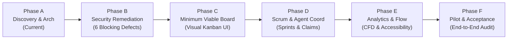

# MAS_PM_BOARD_IMPLEMENTATION_PLAN.md
## Phased Implementation Plan, Backlog & Rollout Order for MAS-PM Board

> **Acinonyx Enterprise Systems Engineering Directorate**  
> **Document Reference:** `MAS-PLAN-PM-001`  
> **Epic Reference:** `MAS-PM-BOARD-001`  
> **Authority:** Office of the Independent Reviewer, Chief Architect & Platform Engineering  
> **Baseline Commit:** `357dd4e2`  
> **Target Branch:** `Acinonyx_frontier`  
> **Status:** APPROVED ROLLOUT PLAN (AWAITING FOUNDER SIGN-OFF)  
> **Companion Documents:** [MAS_PM_BOARD_GAP_ANALYSIS.md](file:///home/acinonyx/Desktop/MAS/MAS_PM_BOARD_GAP_ANALYSIS.md) | [MAS_PM_BOARD_ARCHITECTURE.md](file:///home/acinonyx/Desktop/MAS/MAS_PM_BOARD_ARCHITECTURE.md) | [MAS_PM_BOARD_UX_SPEC.md](file:///home/acinonyx/Desktop/MAS/MAS_PM_BOARD_UX_SPEC.md)

---

### 1. Rollout Strategy & Phasing Overview

In accordance with Section 6 of `MAS-PM-BOARD-001`, implementation follows a strict 6-phase sequence. Autonomous agents are prohibited from declaring phases complete without verifiable empirical evidence:

---

### 2. Detailed Work Breakdown Structure (WBS)

#### Phase A: Discovery, Architecture & Backlog Registration (COMPLETE)
* [x] **A.1:** Forensic gap analysis comparing documented requirements against implemented behavior (`MAS_PM_BOARD_GAP_ANALYSIS.md`).
* [x] **A.2:** Component architecture, data contracts, and security design specification (`MAS_PM_BOARD_ARCHITECTURE.md`).
* [x] **A.3:** User experience, visual interaction model, and accessibility specification (`MAS_PM_BOARD_UX_SPEC.md`).
* [x] **A.4:** Implementation plan and prioritized backlog registration (`MAS_PM_BOARD_IMPLEMENTATION_PLAN.md`).
* [x] **A.5:** Register `PM-SEC-001` through `PM-GOV-001` and `MAS-PM-BOARD-001` into `mas_pm.db`.

---

#### Phase B: Security & Correctness (Remediation of Blocking Findings)
*Mandatory Prerequisite: No autonomous execution or production release may proceed until Phase B is independently verified.*

* [ ] **B.1 (`PM-SEC-001` - Critical): Context-Derived Authenticated Identities**
  * *Component:* `mas/security.py`, `mas/pm/fsm.py`, `mas/pm/tools.py`
  * *Work:* Extract principal identity from verified execution context (`PrincipalContext.current()`). Block caller-supplied `caller_principal` overrides with `ImpersonationAttemptError`.
  * *Acceptance Criteria:* Passing test verifying an agent assigned as `senior_engineer` cannot approve its own issue by supplying `caller_principal="qa_critic"`.
* [ ] **B.2 (`PM-SEC-002` - Critical): Fail-Closed Real Evidence Validation**
  * *Component:* `mas/pm/guards.py`
  * *Work:* Verify `GIT_COMMIT` against actual repository via `git rev-parse --verify`. Verify `TEST_RUN_LOG` exists on disk and hash matches file bytes. Validate test timestamp $\ge$ commit timestamp.
  * *Acceptance Criteria:* Passing test verifying non-existent Git SHAs or mismatched file hashes are rejected with `UnverifiedWorkError`.
* [ ] **B.3 (`PM-CON-001` - Critical): Atomic Concurrency Serialization**
  * *Component:* `mas/pm/fsm.py`, `mas/pm/db.py`
  * *Work:* Wrap entire transition sequence (fetch, guard check, WIP check, state update) in an atomic `BEGIN IMMEDIATE` transaction block with a threading lock.
  * *Acceptance Criteria:* Concurrency stress test verifying that 10 simultaneous workers cannot exceed the WIP limit of 4.
* [ ] **B.4 (`PM-SEC-003` - High): Scope Whitelist Enforcement on Git Changesets**
  * *Component:* `mas/pm/guards.py`
  * *Work:* On transition to `VERIFICATION`, execute `git diff-tree --no-commit-id --name-only -r <commit_sha>` and assert all changed files match `path_whitelist` and zero `forbidden_paths`.
  * *Acceptance Criteria:* Passing test rejecting transition when a commit touches a file outside the approved scope.
* [ ] **B.5 (`PM-DATA-001` - High): Transactional Sequence Key Allocation**
  * *Component:* `mas/pm/db.py`
  * *Work:* Create `pm_project_sequences` table. Allocate sequence numbers using atomic `INSERT ... ON CONFLICT DO UPDATE RETURNING`.
  * *Acceptance Criteria:* Test generating 50 concurrent issues produces zero duplicate keys or race condition exceptions.
* [ ] **B.6 (`PM-GOV-001` - High): Stale Approval Invalidation & Cycle Versioning**
  * *Component:* `mas/pm/db.py`, `mas/pm/guards.py`
  * *Work:* Add `rework_cycle` to `pm_issues` and `pm_critic_verdicts`. Invalidate previous cycle approvals when an issue enters `REJECTED_REWORK`.
  * *Acceptance Criteria:* Passing test showing an issue that had a `PASS` verdict, went to `REJECTED_REWORK`, and re-entered review cannot pass without a fresh verdict.
* [ ] **B.7: Remediation Verification Suite**
  * *Component:* `tests/test_pm_remediation.py`
  * *Work:* Author exhaustive test suite asserting all 6 remediations.

---

#### Phase C: Minimum Viable Board (Canonical UI & Guarded Workflows)
* [ ] **C.1: Relational Schema Migrations**
  * *Component:* `mas/pm/db.py`
  * *Work:* Add tables for `pm_sprints`, `pm_project_sequences`, and columns for priority, rework cycles, and blocker reasons.
* [ ] **C.2: Dashboard REST & SSE API Expansion**
  * *Component:* `mas/dashboard/server.py`
  * *Work:* Implement endpoints:
    * `POST /api/pm/transition`: Guarded transition bridge.
    * `POST /api/pm/issues/create`: Issue authoring with validation.
    * `GET /api/pm/board/<key>`: Optimized live board payload.
* [ ] **C.3: Visual Board View in Portal (`portal/`)**
  * *Component:* `portal/index.html`, `portal/js/board.js`, `portal/css/board.css`
  * *Work:* Render 7 primary columns (`BACKLOG` through `DONE`) and 2 exceptional drawers (`BLOCKED`, `REJECTED_REWORK`).
* [ ] **C.4: Zero-Optimistic Drag-and-Drop Bridge**
  * *Component:* `portal/js/board.js`
  * *Work:* Intercept card drop, trigger backend transition, animate card to destination on success or shake and snap back with explanatory modal on guard rejection.
* [ ] **C.5: Issue Detail Slide-Over Drawer**
  * *Component:* `portal/js/board.js`
  * *Work:* Multi-tab drawer rendering problem statement, scope jailing, attached evidence links, and verdict history.

---

#### Phase D: Scrum & Agent Coordination
* [ ] **D.1: Hybrid Scrum Planning Layer**
  * *Component:* `mas/pm/sprint.py`, `portal/js/board.js`
  * *Work:* Sprint creation, goal tracking, backlog assignment, start/end dates, and carry-over management. Keep continuous Kanban as default.
* [ ] **D.2: Atomic Agent Task Claiming Protocol**
  * *Component:* `mas/pm/tools.py`
  * *Work:* Expose `pm_claim_task` MCP tool allowing agents to atomically pull available work from `STAGED` into `IN_PROGRESS` matching their role and capacity.
* [ ] **D.3: Human-in-the-Loop Approval Traps**
  * *Component:* `mas/pm/guards.py`
  * *Work:* Require explicit human token approval for high-risk actions (production release, database drop, external messaging).
* [ ] **D.4: External Adviser (ChatGPT) Read-Only Gateway**
  * *Component:* `mas/dashboard/server.py`
  * *Work:* Implement `GET /api/pm/external/inspection` with token authentication and sensitive credential redaction.

---

#### Phase E: Analytics, Flow Telemetry & Usability
* [ ] **E.1: Cumulative Flow Diagram (CFD) Visualizer**
  * *Component:* `portal/js/board.js`
  * *Work:* Render interactive SVG/Canvas CFD tracking work distribution across states over time.
* [ ] **E.2: Cycle Time Scatterplot & Flow Efficiency**
  * *Component:* `portal/js/board.js`, `mas/pm/metrics.py`
  * *Work:* Graph cycle time vs completion date and display real-time flow efficiency percentage.
* [ ] **E.3: Token & Cost Accounting Engine**
  * *Component:* `mas/pm/metrics.py`
  * *Work:* Track token expenditure per issue, epic, and completed milestone.
* [ ] **E.4: Keyboard Shortcuts & ARIA Live Accessibility**
  * *Component:* `portal/js/board.js`
  * *Work:* Implement `j`/`k`, `h`/`l`, `Enter`, `m` shortcuts; add `aria-live` state announcements.

---

#### Phase F: Pilot Simulation & Independent Acceptance
* [ ] **F.1: End-to-End Pilot Execution**
  * *Work:* Run a synthetic project (`PILOT`) through the complete lifecycle:
    1. Backlog creation $\to$ Refinement $\to$ Staging.
    2. Concurrent claiming by 4 agents.
    3. Injection of synthetic failing tests and verification of `REJECTED_REWORK` routing.
    4. Successful re-test, critic verdicts, and Merkle release sealing.
    5. Attempted illegal moves (self-approval, scope escape, WIP saturation) asserting 100% rejection.
* [ ] **F.2: Pilot Reporting & Adversarial Review**
  * *Deliverables:* Produce `MAS_PM_BOARD_PILOT_REPORT.md` and `MAS_PM_BOARD_ADVERSARIAL_REVIEW.md`.
* [ ] **F.3: Final Quality Gate & Adoption**
  * *Work:* Execute `bash scripts/run_quality_gate.sh`, verify all tests pass, and present package to founder for production adoption.

---

### 3. Prioritized Backlog Register

| Issue Key | Type | Priority | Status | Title | Blocks |
|---|---|---|---|---|---|
| **PM-SEC-001** | Defect | Critical | BACKLOG | Derive agent identities from authenticated execution context | MAS-PM-BOARD-001 |
| **PM-SEC-002** | Defect | Critical | BACKLOG | Fail-closed validation for real Git commits and test outputs | MAS-PM-BOARD-001 |
| **PM-CON-001** | Defect | Critical | BACKLOG | Atomic state transitions and WIP capacity serialization | MAS-PM-BOARD-001 |
| **PM-SEC-003** | Defect | High | BACKLOG | Enforce filesystem scope whitelist against Git changesets | MAS-PM-BOARD-001 |
| **PM-DATA-001** | Defect | High | BACKLOG | Safe sequence allocation for issue key generation | MAS-PM-BOARD-001 |
| **PM-GOV-001** | Defect | High | BACKLOG | Stale approval invalidation upon rework cycle re-entry | MAS-PM-BOARD-001 |
| **MAS-PM-BOARD-001** | Epic | High | BACKLOG | Design and Implement the Native Scrum/Kanban Board | Production Adoption |

---

*Authored by Project ACINONYX Architecture & Independent Review Directorate.*  
*Companion Deliverables: [MAS_PM_BOARD_GAP_ANALYSIS.md](file:///home/acinonyx/Desktop/MAS/MAS_PM_BOARD_GAP_ANALYSIS.md) | [MAS_PM_BOARD_ARCHITECTURE.md](file:///home/acinonyx/Desktop/MAS/MAS_PM_BOARD_ARCHITECTURE.md) | [MAS_PM_BOARD_UX_SPEC.md](file:///home/acinonyx/Desktop/MAS/MAS_PM_BOARD_UX_SPEC.md)*
