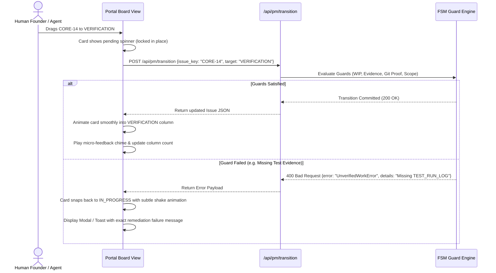

# MAS_PM_BOARD_UX_SPEC.md
## User Experience, Interaction Model & Accessibility Specification for MAS-PM Board

> **Acinonyx Enterprise Systems Engineering Directorate**  
> **Document Reference:** `MAS-UX-PM-001`  
> **Epic Reference:** `MAS-PM-BOARD-001`  
> **Authority:** Office of the Independent Reviewer, Chief Architect & Product Experience  
> **Baseline Commit:** `357dd4e2`  
> **Target Branch:** `Acinonyx_frontier`  
> **Status:** APPROVED UX & ACCESSIBILITY SPECIFICATION  
> **Companion Documents:** [MAS_PM_BOARD_GAP_ANALYSIS.md](file:///home/acinonyx/Desktop/MAS/MAS_PM_BOARD_GAP_ANALYSIS.md) | [MAS_PM_BOARD_ARCHITECTURE.md](file:///home/acinonyx/Desktop/MAS/MAS_PM_BOARD_ARCHITECTURE.md) | [MAS_PM_BOARD_IMPLEMENTATION_PLAN.md](file:///home/acinonyx/Desktop/MAS/MAS_PM_BOARD_IMPLEMENTATION_PLAN.md)

---

### 1. UX Strategy & Canonical Host Placement

In accordance with Section 5 of `MAS-PM-BOARD-001`, ACINONYX must provide a unified, coherent interface rather than fractured, competing portals.

The Project Management Board is integrated directly into the **ACINONYX Living Portal (`portal/`)** as the primary `Board` view (`nav-board`). This guarantees:
- **Zero Context Switching:** The human founder and engineers can transition seamlessly between research compendiums, system topologies, FinOps metrics, and operational task execution.
- **Shared Aesthetic Language:** Adheres to the **Technical Cockpit / Refined Cybernetic Anti-Slop Archetype** ([templates/anti_slop_web/README.md](file:///home/acinonyx/Desktop/MAS/templates/anti_slop_web/README.md)): deep navy-slate background (`#06080e`), crisp telemetry borders, and zero generic purple glow or meaningless marketing copy.
- **Unified Micro-Interaction Fabric:** Reuses the existing `ToastManager`, keyboard HUD (`?`), and accessible modal components.

---

### 2. Information Architecture & Navigation

The main portal navigation bar is extended with a dedicated **Board** item:

```
[ACINONYX // MAS-Core]   Home | Reader | FinOps | Topologies | Benchmarks | Board (Kanban/Scrum) | Timeline | Vault
```

Inside the Board view, a secondary view selector allows switching between:
1. **Active Board (Kanban):** Continuous flow visualization with Little's Law WIP constraints.
2. **Backlog & Hierarchy:** Tree view of Initiatives $\to$ Epics $\to$ Tasks $\to$ Subtasks $\to$ Defects.
3. **Sprint Planner (Scrum):** Optional goal-oriented iteration management.
4. **Flow Telemetry:** Cumulative Flow Diagrams (CFD), cycle time scatterplots, and token burn charts.

---

### 3. Visual Workflow Board Layout

The Kanban board features 7 primary workflow columns and 2 exceptional state panels:

```
┌────────────────────────────────────────────────────────────────────────────────────────────────────────┐
│ BOARD HEADER: Project [CORE] ▾ | Filter: Assignee ▾ | Priority ▾ | Sprint [Sprint 1] ▾ | 🔍 Quick Search │
├───────────┬───────────┬───────────┬──────────────┬──────────────┬──────────────┬───────────┤ Exceptional
│  BACKLOG  │  REFINED  │  STAGED   │ IN_PROGRESS  │ VERIFICATION │JUDICIAL_REV. │   DONE    │  Drawers:
│ (Unshaped)│ (Shaped)  │(Scope-Jail│  (WIP: 4)    │  (WIP: 2)    │  (WIP: 2)    │ (Merkle)  │ ┌─────────┐
│   [ 12 ]  │   [ 3 ]   │   [ 2 ]   │    [ 3/4 ]   │    [ 1/2 ]   │    [ 1/2 ]   │  [ 48 ]   │ │ BLOCKED │
│           │           │           │              │              │              │           │ │   [1]   │
│ ┌───────┐ │ ┌───────┐ │ ┌───────┐ │ ┌──────────┐ │ ┌──────────┐ │ ┌──────────┐ │ ┌───────┐ │ ├─────────┤
│ │CARD 1 │ │ │CARD 2 │ │ │CARD 3 │ │ │CARD 4    │ │ │CARD 5    │ │ │CARD 6    │ │ │CARD 7 │ │ │ REWORK  │
│ └───────┘ │ └───────┘ │ └───────┘ │ └──────────┘ │ └──────────┘ │ └──────────┘ │ └───────┘ │ │   [1]   │
│           │           │           │              │              │              │           │ └─────────┘
└───────────┴───────────┴───────────┴──────────────┴──────────────┴──────────────┴───────────┴────────────
```

#### Column Rules & Visual Indicators:
* **WIP Badges:** Header shows `[Current / Limit]`.
  * If $\text{Current} < \text{Limit}$: Neutral Cyan badge (`#00f0ff`).
  * If $\text{Current} == \text{Limit}$: Amber Warning badge (`#f59e0b`).
  * If an agent/user attempts to pull when saturated: Column border pulses Crimson (`#ef4444`).
* **Exceptional Trays:** `BLOCKED` and `REJECTED_REWORK` are dockable side trays that highlight when non-zero items require attention.

---

### 4. Card Anatomy & Component Specification

Every task card is an information-dense, highly readable component:

```
┌──────────────────────────────────────────────────────────────────┐
│ [TASK] CORE-14                      [CRITICAL] ▾  [Age: 18m]     │
│ Implement Atomic Concurrency Serialization                       │
│ ──────────────────────────────────────────────────────────────── │
│ Epic: MAS-PM-BOARD-001              Assignee: senior_engineer    │
│ Scope: mas/pm/db.py, mas/pm/fsm.py                               │
│ Appetite: [██████████░░░░░░] 14.2k / 50k tokens (28%)            │
│ Evidence: [Git: 357dd4e] [Tests: Passed (12/12)]                 │
│ Critics:  [QA: PASS] [Sec: PENDING] [Arch: UNREVIEWED]           │
└──────────────────────────────────────────────────────────────────┘
```

#### Card Elements Breakdown:
1. **Header Row:**
   * **Issue Type Icon & Key:** Distinct glyph (Epic: 🟣, Task: 🔵, Defect: 🔴, Subtask: ⚪) + Key (`CORE-14`).
   * **Priority Chip:** `CRITICAL` (Flame Red), `HIGH` (Amber), `MEDIUM` (Slate), `LOW` (Muted).
   * **Age Indicator:** Elapsed time since column entry (`18m`, `2h`, `1d`).
2. **Title:** High-contrast text ($\ge 16:1$ ratio) truncated cleanly at 2 lines.
3. **Metadata Section:**
   * **Parent Epic Chip:** Clickable tag filtering the board by that Epic.
   * **Assignee Pill:** Shows agent name and avatar/department badge.
   * **Scope Summary:** Comma-separated list of whitelisted file paths.
4. **Appetite vs Usage Bar:** Visual progress bar tracking tokens spent against allocated budget. Turns amber at 80% and red at 95%.
5. **Verifiable Proof Chips:**
   * **Git Chip:** Clickable commit SHA linking to local git inspector.
   * **Test Log Chip:** Green checkmark for exit code 0; red cross for failures.
   * **Critic Pills:** Three mini-badges displaying verdict status for `QA Critic`, `Red Team Security`, and `Chief Architect`.

---

### 5. Interaction Model & Guarded Drag-and-Drop Bridge

#### 5.1 Zero-Optimistic UI Invariant
A foundational flaw in traditional tools (Jira, Trello) is optimistic updating: the UI immediately moves the card, masking network or validation failures. 

**MAS Invariant:** The card visual state **never updates optimistically**. Every move is routed through the FSM:



#### 5.2 Transition Rejection Explanatory Modal
When an illegal transition is attempted, the user receives an unvarnished technical explanation:
* **Modal Title:** `Transition Rejected by Policy Guard`
* **Violated Invariant:** e.g., `Separation of Builder and Judge (PM-SEC-001)`
* **Technical Reason:** *"Agent 'senior_engineer' is the assignee of CORE-14 and cannot cast the QA Critic verification verdict."*
* **Required Corrective Action:** *"Must be transitioned by principal 'qa_critic' or 'CIOAgent'."*

---

### 6. Issue Detail Slide-Over Drawer

Clicking any card opens a sliding right drawer without navigating away from the board:
* **Overview Tab:** Complete problem statement, acceptance criteria, and Definition of Done.
* **Scope & Boundaries Tab:** Whitelisted paths, forbidden directories, and real Git changeset diff.
* **Evidence Ledger Tab:** Cryptographic hashes, attached test run output logs, and Playwright screenshots.
* **Critic Verdicts Tab:** Signature audit trail of all reviewer decisions with timestamped findings.
* **History Tab:** Chronological timeline of all state transitions and agent actions.

---

### 7. Accessibility & Keyboard Ergonomics (WCAG 2.2 AA)

The board complies with strict enterprise accessibility standards:

#### 7.1 Mathematical Contrast Compliance
* **Canvas Background:** `#06080e` (Navy-black).
* **Column Surfaces:** `rgba(16, 24, 39, 0.75)` with `1px solid rgba(255, 255, 255, 0.1)`.
* **Primary Text:** `#f8fafc` (Contrast ratio: **16.2:1** against canvas).
* **Secondary Text:** `#94a3b8` (Contrast ratio: **6.8:1** against canvas).
* **Interactive Elements:** Minimum target dimension of $24\times24\text{px}$ on desktop and $44\times44\text{px}$ on mobile.

#### 7.2 Keyboard Navigation Map
* `j` / `k`: Select next / previous card in active column.
* `h` / `l`: Move focus to adjacent left / right column.
* `Enter` / `Space`: Open Issue Detail Slide-Over Drawer.
* `m`: Open keyboard move prompt (select target state via number keys `1–7`).
* `/`: Focus quick-filter search box.
* `Escape`: Close detail drawer or active modal.

#### 7.3 Screen Reader Announcements
* Columns and cards use semantic HTML (`role="region"`, `role="list"`, `role="listitem"`).
* Column state updates are broadcast via an off-screen `aria-live="polite"` status region:  
  * *"Issue CORE-14 successfully transitioned to Verification. Column Verification is now at 2 of 2 capacity."*

---

*Authored by Project ACINONYX Architecture & Product Experience Directorate.*  
*Companion Deliverables: [MAS_PM_BOARD_GAP_ANALYSIS.md](file:///home/acinonyx/Desktop/MAS/MAS_PM_BOARD_GAP_ANALYSIS.md) | [MAS_PM_BOARD_ARCHITECTURE.md](file:///home/acinonyx/Desktop/MAS/MAS_PM_BOARD_ARCHITECTURE.md) | [MAS_PM_BOARD_IMPLEMENTATION_PLAN.md](file:///home/acinonyx/Desktop/MAS/MAS_PM_BOARD_IMPLEMENTATION_PLAN.md)*
