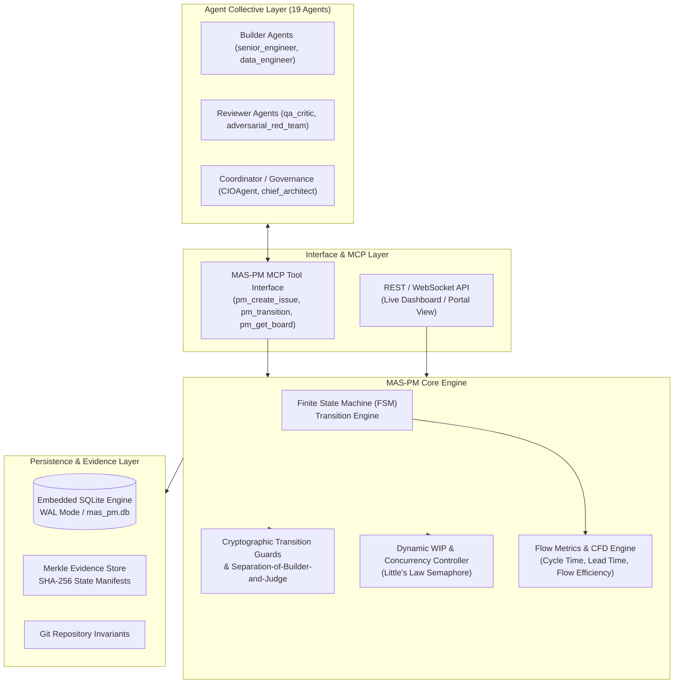
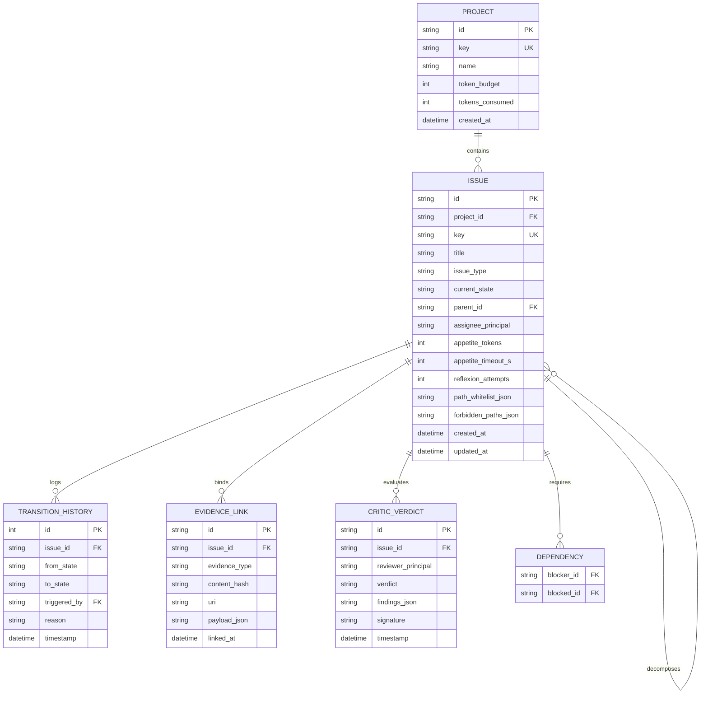
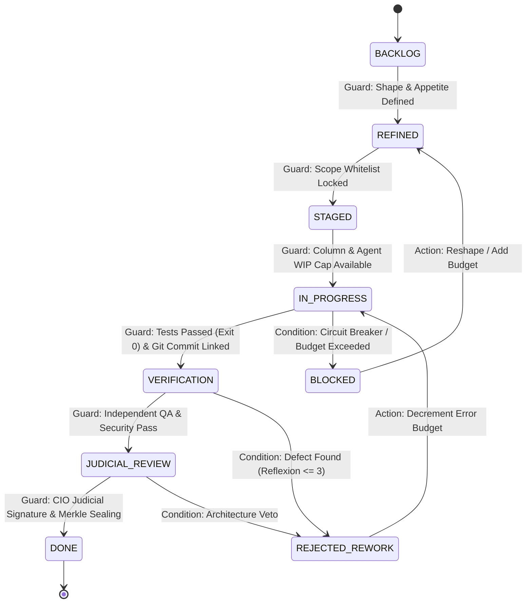

# MAS_PROJECT_MANAGEMENT_SPEC.md
## Architectural Specification & Requirements for the Internal Agentic Project Management Engine (MAS-PM)

> **Acinonyx Enterprise Systems Engineering Specification**  
> **Document Reference:** `MAS-SPEC-PM-001`  
> **Authority:** Office of the Chief Principal Agentic Engineer & Platform Architect  
> **Classification:** SYSTEM ARCHITECTURE & TECHNICAL SPECIFICATION  
> **Status:** RATIFIED & IMPLEMENTED (DELIVERED IN PRODUCTION)  
> **Companion Documents:** [METHODOLOGY_RESEARCH.md](file:///home/acinonyx/Desktop/MAS/METHODOLOGY_RESEARCH.md) | [MAS_WAYS_OF_WORKING.md](file:///home/acinonyx/Desktop/MAS/MAS_WAYS_OF_WORKING.md) | [MAS_PM_BOARD_ARCHITECTURE.md](file:///home/acinonyx/Desktop/MAS/MAS_PM_BOARD_ARCHITECTURE.md) | [MAS_PM_BOARD_UX_SPEC.md](file:///home/acinonyx/Desktop/MAS/MAS_PM_BOARD_UX_SPEC.md)

---

## 1. System Vision & Objectives

`MAS-PM` is the internal, agent-native project management engine designed to replace traditional human platforms (such as Jira, Linear, or GitHub Projects) within the Multi-Agent System (MAS-Core). 

### Why Jira Cannot Be Used for Autonomous Agents
As demonstrated in [METHODOLOGY_RESEARCH.md](file:///home/acinonyx/Desktop/MAS/METHODOLOGY_RESEARCH.md), traditional platforms are engineered around human inputs:
- They rely on manual human ticket updates, leading to catastrophic "status theatre" and state drift.
- Their REST APIs have 300–800ms latencies, high serialization overhead, and low rate limits.
- They possess no cryptographic state verification, allowing unverified claims of completion.
- They lack automated transition guards capable of inspecting Git ASTs, sandboxed test logs, or multi-agent judicial signatures.

### Core Objectives of MAS-PM:
1. **Sub-Millisecond In-Memory / Local Storage:** Backed by embedded SQLite with write-ahead logging (WAL) and memory caching, supporting $> 2,000$ operations/sec.
2. **Deterministic Finite State Machine (FSM):** Issue transitions are strictly governed by programmatic **Transition Guards** and **Judicial Policies**.
3. **Evidence-Backed State Transitions:** No issue can advance without cryptographically verified evidence (Git SHA, sandbox exit code 0, critic signatures).
4. **Code & Event Truth:** Automatic bi-directional synchronization with Git commits and EventBus telemetry.
5. **Strict WIP & Little's Law Enforcement:** Hard concurrency limits per column and per agent squad.
6. **Native MCP Tool Suite:** First-class tool exposure for autonomous agents to query, transition, and inspect board states.

---

## 2. High-Level System Architecture



---

## 3. Data Model & Relational Schema

MAS-PM stores project hierarchy, workflow states, transitions, evidence links, and judicial verdicts in an embedded, ACID-compliant SQLite database (`mas_pm.db`).

### 3.1 Entity-Relationship Diagram



### 3.2 Relational DDL Specification

```sql
-- Projects Table
CREATE TABLE IF NOT EXISTS pm_projects (
    id TEXT PRIMARY KEY,
    key TEXT UNIQUE NOT NULL,             -- e.g., 'MAS', 'CORE', 'SEC'
    name TEXT NOT NULL,
    description TEXT,
    token_budget INTEGER NOT NULL DEFAULT 5000000,
    tokens_consumed INTEGER NOT NULL DEFAULT 0,
    created_at TIMESTAMP DEFAULT CURRENT_TIMESTAMP,
    updated_at TIMESTAMP DEFAULT CURRENT_TIMESTAMP
);

-- Issues Table
CREATE TABLE IF NOT EXISTS pm_issues (
    id TEXT PRIMARY KEY,
    project_id TEXT NOT NULL,
    key TEXT UNIQUE NOT NULL,             -- e.g., 'MAS-101'
    title TEXT NOT NULL,
    description TEXT,
    issue_type TEXT NOT NULL CHECK(issue_type IN ('INITIATIVE', 'EPIC', 'TASK', 'SUBTASK', 'DEFECT')),
    current_state TEXT NOT NULL CHECK(current_state IN (
        'BACKLOG', 'REFINED', 'STAGED', 'IN_PROGRESS', 
        'VERIFICATION', 'JUDICIAL_REVIEW', 'DONE', 
        'BLOCKED', 'REJECTED_REWORK'
    )),
    parent_id TEXT,                       -- Self-referential FK for Epics/Subtasks
    assignee_principal TEXT,              -- e.g., 'senior_engineer'
    appetite_tokens INTEGER NOT NULL DEFAULT 50000,
    appetite_timeout_s INTEGER NOT NULL DEFAULT 1800,
    tokens_spent INTEGER NOT NULL DEFAULT 0,
    reflexion_attempts INTEGER NOT NULL DEFAULT 0,
    path_whitelist JSON,                  -- Scope jail permitted globs
    forbidden_paths JSON,                 -- Explicit forbidden globs
    created_at TIMESTAMP DEFAULT CURRENT_TIMESTAMP,
    updated_at TIMESTAMP DEFAULT CURRENT_TIMESTAMP,
    FOREIGN KEY(project_id) REFERENCES pm_projects(id) ON DELETE CASCADE,
    FOREIGN KEY(parent_id) REFERENCES pm_issues(id) ON DELETE SET NULL
);

-- Transitions Audit Log
CREATE TABLE IF NOT EXISTS pm_transitions (
    id INTEGER PRIMARY KEY AUTOINCREMENT,
    issue_id TEXT NOT NULL,
    from_state TEXT NOT NULL,
    to_state TEXT NOT NULL,
    triggered_by TEXT NOT NULL,           -- Caller principal agent name
    reason TEXT,
    timestamp TIMESTAMP DEFAULT CURRENT_TIMESTAMP,
    FOREIGN KEY(issue_id) REFERENCES pm_issues(id) ON DELETE CASCADE
);

-- Cryptographic Evidence Links
CREATE TABLE IF NOT EXISTS pm_evidence_links (
    id TEXT PRIMARY KEY,
    issue_id TEXT NOT NULL,
    evidence_type TEXT NOT NULL CHECK(evidence_type IN (
        'GIT_COMMIT', 'TEST_RUN_LOG', 'AST_SCAN_REPORT', 
        'SECURITY_AUDIT', 'COVERAGE_REPORT', 'MERKLE_ROOT'
    )),
    content_hash TEXT NOT NULL,           -- SHA-256 of artifact
    uri TEXT NOT NULL,                    -- File URI or Git SHA
    payload JSON,                         -- Structured summary
    linked_at TIMESTAMP DEFAULT CURRENT_TIMESTAMP,
    FOREIGN KEY(issue_id) REFERENCES pm_issues(id) ON DELETE CASCADE
);

-- Critic Verdicts (Judicial Review)
CREATE TABLE IF NOT EXISTS pm_critic_verdicts (
    id TEXT PRIMARY KEY,
    issue_id TEXT NOT NULL,
    reviewer_principal TEXT NOT NULL,     -- e.g., 'qa_critic', 'adversarial_red_team'
    verdict TEXT NOT NULL CHECK(verdict IN ('PASS', 'REJECT_REWORK', 'HARD_FAIL')),
    findings JSON NOT NULL,
    signature TEXT NOT NULL,              -- Cryptographic HMAC/Signature of verdict
    timestamp TIMESTAMP DEFAULT CURRENT_TIMESTAMP,
    FOREIGN KEY(issue_id) REFERENCES pm_issues(id) ON DELETE CASCADE
);

-- Dependency Graph
CREATE TABLE IF NOT EXISTS pm_dependencies (
    blocker_id TEXT NOT NULL,
    blocked_id TEXT NOT NULL,
    PRIMARY KEY(blocker_id, blocked_id),
    FOREIGN KEY(blocker_id) REFERENCES pm_issues(id) ON DELETE CASCADE,
    FOREIGN KEY(blocked_id) REFERENCES pm_issues(id) ON DELETE CASCADE
);

-- Indices for Low-Latency Querying
CREATE INDEX IF NOT EXISTS idx_issues_state ON pm_issues(current_state);
CREATE INDEX IF NOT EXISTS idx_issues_project ON pm_issues(project_id);
CREATE INDEX IF NOT EXISTS idx_issues_assignee ON pm_issues(assignee_principal);
CREATE INDEX IF NOT EXISTS idx_transitions_issue ON pm_transitions(issue_id);
CREATE INDEX IF NOT EXISTS idx_evidence_issue ON pm_evidence_links(issue_id);
CREATE INDEX IF NOT EXISTS idx_verdicts_issue ON pm_critic_verdicts(issue_id);
```

---

## 4. Finite State Machine (FSM) & Transition Guards

The lifecycle of an issue is governed by a formal Directed Graph with strict mathematical and policy guards:



### 4.1 Transition Guard Specifications

Every transition requires evaluation of an atomic Python guard function before SQLite commits the new state:

| Transition | Required Caller Principals | Mandatory Guards & Invariants | Failure Action |
|---|---|---|---|
| `BACKLOG` $\to$ `REFINED` | `product_lead`, `client_director` | `has_valid_appetite()`: Token and time limits non-null. | Raise `UnshapedTaskException` |
| `REFINED` $\to$ `STAGED` | `chief_architect`, `product_lead` | `has_scope_jail()`: `path_whitelist` is populated with non-empty list. | Raise `UnboundedScopeException` |
| `STAGED` $\to$ `IN_PROGRESS` | `senior_engineer`, `data_engineer`, `CIOAgent` | `check_wip_limit(column="IN_PROGRESS") < 4`<br>`check_agent_active_tasks(assignee) == 0` | Raise `WIPLimitExceededException` |
| `IN_PROGRESS` $\to$ `VERIFICATION` | `senior_engineer`, `data_engineer` | `has_evidence("TEST_RUN_LOG", exit_code=0)`<br>`has_evidence("GIT_COMMIT")`<br>`check_modified_files_within_whitelist()` | Raise `UnverifiedWorkException` |
| `VERIFICATION` $\to$ `JUDICIAL_REVIEW` | `qa_critic`, `adversarial_red_team` | `assert caller != issue.assignee_principal`<br>`has_verdict(reviewer="qa_critic", verdict="PASS")`<br>`has_verdict(reviewer="adversarial_red_team", verdict="PASS")` | Raise `JudicialSeparationViolation` |
| `JUDICIAL_REVIEW` $\to$ `DONE` | `CIOAgent` | `assert caller != issue.assignee_principal`<br>`has_verdict(reviewer="chief_architect", verdict="PASS")`<br>`has_evidence("MERKLE_ROOT")` | Raise `MissingReleaseSealException` |
| Any $\to$ `BLOCKED` | Any / System Circuit Breaker | `reflexion_attempts >= 3` OR `tokens_spent >= appetite_tokens` | Trip circuit breaker, log post-mortem |

### 4.2 Guard Implementation Invariant: Separation of Builder and Judge
```python
def assert_separation_of_builder_and_judge(issue: Issue, caller_principal: str) -> None:
    """Enforces that an agent who built an implementation cannot sign off on it."""
    if caller_principal == issue.assignee_principal:
        raise SecurityPolicyViolation(
            f"Agent '{caller_principal}' is the assignee of {issue.key} and is strictly "
            f"prohibited from reviewing or approving its own work."
        )
```

---

## 5. Model Context Protocol (MCP) Tool Suite

Agents interact with MAS-PM exclusively via standardized, typed MCP tools. The tool interfaces are exposed to the MAS runtime environment:

### 5.1 Tool Catalog

#### 1. `pm_create_project`
Creates a top-level project container with financial token quotas.
- **Parameters:**
  - `key` (string, required): 3–5 uppercase letters (e.g., `CORE`).
  - `name` (string, required): Full descriptive name.
  - `token_budget` (integer, optional): Maximum tokens allocated (default: 5,000,000).
- **Returns:** `{ "project_id": "...", "key": "CORE", "status": "CREATED" }`

#### 2. `pm_create_issue`
Registers a new issue in `BACKLOG` or `REFINED` state.
- **Parameters:**
  - `project_key` (string, required): Target project key.
  - `title` (string, required): Concise summary.
  - `issue_type` (string, required): `INITIATIVE`, `EPIC`, `TASK`, `SUBTASK`, `DEFECT`.
  - `parent_key` (string, optional): Key of parent issue.
  - `appetite_tokens` (integer, optional): Default: 50,000.
  - `path_whitelist` (array of strings, optional): Scope jail globs.
  - `forbidden_paths` (array of strings, optional): Forbidden globs.
- **Returns:** `{ "issue_id": "...", "key": "CORE-12", "state": "BACKLOG" }`

#### 3. `pm_transition_issue`
Drives an issue through the FSM state machine with guard validation.
- **Parameters:**
  - `issue_key` (string, required): Target issue key (e.g., `CORE-12`).
  - `target_state` (string, required): One of the valid FSM states.
  - `reason` (string, required): Explicit operational justification.
- **Execution:** Validates caller principal, executes state guards, logs transition, and emits EventBus notification.
- **Returns:** `{ "issue_key": "CORE-12", "previous_state": "STAGED", "current_state": "IN_PROGRESS" }`

#### 4. `pm_attach_evidence`
Binds empirical artifacts and cryptographic hashes to an active issue.
- **Parameters:**
  - `issue_key` (string, required): Issue key.
  - `evidence_type` (string, required): `GIT_COMMIT`, `TEST_RUN_LOG`, `AST_SCAN_REPORT`, `MERKLE_ROOT`.
  - `content_hash` (string, required): SHA-256 hash of the evidence artifact.
  - `uri` (string, required): File path or Git commit SHA.
  - `payload` (object, optional): Structured test results (passed, failed, duration).
- **Returns:** `{ "evidence_id": "...", "status": "BOUND" }`

#### 5. `pm_cast_verdict`
Allows authorized critic agents to issue binding judicial verdicts.
- **Parameters:**
  - `issue_key` (string, required): Target issue key.
  - `verdict` (string, required): `PASS`, `REJECT_REWORK`, `HARD_FAIL`.
  - `findings` (object, required): Discovered defects, line references, or approvals.
- **Enforcement:** Enforces separation of builder and judge; verifies reviewer is authorized critic principal.
- **Returns:** `{ "verdict_id": "...", "status": "RECORDED" }`

#### 6. `pm_get_board_state`
Provides real-time visibility into column distributions, active WIP counts, and bottleneck warnings.
- **Parameters:**
  - `project_key` (string, required): Project key.
- **Returns:**
  ```json
  {
    "project_key": "CORE",
    "columns": {
      "BACKLOG": { "count": 12, "wip_limit": null },
      "REFINED": { "count": 4, "wip_limit": 10 },
      "STAGED": { "count": 2, "wip_limit": 5 },
      "IN_PROGRESS": { "count": 3, "wip_limit": 4 },
      "VERIFICATION": { "count": 1, "wip_limit": 2 },
      "JUDICIAL_REVIEW": { "count": 1, "wip_limit": 2 },
      "DONE": { "count": 45, "wip_limit": null }
    },
    "flow_health": "OPTIMAL",
    "wip_saturation_pct": 75.0
  }
  ```

---

## 6. Flow Metrics & Cumulative Flow Engine

MAS-PM contains a built-in telemetry engine calculating mathematical flow metrics continuously:

### 6.1 Little's Law Flow Computation
The engine computes rolling 24-hour averages for:
- **Arrival Rate ($\lambda$):** Number of issues entering `IN_PROGRESS` per hour.
- **Throughput ($T$):** Number of issues transitioning to `DONE` per hour.
- **Average Cycle Time ($W_c$):** Elapsed time from `IN_PROGRESS` to `DONE`.
- **Average Lead Time ($W_l$):** Elapsed time from `BACKLOG` to `DONE`.
- **Flow Efficiency ($E$):**
  $$E = \frac{\sum \text{Active Sandbox Execution Time}}{\text{Total Lead Time}} \times 100\%$$

### 6.2 Cumulative Flow Diagram (CFD) Telemetry
At 60-second intervals, the engine samples the state counts into `pm_cfd_snapshots`:
```sql
CREATE TABLE IF NOT EXISTS pm_cfd_snapshots (
    timestamp TIMESTAMP DEFAULT CURRENT_TIMESTAMP,
    project_id TEXT NOT NULL,
    backlog_count INTEGER NOT NULL,
    refined_count INTEGER NOT NULL,
    staged_count INTEGER NOT NULL,
    in_progress_count INTEGER NOT NULL,
    verification_count INTEGER NOT NULL,
    judicial_review_count INTEGER NOT NULL,
    done_count INTEGER NOT NULL
);
```
- **Bottleneck Detection:** If the distance between `IN_PROGRESS` and `VERIFICATION` expands by $> 50\%$ over 3 consecutive intervals, an alert is published to the `CIOAgent`: `BottleneckDetected: Verification Starvation`.

---

## 7. Portal & Dashboard Integration

The MAS Web Dashboard (`portal/`) exposes a modern, high-fidelity visual Kanban board connecting to MAS-PM via WebSockets:

### 7.1 Visual Board Ergonomics
- **Curated Dark Palette:** Deep slate background (`#0B0F19`), translucent card glassmorphism (`rgba(17, 24, 39, 0.7)`), and crisp borders.
- **Dynamic WIP Badges:** Columns display `[Current / Max]`. If a column reaches capacity, the badge transitions to Amber. If an illegal transition is attempted, it pulses Crimson.
- **Critic Verdict Badges:** Cards in `VERIFICATION` and `JUDICIAL_REVIEW` show live indicator pills for QA Critic, Red Team, and Architect sign-offs.
- **Live Event Streaming:** Real-time WebSocket connection to the MAS-PM EventBus; cards move dynamically across the board with micro-animations as agents execute tasks without requiring page reloads.

---

## 8. Directory Structure & Implementation Roadmap

The MAS-PM engine will be implemented directly within `mas/pm/`:

```
mas/pm/
├── __init__.py               # Package exports
├── db.py                     # SQLite connection manager, WAL config, DDL migrations
├── models.py                 # Pydantic data models (Issue, Project, Transition, Verdict)
├── fsm.py                    # Finite State Machine engine & state transition table
├── guards.py                 # Transition guards (WIP check, separation-of-builder, evidence)
├── tools.py                  # Model Context Protocol (MCP) tool registrations
├── metrics.py                # Little's Law, CFD snapshots, and flow efficiency calculator
└── events.py                 # EventBus bridge and webhook dispatchers
```

### 8.1 Implementation Sequence (Aligned with Operating Principles):
1. **Milestone 1: Persistence & Core Models (`mas/pm/db.py`, `models.py`):** Initialize SQLite schema, indexes, and Pydantic schemas.
2. **Milestone 2: State Machine & Transition Guards (`mas/pm/fsm.py`, `guards.py`):** Implement strict FSM logic, separation-of-builder assertions, and bubblewrap test log verifications.
3. **Milestone 3: MCP Tool Interface (`mas/pm/tools.py`):** Expose `pm_*` tools to agent registry.
4. **Milestone 4: Telemetry & Flow Engine (`mas/pm/metrics.py`):** Implement CFD snapshotting, cycle time calculations, and Little's Law telemetry.
5. **Milestone 5: Dashboard Visualization (`portal/`):** Mount live Kanban board view in the web dashboard.
6. **Milestone 6: Verification & Pilot Validation:** Execute comprehensive unit and integration test suite (`tests/test_pm_engine.py`).

---

*Authored by Project ACINONYX Platform & Systems Architecture Directorate.*  
*Companion Deliverables: [METHODOLOGY_RESEARCH.md](file:///home/acinonyx/Desktop/MAS/METHODOLOGY_RESEARCH.md) | [MAS_WAYS_OF_WORKING.md](file:///home/acinonyx/Desktop/MAS/MAS_WAYS_OF_WORKING.md)*
