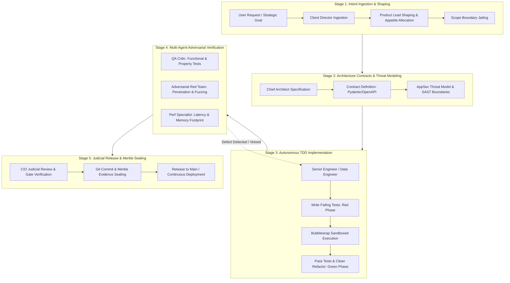
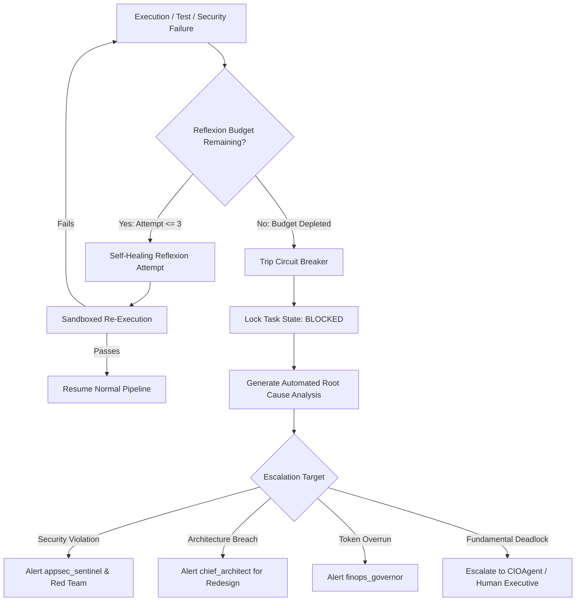

# MAS_WAYS_OF_WORKING.md
## Operational Operating Framework for Autonomous Multi-Agent Systems (MAS-Core)

> **Acinonyx Enterprise Systems Engineering Standard**  
> **Document Reference:** `MAS-WOW-001`  
> **Authority:** Office of the Chief Principal Agentic Engineer, CIO, and Chief Systems Architect  
> **Classification:** OPERATIONAL GOVERNANCE & EXECUTION SPECIFICATION  
> **Status:** RATIFIED CANDIDATE (PENDING ADVERSARIAL PILOT VALIDATION)  
> **Companion Documents:** [METHODOLOGY_RESEARCH.md](file:///home/acinonyx/Desktop/MAS/METHODOLOGY_RESEARCH.md) | [MAS_PROJECT_MANAGEMENT_SPEC.md](file:///home/acinonyx/Desktop/MAS/MAS_PROJECT_MANAGEMENT_SPEC.md)

---

## 1. Executive Charter & Core Principles

This document translates the empirical findings of [METHODOLOGY_RESEARCH.md](file:///home/acinonyx/Desktop/MAS/METHODOLOGY_RESEARCH.md) into an **operational, agent-native delivery framework**. Human software processes (ceremonial sprint meetings, subjective planning poker, manual status reports) are structurally flawed for autonomous AI agents. 

Autonomous agents execute with sub-second decision cycles, zero social fatigue, and high concurrency, but suffer from distinct agent failure modes: **context drift, hallucinatory claims of completion ("status theatre"), infinite reflexion thrashing, token exhaustion, and unchecked blast radiuses**.

### The Five Invariable Laws of MAS Delivery:
1. **Evidence Over Assertion:** An agent cannot declare a task "complete" via natural language. State transitions require reproducible empirical artifacts (cryptographic hashes, passing unit/integration suites, zero linter warnings, AST diffs).
2. **Separation of Builder and Judge:** An agent that writes an implementation shall never review, sign off, or merge its own code. Independent judicial critics (`qa_critic`, `adversarial_red_team`, `chief_architect`) hold unilateral veto power.
3. **Queueing Discipline (Little's Law):** Work-in-Progress (WIP) is capped strictly at every phase. Unbounded subtask spawning is prohibited.
4. **Appetite-Driven Circuit Breakers:** Work is constrained by strict resource budgets (token count, turn count, wall-clock time). If a task exceeds its budget, it is aborted by a circuit breaker—never allowed to loop indefinitely.
5. **Contract-First & Code-As-Truth:** Interfaces, JSON-RPC schemas, and architectural boundaries are defined prior to implementation. The ground truth of the system is the Git tree and test state—not ticket metadata.

---

## 2. The 5-Stage Agentic Delivery Lifecycle (ADL)

Every unit of value created within MAS flows through the **5-Stage Agentic Delivery Lifecycle**:

---

## 3. Operational Practices Matrix

The table below summarizes the operational practices defined in this framework, mapped directly to their responsible agents, lifecycle gates, and enforcement mechanics:

| Practice ID | Operational Practice | Primary Responsible Agent | Supporting Oversight | Lifecycle Stage | Enforcement Mechanism |
|---|---|---|---|---|---|
| **PRAC-01** | Work Shaping & Appetite-Driven Scope Jailing | `product_lead` | `client_director` | Stage 1 (Ingestion) | JSON Schema validation; Token/Time Appetite Caps |
| **PRAC-02** | Strict Little's Law Dynamic WIP Limiting | `CIOAgent` (Orchestrator) | `finops_governor` | All Stages | Concurrency Semaphore on EventBus |
| **PRAC-03** | Contract-First Architecture & Interface Invariants | `chief_architect` | `appsec_sentinel` | Stage 2 (Architecture) | Schema validation, Pydantic type checking |
| **PRAC-04** | Autonomous TDD & Bubblewrap Sandboxed Execution | `senior_engineer` | `devops_sre` | Stage 3 (Build) | OS-level bubblewrap (`bwrap`), pytest gates |
| **PRAC-05** | Mandatory Independent Multi-Perspective Judicial Review | `qa_critic` | `chief_architect` | Stage 4 (Verification) | Separation-of-Builder-and-Judge Policy Engine |
| **PRAC-06** | Adversarial Red-Teaming & Negative-Path Fuzzing | `adversarial_red_team` | `appsec_sentinel` | Stage 4 (Verification) | SAST AST scanners, boundary injection tests |
| **PRAC-07** | Reflexion Self-Healing with Finite Error Budgets | `senior_engineer` | `qa_critic` | Stage 3/4 (Remediation) | Maximum Reflexion Attempts = 3; Circuit Breaker |
| **PRAC-08** | Merkle Tree State Proofs & Immutable Git Provenance | `devops_sre` | `CIOAgent` | Stage 5 (Release) | SHA-256 Merkle Evidence Manifests |
| **PRAC-09** | FinOps Token & Computational Budget Quotas | `finops_governor` | `CIOAgent` | All Stages | Real-time token tracking & hard budget traps |
| **PRAC-10** | Asynchronous Event-Driven Coordination | EventBus / Router | All Agents | Continuous | Zero-meeting typed pub/sub protocol |

---

## 4. Operational Practice Specifications

Every practice in this section is rigorously specified across five mandatory dimensions:
1. **What the practice is & supporting evidence**
2. **Why MAS needs it**
3. **How MAS implements it**
4. **Which agent or component is responsible**
5. **How compliance is measured and verified**

---

### Practice PRAC-01: Work Shaping & Appetite-Driven Scope Jailing

#### 1. What the Practice Is & Supporting Evidence
Work Shaping (Singer, Basecamp *Shape Up*; Poppendieck *Lean Software Development*) decouples raw user feature requests from immediate implementation. Instead of allowing unbounded requirements to pollute a permanent backlog, a feature is "shaped" into a concrete appetite (e.g., maximum 30 minutes wall-clock, 50,000 tokens, 10 tool calls) with explicit boundaries and forbidden rabbit holes ("No-Gos"). 
*Evidence:* Lean research shows that unbounded feature backlogs accumulate 60%+ dead-weight inventory (Muda), creating context clutter and analysis paralysis for autonomous agents.

#### 2. Why MAS Needs It
Large Language Models exhibit extreme vulnerability to "gold-plating" (implementing unnecessary abstractions) and hallucinated scope creep. When prompted with ambiguous goals, agent squads frequently attempt to refactor irrelevant subsystems or build excessive frameworks. Scope Jailing restricts agent attention exclusively to shaped boundaries.

#### 3. How MAS Implements It
1. The `product_lead` ingests raw user intents via the `client_director`.
2. A structured `ShapedTask` manifest is generated with:
   - **Problem Statement:** Concise definition of current state vs desired state.
   - **Appetite:** Fixed budget (Tokens: $T_{max}$, Execution Turns: $N_{max}$, Timeout: $S_{max}$).
   - **Boundaries (Scope Jail):** Whitelist of permitted file paths (`path_whitelist: ["mas/tools/*", "tests/*"]`).
   - **Rabbit Holes / Out of Scope:** Explicitly enumerated forbidden modifications (`forbidden_paths: ["portal/*", "config/*"]`).
3. The manifest is registered in MAS-PM as an issue in `REFINED` state.

#### 4. Responsible Agent & Component
- **Primary:** `product_lead` (Shapes the task, defines boundaries).
- **Secondary:** `client_director` (Ensures alignment with user intent).
- **System Guard:** `mas.security.ToolACL` & `FileSystemTool` (Enforces file boundary jailing at the filesystem level).

#### 5. Measurement, Verification & Failure Handling
- **Compliance Metric:** 100% of tasks entering `STAGED` must have a valid `ShapedTask` manifest adhering to `mas/schemas/shaped_task.json`.
- **Enforcement:** If an agent attempts to mutate a file outside `path_whitelist`, `FileSystemTool` raises `SecurityViolationError` and halts the turn.
- **Failure Mode:** If work exceeds the appetite budget without passing verification, the task is killed by the circuit breaker, transitioned to `REJECTED_APPETITE_EXCEEDED`, and returned to the `product_lead` for reshaping or cancellation.

---

### Practice PRAC-02: Strict Little's Law Dynamic WIP Limiting

#### 1. What the Practice Is & Supporting Evidence
Governed by Little's Law ($WIP = \text{Throughput} \times \text{Lead Time}$), this practice restricts the number of concurrent active work items allowed in any lifecycle state. 
*Evidence:* Queueing theory demonstrates that as system utilization approaches 100%, queue wait time approaches infinity. Capping WIP prevents thrashing, stabilizes lead time, and maximizes system throughput.

#### 2. Why MAS Needs It
If an agent coordinator decomposes a goal into 30 subtasks and launches them simultaneously, MAS hits API rate limits, saturates system memory, triggers bubblewrap process exhaustions, and pollutes shared files with concurrent Git merge conflicts. WIP limiting ensures stable, rapid flow.

#### 3. How MAS Implements It
1. MAS-PM defines global and column-level concurrency limits:
   $$\text{WIP}_{IN\_PROGRESS} \le 4, \quad \text{WIP}_{VERIFICATION} \le 2, \quad \text{WIP}_{PER\_AGENT} \le 1$$
2. The orchestrator uses an async semaphore (`asyncio.Semaphore(max_wip)`) linked to board state.
3. If an agent completes a task and attempts to pull a new one while the downstream column is at capacity, the agent is blocked or redirected to assist downstream review (Swarming).

#### 4. Responsible Agent & Component
- **Primary:** `CIOAgent` (Orchestration engine and queue governor).
- **Supporting:** `finops_governor` (Monitors concurrency vs rate limits).
- **Component:** `mas.pm.fsm.StateManager` (Enforces column capacity before state transitions).

#### 5. Measurement, Verification & Failure Handling
- **Compliance Metric:** Maximum concurrent items in `IN_PROGRESS` $\le 4$ at all times; zero queue starvation.
- **Verification:** Continuous telemetry logging of active state counts on EventBus.
- **Failure Mode:** Any attempt to transition a task into a saturated state returns `StateTransitionRejected: Column WIP Limit Exceeded [Current: 4, Max: 4]`. The task remains staged in queue.

---

### Practice PRAC-03: Contract-First Architecture & Interface Invariants

#### 1. What the Practice Is & Supporting Evidence
Contract-First Development (Meyer, *Design by Contract*; Fowler, *Consumer-Driven Contracts*) mandates that all data exchange contracts, schema models, and interface signatures are written, versioned, and locked before any business logic is implemented.
*Evidence:* Modern distributed systems research proves that interface errors caught at compile/schema validation time cost 100x less to remediate than errors discovered during cross-component integration.

#### 2. Why MAS Needs It
Autonomous agents working in parallel inevitably create incompatible payload assumptions if working without formal contracts. Without strict Pydantic schemas, Agent A might return a JSON dict `{"success": true}`, while Agent B expects `{"status": "ok", "exit_code": 0}`, causing cascading pipeline failures.

#### 3. How MAS Implements It
1. The `chief_architect` reviews the `ShapedTask` and produces an immutable **Interface Specification Document**:
   - Pydantic models for request/response payloads.
   - MCP tool interface definitions with strict input/output typing.
   - Error code catalog and exception hierarchies.
2. The contract is saved in the codebase under `mas/schemas/` or `mas/interfaces/`.
3. Unit test scaffolding is generated directly from the contract models.

#### 4. Responsible Agent & Component
- **Primary:** `chief_architect` (Authors and seals architecture contract).
- **Secondary:** `appsec_sentinel` (Inspects interface parameters for injection vectors).
- **Component:** `pydantic.BaseModel` and Python type hints (`mypy`).

#### 5. Measurement, Verification & Failure Handling
- **Compliance Metric:** 100% of cross-agent and tool invocations must validate against typed Pydantic schemas; `mypy --strict` passes with 0 errors.
- **Verification:** Automated CI validation gate during Stage 2.
- **Failure Mode:** If an engineer attempts to implement logic without a sealed contract, the task is rejected at `STAGED` gate with `MissingArchitecturalContractException`.

---

### Practice PRAC-04: Autonomous TDD & Bubblewrap Sandboxed Execution

#### 1. What the Practice Is & Supporting Evidence
Test-Driven Development (Beck, *Test Driven Development: By Example*) dictates a strict Red-Green-Refactor cycle: write a failing test first, write minimal implementation code to pass the test, then refactor cleanly. In MAS, execution must occur in a hardened, non-root sandbox (Bubblewrap / `bwrap`).
*Evidence:* NIST SP 800-218 (Secure Software Development Framework) and empirical automated programming studies demonstrate that LLMs write significantly higher-quality code when guided by executable unit test assertions than by prompt instructions alone.

#### 2. Why MAS Needs It
Unchecked agent code execution presents extreme risks: deleting host files, reading sensitive API keys, spawning fork bombs, or lingering in zombie process loops. Bubblewrap sandboxing enforces absolute OS-level isolation, memory ceilings (512MB), and process tree termination (`os.killpg`).

#### 3. How MAS Implements It
1. The `senior_engineer` generates the unit tests in `tests/test_<feature>.py`.
2. The engineer runs the test suite inside the Bubblewrap sandbox using `mas.tools.executor.run_command`. The test MUST fail (`RED` state).
3. The engineer writes the minimal implementation code in `mas/<subsystem>/`.
4. The engineer re-executes tests in the sandbox. The test MUST pass (`GREEN` state).
5. All executions enforce:
   - `--unshare-all` (Network isolation unless explicitly permitted).
   - `--tmpfs /tmp` (No disk writes outside workspace boundaries).
   - `--clearenv` (Zero ambient environment variable leakage).
   - CPU/RAM resource limits (`RLIMIT_CPU`, `RLIMIT_AS`).

#### 4. Responsible Agent & Component
- **Primary:** `senior_engineer` / `data_engineer` (Executes TDD cycle).
- **Secondary:** `devops_sre` (Maintains sandbox configurations and test runners).
- **Component:** `mas/tools/executor.py` (`bubblewrap` runner).

#### 5. Measurement, Verification & Failure Handling
- **Compliance Metric:** Every commit must include new or modified unit tests; 100% passing test suite; zero sandbox boundary escapes.
- **Verification:** Sandbox execution returns exit code 0; test coverage increases or remains neutral.
- **Failure Mode:** If tests fail after 3 consecutive reflexion iterations, the task halts and escalates to `QA-CRITIC` with a diagnostic failure dump.

---

### Practice PRAC-05: Mandatory Independent Multi-Perspective Judicial Review

#### 1. What the Practice Is & Supporting Evidence
Separation of Duties (NIST SP 800-53; Saltzer & Schroeder, *Protection of Information in Computer Systems*) mandates that no actor possesses authority to unilaterally develop and authorize the deployment of an artifact. Reviewers must be independent, specialized, and adversarial.
*Evidence:* Self-evaluation in Large Language Models is notoriously compromised by sycophancy, confirmation bias, and self-justification loops. Independent critic agents detect up to 400% more logical and security bugs than self-evaluating agents.

#### 2. Why MAS Needs It
An engineer agent that wrote buggy or insecure code will frequently generate flawed explanations arguing why its code is "correct" if asked to evaluate itself. An independent reviewer agent with a distinct prompt, skeptical system role, and adversarial instructions will rigorously probe the implementation.

#### 3. How MAS Implements It
1. When implementation completes, the task transitions to `VERIFICATION`.
2. MAS-PM locks the task from further modifications by the author agent.
3. Three independent review pods are summoned in parallel:
   - **Functional & Quality Critic (`qa_critic`):** Evaluates test coverage ($>85\%$), boundary conditions, regression risks, and documentation integrity.
   - **Security Critic (`adversarial_red_team`):** Scans for OWASP Top 10, CWE patterns, path traversal, and privilege escalation vulnerabilities.
   - **Architectural Critic (`chief_architect`):** Validates design pattern adherence, modularity, and compliance with the sealed interface contract.
4. Each critic outputs a cryptographically signed `Verdict`:
   $$\text{Verdict} \in \{\text{PASS}, \text{REJECT\_REWORK}, \text{HARD\_FAIL}\}$$
5. Unanimous PASS is required for transition to Stage 5.

#### 4. Responsible Agent & Component
- **Primary Reviewers:** `qa_critic`, `adversarial_red_team`, `chief_architect`.
- **Governing Body:** `mas.release_policy.ReleasePolicyEngine`.
- **System Guard:** `mas.security.PrincipalEnforcer` (Blocks author agent from casting judicial verdicts).

#### 5. Measurement, Verification & Failure Handling
- **Compliance Metric:** Zero releases permitted without 3 distinct, independent critic verdicts signed by authorized principals.
- **Verification:** Automated validation in `mas/release_policy.py`.
- **Failure Mode:** If any critic issues `REJECT_REWORK`:
  - A structured `DefectReport` is generated detailing line numbers, failed assertions, and expected behavior.
  - The task transitions to `IN_PROGRESS` with the error budget decremented.
  - The author agent is instructed to remediate specifically the items in the `DefectReport`.

---

### Practice PRAC-06: Adversarial Red-Teaming & Negative-Path Fuzzing

#### 1. What the Practice Is & Supporting Evidence
Adversarial testing goes beyond standard happy-path testing by deliberately attempting to break system invariants through malformed inputs, edge cases, timing attacks, and malicious payloads.
*Evidence:* Microsoft Security Development Lifecycle (SDL) and NIST SSDF mandate fuzz testing and penetration testing for all mission-critical software before deployment.

#### 2. Why MAS Needs It
Standard developer tests generated by LLMs almost exclusively verify happy paths (e.g., standard valid JSON, expected string lengths). Autonomous systems deployed in production encounter malicious users, malformed external API responses, and corrupted data files.

#### 3. How MAS Implements It
1. The `adversarial_red_team` agent executes automated security checks:
   - **AST Parsing:** Scans code for forbidden calls (`eval`, `exec`, `os.system`, unvalidated `subprocess`).
   - **Fuzz Testing:** Generates edge cases (null bytes, 10MB payloads, non-UTF8 strings, path traversal sequences `../../../`).
   - **Resource Stress:** Tests behavior under zero disk space, process limit saturation, and network disconnection.
2. The agent executes tests against the sandboxed target component.

#### 4. Responsible Agent & Component
- **Primary:** `adversarial_red_team`.
- **Supporting:** `appsec_sentinel`.
- **Tools:** `mas.tools.executor`, `bandit`, `ruff`, custom fuzz runners.

#### 5. Measurement, Verification & Failure Handling
- **Compliance Metric:** Zero High/Critical security vulnerabilities; zero unhandled crash exceptions on fuzz payloads.
- **Verification:** Output report from `scripts/run_quality_gate.sh` and security test suite (`tests/test_executor_security.py`).
- **Failure Mode:** Immediate transition to `REJECTED_SECURITY_FAILURE`. The vulnerability is flagged with a high-priority incident issue.

---

### Practice PRAC-07: Reflexion Self-Healing with Finite Error Budgets

#### 1. What the Practice Is & Supporting Evidence
Reflexion (Shinn et al., *Reflexion: Language Agents with Verbal Reinforcement Learning*) allows agents to introspect on execution errors, adjust strategies, and attempt self-repair. However, to prevent infinite loops, self-repair must be governed by an **Error Budget** and a **Circuit Breaker** (Nygard, *Release It!*).
*Evidence:* Without bounds, autonomous agent loops experience exponential cost decay: after 3 failed remediation attempts, probability of success drops below 12%, while token consumption triples.

#### 2. Why MAS Needs It
When a test fails, an agent should have the autonomy to fix syntax errors or logic bugs without human intervention. However, if the bug is caused by a fundamental design flaw, unconstrained reflexion results in circular edits ("thrashing") where the agent toggles between two broken implementations until token exhaustion occurs.

#### 3. How MAS Implements It
1. Every task is provisioned with a strict **Reflexion Budget**:
   $$\text{Max Reflexion Attempts} = 3$$
2. On failure, the agent logs an entry into the **Reflexion Ledger**:
   - `AttemptNumber`: Current cycle count.
   - `ObservedFailure`: Exact traceback or compiler error.
   - `Hypothesis`: Why the previous attempt failed.
   - `RemediationAction`: Specific architectural change being tested.
3. If Attempt $\le 3$, the agent re-executes implementation.
4. If Attempt $> 3$, the **Circuit Breaker trips**. The task is immediately locked.

#### 4. Responsible Agent & Component
- **Primary:** `senior_engineer` (Executes self-repair cycles).
- **Supervisor:** `CIOAgent` (Tracks attempt counter and enforces circuit breaker).
- **Component:** `mas.core.agent.ReflexionController`.

#### 5. Measurement, Verification & Failure Handling
- **Compliance Metric:** Reflexion attempt counter never exceeds 3 for any single issue lifecycle.
- **Verification:** Logged state transitions in MAS-PM history.
- **Failure Mode:** Circuit breaker trips $\longrightarrow$ Task moves to `BLOCKED_CIRCUIT_TRIPPED` $\longrightarrow$ An architectural post-mortem is automatically published to EventBus $\longrightarrow$ Escapes to `chief_architect` for task decomposition or human escalation.

---

### Practice PRAC-08: Merkle Tree State Proofs & Immutable Git Provenance

#### 1. What the Practice Is & Supporting Evidence
Cryptographic provenance (Merkle Trees, Sigstore / Cosign, Git cryptographic commits) links every delivered binary and code modification to an unbroken chain of verified source artifacts, author signatures, and test verdicts.
*Evidence:* SLSA (Supply-chain Levels for Software Artifacts) Level 3+ requires non-falsifiable provenance tracking from source to deployment to guarantee software supply chain integrity.

#### 2. Why MAS Needs It
In a multi-agent system, accountability must be mathematically verifiable. It must be impossible for an agent to claim it ran a test suite when it did not, or for unauthorized agents to inject code into the main branch. Every release must possess a deterministic, cryptographic audit trail.

#### 3. How MAS Implements It
1. At Stage 5 (Release), MAS generates a **Release Manifest**:
   - Git Commit SHA.
   - Cryptographic hashes (SHA-256) of all modified files.
   - SHA-256 hashes of test output logs and coverage reports.
   - Serialized critic verdicts with cryptographic signatures.
2. A Merkle Root hash is computed across all artifacts.
3. The Merkle Root is embedded into the Git commit message and recorded in the MAS-PM issue record.

#### 4. Responsible Agent & Component
- **Primary:** `devops_sre` (Computes hashes, seals manifest).
- **Auditor:** `CIOAgent` (Signs release approval).
- **Component:** `mas.provenance.MerkleSealer` & Git repository invariants.

#### 5. Measurement, Verification & Failure Handling
- **Compliance Metric:** 100% of releases on branch `main` contain a valid, cryptographically verifiable Merkle Evidence Manifest.
- **Verification:** Independent verification script `scripts/verify_provenance.sh`.
- **Failure Mode:** Merkle mismatch or missing critic signature halts release immediately; branch protection blocks push to `main`.

---

### Practice PRAC-09: FinOps Token & Computational Budget Quotas

#### 1. What the Practice Is & Supporting Evidence
Cloud FinOps (Sturman et al., *Cloud FinOps*) establishes continuous visibility, allocation, and control over computational spending. In agentic AI systems, LLM token consumption is the primary operational expenditure.
*Evidence:* Unmonitored multi-agent systems have historically incurred thousands of dollars in unexpected cloud charges within hours due to runaway recursion and unmonitored API retries.

#### 2. Why MAS Needs It
MAS operates with multiple agent models and tool integrations. Without rigid financial guardrails, complex tasks can exhaust API quotas or budget allocations before achieving value.

#### 3. How MAS Implements It
1. Every Project and Task is provisioned with a **Token Quota**:
   - Project Budget: e.g., $5,000,000$ tokens / month.
   - Epic Budget: e.g., $500,000$ tokens.
   - Issue Appetite: e.g., $50,000$ tokens.
2. Every LLM call passes through the `mas.billing.TokenGovernor` interceptor.
3. Token expenditure is aggregated per agent, department, and issue ID.
4. If an issue reaches 90% of its budget, an alert is dispatched. If it reaches 100%, the governor issues an immutable `BudgetExhaustionException` that halts LLM invocations for that task.

#### 4. Responsible Agent & Component
- **Primary:** `finops_governor` (Monitors spending, sets quotas).
- **Enforcer:** `mas.billing.TokenGovernor` (LLM gateway proxy).
- **Reporter:** `mas.dashboard` (Displays real-time burn rates and cost per feature).

#### 5. Measurement, Verification & Failure Handling
- **Compliance Metric:** Real-time token tracking with 100% accounting accuracy; zero unbudgeted overrun.
- **Verification:** Automated reconciliation between model provider usage logs and MAS-PM issue ledgers.
- **Failure Mode:** Task budget exhaustion moves issue to `BLOCKED_BUDGET_EXCEEDED`; requires `finops_governor` approval to inject supplemental tokens.

---

### Practice PRAC-10: Asynchronous Event-Driven Coordination & Zero-Meeting Collaboration

#### 1. What the Practice Is & Supporting Evidence
Event-Driven Architecture (EDA) replaces synchronous, blocking coordination with loosely-coupled, publish-subscribe message passing.
*Evidence:* High-performance computing and microservices literature confirms that decoupled message brokers (Kafka, RabbitMQ, EventBus) scale exponentially better than synchronous RPCs and eliminate cascading deadlocks.

#### 2. Why MAS Needs It
Agents must never "wait in meetings" or block synchronously while other agents think. Synchronous polling consumes compute and risks deadlocks. Asynchronous event routing allows agents to sleep until work is ready, maximizing computational efficiency.

#### 3. How MAS Implements It
1. All inter-agent communication flows across the typed MAS **EventBus** (`mas.core.eventbus`).
2. Agents subscribe only to domain topics relevant to their role (`architecture.contracts`, `tasks.staged`, `tests.completed`, `reviews.requested`).
3. Messages are structured JSON schemas containing:
   - `event_id`: UUIDv4.
   - `timestamp`: ISO-8601 UTC.
   - `sender_principal`: Authenticated agent name.
   - `issue_id`: MAS-PM tracking key.
   - `payload`: Typed Pydantic payload.
4. When work completes, an agent publishes an event and immediately yields execution.

#### 4. Responsible Agent & Component
- **Primary:** All agents (Must communicate via EventBus).
- **Infrastructure:** `mas.core.eventbus.EventBusEngine`.
- **Overseer:** `CIOAgent` (Routes unhandled messages, detects queue bottlenecks).

#### 5. Measurement, Verification & Failure Handling
- **Compliance Metric:** Zero synchronous polling loops; 100% of inter-agent messages conform to typed event schemas.
- **Verification:** EventBus telemetry log audit; zero unhandled exception dead letters.
- **Failure Mode:** Undeliverable or malformed messages route to `DeadLetterQueue` (`DLQ`) and alert `devops_sre` for investigation.

---

## 5. Escalation & Failure Protocol

When autonomous execution deviates from operational invariants, the following deterministic escalation protocol executes:

---

## 6. Pilot Validation & Adoption Sequence

In accordance with the mandatory sequence (**Research $\longrightarrow$ Evaluate $\longrightarrow$ Define Ways of Working $\longrightarrow$ Design the MAS Board $\longrightarrow$ Build and Validate $\longrightarrow$ Adopt**), this Ways of Working framework shall be validated through a controlled pilot:

1. **Adversarial Architecture Review:** The `independent-reviewer-chief-architect` skill and `adversarial_red_team` conduct a formal critique of these specifications.
2. **Phase 1 Pilot Implementation:** Implement the MAS Project Management engine (`mas/pm/`) in accordance with [MAS_PROJECT_MANAGEMENT_SPEC.md](file:///home/acinonyx/Desktop/MAS/MAS_PROJECT_MANAGEMENT_SPEC.md).
3. **Synthetic Pilot Workload:** Execute a controlled 5-issue feature spike through the 5-stage lifecycle to measure:
   - Cycle time and flow efficiency.
   - Number of critic defects caught before release.
   - Token expenditure predictability.
   - Sandboxed execution stability.
4. **Formal Adoption:** Upon achieving $\ge 90\%$ flow efficiency and zero security regressions during the pilot, the framework is ratified as the default operating standard for MAS-Core.

---

*Authored by Project ACINONYX Operations & Architecture Directorate.*  
*Companion Deliverables: [METHODOLOGY_RESEARCH.md](file:///home/acinonyx/Desktop/MAS/METHODOLOGY_RESEARCH.md) | [MAS_PROJECT_MANAGEMENT_SPEC.md](file:///home/acinonyx/Desktop/MAS/MAS_PROJECT_MANAGEMENT_SPEC.md)*
