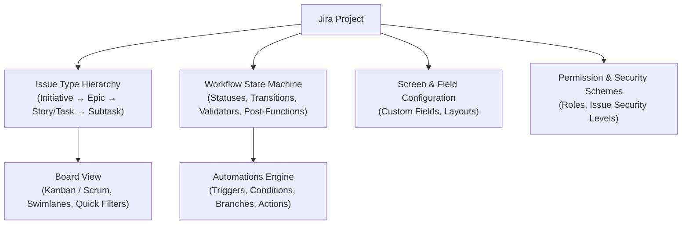
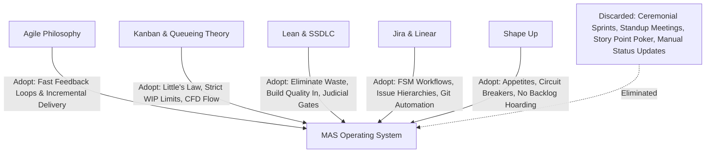

# METHODOLOGY_RESEARCH.md
## An Evidence-Based Study of Agile, Scrum, Kanban, Jira, and Modern Delivery Systems for Autonomous Multi-Agent Collectives

> **Acinonyx Enterprise Systems Research Directorate**  
> **Document Reference:** `MAS-RESEARCH-001-ADDENDUM`  
> **Authority:** Office of the Chief Principal Agentic Engineer & Systems Architect  
> **Target Audience:** Autonomous Agent Collectives, Platform Engineers, AI Architects, and Executive Leadership  
> **Status:** APPROVED FOR OPERATIONAL ADAPTATION  

---

## Executive Summary & Research Mandate

The objective of this research is to rigorously evaluate established human software development methodologies (Agile, Scrum, Kanban, Lean, Extreme Programming, DevOps) and project management systems (Jira, Linear, GitHub Projects) to derive the mathematical principles, workflow invariants, and structural mechanisms necessary to design an **Agent-Centred Project Management and Operating Framework for MAS-Core**.

### The Core Thesis: Principles Over Human Ceremonies
Human software engineering methodologies were engineered around human biological and psychological constraints:
1. **Cognitive Load & Working Memory:** Humans can track $7 \pm 2$ items; daily standups and sprint planning exist to synchronize distributed human memories.
2. **Communication Latency & Social Friction:** Humans require synchronous conversation, emotional alignment, and meetings to resolve ambiguity.
3. **Fatigue & Variable Velocity:** Human stamina fluctuates daily; story points and fixed sprint cadences provide psychological pacing.
4. **Trust & Accountability Deficits:** Humans can hide non-progress behind verbal status updates ("status theatre").

Autonomous AI agent collectives operate under radically different constraints and capabilities:
- **Sub-Second Execution & Zero Meeting Fatigue:** Agents do not need 15-minute standup meetings to know what others are doing; event streams and shared memory fabrics provide millisecond-latency state synchronization.
- **Context Drift & Hallucination Vulnerability:** Agents require explicit, deterministic mathematical boundaries, immutable contracts, and continuous verification loops.
- **High Concurrency & Asymmetric Task Durations:** Agent task runtimes vary from 200 milliseconds (code generation) to 5 minutes (container building or browser-based integration testing). Fixed 2-week sprint timeboxes are mathematically ill-suited for agent workflows.
- **Verification Over Trust:** Agent work must never be accepted based on self-reported completion; it must be verified cryptographically and empirically by independent critic agents.

Therefore, MAS must **not copy Jira's bureaucratic bloat** or **blindly adopt Scrum's human meetings**. Instead, MAS must extract the underlying flow dynamics, queueing theory, and feedback loops of these systems and construct a native, high-throughput **Agentic Ways of Working (WoW)** and an **Autonomous Project Management Engine (MAS-PM)**.

---

## 1. Agile: Principles, Lifecycles, and Agentic Realities

### 1.1 The 2001 Agile Foundations
The Agile Manifesto established four core value trade-offs and twelve operating principles designed to counter rigid Waterfall planning:
- **Individuals and interactions** over processes and tools.
- **Working software** over comprehensive documentation.
- **Customer collaboration** over contract negotiation.
- **Responding to change** over following a plan.

### 1.2 Agile Development Lifecycles
Traditional Agile operates as an iterative empirical feedback loop:
$$\text{Hypothesis} \longrightarrow \text{Small Increment} \longrightarrow \text{Automated Test} \longrightarrow \text{User Feedback} \longrightarrow \text{Adaptation}$$

Key operational mechanisms:
- **Incremental Delivery:** Decomposing large releases into small, vertically sliced working increments to reduce blast radius and accelerate time-to-value.
- **Continuous Feedback:** Reducing feedback latency from months to minutes through unit tests, continuous integration, and frequent customer reviews.
- **Continuous Improvement (Kaizen):** Retrospectives where delivery teams analyze delivery friction and adjust process policies.

### 1.3 Human vs. Agentic Agile Comparative Analysis

| Agile Concept | Human Implementation | Agentic Collective Adaptation (MAS) | Reason for Adaptation |
|---|---|---|---|
| **Individuals & Interactions** | Synchronous meetings, Slack chats, pair programming. | Asynchronous EventBus message routing, structured JSON-RPC payloads. | Natural language chatter causes token bloat; agents require structured typed contracts. |
| **Working Software** | Deployable binary or web preview for human QA. | Automated headless verification with Playwright, test suites, and Merkle state proofs. | Agent work must be self-verifying without human handholding. |
| **Responding to Change** | Mid-sprint backlog reprioritization, scope renegotiation. | Dynamic strike pod assembly, automatic task re-planning via supervisor DAGs. | Agents can pivot architectural tasks instantly without emotional switching costs. |
| **Incremental Delivery** | 2-week sprint releases. | Micro-task streaming: 10-minute continuous delivery cycles. | Time-boxing at multi-week scale creates artificial queueing delays for agents. |

---

## 2. Scrum: Decomposition, Responsibilities, and Flaws

### 2.1 The Scrum Framework Architecture
Scrum organizes development into fixed time-boxed iterations called **Sprints** (typically 1 to 4 weeks).

#### Core Roles
1. **Product Owner (PO):** Maximizes product value; owns the single prioritized Product Backlog.
2. **Scrum Master (SM):** Promotes Scrum adoption; removes impediments for the delivery team.
3. **Developers / Delivery Team:** Cross-functional group that plans and executes the Sprint Backlog.

#### Core Ceremonies
1. **Sprint Planning:** Selecting backlog items to form a Sprint Goal and Sprint Backlog.
2. **Daily Scrum (Standup):** 15-minute daily sync answering: What did I do? What will I do? What is blocking me?
3. **Sprint Review:** Demonstrating the completed Increment to stakeholders for feedback.
4. **Sprint Retrospective:** Team reflection to identify process improvements.

#### Core Artifacts & Commitments
- **Product Backlog** $\longrightarrow$ Commitment: *Product Goal*.
- **Sprint Backlog** $\longrightarrow$ Commitment: *Sprint Goal*.
- **Increment** $\longrightarrow$ Commitment: *Definition of Done (DoD)*.

### 2.2 Why Scrum Fails Autonomous AI Collectives
Empirical study of Scrum reveals that its core mechanisms are human-compensatory compromises:
1. **The Time-Box Fallacy:** Forcing work into 2-week buckets creates artificial batching. In an agent collective, an architectural feature can be planned, implemented, tested, and audited in 12 minutes. Waiting for sprint boundaries introduces massive queue latency.
2. **The Daily Standup Anti-Pattern:** A daily 24-hour sync cadence is absurdly slow for agents operating on sub-second turn cycles. For agents, a standup is replaced by real-time event streaming (`agent.publish(event)`).
3. **Story Point Subjectivity:** Story points estimate human cognitive complexity and uncertainty using Planning Poker. Agents require deterministic resource metrics: token budget, timeout seconds, memory footprint, and tool call count.
4. **The "Water-Scrum-Fall" Trap:** Organizations wrap traditional Waterfall specifications inside Scrum sprints, creating ceremonial overhead without agility.

---

## 3. Kanban: Flow Systems, Queueing Theory & Mathematical Rigor

### 3.1 Kanban Mechanics & The Six Core Practices
Originating from the Toyota Production System (Taiichi Ohno) and formalized for knowledge work by David J. Anderson, Kanban is a continuous pull system governed by flow:
1. **Visualize the Workflow:** Mapping work states on a visual board.
2. **Limit Work-in-Progress (WIP):** Capping active items in each column.
3. **Manage Flow:** Optimizing movement through states while minimizing wait times.
4. **Make Policies Explicit:** Clearly documenting criteria for state transitions.
5. **Implement Feedback Loops:** Cadenced review of metrics (cadences, replenishment, delivery).
6. **Improve Collaboratively, Evolve Experimentally:** Using models and scientific methods.

### 3.2 The Mathematics of Kanban: Little's Law
The mathematical foundation of Kanban is **Little's Law** from queueing theory:

$$WIP = \text{Throughput} \times \text{Lead Time} \quad \iff \quad \text{Lead Time} = \frac{WIP}{\text{Throughput}}$$

Where:
- **Work-in-Progress ($WIP$):** The number of work items currently active in the system.
- **Throughput ($\lambda$):** The average number of work items completed per unit of time.
- **Lead Time ($W$):** The total elapsed time from when work is requested to when it is delivered.

#### Critical Mathematical Implications for MAS:
1. **If WIP is unconstrained, Lead Time explodes:** When an agent supervisor spawns 50 unconstrained subtasks simultaneously, token throughput saturates, rate limits hit, and total completion time degrades exponentially.
2. **Strict WIP limits guarantee low lead time:** By setting a WIP limit of $K$ concurrent tasks per agent squad, lead time remains predictable and bounded.
3. **Cycle Time Stability Enables Probabilistic Forecasting:** Rather than guessing human story points, MAS can use Monte Carlo simulations over historical cycle times to calculate exact completion probabilities (e.g., "95% probability of completion within 140 seconds").

### 3.3 Flow Metrics & Visualization
1. **Cumulative Flow Diagram (CFD):** Visualizes work item distribution across states over time. Diverging bands indicate bottlenecks and growing WIP.
2. **Cycle Time Scatterplot:** Tracks elapsed execution time for every individual ticket.
3. **Flow Efficiency:** 
   $$\text{Flow Efficiency} = \frac{\text{Active Execution Time}}{\text{Total Lead Time}} \times 100\%$$
   Human software teams typically have flow efficiencies of 5%–15% (items spend 85%–95% of their time waiting). An optimized agent collective achieves flow efficiencies $> 80\%$.

---

## 4. Jira: Enterprise Architecture, Capabilities & Critique

### 4.1 Architecture & Core Components of Jira
Atlassian Jira represents the enterprise standard for human issue tracking and project management.

#### Detailed Capabilities Breakdown:
1. **Issue Hierarchy:** 
   - `Initiative` (Multi-month strategic objective)
   - `Epic` (Large deliverable grouping multiple stories)
   - `Story / Task / Bug` (Standard unit of deliverable value)
   - `Subtask` (Decomposed technical implementation step)
2. **Workflows as Finite State Machines (FSM):**
   - **Statuses:** Current lifecycle stage (`To Do`, `In Progress`, `Code Review`, `QA`, `Done`).
   - **Transitions:** Directed edges connecting statuses.
   - **Conditions:** Rules governing who or what can trigger a transition.
   - **Validators:** Assertions ensuring required fields or criteria are satisfied before transition commits.
   - **Post-Functions:** Side effects executed on transition (e.g., notify Slack, update custom field, trigger webhook).
3. **Automations Engine:** No-code rule engine executing event-driven actions (e.g., `WHEN PR merged THEN transition issue to Done`).
4. **VCS & CI/CD Integrations:** Bi-directional sync connecting Jira issues to GitHub/GitLab branches, commits, and pull requests via issue keys (`PROJ-123`).

### 4.2 Critical Critique: The Failure Modes of Jira
Despite its dominance, Jira presents profound operational liabilities that must NOT be replicated in MAS:
1. **Decoupled from Ground Truth (Status Theatre):** Jira tickets routinely drift from reality because updating tickets is manual human overhead. In Jira, a ticket may be marked "Done" while the code is broken or not merged.
2. **Sluggish API & Excessive Overhead:** Jira Cloud REST APIs suffer from 200–800ms latencies, aggressive rate limiting, and bloated multi-kilobyte JSON responses laden with UI-specific metadata.
3. **Bureaucratic Configuration Hell:** Enterprise Jira instances accumulate hundreds of custom fields, conflicting permission schemes, and fragile post-functions that paralyze developer flow.
4. **Absence of Cryptographic Verification:** Jira accepts status transitions on blind faith. It has no mechanism to verify that an issue moved to "Done" was validated by reproducible test evidence or cryptographic signatures.

---

## 5. Other Relevant Approaches: DevOps, Lean, and Modern Systems

### 5.1 DevOps & The DORA Metrics
The DevOps movement (Gene Kim, Jez Humble) and the DevOps Research and Assessment (DORA) framework establish that high-performing engineering organizations optimize for four throughput and stability metrics:

| DORA Metric | Definition | Human Target (Elite) | MAS Agent Target |
|---|---|---|---|
| **Deployment Frequency** | How often code is deployed to production. | Multiple times per day | On-demand continuous streaming |
| **Lead Time for Changes** | Time from commit to production release. | $< 1$ hour | $< 3$ minutes |
| **Change Failure Rate** | Percentage of deployments causing production failures. | $0\% - 15\%$ | $< 1\%$ (Guaranteed by Judicial Gates) |
| **Failed Deployment Recovery Time** | Time to restore service when an incident occurs. | $< 1$ hour | $< 30$ seconds (Automated rollback) |

### 5.2 Lean Software Development (Poppendieck)
Mary and Tom Poppendieck translated Lean Manufacturing into seven software principles:
1. **Eliminate Waste (Muda):** Anything that does not deliver direct customer value.
   - *The 7 Software Wastes:* Partially Done Work, Extra Features (Gold-plating), Re-learning, Handoffs, Task Switching, Delays, Defects.
2. **Build Quality In:** Never push defects downstream; inspect and verify immediately at the point of creation.
3. **Create Knowledge:** Document decisions systematically (ADRs, Merkle reflections).
4. **Defer Commitment:** Keep options open until decisions can be based on evidence.
5. **Deliver Fast:** Shorten feedback cycles to minimize risk.
6. **Respect People (and Agents):** Empower teams with clear boundaries and autonomy.
7. **Optimize the Whole:** Prevent sub-optimization of isolated components.

### 5.3 Secure SDLC (SSDLC) & NIST SSDF (SP 800-218)
Modern software development integrates security into every lifecycle phase:
- **Design:** Threat modeling, trust boundary definition, attack surface enumeration.
- **Implementation:** Secure coding standards, dependency vetting, secret-free code repositories.
- **Verification:** Static Application Security Testing (SAST), Dynamic Testing (DAST), software bill of materials (SBOM) generation, and dependency vulnerability scanning.
- **Judicial Gating:** Cryptographic signing of build artifacts; independent verification before deployment.

### 5.4 Alternative Project Management Models
1. **Linear:** Focused on developer speed, keyboard-first ergonomics, automatic Git state synchronization, minimal configuration, and continuous cycles instead of ceremonial sprints.
2. **GitHub Projects:** Native adjacency to source code; issues and pull requests share the same database; status updates trigger automatically on Git events.
3. **Basecamp Shape Up:** 
   - Rejects the permanent backlog ("backlogs are big time wasters").
   - Six-week cycles with two-week cool-downs.
   - "Appetite" (how much time we want to spend) instead of "Estimates" (how long will it take).
   - "Shaping" work before assigning to small autonomous squads.
   - "Circuit Breakers": If a project does not finish within its appetite, it does not get extended; it is cancelled by default.

---

## 6. Synthesis: Agent-Centred Adaptation Framework

To build an agentic project management system for MAS-Core, we synthesize the best attributes of each framework while discarding human compromises:

### The Three Operational Mandates for MAS:
1. **Code & Event Truth Over Status Theatre:** An issue in MAS is never updated manually by a human form; its state is updated automatically via cryptographically verified Git events, test execution summaries, and MCP tool invocations.
2. **Separation of Builder and Judge:** In accordance with judicial release policies and independent architecture principles, the agent that writes code cannot approve its own release. Independent reviewer agents (`qa_critic`, `adversarial_red_team`, `chief_architect`) must evaluate evidence.
3. **Bounded Autonomous Execution:** Every task executed by an agent squad must operate within strict time limits, token budgets, and concurrency WIP limits, backed by automatic circuit breakers.

---

*Authored by Project ACINONYX Research Directorate.*  
*Companion Deliverables: [MAS_WAYS_OF_WORKING.md](MAS_WAYS_OF_WORKING.md) | [MAS_PROJECT_MANAGEMENT_SPEC.md](MAS_PROJECT_MANAGEMENT_SPEC.md)*
