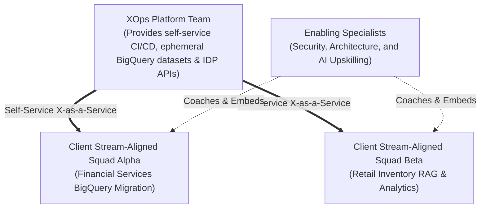
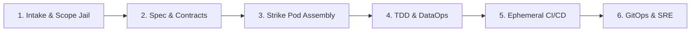

# THE ACINONYX WAYS OF WORKING (WoW)
### Enterprise Operating Manual, Governance Protocols & Engineering Constitution
**Organization:** Acinonyx Consulting Group (ACG) / Project ACINONYX (MAS-Core)  
**Authority:** Office of the Chief Principal Agentic Engineer & Architect  
**Effective Date:** October 5, 2026  
**Standard Compliance:** ISO/IEC/IEEE 12207:2026, NIST SP 800-218 (SSDF v1.2), Google Cloud DORA AI Capabilities Model, DataOps Manifesto  

**Current delivery assignment:** [Delivery ownership](DELIVERY_OWNERSHIP.md) governs Codex and Antigravity responsibilities and supersedes conflicting assignment examples below. Codex owns frontend development, UX/UI, design and art direction; Antigravity owns backend/engine implementation. Guild and runtime persona names do not grant development or runtime authority.

---

## 1. Company Identity & Architectural Vision

Acinonyx Consulting Group (ACG) operates as a premier **Cloud Data & AI Consulting Practice** and an **Autonomous Multi-Agent Systems Studio**. We reject slow, bloated legacy processes and fragile "vibe coding." We deliver high-impact, verifiable outcomes by fusing:
1. **Google Cloud Platform Data Architecture:** BigQuery, Looker Studio, dbt, Cloud Composer, and Dataplex.
2. **Autonomous Multi-Agent Collective (MAS-Core):** Specialized agent squads executing within sandboxed deterministic execution loops.
3. **Rigorous Operational Governance:** Continuous integration, formal Data Contracts, and immutable GitOps delivery.

---

## 2. Organizational Architecture: Team Topologies & Guilds

In accordance with **Conway's Law** and the empirical research of Team Topologies (Skelton & Pais), ACG organizes human consultants and autonomous agents into four decoupled interaction structures:

### The 7 Capability Guilds of Acinonyx Labs
Every agent and human engineer belongs to a functional Capability Guild that maintains domain excellence and standards:
1. **Executive & Strategy:** `CIOAgent` (Chief Information Officer), `HRAgent` (People & Talent Topology).
2. **Research & Product:** `MarketResearcherAgent`, `ProductManagerAgent` (`product_lead`), `DesignerAgent` (`design_lead`).
3. **Data & AI:** `DataEngineerAgent`, `VectorRAGArchitectAgent`.
4. **Software Engineering:** `ArchitectAgent` (`chief_architect`), `BackendEngineerAgent`, `FrontendEngineerAgent`, `AgentWorkflowEngineerAgent`, `EngineerAgent` (`senior_engineer`).
5. **Quality & Verification:** `QAAgent` (`qa_critic`), `AdversarialRedTeamAgent`.
6. **Platform & Security:** `FinOpsGovernorAgent`, Security SRE.
7. **Growth & GTM:** `ClientManagerAgent` (`client_director`), `MarketingAgent`, `TechnicalWriterAgent`, `DevAdvocateAgent`.

### Liquid Strike Pods
For specific client missions or feature builds, cross-functional squads are assembled dynamically via `AcinonyxEnterprise.assemble_strike_pod()`. The pod executes through research-first gated milestones with Merkle provenance tracking and **auto-disbands upon delivery**, eliminating permanent bureaucratic overhead.

---

## 3. The 6-Phase Unified Delivery Lifecycle

Every engagement, data pipeline, and software module must traverse the standard Acinonyx lifecycle:

### Phase 1: Intake & The Scope Jail
- Handled by `client_director` using [`templates/rfp-intake.template.md`](../templates/rfp-intake.template.md).
- Define the business problem, target KPIs, and the **Scope Jail** (a non-negotiable list of excluded items).
- Work commences only with an approved Client Engagement Brief and signed Statement of Work (SOW).

### Phase 2: Architecture & Contract-First Specification
- Handled by `chief_architect` and `data_engineer`.
- **Zero code is written without a contract:**
  - REST/gRPC interfaces: OpenAPI 3.1 or Protobuf.
  - Data pipelines: Machine-readable Data Contracts ([`templates/data-contract.template.yml`](../templates/data-contract.template.yml)) validated via `mas.validation.validate_data_contract()`.
  - Architecture decisions: Documented in [`templates/adr.template.md`](../templates/adr.template.md) under `/docs/adr/`.

### Phase 3: Dynamic Strike Pod Assembly
- Summoned via `enterprise.assemble_strike_pod(title, requirements, required_specializations)`.
- Agents attach to the dedicated mission EventBus topic (`org:pod:<mission_id>`).
- Token budget is locked (default: 150,000 tokens) with FinOps governor monitoring.

### Phase 4: Test-Driven Construction & DataOps
- **Test-Driven Development (TDD):** Red-Green-Refactor. Unit tests are written before functional code.
- **Three-Tier BigQuery Modeling:**
  - `staging` (Bronze): 1:1 view of raw sources; zero business logic.
  - `intermediate` (Silver): Normalized transformations, deduplication, surrogate keys.
  - `marts` (Gold): Star-schema dimensional models partitioned daily and clustered.
- **Trunk-Based Development:** Merges to `main` daily; branch lifespans $\le 24$ hours; PR batch sizes $\le 200$ LOC.

### Phase 5: Ephemeral CI/CD & Automated Verification
- Every PR provisions an isolated BigQuery dataset: `ci_scratch_pr_<id>`.
- Automated CI pipeline runs:
  - BigQuery dry-run cost scans (queries scanning $> 500\text{ GB}$ fail the build).
  - Data quality assertions (uniqueness, referential integrity, non-null).
  - Security gates: SAST (Semgrep), SCA (Trivy), Secret scanner (Gitleaks).
  - Dialectical critique and mutation testing (`mutmut`).
- Ephemeral dataset is immediately destroyed upon pipeline completion.

### Phase 6: Progressive GitOps Delivery & Managed SRE
- Declarative infrastructure synchronization via **ArgoCD**.
- Canary deployments (1% $\rightarrow$ 10% $\rightarrow$ 100%) with automated rollback on latency or error spikes.
- Lineage cataloging in **Google Cloud Dataplex**.
- SRE monitoring against 99.9% SLO with error budget freeze triggers.

---

## 4. The Eight Non-Negotiable Governance Invariants

These invariants are enforced in runtime code, CI pipelines, and organizational reviews:

1. **Invariant 1 (Staged Dispatch Interlock):** Default execution mode is `STAGED` (`MAS_ENABLE_LIVE_DISPATCH=false`). Agents operate in local simulation and cannot alter live cloud infrastructure or send external communications without explicit human approval.
2. **Invariant 2 (Filesystem Jail):** Agent file operations are strictly confined to authorized project roots (`allowed_projects`). Access outside the jail is blocked at the OS boundary.
3. **Invariant 3 (Bounded Dialectical Debates):** Self-healing and debate loops between engineers and critics are capped at $K \le 3$ rounds to prevent infinite token consumption.
4. **Invariant 4 (Durable Audit Logging):** Every bus message, task dispatch, and dry-run query is appended to durable JSONL storage (`workspace/audit/events.jsonl`).
5. **Invariant 5 (BigQuery Pre-Merge Cost Cap):** Any individual query scanning $> 500\text{ GB}$ fails CI validation automatically.
6. **Invariant 6 (Zero Staging Contamination):** Production and shared staging datasets are never used for PR testing; isolated ephemeral datasets are mandatory.
7. **Invariant 7 (Cryptographic Merkle Provenance):** Release artifacts must compute a SHA-256 Merkle root hash linking the code to its test logs, architecture specs, and commit SHA.
8. **Invariant 8 (Shift-Left Secret Prevention):** Zero-tolerance policy for secrets in source control. Pre-commit hooks block any commit containing private keys, tokens, or credentials.

---

## 5. Quality & Flow Gates

### 5.1 Definition of Ready (DoR)
A task or user story may be pulled into active development only if:
- [ ] Conforms to INVEST criteria.
- [ ] Contains executable Gherkin acceptance criteria (`Given-When-Then`).
- [ ] Interface schema (OpenAPI or Data Contract) is approved.
- [ ] Upstream dependencies are identified with zero blockers.

### 5.2 Definition of Done (DoD)
An item is done and eligible for release only if:
- [ ] 100% of unit and integration tests pass in a hermetic container.
- [ ] Code passes strict typing (`mypy --strict`) and linters with zero warnings.
- [ ] Code is reviewed by peer engineer or QA Critic agent.
- [ ] Pull request is $\le 200$ LOC and merged into `main`.
- [ ] Security scans pass with zero High or Critical vulnerabilities.
- [ ] Deployed to ephemeral/staging environment and verified.

### 5.3 Flow Management: Little’s Law
$$\text{Cycle Time} = \frac{\text{Work-in-Progress (WIP)}}{\text{Throughput}}$$
- Every active board must enforce explicit numerical **WIP Limits** per column.
- When a bottleneck forms (WIP limit reached), upstream team members swarms to unblock the bottleneck rather than pulling new tickets ("Stop starting, start finishing").
- Planning is guided by **Monte Carlo probabilistic forecasting** (e.g., 85th percentile confidence) rather than subjective story point estimation.

---

*Ratified by the Acinonyx Enterprise Systems Research Directorate & Chief Architect.*
