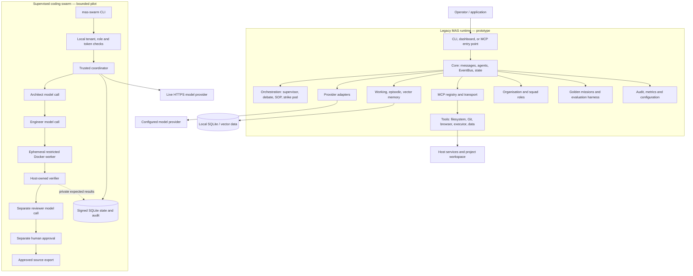

# MAS architecture

MAS has two distinct execution surfaces. The legacy runtime is a development
prototype with known production blockers. The supervised coding swarm is a newer,
bounded workflow for creating and verifying Python functions; it is deliberately
kept outside the legacy dashboard, MCP and tool routes.

The key boundary is between untrusted agent output and trusted control-plane work.
Agents can propose plans and code; they cannot change identities, tests, budgets,
verification evidence or release approval. Candidate code runs in a temporary
restricted container. The verifier compares output against operator-owned expected
results outside that container.

See the [supervised swarm design](SUPERVISED_SWARM.md) for the exact controls and
the [independent review](../reviews/SUPERVISED_SWARM_REVIEW.md) for tested evidence
and remaining limitations.
