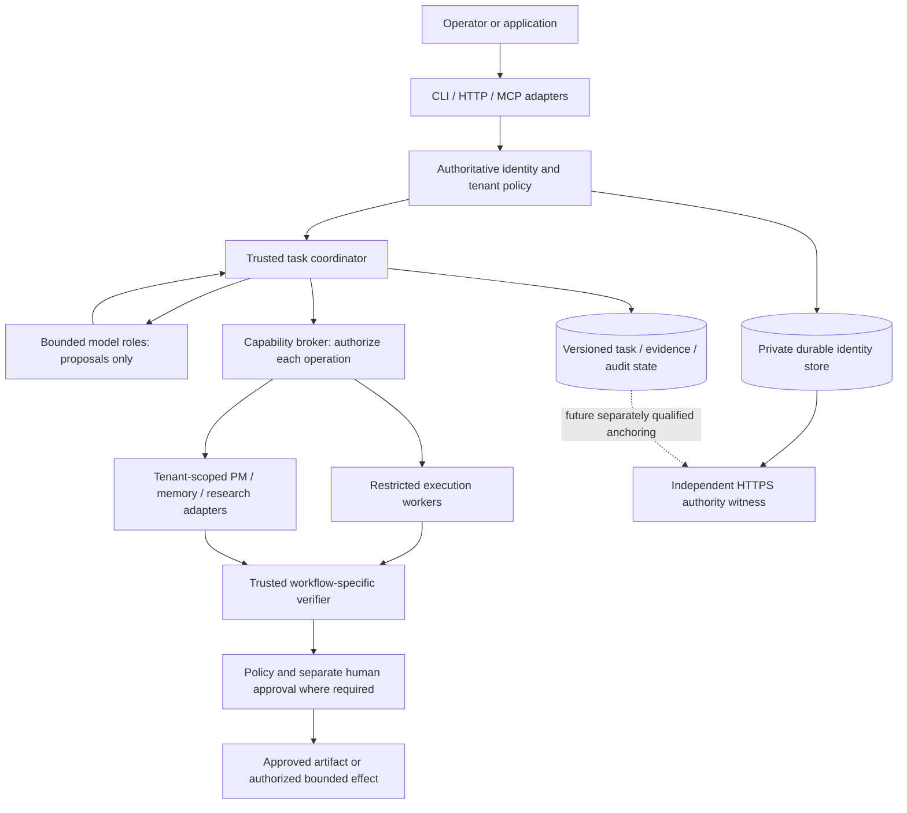

# ADR: consolidate MAS onto a controlled execution platform

Status: **DRAFT — proposed design; consolidation is not implemented.**
Source baseline: `119ca57ac000058f485dc1a33f62aafd722a3931`.
Owner: Independent Reviewer & Chief Architect, with implementation owned by AcinonyxLabs engineering.
Related documents: [component migration map](MAS_CONSOLIDATION_MIGRATION.md), [acceptance checklist](MAS_CONSOLIDATION_ACCEPTANCE.md), [current architecture](MAS_ARCHITECTURE.md).

## Context and decision

The repository currently contains a broad agent framework and a separate supervised coding workflow. The latter is bounded to generating and verifying Python `solve(payload)` functions; it is not a general platform execution engine. Their coordinators, identity stores, audit streams and approval mechanisms are not interchangeable. Tenant-bound PM interfaces and durable IAM have been improved, but those changes do not automatically protect shared memory, model dispatch or organization workflows. The HTTPS witness currently anchors configured durable IAM stores, not the swarm store or every audit stream.

Propose a shared trusted control plane with versioned workflow adapters. Reuse the supervised swarm's enforced separation of proposal, execution, verification and approval. Preserve its current working adapter while extracting common controls behind compatibility boundaries. Admit older capabilities individually after acceptance; do not create an unrestricted wrapper around existing tools.

The first operating envelope is a supervised single-host pilot with a separately administered HTTPS witness. Public hostile-code hosting, distributed execution, arbitrary autonomous deployment and general enterprise approval are outside this decision. Restricted Docker shares the host kernel; it is insufficient by itself for public hostile-code service admission.

## Target architecture

Solid lines describe proposed ownership, not implemented integration. The dashed line is future work and requires a separate namespace/protocol qualification for each anchored stream. The witness must retain its own signing key, administrators, storage and recovery boundary.

### Boundaries and authority

- The coordinator, policy engine, verifier, operator configuration, private stores and execution host are trusted. Agent outputs, imported documents, tool results and candidate programs are untrusted.
- Interfaces authenticate callers and resolve tenant ownership server-side. Client/model-supplied tenant IDs cannot select authority. Check current authorization before admission and before sensitive effects; do not trust a context cached before revocation.
- The broker exposes explicit tenant-scoped capabilities with argument validation. No agent capability changes identities, permissions, budgets, test expectations, verifier outcomes, witness configuration or approvals.
- Provisioning, witness enrollment and uncertain-commit recovery remain trusted administrative operations. Do not expose them through agent-facing MCP.
- Do not route unrestricted host tools or raw SQLite APIs through the broker. Filesystem access remains bounded to a resolved private workspace; executable code goes through the accepted worker boundary.

## Common contracts to implement

These are design requirements, not existing serialized APIs. Define concrete schemas and conformance tests before adding adapters.

| Contract | Required fields and enforcement |
| --- | --- |
| Task | `schema_version`, server-owned `tenant_id`, `task_id`, authenticated `subject_id`, workflow version, immutable input/artifact hashes, tenant-scoped idempotency key, limits, state/version and timestamps. Reusing a key with different inputs must conflict. |
| Agent message | Version, tenant/task IDs, message ID, verified sender role, recipient/topic, parent and correlation IDs, content type, bounded payload/artifact references and deadline. Assign sender/tenant metadata through the coordinator; never accept a role claim as authority. |
| Capability request | Task, caller, capability/version, validated arguments, operation ID and expected state version. Reauthorize and apply per-capability ownership/effect policy. |
| Execution result | Operation/attempt ID, candidate hash, worker image/environment digest, exit classification, bounded stdout/stderr or artifact hashes, observed timing and resource outcome. Worker output is not verification evidence by itself. |
| Verification evidence | Task/attempt and candidate hashes, verifier and suite versions/hashes, observed case outcomes, timestamps, provenance and failures. Fail missing, stale, mismatched or tampered evidence; never substitute a model-generated report. |
| Approval | Tenant/task, distinct authenticated approver where required, exact candidate/evidence hashes, policy version, expiry and decision. Changed artifacts invalidate approval. No agent self-approval. |
| Audit event | Stream/version, tenant/task/operation references, actor, transition, previous/checkpoint integrity and timestamp. Exclude bearer tokens and secret payloads; persist required audit and state mutation atomically. |

Treat each data store and external side effect as a distinct transaction domain. Do not promise atomic commit across stores or providers. Record intents and outcomes; reconcile uncertain effects explicitly rather than retrying them blindly. Identity fencing retains advance-before-local-commit behavior and fails closed if checkpoints diverge.

## Workflow lifecycle and communication

Retain the coding adapter's existing states and at-most-three-model-call behavior. Introduce a versioned shared lifecycle with admitted, active, awaiting approval and terminal outcomes; workflow adapters may retain finer stages such as planning/coding/verifying/reviewing. Every transition must have a policy, state-version check and durable evidence. Never reinterpret existing records under an incompatible state machine.

Use typed, tenant-scoped asynchronous messages locally first. Recipient and topic routing are functionality; authorization is an additional requirement. Validate ownership on publish, read, subscription, replay and artifact resolution. Bound queue size, payload size, context, hops, delegation depth, calls, deadlines and retry attempts. Reject cyclic or excessive delegation. Do not assume distributed delivery or exactly-once effects from the existing EventBus/SwarmNode implementations.

Any durable delivery adapter needs event IDs, deduplication, replay authorization and an explicit delivery guarantee before admission. Human discussions or multi-agent debate remain proposals. Their conclusions cannot override verifier failures.

## Identity and data migration

Use durable platform IAM as the proposed authority behind an identity adapter; do not copy swarm credentials into it unchanged. Inventory tenant/subject mappings, roles and active sessions. Resolve conflicting ownership explicitly, deny ambiguous mappings and issue new credentials after cutover. Keep submitter/approver separation. Qualify revocation in long-running workflows and specify which operations are cancelled versus prevented from starting; already completed effects cannot be undone by revocation.

Preserve the swarm's separate signed run/audit history during migration. Export under maintenance controls, verify signatures/provenance, copy into versioned storage and reconcile counts, ownership, hashes and terminal states. Do not rewrite historical signatures as though they were original evidence. New history must reference a reviewed migration manifest.

Unify authority logically before considering physical database consolidation. Separate stores may remain where their ownership and transaction rules are clear. This avoids an unnecessary cross-store rewrite.

## Options considered and consequences

| Option | Assessment |
| --- | --- |
| Wrap all older tools in the new CLI | Rejected: exposes old authority and execution bypasses through a newer interface. |
| Replace every component at once | Rejected: large migration risk, weak fault attribution and difficult rollback. |
| Shared controls with gated workflow adapters | Recommended: preserves tested behavior, supports incremental migration and makes admission evidence explicit. |

The design adds contract and migration work, and witness dependence trades availability for authority freshness. A single supported interface can coexist with multiple workflow adapters; this does not require one enormous coordinator or a fixed universal agent count. Admit additional agents only against explicit workflow limits and measurable benefit.

## Rollout, recovery and decisions still needed

Follow phases P0–P6 in the migration map. Initially run the new adapter in isolated shadow fixtures, then an allowlisted pilot. Shadow mode must not duplicate external effects. Keep one writer per migrated authority; avoid uncontrolled dual writes. Route selection is trusted configuration, never a caller's security downgrade option.

Rollback means stopping admissions, reconciling active/uncertain work and routing only to a previously accepted compatible adapter. Never revive old credentials, restore stale authority, rewind witness heads or enable unguarded legacy endpoints. If reverse data migration is unsafe, remain offline and recover forward.

Before implementation: ratify schema/version ownership, role mapping, operation-specific approval policy and supported resource ceilings. Before production: choose the independently administered witness domain, monitoring and restore policy; set workload-specific SLOs, backup/RPO/RTO and retention requirements with the acceptance evidence. Numerical performance targets are not established by this draft.

## Architect assessment

**APPROVED WITH CONDITIONS as a draft direction, not as an implemented or deployable platform.** Conditions: complete P0 contracts/inventory, maintain compatibility, implement and test shared authority, qualify each adapter, and pass the admission checklist. Enterprise readiness remains unapproved. Platform modularity and ownership are addressed by adapters; data integrity depends on versioned migrations and reconciliation; AI reliability depends on external verification and bounds; resilience depends on fail-closed authority and operational recovery evidence.
