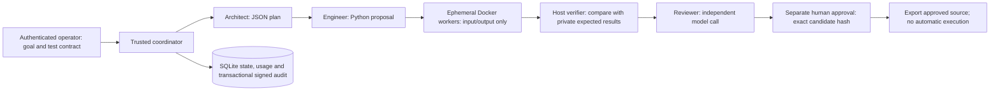

# Supervised coding swarm

The executable entry point is `mas-swarm` (`python -m mas.swarm.cli` from a checkout).
It implements a bounded workflow for generating a **Python `solve(payload)` function**,
verifying its input/output behavior and obtaining separate human approval. It does
not deploy code, edit arbitrary repositories, access a desktop or expose a remote
service. This first scope is deliberate: the older dashboard, gateway, IAM and MCP
tools retain the limitations documented in the [architecture review](../reviews/ARCHITECT_REVIEW.md).



## Trust boundaries

The coordinator, operator CLI, database, signing key, provider adapter and Docker
daemon are trusted. Anyone with the operating-system account or Docker socket is
an administrator; bearer tokens do not protect against a compromised local account.
Only agent **outputs and candidate code** are untrusted. There is no agent-visible
tool that changes permissions, test contracts, budgets, evidence or approval.

The architect and engineer receive a goal and bounded context, not expected test
answers. The reviewer receives source and actual verifier outcomes, never authority
to manufacture outcomes. Fixed system prompts express each role; security comes
from unavailable capabilities and enforced contracts, not prompt wording.

Candidate code runs as UID 65534 in an operator-reviewed, digest-pinned Python
image. Each input gets an ephemeral container with no host mounts, socket,
credentials, egress or Linux capabilities, a read-only root, bounded temporary
storage, CPU, memory, processes, file descriptors, output and execution time.
Docker's default seccomp policy and no-new-privileges remain active. The trusted
verifier runs **outside** the candidate process. Exiting with code zero without a
valid matching JSON result fails; printing a fabricated test certificate fails.

Docker containers share the host kernel. This implementation is for a supervised
pilot on a dedicated machine, **not a public hostile-code execution service**.
MicroVM isolation, sandbox escape testing and infrastructure hardening remain
required before that deployment scope can be accepted.

## State, identity and failure behavior

Tokens are randomly generated, hashed in storage, tenant scoped, role checked,
revocable and expire within seven days (one day by default). No default secrets
exist. Credential files and the CLI state directory must be owner-only. The
separate approver must have a different subject from the submitter. Local
administrative enrollment is not a remote identity provider.
Identity records are signed and checked against their latest audit event, so
editing a stored role or replaying an older unrevoked token record is rejected.

SQLite WAL and FULL synchronous transactions couple every mutation with its audit
record. Audit insertion failure rolls back the mutation. Run documents and audit
events are HMAC signed; the audit hash chain is checked before each write. Source,
suite, run and worker-image hashes bind verification to the exact proposal. This
detects tampering without the key, not deletion/rollback of an entire authentic
database snapshot by an administrator. External immutable audit anchoring is a
future production requirement. Current audit validation scans the chain and is
appropriate for the bounded pilot, not high-throughput multi-host operation.

Submission keys are unique within a tenant and bind the immutable request. An
atomic claim prevents duplicate coordinators. Expired active leases require
explicit recovery and cleanup of containers carrying that run's label. Recovery
marks the job interrupted, without replaying side effects or model calls. Backups
use SQLite's backup API; the signing key must be protected and backed up separately.

The fixed workflow allows at most three model calls, no automatic retries, two
concurrent test containers by default, bounded contexts and output, a total
deadline and reserved token budgets settled against provider-reported usage.
Uncertain failed/cancelled calls retain their reservation; they are never treated
as free. These controls do not constitute a currency billing cap enforced by the
provider. Configure provider-side spending limits as well.

Cancellation joins container creation before cleanup, kills attached execution,
removes the container and joins sibling tasks. A cancellation recorded in another
CLI process is polled every 100ms. Model HTTP requests run in killable trusted
subprocesses. A crash or daemon outage can leave a labelled container requiring
operator reconciliation; do not assume exactly-once effects across a lost Docker
response. No host-execution or synthetic model fallback exists.

States: queued → planning → coding → verifying → reviewing → awaiting_approval
→ approved. Rejected, failed, cancelled and interrupted are terminal. Approval
requires all mandatory cases passing, reviewer agreement, complete usage,
unaltered provenance and evidence no more than one hour old. Export requires
human approval and never runs the exported code.

## Setup and operation

```bash
python -m pip install '.[dev]'
# Managed cloud: follow the environment Docker/proxy/CA instructions first.
docker --host=unix:///var/run/docker.sock pull python@sha256:05cda9777409a9c3ffddd94a4c476b79f0769a0b4857f0c7ed9226b6800b0d6f
python -m mas.swarm.cli init --tenant acinonyxlabs --subject ceo
python -m mas.swarm.cli enroll --subject release-reviewer --role approver --out workspace/scratch/swarm/reviewer.token
python -m mas.swarm.cli submit --request-key sum-v1 --goal 'Implement solve(payload) returning the sum of a JSON list of finite numbers, including empty and negative lists.' --cases templates/swarm/sum_cases.json
```

Configure `MAS_SWARM_API_KEY` securely, and set `MAS_SWARM_PROVIDER_URL` and
`MAS_SWARM_MODEL` in the environment. The requested provider is **Gemini 3.8 Flash**;
Google's OpenAI-compatible endpoint is
`https://generativelanguage.googleapis.com/v1beta/openai`. The configured model ID
`gemini-3.8-flash` passed authenticated discovery and a real three-role workflow
in this environment on 2026-10-08. Availability must be checked in each environment.
Do not substitute a different model silently. The adapter requires
HTTPS, complete JSON responses and actual usage; unsupported models fail closed.
Run `python -m mas.swarm.cli provider-check` to verify authenticated model discovery;
every workflow also requires the requested ID to appear in that provider's listing.

```bash
python -m mas.swarm.cli run RUN_ID --image python@sha256:05cda9777409a9c3ffddd94a4c476b79f0769a0b4857f0c7ed9226b6800b0d6f
python -m mas.swarm.cli show RUN_ID
python -m mas.swarm.cli --token-file workspace/scratch/swarm/reviewer.token approve RUN_ID --candidate-hash HASH_FROM_SHOW
python -m mas.swarm.cli export RUN_ID --out workspace/scratch/approved_candidate.py
python -m mas.swarm.cli audit
python -m mas.swarm.cli backup --out workspace/scratch/swarm-backup.db
```

`cancel RUN_ID` records cancellation. `recover RUN_ID --image DIGEST` reconciles
an expired active lease and removes only that run's containers. If the Docker
daemon becomes unavailable, restore it and inspect labelled containers before
resuming operations. `cleanup RUN_ID --image DIGEST` reconciles workers belonging
to failed, rejected, cancelled or interrupted runs and records an audit event.
No network service needs to start; the model endpoint is
external and Docker is a required local prerequisite. Existing credential files
are never overwritten.
`revoke --subject NAME` invalidates that subject's credentials in the current
tenant; live operations recheck revocation rather than trusting a cached role.

See the [delivery review](../reviews/SUPERVISED_SWARM_REVIEW.md) for the observed
tests, live Gemini benchmark, scoped rating and remaining 10/10 gates.

## Acceptance and the 10/10 target

```bash
python scripts/verify_secure_swarm.py --image python@sha256:05cda9777409a9c3ffddd94a4c476b79f0769a0b4857f0c7ed9226b6800b0d6f --out workspace/scratch/acceptance-UNIQUE
```

This runs meaningful security/state regressions and real Docker workflow tests,
and emits actual counts, source hash, image, timestamps, JUnit and logs. Zero
tests, any failure or any skip fails structural acceptance. The model in those
tests is a **scripted TLS fixture**. The report never awards a numerical rating or
claims live model quality. CI runs these same checks without production credentials.

For a small **live** evaluation, run `python scripts/evaluate_secure_swarm.py
--image DIGEST --out workspace/scratch/live-UNIQUE`. It tests stable deduplication,
invoice reconciliation and handling of an untrusted imported note. It records
actual outcomes, usage and latency and never grants human approval or awards a
rating. Provider totals, including any thinking overhead absent from visible
completion counts, are fully charged against each run's budget.

Before awarding 10/10 for the scoped pilot, require a fresh-install verification,
all structural checks, a real requested-model run, representative task correctness
and prompt-injection evaluations, repeated load/cancellation/crash tests with no
orphaned workers, backup restoration, provider outage and budget evidence, and an
independent review. Passing a small example suite does not prove general program
correctness. Full MAS/enterprise readiness additionally requires resolving the
legacy review blockers, multi-host recovery/load evidence, external audit,
identity integration and stronger hostile-tenant isolation. These remain explicit
gates, not an automatic 10/10 certificate.

## Shared platform identity

The optional, persisted `--identity platform` mode uses durable platform IAM sessions and explicit swarm permissions. Local mode remains isolated for compatibility. See [shared identity setup and recovery](SHARED_SWARM_IDENTITY.md); existing local state requires reviewed migration rather than automatic rebinding.
