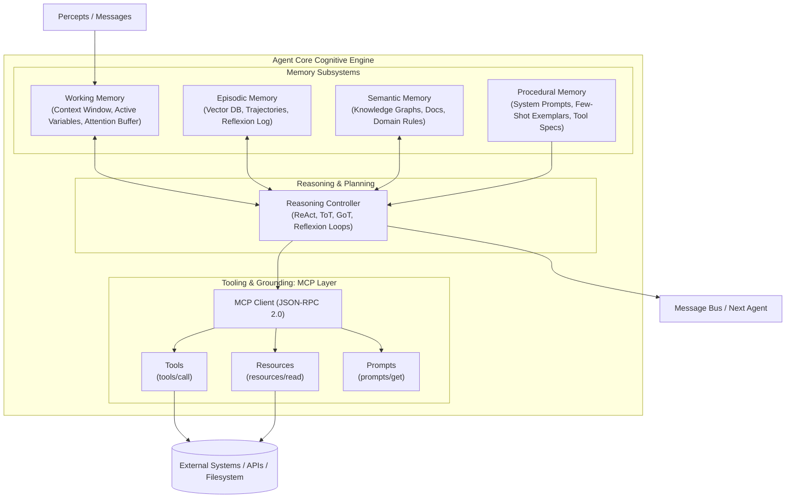
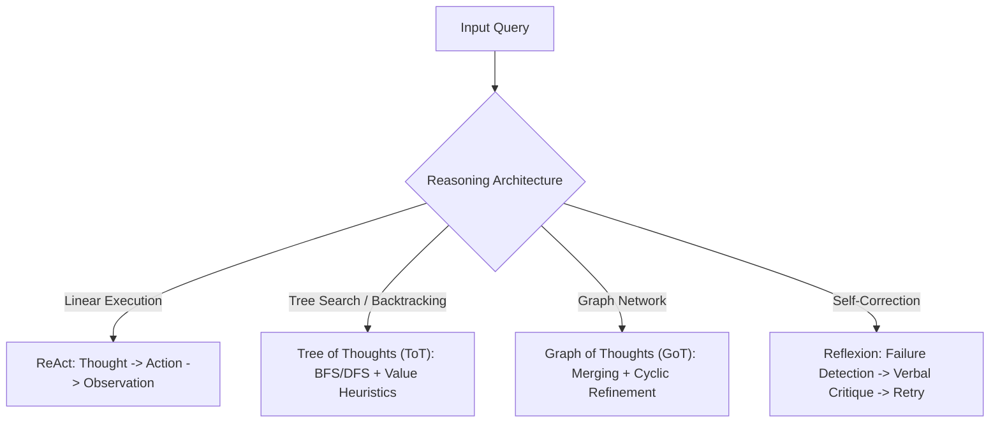
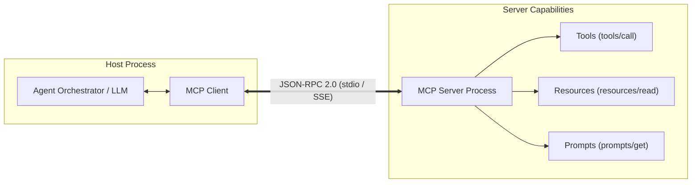
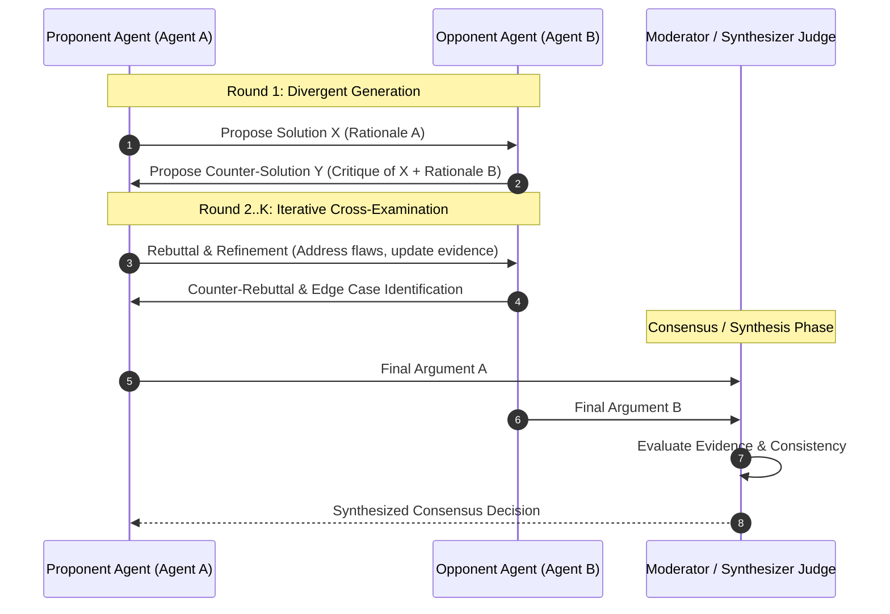
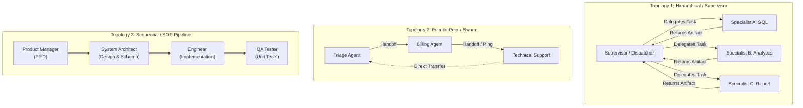

# Deep Dive: Modern LLM-Based Multi-Agent Systems (LLM-MAS)

## 1. Agent Core Anatomy

In modern agentic AI, foundation models do not act merely as static text predictors, but as the central reasoning core within a structured cognitive architecture (e.g., the **CoALA** framework: Cognitive Architectures for Language Agents).



---

### 1.1 Memory Systems Taxonomy

Drawing from cognitive science (Tulving's taxonomy) and modern vector/key-value storage:

#### A. Working Memory (Active Workspace)
* **Definition:** The active context window ($C_t$) containing the conversation history, current system prompt, immediate scratchpad, and tool outputs.
* **Failure Modes:**
  * **"Lost in the Middle" Effect:** Performance degrades when critical information is placed in the center of long contexts rather than the extreme ends.
  * **Quadratic Attention Complexity:** Self-attention scales with $O(L^2)$ token length, imposing computational and latency limits.
* **Mitigation Techniques:**
  * Context truncation with rolling summarization nodes.
  * Attention KV-cache eviction policies (e.g., StreamingLLM, SnapKV).
  * Dynamic scratchpad variables kept out of LLM context until explicitly retrieved.

#### B. Episodic Memory (Experience Traces)
* **Definition:** Persistent storage of past experiences, agent trajectories, successes, and failures.
* **Storage Paradigm:** Vector databases (Chroma, Qdrant, Milvus) indexing embeddings $\mathbf{e} = f_{\text{embed}}(\text{trajectory})$.
* **Retrieval Scoring:** Formulated by Park et al. (Stanford Generative Agents) as a weighted linear combination:
  $$\text{Score}(m) = \alpha \cdot \text{Recency}(m) + \beta \cdot \text{Importance}(m) + \gamma \cdot \text{Relevance}(m, q)$$
  * $\text{Recency}(m) = \lambda^{t - t_m}$ (exponential decay where $\lambda \in [0.99, 0.995]$).
  * $\text{Importance}(m)$: LLM-evaluated integer score ($1$ to $10$) evaluating psychological impact.
  * $\text{Relevance}(m, q) = \frac{\mathbf{e}_m \cdot \mathbf{e}_q}{\|\mathbf{e}_m\| \|\mathbf{e}_q\|}$ (cosine similarity between query $q$ and memory $m$).

#### C. Semantic Memory (Declarative Knowledge)
* **Definition:** Factual world knowledge independent of specific agent execution history.
* **Implementations:** Hierarchical RAG (Retrieval-Augmented Generation), domain-specific knowledge graphs (KGs), and structured relational schemas.

#### D. Procedural Memory (Skills & Rules)
* **Definition:** "How-to" knowledge detailing how tasks should be performed.
* **Implementations:** System prompt rules, few-shot demonstration exemplars, and learned executable skill libraries (e.g., Voyager, where code functions representing verified skills are stored in a vector DB and indexed by task descriptions).

---

### 1.2 Reasoning Engines & Planning Paradigms



| Technique | State Representation | Search / Exploration Mechanism | Error Recovery | Best Suited For |
| :--- | :--- | :--- | :--- | :--- |
| **CoT / Self-Consistency** | Linear token sequence | Stochastic sampling (ArgMax or Temperature $> 0$ with majority vote) | None (single-pass) | Deterministic math & symbolic logic |
| **ReAct** | Interleaved `Thought`, `Action`, `Observation` trace | Greedy step-by-step tool invocation | Dynamic re-planning based on tool return | Real-world API/tool interaction |
| **Tree of Thoughts (ToT)** | Tree where nodes are intermediate thoughts | BFS or DFS with evaluation heuristics (LLM score or beam selection) | Explicit backtracking to unvisited branches | Combinatorial planning (Game of 24, Crosswords) |
| **Graph of Thoughts (GoT)** | Directed Acyclic Graph (DAG) with node merging | Arbitrary graph transitions (forking, combining, feedback loops) | Aggregation of multiple divergent reasoning branches | Document summarization, multi-perspective synthesis |
| **Reflexion** | Episodic memory of failed trajectories + verbal self-critique | Actor-Evaluator-Self-Reflection loop | Explicit verbal memory injection on subsequent attempt | Code generation, test-driven debugging |

---

### 1.3 MCP (Model Context Protocol) Tooling Architecture

Anthropic’s open **Model Context Protocol (MCP)** standardizes how language models communicate with local and remote data sources, environments, and toolkits, replacing bespoke SDK bindings with a uniform client-server protocol.

#### Architecture Model
* **MCP Host:** The orchestration container or runtime (e.g., Antigravity, Claude Desktop, custom agent framework).
* **MCP Client:** The bridge component inside the host maintaining dedicated $1:1$ connections to servers.
* **MCP Server:** A lightweight process exposing capabilities via standardized primitives over an IPC/network transport.



#### Wire Protocol: JSON-RPC 2.0
MCP uses JSON-RPC 2.0 specifications over two supported transports:
1. **STDIO:** Local sub-process communication via standard input/output streams. Fast, sandboxed, and zero network configuration.
2. **SSE (Server-Sent Events) over HTTP:** Remote server communication for distributed or cloud-hosted tools.

#### The Three Core Primitives

1. **Tools (`tools/list`, `tools/call`):**
   * Executable functions invoked by the model with structured parameters.
   * Model receives JSON Schema defining arguments; returns content (text, image, embedded resource).
   ```json
   // Request (Client -> Server)
   {
     "jsonrpc": "2.0",
     "id": 1,
     "method": "tools/call",
     "params": {
       "name": "query_database",
       "arguments": {"sql": "SELECT id, status FROM tasks WHERE completed = false;"}
     }
   }
   // Response (Server -> Client)
   {
     "jsonrpc": "2.0",
     "id": 1,
     "result": {
       "content": [{"type": "text", "text": "{\"rows\": [{\"id\": 101, \"status\": \"pending\"}]}"}]
     }
   }
   ```

2. **Resources (`resources/list`, `resources/read`, `resources/subscribe`):**
   * Passive context attachments (file contents, live logs, database schemas) identified by custom URIs (e.g., `file:///workspace/data.csv`, `postgres://db/schema`).
   * Supports push notifications via `notifications/resources/updated`.

3. **Prompts (`prompts/list`, `prompts/get`):**
   * Pre-parameterized templates exposed by the server enabling consistent multi-turn workflows (e.g., `git-commit-prompt`, `code-review-template`).

---

## 2. Multi-Agent Debate (MAD)

Multi-Agent Debate (MAD) leverages Marvin Minsky’s *Society of Mind* and Hegelian dialectics (Thesis $\to$ Antithesis $\to$ Synthesis) to surpass single-agent reasoning capabilities.



### 2.1 Mechanics & Protocols
* **Divergent Initialization:** Agents are seeded with complementary or conflicting perspectives, distinct personas, varying temperature parameters, or asymmetric information slices.
* **Turn Structures:**
  * *Simultaneous Debate:* All agents submit proposals concurrently in round $r$; in round $r+1$, each agent reads all peer responses from round $r$ and revises its position.
  * *Round-Robin Debate:* Agents speak sequentially, modifying arguments dynamically.
* **Termination & Consensus Mechanisms:**
  1. *Unanimous / Supermajority Agreement:* Terminate when cosine similarity between agent responses exceeds threshold $\tau$ or exact solution tokens match.
  2. *Synthesizer / Judge Role:* An impartial evaluator agent inspects the full transcript, checks factual consistency, and selects/merges the superior reasoning path.
  3. *Confidence-Weighted Voting:* Agents output confidence $c_i \in [0, 1]$; final score is $\sum c_i \cdot \mathbb{I}(\text{choice}_i = k)$.

### 2.2 Advantages
* **Hallucination Suppression:** Factual errors generated by one model are often caught and debunked by peer agents possessing different training token priors or context framing.
* **Overcoming Myopia:** Single models get trapped in local reasoning minima; debate forces exploration of non-obvious counter-examples.

### 2.3 Pathologies, Failure Modes & Mitigations

1. **Sycophancy & Conformity Bias:**
   * *Phenomenon:* LLMs are alignment-tuned (via RLHF) to be agreeable. When confronted by a confident peer—even one propagating incorrect assertions—agents often abandon correct positions to minimize conversational friction.
   * *Mitigation:* **Blind Anonymization.** Strip agent identities and stylistic markers so arguments are evaluated strictly on logical propositions. Introduce an explicit **Contrarian / Devil's Advocate** agent whose objective function penalizes consensus.

2. **Premature Convergence:**
   * *Phenomenon:* In early rounds (Rounds 1–2), an initial dominant response gains traction, causing subsequent agents to echo its phrasing before exploring the solution space.
   * *Mitigation:* **Delayed Communication.** Enforce independent multi-turn thought generation before inter-agent message broadcasting begins.

3. **Context Window Churn & Token Cost:**
   * *Phenomenon:* Dense $N$-agent debate over $K$ rounds scales token consumption at $O(K \cdot N^2)$, quickly exhausting context windows and budget.
   * *Mitigation:* Implement strict round caps ($K \le 3$, as shown in ConsensAgent studies) and compress intermediate debate turns into structured formal claim-rebuttal matrices.

---

## 3. Orchestration Topologies

The structural topology of an agent network dictates communication flow, error propagation boundaries, state management, and systemic failure modes.



---

### 3.1 Hierarchical (Supervisor / Manager-Worker)

* **Architecture:** A central "Supervisor" agent acts as the root node. It interprets the global objective, performs task decomposition, delegates work items to subordinate specialist agents, validates intermediate outputs, and aggregates the final response.
* **Control Flow:** Deterministic dispatch:
  1. User prompt $\to$ Supervisor.
  2. Supervisor routes to Worker $i$ with scoped sub-task prompt.
  3. Worker $i$ executes via local tools and returns result payload to Supervisor.
  4. Supervisor updates shared state and decides next route (Worker $j$ or `__end__`).
* **Leading Implementations:** LangGraph Supervisor pattern (`create_supervisor`), CrewAI Hierarchical Process with Manager LLM, AutoGen `GroupChatManager`.
* **Strengths:**
  * High governance, predictable control flow, and deterministic state transitions.
  * Human-in-the-Loop (HITL) checkpoints can be cleanly inserted at the supervisor node before dispatch.
* **Weaknesses:**
  * Centralized bottleneck: Supervisor context window accumulates all sub-task summaries.
  * Single point of failure: If the supervisor hallucinates a plan, workers blindly execute invalid sub-tasks.

---

### 3.2 Peer-to-Peer / Swarm (Decentralized Mesh)

* **Architecture:** Agents operate as autonomous peers without a global coordinator. Communication occurs through dynamic handoffs or shared message queues.
* **Control Flow:**
  * *Handoff Pattern:* Agent $A$ determines it lacks tools or domain expertise and executes a special tool `transfer_to_agent_b(context)` (e.g., OpenAI Swarm).
  * *Actor Model Pattern:* Each agent has an inbox queue. Agents post asynchronous messages to peers; state is decentralized.
* **Strengths:**
  * Maximum flexibility; well-suited for open-ended problem exploration, multi-party negotiations, and dynamic customer service routing.
  * No central bottleneck or coordinator latency.
* **Weaknesses:**
  * **Routing Loops & Deadlocks:** Agent $A$ hands off to $B$, who hands off to $C$, who hands back to $A$.
  * State tracking and auditability are complex; reconstructing execution traces requires distributed tracing.
  * High risk of goal drift over long interaction chains.

---

### 3.3 Sequential & SOP-Driven (Assembly Line / Software Org)

* **Architecture:** Emulates industrial Standard Operating Procedures (SOPs) and waterfall/agile development cycles. Agents occupy static, sequential roles where the output of phase $k$ serves as the input specification for phase $k+1$.
* **Control Flow:**
  $$\text{Task} \xrightarrow{} \text{Role}_1 (\text{PRD}) \xrightarrow{} \text{Role}_2 (\text{System Architecture}) \xrightarrow{} \text{Role}_3 (\text{Code Synthesis}) \xrightarrow{} \text{Role}_4 (\text{Review / Test})$$
* **Leading Implementations:**
  * **MetaGPT:** Enforces the paradigm: $\text{Code} = \text{SOP}(\text{Team})$. Uses standardized intermediate artifacts (PRD with User Stories, System Design with Class/Sequence Diagrams, API specs) formatted in JSON/Markdown.
  * **ChatDev:** Multi-agent software company simulating CEO, CPO, CTO, Programmer, and Reviewer with phase-level multi-turn chat chains.
* **Strengths:**
  * **Lowest Hallucination Rate:** By constraining agents to strict intermediate artifact formats (e.g., Mermaid diagrams, OpenAPI JSON), ungrounded prose is minimized.
  * Highly reproducible and easily auditable against software development standards.
* **Weaknesses:**
  * Inflexible: Cannot adapt easily if an unexpected exception occurs outside the predefined SOP pipeline.
  * Upstream error compounding: A flaw in the PRD cascades linearly through architecture into code.

---

## 4. Architectural Trade-Off Analysis

| Dimension | Hierarchical (Supervisor) | Peer-to-Peer (Swarm) | Sequential (SOP Pipeline) |
| :--- | :--- | :--- | :--- |
| **State Management** | Centralized typed state (e.g., LangGraph `TypedDict`) | Fragmented / Localized state or passed payload | Cumulative artifact state (e.g., MetaGPT Shared Memory) |
| **Communication Overhead** | $O(N)$ messages (Hub-and-Spoke) | $O(N^2)$ worst-case cross-talk | $O(N)$ linear handoffs |
| **Fault Isolation** | High (Supervisor catches worker errors) | Low (Errors cascade through handoffs) | Medium (Gated by phase reviewers) |
| **Determinism & Auditability**| High | Low | Very High |
| **Recovery Mechanism** | Supervisor re-dispatches with critique | Relies on agent self-redirection | Phase loop-back (e.g., Tester rejects $\to$ Developer fixes) |
| **Latency Profile** | Variable (bounded by supervisor rounds) | Unpredictable (risk of long handoff chains) | Predictable (linear function of pipeline stages) |
| **Optimal Use Case** | Complex multi-domain workflows (research + coding + review) | Dynamic routing, customer support, open negotiation | Structured document / software generation |

---

## 5. Summary & Engineering Recommendations

1. **For Production Enterprise Automation:** Combine **Hierarchical Supervisor** topology with **LangGraph**, using explicit state checkpoints and typed Pydantic models for validation.
2. **For High-Fidelity Domain Artifacts (Code / Design):** Implement **SOP-driven pipelines (MetaGPT style)** with deterministic unit-test validation gates.
3. **For Reasoning & Truth Verification:** Use **Multi-Agent Debate (MAD)** with a maximum of $2-3$ rounds, anonymized argument passing, and an explicit contrarian/devil's advocate to eliminate sycophantic convergence.
4. **For Tool Standardization:** Expose tools exclusively via the **Model Context Protocol (MCP)** using STDIO transports for isolated local tasks and SSE for distributed microservices.
