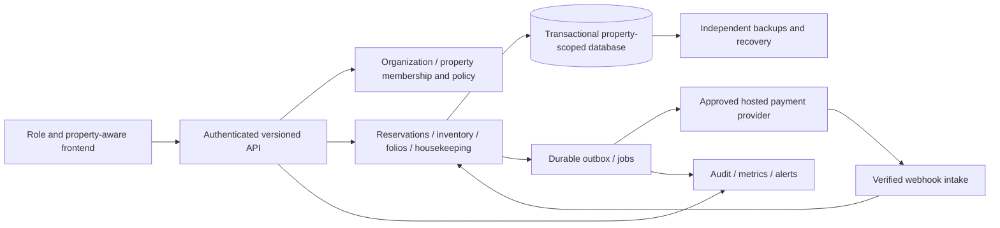

# Platinum Lodge: multi-property hotel management project

Initiated 9 October 2026. Planning baseline; implementation has not started under this plan.

## 1. Mandate and outcome

Deliver a production-ready, multi-property hotel management system in its first release. Reservations and check-in, billing and payments, and housekeeping are the core operating workflows. Close the frontend gap while developing the backend needed to support real hotels safely. Platinum Lodge is the initial product context, not a restriction to one hotel.

Success means staff can run daily operations quickly, managers can see and resolve exceptions across properties, money reconciles, access stays within authorized properties, and operations recover from failure. A polished demonstration or a passing prototype test suite does not satisfy this mandate.

The owner has not supplied a fixed deadline, budget, named second property, jurisdictions or payment provider. These are discovery decisions, not reasons to stop planning. This plan proposes scope and targets; it does not claim that staffing, provider accounts, legal requirements or targets have already been confirmed.

## 2. Baseline and evidence

Prototype: `feat/platinum-lodge-management`, commit `2c1f063b4fd8369ccb0f89cf1ed4dd45864f465b`. Inspected application: `projects/platinum-lodge/`. Current organizational ownership baseline: `8b92e33794339d4917e2c0060991c3523d32b605` on `Acinonyx_frontier`.

The prototype is a dependency-free Node 24 HTTP application with SQLite, a responsive vanilla JavaScript frontend, staff roles, reservations, check-in/out, folios, recorded payments/refunds, housekeeping states, dining, events, maintenance, image uploads and a backup script. It has useful business behavior worth preserving through regression contracts.

Validation on 9 October: `npm run check` passed; `npm test` passed all **six** workflow tests, with zero failures or skips. These are hotel tests, separate from the MAS engine's test suite. Browser, penetration, load, real payment and production recovery checks were not run in this planning exercise. Historical README browser claims are not fresh evidence.

| Area | Present | Gap for first release |
| --- | --- | --- |
| Property model | One hotel configuration; global room numbers and roles | Organization/property hierarchy, memberships, property-local inventory/configuration and scoped reporting |
| Reservations | Date/capacity checks, overlap checks, lifecycle and room moves | Transactional concurrency protection, version conflicts, rate/deposit/cancellation rules, multi-property availability |
| Front desk | Basic arrivals, check-in and checkout | Reliable task workspace, exception handling, room readiness and payment status, audit trails, keyboard/mobile usability |
| Money | Integer-cent amounts, folio charges, manual receipts/refunds | Immutable journal, tax/invoice policy, business-day posting, payment processing, settlement and shift reconciliation |
| Payments | Records money said to have been received | Regional provider integration, signed webhooks, pending/unknown states, replay protection, refund/settlement reconciliation |
| Housekeeping | Dirty/cleaning/inspection/clean states | Assignment, priorities, mobile workflow, reliable freshness, supervisor approval, workload and room-readiness visibility |
| Security | Password hashing, role checks, cookies, origin protection | Tenant isolation, granular permissions, privileged MFA, recovery, session lifecycle, threat-modelled production controls |
| Recovery | Database backup and upload copying | Scheduled encrypted off-site backups, coordinated file recovery, restore drills, RPO/RTO evidence |
| Frontend | Forest-green/cream hospitality identity, forms and tables | Full role journeys, accessible components, property context, predictable loading/errors/retries, measured task efficiency |
| Operations | Local server and project CI | Deployment, migrations, secrets, monitoring, incident response, release ownership, support and cutover |

Specific risks found: new frontend POST calls generate new idempotency keys; a lost acknowledgement followed by retry can become a new operation. Keys are not designed around property/actor scope. Full-state fetching needs pagination and scoped endpoints. Booking charges are not a revenue-recognition model. Sessions are memory-local. Upload and database backups need consistency rules. Third-party reference photographs need rights verification. The feature branch predates the current ownership agreement and other frontier changes; integrating it must be selective and reviewed.

## 3. Ownership and authority

Apply the [delivery ownership agreement](https://github.com/mphoMas/Acinonyx/blob/8b92e33794339d4917e2c0060991c3523d32b605/company/DELIVERY_OWNERSHIP.md).

| Responsibility | Delivery/integration owner | Review and decision |
| --- | --- | --- |
| Frontend, navigation, UX/UI, accessibility, responsive behavior, frontend performance | Codex | Antigravity reviews integration; hotel staff test journeys; owner decides product tradeoffs |
| Design system, visual identity, typography, imagery, motion and art direction | Codex | Owner approves brand direction and asset rights |
| Backend, domain logic, data model, APIs, identity, tenancy, payment integration | Antigravity development team | Separate technical/security reviewer; Codex reviews user-facing contracts |
| Infrastructure, CI/CD, migrations, backend tests, observability, backups, incident tooling | Antigravity development team | Separate operational review and witnessed drills |
| API contracts and acceptance | One named owner per task; jointly agreed interfaces | Both teams; version and evidence tied to candidate |
| Product scope, budget, procurement and final release | Project owner | Advice from both teams and hotel/finance/privacy specialists |

Project path map: Codex owns `public/`, frontend-only browser tests, design documentation and approved visual assets. Antigravity owns `server.js`, backend modules/migrations, server tests, operational scripts and infrastructure. Shared `package.json`, CI and cross-layer tests get a task-specific owner before edits. Planning coordination is Codex-owned. This map is not a blanket runtime permission grant.

The **Antigravity development team** can perform scoped repository engineering with its actual permissions. The **supervised coding swarm** remains a bounded Python `solve(payload)` workflow with restricted execution, host verification and separate authenticated human approval. It cannot be assigned this application's general frontend, backend, deployment or hotel administration. Model agreement does not authorize release. No provider execution budget or production credentials are granted by this plan.

Antigravity acknowledgement is pending. The repository handoff is available; no external message or active backend execution is claimed. Runtime assignees stay unassigned until actual authenticated principals and authority are established. Descriptive ownership in MAS-PM does not create an identity.

## 4. First-release scope

### Included

1. Multi-property organization model from the start: staff memberships and permissions per property, explicit group permissions, property-local settings, currencies/timezones, legal entity, business day, tax configuration and invoice numbering. Separate organizations must remain isolated even if the first customer owns all pilot hotels.
2. Rooms and room types, sellable inventory, agreed rate plans and occupancy limits; availability; reservation creation/amendment/cancellation/no-show; deposits and policy snapshots; room allocation/moves; arrivals, departures and in-house workspaces.
3. Check-in eligibility, guest details restricted by role, payment/deposit exceptions, room readiness, checkout settlement, permitted credit balances and late checkout policy. Identity/legal guest-registration requirements are decided for each launch jurisdiction.
4. Folios, nightly accommodation posting and business-day close, additional charges, reversals, taxes, invoices/receipts, split folios and basic charge routing, partial payments, refunds, cash/bank/manual tender capture, staff shift reconciliation and management financial reports.
5. One approved payment-provider integration with hosted/tokenized payment handling, tested authorization/capture/refund workflows as supported by that provider, webhooks and settlement reconciliation. Provider/country/merchant eligibility is a discovery blocker. Recording a payment alone cannot satisfy integrated payments acceptance.
6. Housekeeping assignments, priorities, mobile room updates, inspection approval, arrival-readiness queue and maintenance/out-of-service handling with relocation and escalation.
7. Property and group dashboards with drill-down, a unified exception queue, actionable alerts, audit history and permission-safe exports. Aggregation keeps currencies separate unless an explicitly reviewed FX policy is introduced.
8. Production authentication, monitoring, recovery, support, migration, staff training and deployment controls.

### Deferred unless explicitly reprioritized

OTA/channel manager and public booking engine; advanced revenue management; full restaurant/bar POS and stock; events/catering; loyalty/CRM campaigns; payroll; bulk group contracting/company credit; advanced multi-currency settlement/FX; guest mobile app; autonomous AI operations; writable offline booking/payment queues.

These deferrals need the owner's scope review at discovery. If existing hotels depend on an OTA, statutory integration or another excluded system to operate, its supported integration becomes a first-release dependency and the estimate changes. Existing prototype dining/events routes must be disabled or brought fully into property-scoped acceptance before any production exposure; legacy features cannot bypass the release scope.

## 5. Product and design direction

Codex will evolve the prototype's hospitality identity into an operational design system: readable type, forest-green/cream foundation, restrained gold accents, explicit semantic status colors plus text/icons, accessible contrast and clear hierarchy. Decorative imagery must not obscure operational information. Use owned/licensed property imagery; reference galleries are inspiration, not a license.

Primary navigation is role-focused. Each property workspace has **Today**, reservations/calendar, guests and stays, billing, housekeeping, and reports where permitted. Group managers get a portfolio overview with safe drill-down. An always-visible property identity accompanies consequential actions. Group mode cannot silently create property-level operations.

Daily work centers on tasks: arrivals lacking a ready room, departures with outstanding balances, cleaning overdue for arrival, maintenance blocking inventory and unreconciled payments. Every alert links to the underlying record, shows freshness and a clear next action. Managers get accountable assignment and escalation rather than a wall of decorative charts.

Frontend completion requires empty/loading/error/permission-denied/stale/conflict/success states, preserved input after recoverable errors, durable retry keys, keyboard interaction, accessible dialogs, visible focus, EN/PT review, currency/date formatting, responsive 360/768/1440px layouts and 200% zoom. Property switches clear scoped caches and warn about unsaved work; no old-property data or action can remain attached to a new context.

Low-connectivity support starts with explicit stale/read-only views and safe manual operating procedures. Do not queue financial or availability mutations offline without an approved conflict and reconciliation design. Recovery must explain whether an operation is pending, failed, completed or uncertain.

Deliver design inventory, journey maps, task-based wireframes, component tokens/specifications, interactive frontend states, browser evidence and usability measurements. Mocked screens may support design review but do not pass production acceptance.

## 6. Target architecture and contracts

Recommend a modular Node backend with a transactional managed PostgreSQL database, versioned migrations and a separate job/outbox processing boundary. Antigravity owns the architecture decision record and validates hosting, team capability, cost and concurrency requirements before selection. This is a recommendation, not an implemented migration. Microservices are unnecessary for the initial release unless a concrete scaling or authority requirement justifies them.

Tenancy: organizations contain properties; users receive explicit memberships and action permissions. The server derives and checks access for each record, query, export, file, background job, webhook, audit entry and report. A property ID supplied by the browser is not authority. A second organization is included in adversarial tests even if initially not marketed as SaaS. Cross-property guest sharing is explicit and privacy-reviewed, never the default consequence of shared tables.

Inventory: make overlap protection transactional, including simultaneous allocation, amendments and out-of-service moves. Reservation status, room occupancy and housekeeping status are distinct. Preserve policy/rate snapshots and use optimistic versions for amendments. Never accept an override merely because a frontend button is visible.

Finance: append immutable balanced journal entries with currency exponent-aware integer units, legal-entity/property context and provenance. Correct through reversals, not destructive edits. Separate booked value, earned accommodation revenue, receivables, cash receipts, deposits and taxes. Define rounding and invoice sequencing with the launch accountant. Business-day close is resumable and idempotent, with explicit late posting rules. Event/dining ledgers must not be quietly merged into accepted financial reports.

Payments: hosted/tokenized capture; no storage of PAN/CVV. Scope idempotency to organization/property/operation and retain keys across client retries. Verify provider signatures, deduplicate events, handle out-of-order notifications, distinguish pending/unknown/failed/settled, and reconcile settlement independently. Refund limits and approval permissions are server-enforced. Chargebacks, provider outages and partially completed operations have runbooks. Outsourcing capture does not automatically remove PCI obligations.

API contract minimum: versioned OpenAPI schema, scoped pagination/filtering, permission capabilities, ISO timestamps plus property business date, currency and minor-unit amount, record version, idempotency behavior/retention, error codes and safe user messages, correlation ID, audit semantics, freshness and event delivery expectations. Shared fixtures cover two properties and two organizations. Contract changes require agreed compatibility and consumer tests; frontend never substitutes for server enforcement.

Security/operations: privileged MFA, secure session handling and revocation, account recovery, rate limiting, origin/CSRF review, upload validation, secret management, least privilege, encrypted transport/storage, redacted logs, retention/deletion/export rules and separate test/production environments. Audit attributes immutable principal, acting property, action, before/after reference and correlation ID, with protected retention. Hotel product identity is not automatically MAS engine identity; any binding requires an explicit design and authority decision.

## 7. Benchmarks and measurable success

See [benchmarks and acceptance](BENCHMARKS_AND_ACCEPTANCE.md) for primary sources, protocols, owners and evidence requirements. Production PMS references establish a capability floor; their marketing claims do not certify this system or guarantee comparable results.

Proposed first-release targets: at least 30% reduction in median time for matched staff tasks against the hotel's measured current workflow; at least 95% successful completion of core scripted journeys; clean routine check-in median at most 90 seconds; housekeeping state update median at most 15 seconds; p95 core reads at most 500ms and durable mutations at most 1s excluding provider/network time; monthly availability objective 99.9%; recovery RPO at most 15 minutes and RTO at most 60 minutes. All targets are unverified until measured. More ambitious standards can follow demonstrated reliability.

Safety targets outrank speed: no cross-tenant disclosure in the adversarial suite, no double allocation under concurrency tests, no duplicate monetary effect in replay tests, and no unexplained closing financial difference. A fast check-in that corrupts inventory or money fails.

## 8. Delivery phases and acceptance sequence

Indicative **14–20 elapsed weeks**, conditional on an available backend team, one frontend stream, timely product/finance decisions, a regional payment sandbox and a workable hosting procurement path. This is an initial planning range, not a delivery commitment. Antigravity estimates backend capacity during discovery; reforecast after foundations and again before qualification. Do not derive a promised date from this document.

| Phase | Indicative relative window | Deliverables and exit gate |
| --- | --- | --- |
| 0: discovery and project baseline | Weeks 1–2 | Real operating journeys, launch properties/jurisdictions, payment eligibility, metric baseline, scope, ADRs, cost/capacity estimate; G0 |
| 1: foundations and design system | Weeks 3–5 | Reviewed tenancy/auth model, migration/deployment skeleton, contracts, property navigation/components; G1 |
| 2: reservations and front desk | Weeks 6–9 | Concurrent-safe booking lifecycle, operational frontend and room readiness; G2 |
| 3: finance and payments | Weeks 6–12, after foundations | Ledger, taxes/invoices, provider, webhooks, business-day/shift reconciliation; G3 |
| 4: housekeeping and management | Weeks 8–13 | Assigned mobile workflow, maintenance exceptions, portfolio reporting, productive task workspace; G4 |
| 5: qualification and migration | Weeks 13–16 or later | Security/performance/recovery, migration rehearsals, staff UAT, support readiness; G5 |
| 6: controlled rollout and stabilization | Weeks 17–20 or earlier if qualified | Authorized production rollout, 14 consecutive staffed operational days at Platinum Hotel Mozambique, with multi-property technical qualification; G6 |

Windows overlap where dependencies permit; adding them does not produce the elapsed estimate. Procurement and legal integrations may lengthen the path. Finance policy/provider feasibility and tenant-safe foundations are the first critical risks. Backend work can proceed by domain after G1, while Codex builds against agreed contracts.

Gate sequence: G0 scope/feasibility → G1 foundations → G2 reservations → G3 finance → G4 housekeeping/management → G5 production qualification → G6 operational acceptance. Domain work may overlap; final gate sign-offs retain that order. Each gate has a versioned candidate, actual runner results, separate review, unresolved-risk register and decision record. Nothing is marked complete because a document proposes a test.

## 9. Work management and collaboration

MAS-PM is the planning source of truth. The [backlog export](BACKLOG.md) is a snapshot of locally initiated records, not a second live board. Planning records remain BACKLOG; no active sprint, authenticated executor assignment, provider allowance or production activation is created. The local PM instance is not claimed to be a deployed shared service. Export/import synchronization and principal binding must be checked before both teams execute.

Each task records one delivery/integration owner, allowed/forbidden paths, contract, blockers, acceptance and separate review. Backend implementation tasks belong to Antigravity; Codex implements frontend tasks. Before staging, split large packages into reviewable units, estimate capacity, bind real principals and execution allowances, and agree exact file scopes. Separate branches/worktrees avoid concurrent edits to shared files.

Weekly product/operations review: scope, real demonstrations, blockers, metric results, costs and decisions. During active implementation, a brief daily async update records completed evidence, current work, blockers and next integration point in MAS-PM. Maintain one decision log and a dated risk register; reforecast each gate. A handoff includes commit, contracts, migrations, commands/results, screenshots where relevant and remaining issues. Cross-boundary changes receive coordinated review.

## 10. Operational acceptance and cutover

Qualification uses synthetic data before authorized customer migration. Validate at least two properties in one organization and a separate adversarial organization. Owner amended the initial pilot on 9 October 2026 to Platinum Hotel only, in Mozambique. G6 now requires 14 consecutive staffed operational days there plus multi-property technical qualification. Synthetic evidence does not establish live second-property operational acceptance; that remains an expansion gate when another property participates. Multi-property architecture, authorization and correctness are release-one requirements.

Migration rehearsals map property inventories, guests, reservations, opening balances, deposits and users; deduplicate deliberately; reconcile source/target totals and preserve provenance. No customer passwords or sessions are copied blindly. Take verified backups, establish a write freeze/capture window, obtain operational sign-off, and reconcile before reopening transactions.

Deploy by reversible candidate with reviewed migrations. Restore/rollback instructions distinguish software rollback from database restore: after accepting new bookings or payments, restoring an old database can lose business transactions. Fence writes, recover/replay with reconciliation and maintain provider truth. Do not promise that a rollback undoes a captured payment.

Provide staffed incident ownership, after-hours escalation appropriate to hotel operation, status communication, safe manual procedures, documented support contacts, alert routing and training. Proposed critical-incident acknowledgement is within 15 minutes under an explicitly staffed rota; it is not a promise of unsupported 24/7 coverage.

Run the first controlled cohort through at least 14 consecutive staffed operational days covering arrival peaks, checkout, housekeeping handovers, nightly close, cash shifts, refunds and recovery. Track daily inventory and finance reconciliation. Predefined stop conditions include tenant leaks, duplicate charges, unexplained ledger differences, unprotected overbooking and failed recovery. Stop new writes where required, follow incident procedure and obtain requalification before expansion.

## 11. Blind spots and risk treatment

| Risk / blind spot | Prevention, decision or test | Owner |
| --- | --- | --- |
| One-property pilot cannot prove live multi-property operations | Qualify technical isolation with synthetic organizations/properties; require additional operational qualification before expanding to a second real property | Project owner |
| Multi-property UI mistaken for isolation | Server-scoped records/files/jobs/exports and adversarial 2-org tests | Antigravity |
| Wrong property after switch or stale data | Context labels, state invalidation, unsaved-form handling, stale response rejection | Codex |
| Concurrent booking/move/maintenance conflict | Transactional inventory invariants and fault/concurrency testing | Antigravity |
| Lost payment acknowledgement / webhook replay | Durable operation keys, uncertain state and independent provider reconciliation | Antigravity |
| Tax, guest reporting or invoice laws unknown | Launch-country accountant/legal requirements before finance build sign-off | Project owner with Antigravity |
| Provider unavailable in operating country | Verify merchant, currency, payout, refund and terminal capability before selection | Project owner with Antigravity |
| Booking value presented as revenue | Reviewed revenue/business-day definitions, golden accounting fixtures | Antigravity + finance reviewer |
| Night audit crossing timezone/DST/day boundary | Property business-date model; timezone/DST/late-posting tests | Antigravity |
| Cash theft / excessive refund authority | Approval limits, shift reconciliation, immutable actor audit | Antigravity + hotel finance |
| Room clean versus actually ready | Distinct occupancy/cleaning/inspection states and supervised acceptance | Both, implementation split by layer |
| Emergency room failure with active reservation | Relocation and guest communication workflow, not impossible blocking rule | Both |
| Poor connectivity / power interruption | Read-only stale mode, manual continuity, tested restart and reconciliation | Both |
| Multi-currency misleading totals | Currency-separated portfolio reports; no implicit FX | Both |
| Guest PII exposed through search/logs/exports | Data minimization, permissions, redaction, retention, privacy review | Antigravity |
| Backup exists but cannot restore | Off-site encryption, keys recoverable separately, two timed restore drills | Antigravity |
| DB snapshot and uploads inconsistent | Coordinated object references/snapshot rules and restored-media tests | Antigravity |
| Beautiful UI slows experienced staff | Keyboard paths, real-staff task timing, large readable tables and focus design | Codex |
| Automated accessibility scan false confidence | Manual keyboard/screen-reader/zoom tests against WCAG 2.2 AA | Codex + separate reviewer |
| Hotel images lack publication rights | Rights register and approved original assets | Codex + project owner |
| Prototype extras leak into release | Disable or qualify every route/module; explicit feature inventory | Antigravity |
| AI outputs treated as release evidence | Actual candidate-bound runs and separate review/human decision | Both + project owner |
| Support not staffed / supplier lock-in | Coverage/cost agreement, exports, runbooks and documented dependencies | Project owner + Antigravity |
| Large feature branch diverges from frontier | Selective integration plan preserving current agreements/security | Antigravity |

## 12. Cost, decisions and first actions

Budget separately for engineering/design/review, managed database and backups, application/jobs hosting, monitoring/log retention, payment transaction/terminal costs, communications/integrations, security assessment, staff devices/connectivity and training/support. Establish expected property/room/staff scale and a monthly cost model before infrastructure commitment. No invented monetary or model-token estimate is approved here.

Discovery decisions to record: launch organizations/properties/countries; current systems and required channels; legal entities/currencies/timezones/tax/invoice rules; payment provider and merchant readiness; cash/refund/credit policies; inventory scale/room types; guest sharing/privacy; migration scope; support hours and incident decision owner; staffing/budget/date; approved brand assets. Alternatives, owner, deadline, evidence and impact belong in the decision log.

Immediate work: Antigravity reads/acknowledges ownership and validates backend feasibility; Codex inventories frontend journeys and prepares the property/role workspace specification; the owner identifies launch partners and finance/payment decision-makers. Together finalize G0, agree contracts and staged tasks, then begin implementation. This planning handoff does not imply that Antigravity has already accepted or begun work.

Owner amendment: [SCOPE_AMENDMENT_2026_10_09.md](SCOPE_AMENDMENT_2026_10_09.md) confirms the one-property initial pilot, Excel baseline, open provider selection and Codex lifecycle coordination with implementation ownership unchanged.
