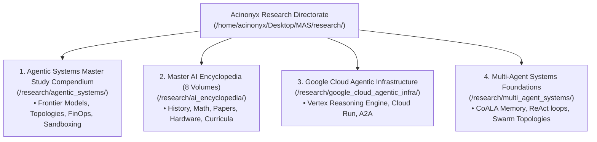

# Acinonyx Labs Research Portal & Knowledge Repositories

> *"Intelligence is not a monolithic scalar; it is an orchestrated architecture of specialized cognitive actors, thermodynamic compute, verifiable memory, and deterministic tool execution."*

Welcome to the **Acinonyx Enterprise Systems Research Directorate**. This portal indexes the theoretical foundations, empirical benchmarks, production architectures, and industrial landscape surveys authored to study and build next-generation agentic systems.

---

## 1. Master Research Repositories

---

## 2. Directory Overviews & Deep Links

### 2.1 [Agentic Systems Master Compendium](file:///home/acinonyx/Desktop/MAS/research/agentic_systems/README.md)
*An exhaustive, cloud-agnostic study suite covering frontier AI models, cognitive multi-agent architectures, cloud hyperscaler stacks, Work-as-a-Service (WaaS) economics, vertical enterprise use cases, and production sandboxing.*
- **[Module 1: Frontier AI Models & The Intelligence Layer](file:///home/acinonyx/Desktop/MAS/research/agentic_systems/01_frontier_models_and_intelligence/)**
  - [Chapter 1: Leading Frontier Models Comparison (o1/o3, Sonnet 3.5, DeepSeek-R1, Gemini 2.0, Llama 3.3)](file:///home/acinonyx/Desktop/MAS/research/agentic_systems/01_frontier_models_and_intelligence/01_leading_frontier_models_comparison.md)
  - [Chapter 2: The Reasoning Revolution — Test-Time Compute, GRPO & PRMs](file:///home/acinonyx/Desktop/MAS/research/agentic_systems/01_frontier_models_and_intelligence/02_reasoning_models_test_time_compute.md)
  - [Chapter 3: Small Language Models (SLMs) & Edge Inference Efficiency](file:///home/acinonyx/Desktop/MAS/research/agentic_systems/01_frontier_models_and_intelligence/03_slms_and_inference_efficiency.md)
- **[Module 2: Multi-Agent Architectures, Topologies & Cognitive System Design](file:///home/acinonyx/Desktop/MAS/research/agentic_systems/02_multi_agent_architectures_and_designs/)**
  - [Chapter 1: Cognitive Foundations — CoALA Framework & Dynamic Agent Loops](file:///home/acinonyx/Desktop/MAS/research/agentic_systems/02_multi_agent_architectures_and_designs/01_cognitive_foundations_coala_and_loops.md)
  - [Chapter 2: Multi-Agent Coordination Topologies & Communication Patterns](file:///home/acinonyx/Desktop/MAS/research/agentic_systems/02_multi_agent_architectures_and_designs/02_multi_agent_topologies_and_patterns.md)
  - [Chapter 3: Open Interoperability Protocols — Anthropic MCP & Google Cloud A2A](file:///home/acinonyx/Desktop/MAS/research/agentic_systems/02_multi_agent_architectures_and_designs/03_inter_agent_protocols_mcp_and_a2a.md)
- **[Module 3: The Industrial Landscape, Platforms & Compute Infrastructure](file:///home/acinonyx/Desktop/MAS/research/agentic_systems/03_industrial_landscape_and_companies/)**
  - [Chapter 1: Leading Companies, Frontier Labs & Market Ecosystem](file:///home/acinonyx/Desktop/MAS/research/agentic_systems/03_industrial_landscape_and_companies/01_leading_companies_and_frontier_labs.md)
  - [Chapter 2: Cloud Hyperscaler Stacks & Multi-Agent Frameworks](file:///home/acinonyx/Desktop/MAS/research/agentic_systems/03_industrial_landscape_and_companies/02_hyperscalers_cloud_stacks_and_frameworks.md)
  - [Chapter 3: Self-Hosted, Sovereign & Air-Gapped Infrastructure](file:///home/acinonyx/Desktop/MAS/research/agentic_systems/03_industrial_landscape_and_companies/03_self_hosted_and_sovereign_infrastructure.md)
- **[Module 4: Business Models, Token FinOps & The Work-as-a-Service Economy](file:///home/acinonyx/Desktop/MAS/research/agentic_systems/04_business_models_economics_and_finops/)**
  - [Chapter 1: The Economic Paradigm Shift — From SaaS to Work-as-a-Service (WaaS)](file:///home/acinonyx/Desktop/MAS/research/agentic_systems/04_business_models_economics_and_finops/01_from_saas_to_waas_digital_ftes.md)
  - [Chapter 2: Enterprise Token FinOps, Prompt Caching & TCO Breakeven Analysis](file:///home/acinonyx/Desktop/MAS/research/agentic_systems/04_business_models_economics_and_finops/02_token_economics_caching_and_tco.md)
- **[Module 5: Vertical Use Cases & Production Architectures](file:///home/acinonyx/Desktop/MAS/research/agentic_systems/05_vertical_use_cases_and_architectures/)**
  - [Chapter 1: Autonomous Software Engineering & DevOps Operations](file:///home/acinonyx/Desktop/MAS/research/agentic_systems/05_vertical_use_cases_and_architectures/01_software_engineering_and_devops.md)
  - [Chapter 2: Autonomous Cybersecurity & SecOps Incident Response](file:///home/acinonyx/Desktop/MAS/research/agentic_systems/05_vertical_use_cases_and_architectures/02_cybersecurity_and_autonomous_secops.md)
  - [Chapter 3: Customer Experience, Ambient Voice & Conversational Agency](file:///home/acinonyx/Desktop/MAS/research/agentic_systems/05_vertical_use_cases_and_architectures/03_customer_experience_and_ambient_voice.md)
  - [Chapter 4: Healthcare, Financial Services & Legal Enterprise Disruption](file:///home/acinonyx/Desktop/MAS/research/agentic_systems/05_vertical_use_cases_and_architectures/04_healthcare_finance_and_legal_enterprise.md)
- **[Module 6: Governance, Security, Evaluation & Production Sandboxing](file:///home/acinonyx/Desktop/MAS/research/agentic_systems/06_governance_security_and_evaluation/)**
  - [Chapter 1: Adversarial Threat Surfaces, Indirect Injection & Sandbox Isolation](file:///home/acinonyx/Desktop/MAS/research/agentic_systems/06_governance_security_and_evaluation/01_threats_sandboxing.md)
  - [Chapter 2: Evaluation Benchmarks, Dynamic ELO & Cryptographic Provenance](file:///home/acinonyx/Desktop/MAS/research/agentic_systems/06_governance_security_and_evaluation/02_benchmarks_evaluation_and_auditability.md)
- **[Module 7: Computer Use, OS Automation & GUI Grounding](file:///home/acinonyx/Desktop/MAS/research/agentic_systems/07_computer_use_and_os_automation/)**
  - [Chapter 1: Theoretical Foundations, POMDP Formulation & OSWorld/ScreenSpot Benchmarks](file:///home/acinonyx/Desktop/MAS/research/agentic_systems/07_computer_use_and_os_automation/01_theoretical_foundations_and_benchmarks.md)
  - [Chapter 2: GUI Grounding, Perception, Action Spaces & Token FinOps](file:///home/acinonyx/Desktop/MAS/research/agentic_systems/07_computer_use_and_os_automation/02_gui_grounding_perception_and_action_spaces.md)
  - [Chapter 3: Sandboxing, Security Hardening & GCP Cloud Workstations / Vertex AI Integration](file:///home/acinonyx/Desktop/MAS/research/agentic_systems/07_computer_use_and_os_automation/03_sandboxing_security_and_gcp_cloud_workstations.md)
  - [Chapter 4: MAS-Core Implementation Blueprint — ComputerUseTool & Legacy Ingestion Pods](file:///home/acinonyx/Desktop/MAS/research/agentic_systems/07_computer_use_and_os_automation/04_mas_implementation_blueprint.md)

---

### 2.2 [Master AI Encyclopedia (8 Volumes)](file:///home/acinonyx/Desktop/MAS/research/ai_encyclopedia/README.md)
- **Volume 1: History & Evolution** (1950 – 2026+ Timeline, AI Winters, Philosophical Debates)
- **Volume 2: Architecture & Paradigms** (Attention, RoPE, MoE, Mamba, SFT/RLHF/DPO/GRPO, CoALA)
- **Volume 3: Builders, Labs & Compute** (Pioneers, Labs, GPU/TPU/ASIC silicon)
- **Volume 4: Academic Research & Benchmarks** (Seminal Papers, Scaling Laws, Benchmarks, Alignment)
- **Volume 5: Education & Curricula** (University degrees, Stanford/MIT/CMU, self-study roadmaps)
- **Volume 6: Products & Ecosystem** (Consumer apps, developer frameworks, cloud platforms)
- **Volume 7: Enterprise Impact & Economics** (Industry disruption, macroeconomics, CapEx ROI)
- **Volume 8: Frontier Trends & The Future of AI** (Robotics, World Models, Path to AGI/ASI)

---

### 2.3 [Google Cloud Agentic Infrastructure](file:///home/acinonyx/Desktop/MAS/research/google_cloud_agentic_infra/)
- Production patterns for deploying autonomous multi-agent workloads on Google Cloud.
- Vertex AI Reasoning Engine, Cloud Run sidecars, Cloud Workstations, and A2A inter-agent protocol.

---

### 2.4 [Multi-Agent Systems (MAS Core)](file:///home/acinonyx/Desktop/MAS/research/multi_agent_systems/)
- Theoretical specifications for EventBus pub/sub, supervisor DAGs, anti-sycophantic debate, and schema-constrained SOP execution.

---

### 2.5 [System Development Life Cycle (SDLC) Master Compendium](file:///home/acinonyx/Desktop/MAS/research/system_development_life_cycle/README.md)
- Complete theory, international standards (ISO/IEC/IEEE 12207:2026, NIST SP 800-218 SSDF v1.2), comparative methodology trade-offs, and the modern 2026 Spec-Driven Agentic SDLC implementation blueprint.

---

### 2.6 [The XOps Trinity: DevOps, DataOps & MLOps Compendium](file:///home/acinonyx/Desktop/MAS/research/devops_dataops_mlops/README.md)
- Comparative architecture and lifecycle convergence across DevOps (code/CI-CD/GitOps), DataOps (BigQuery/dbt/contracts/ephemeral datasets), and MLOps/LLMOps (Vertex AI/Feature Stores/Kubeflow/drift detection), with an enterprise implementation blueprint for Acinonyx Consulting Group.

---

### 2.7 [Agile, Kanban & Lean Frameworks Compendium](file:///home/acinonyx/Desktop/MAS/research/agile_kanban_frameworks/README.md)
- Complete theory, empirical flow mathematics (Little's Law, CFD, Monte Carlo probabilistic forecasting), Extreme Programming (XP), Scrumban, Basecamp Shape Up, enterprise scaling critiques (SAFe, LeSS, Spotify Model), and 2026 AI-augmented multi-agent agility.

---

### 2.8 [Company Governance, Self-Improvement & Operational Architecture](file:///home/acinonyx/Desktop/MAS/research/company_governance_and_self_improvement/README.md)
- Synthesis of the Grand Squad Symposium debate across all 12 collective roles, full enterprise gap analysis, the ratified Acinonyx Ways of Working (`WAYS_OF_WORKING.md`), and canonical templates for Data Contracts, ADRs, and Scope Jails.
