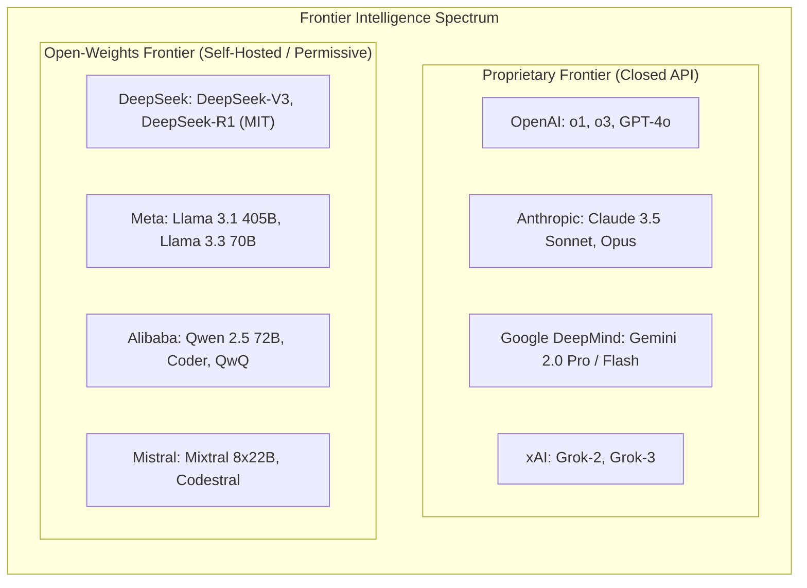

# Module 1: Frontier AI Models & The Intelligence Layer
## Chapter 1: Leading Frontier Models — Architectural & Benchmark Comparison

> *"In an agentic system, the foundation model is not the product; it is the cognitive engine whose reasoning latency, instruction compliance, tool calling fidelity, and context window economics dictate the operational boundaries of the entire swarm."*

---

## 1. The Global Frontier Model Landscape (2025 – 2026)

The foundation model landscape has undergone an unprecedented bifurcation between proprietary closed-API hyperscaler models and hyper-efficient open-weights architectures that have closed the performance gap.

---

## 2. Comprehensive Model Family Analysis

### 2.1 OpenAI: GPT-4o, o1, and o3
- **Architectural Paradigm:** Multi-modal dense & sparse architectures paired with test-time reinforcement learning.
- **Flagship Offerings:**
  - **GPT-4o ("Omni"):** Native omni-modal processing (end-to-end tokenization across text, audio, and high-frequency vision), 128k context window, sub-second latency. The premier model for real-time voice and interactive desktop perception.
  - **OpenAI o1 & o3:** Frontier reasoning engines trained using large-scale reinforcement learning to generate extensive internal Chain-of-Thought (CoT) `<thought>` traces prior to outputting responses.
- **Agentic Strengths:**
  - Extremely mature tool-calling APIs with native strict JSON Schema adherence (`strict: true` guaranteeing zero schema violations).
  - Parallel function calling allowing an agent to return multiple tool invocations in a single forward pass.
  - Unmatched performance on complex mathematical theorem proving and competitive programming.
- **Agentic Limitations:** High cost on full reasoning traces, opaque hidden thought tokens (developers cannot inspect raw `<thought>` tokens in production APIs), and vendor lock-in.

### 2.2 Anthropic: Claude 3.5 Sonnet, Claude 3.5 Haiku, and Opus
- **Architectural Paradigm:** Constitutional AI, high-steerability Transformer backbones, and native screen perception.
- **Flagship Offerings:**
  - **Claude 3.5 Sonnet:** Widely regarded by the global software engineering community as the gold standard for agentic coding, nuanced instruction following, and architectural synthesis.
  - **Claude 3.5 Haiku:** Ultra-fast, low-cost worker model designed for agentic sub-task delegation, classification, and high-volume tool triage.
- **Agentic Strengths:**
  - **Native Computer Use API:** First model trained explicitly to interpret raw desktop screenshots, calculate pixel coordinates, move mouse cursors, click, drag, and type into standard OS applications.
  - **Model Context Protocol (MCP):** Anthropic is the creator and open steward of MCP, standardizing tool, resource, and prompt connectivity across ecosystems.
  - **Prompt Caching:** Up to 90% discount on input tokens and 80% reduction in latency for cached system instructions and large codebases.
- **Agentic Limitations:** Strict rate limits on tier-1 accounts; closed weights prevent on-prem air-gapped hosting.

### 2.3 Google DeepMind: Gemini 2.0 & Gemini 1.5 Pro / Flash
- **Architectural Paradigm:** Sparse Mixture-of-Experts (MoE) on Google Cloud TPU v5e/v5p/Trillium silicon.
- **Flagship Offerings:**
  - **Gemini 2.0 Flash / Pro:** Native multimodal streaming backbones optimized for reasoning and autonomous tool actuation.
  - **Gemini 1.5 Pro:** Landmark 2,000,000-token context window with near-perfect needle-in-a-haystack retrieval (>99.7% recall across 2M tokens).
- **Agentic Strengths:**
  - Ability to ingest an entire enterprise codebase, 1 hour of video, or 30 corporate financial filings in a single prompt window, eliminating complex RAG chunking pipelines.
  - Grounding with Google Search providing real-time web citations and factual validation directly inside API responses.
  - Deep integration with Vertex AI Reasoning Engine, Agent Development Kit (ADK), and Cloud Run gVisor sandboxing.
- **Agentic Limitations:** Output formatting occasionally drifts without explicit system instruction grounding; API regional availability constraints.

### 2.4 DeepSeek: DeepSeek-V3 & DeepSeek-R1
- **Architectural Paradigm:** Ultra-efficient fine-grained Sparse MoE with Multi-Head Latent Attention (MLA) and pure GRPO reinforcement learning.
- **Flagship Offerings:**
  - **DeepSeek-V3:** 671B total parameters, 37B active parameters per token across 256 micro-experts + 1 shared expert. Trained on 14.8 trillion tokens for only ~$6M.
  - **DeepSeek-R1:** First frontier open-weights model to achieve performance parity with OpenAI o1 across math, coding, and logical reasoning, released under a permissive MIT license.
- **Agentic Strengths:**
  - **Multi-Head Latent Attention (MLA):** Compresses the Key-Value (KV) cache by 93.3%, allowing enterprise self-hosting clusters to serve 10x higher concurrent agent sessions on standard H100/H800/A100 hardware.
  - **Transparent Reasoning Traces:** Full `<think>` tokens are visible to developers, enabling real-time introspection into agent planning and error correction.
  - **Distillation Ecosystem:** R1 reasoning capabilities distilled into 1.5B, 7B, 14B, and 32B models based on Qwen 2.5 and Llama 3, allowing local edge deployment on consumer laptops and edge nodes.
- **Agentic Limitations:** Slower raw output generation speed on large clusters when running unquantized MoE; requires specialized DualPipe / expert parallelism orchestration for self-hosting.

### 2.5 Meta AI (FAIR): Llama 3.1 & Llama 3.3
- **Architectural Paradigm:** Dense autoregressive Transformers trained on massive web tokens (15+ trillion tokens) using standard Grouped-Query Attention (GQA).
- **Flagship Offerings:**
  - **Llama 3.1 405B:** The world's largest open-weights dense model, serving as a primary teacher model for synthetic data generation and distillation.
  - **Llama 3.3 70B:** Matches Llama 3.1 405B capabilities on common enterprise benchmarks while running efficiently on a single 8x H100 node.
- **Agentic Strengths:**
  - Total enterprise data sovereignty: Can be fully downloaded, fine-tuned, weight-pruned, and deployed on completely air-gapped on-premise hardware without data exfiltration risks.
  - Massive global developer ecosystem and native support across all serving engines (vLLM, Ollama, TensorRT-LLM, TGI).
- **Agentic Limitations:** Dense architecture requires higher inference compute per token than sparse MoE; lacks native test-time reasoning loops out of the box (requires external prompt scaffolding or fine-tuning).

### 2.6 Alibaba: Qwen 2.5 & QwQ
- **Architectural Paradigm:** Dense and MoE multilingual models with specialized coding and reasoning variants.
- **Flagship Offerings:**
  - **Qwen 2.5 Coder (32B / 72B):** Widely recognized as the highest-performing open-weights coding model, rivaling closed GPT-4o on HumanEval and SWE-bench.
  - **QwQ-32B-Preview:** An open reasoning model rivaling OpenAI o1-mini on competitive math and logical deduction.
- **Agentic Strengths:**
  - Superior multilingual code generation and mathematical reasoning in compact 14B and 32B footprints.
  - Highly robust tool-calling support and JSON extraction capabilities.

---

## 3. The Master Model Benchmark Matrix

The following table cross-references the leading foundation models across standardized evaluation suites critical to autonomous agent performance:

| Model | Creator | Weights | Total Params | Active Params | Context Window | SWE-bench Verified | AIME 2024 (Math) | GPQA Diamond (Science) | LiveCode Bench | Tool-Call Reliability |
| :--- | :--- | :---: | :---: | :---: | :---: | :---: | :---: | :---: | :---: | :---: |
| **Claude 3.5 Sonnet** | Anthropic | Closed | Undisclosed | Undisclosed | 200,000 | **49.0% – 54.0%** | 78.3% | 65.0% | **45.2%** | **99.4%** |
| **OpenAI o1** | OpenAI | Closed | Undisclosed | Undisclosed | 200,000 | 48.9% | **83.3%** | **77.3%** | 63.4% | 98.1% |
| **DeepSeek-R1** | DeepSeek | **Open (MIT)** | 671B | 37B | 128,000 | 49.2% | 79.8% | 71.5% | 65.9% | 97.2% |
| **Gemini 2.0 Flash** | Google | Closed | Undisclosed | Undisclosed | **1,000,000** | 42.0% | 68.0% | 62.1% | 41.0% | 98.8% |
| **GPT-4o** | OpenAI | Closed | Undisclosed | Undisclosed | 128,000 | 38.8% | 40.0% | 53.6% | 33.8% | 99.1% |
| **Llama 3.3 70B** | Meta | **Open** | 70B | 70B | 128,000 | 37.8% | 46.7% | 51.2% | 34.1% | 96.5% |
| **Qwen 2.5 Coder 32B** | Alibaba | **Open** | 32B | 32B | 128,000 | 41.2% | 52.0% | 49.8% | 42.5% | 97.8% |
| **Mixtral 8x22B** | Mistral AI | **Open (Apache)**| 141B | 39B | 64,000 | 31.0% | 38.0% | 41.5% | 29.0% | 95.0% |

---

## 4. Key Takeaways for Agentic System Architects

1. **The Reasoning Bifurcation:** For high-complexity planning, multi-file code editing, and mathematical verification, **reasoning models (Claude 3.5 Sonnet, OpenAI o1, DeepSeek-R1)** are mandatory. Single forward-pass models (GPT-4o, Llama 3 8B) fail due to error accumulation across multi-turn trajectories.
2. **The Open-Weights Parity Reality:** DeepSeek-R1 and Qwen 2.5 Coder prove that enterprise agent architectures no longer need to rely exclusively on closed US hyperscaler APIs. Self-hosted deployments can match proprietary performance while retaining 100% data sovereignty.
3. **The Importance of MLA & Sparse MoE:** As agents execute multi-turn loops with expanding tool histories, models utilizing **Multi-Head Latent Attention (MLA)** and **Grouped-Query Attention (GQA)** prevent KV-cache OOM (Out-of-Memory) crashes, dramatically reducing enterprise FinOps token bills.
