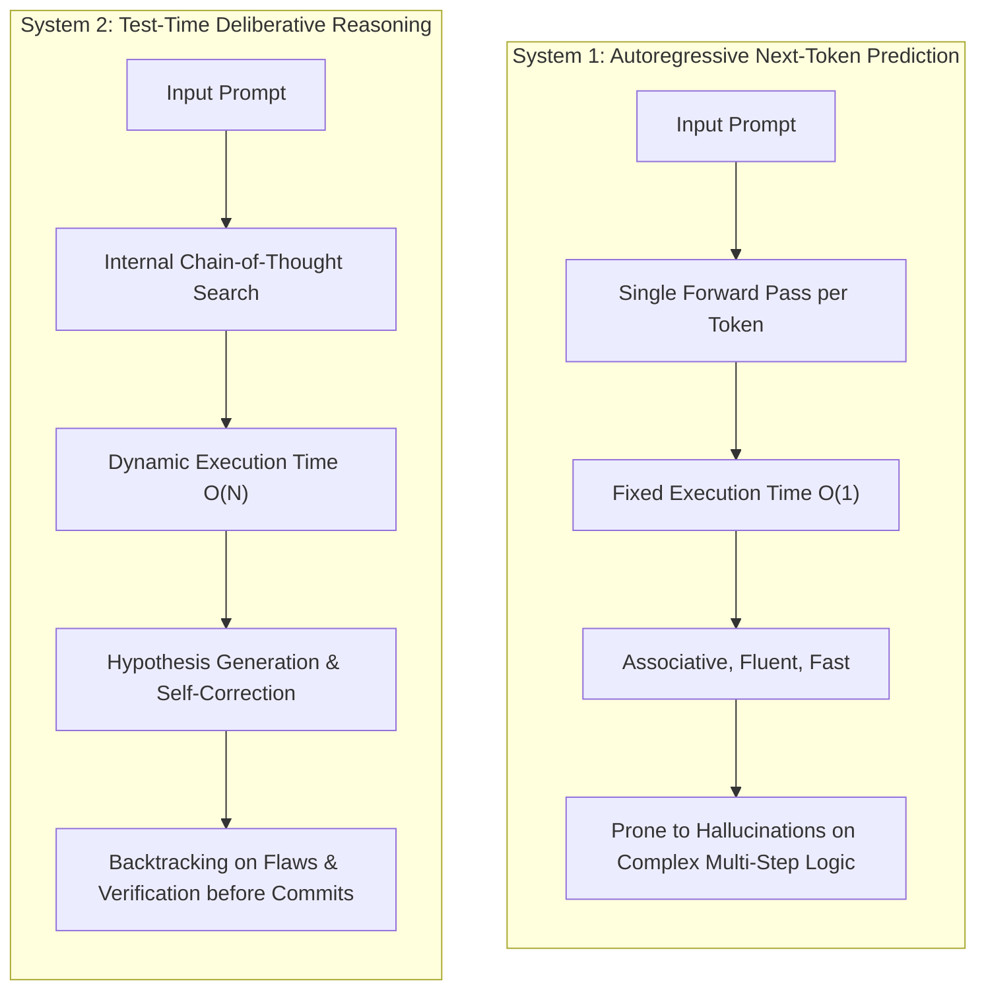
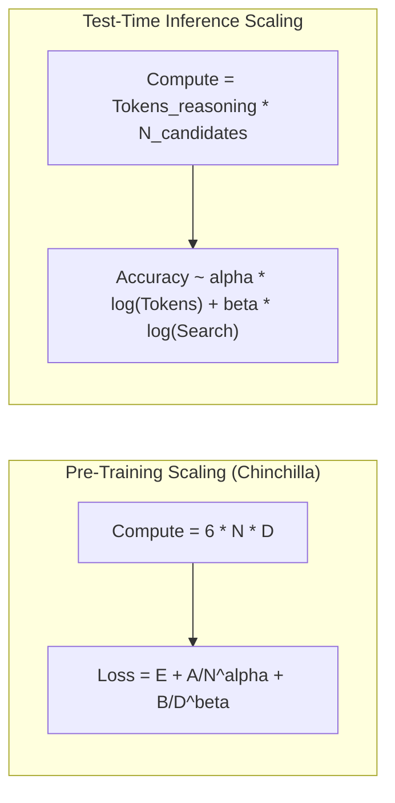
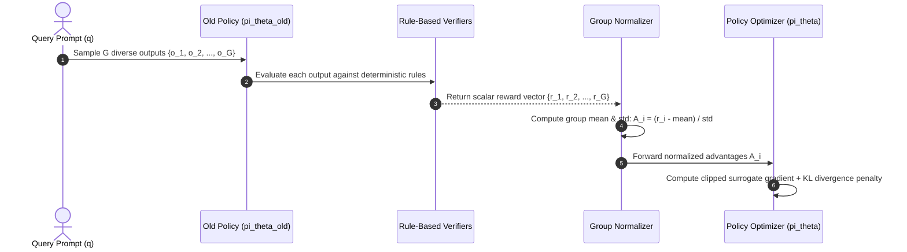
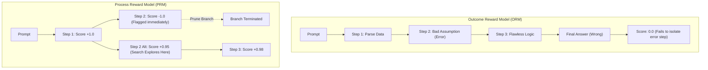

# Module 1: Frontier AI Models & The Intelligence Layer
## Chapter 2: The Reasoning Revolution — Test-Time Compute & Inference Scaling

> *"Historically, machine learning scaling was bounded by pre-training compute: how many trillions of tokens could be compressed into parameters. The reasoning revolution unlocked an orthogonal dimension of capability: test-time compute, where intelligence scales dynamically with the number of tokens allocated to deliberation, search, and self-verification."*

---

## 1. System 1 vs. System 2 Cognitive Duality

Modern foundation models operate along a cognitive spectrum inspired by Daniel Kahneman’s dual-process theory:



### 1.1 The Failure Mode of Pure System 1 in Autonomous Agents
Standard autoregressive language models predict token $x_t$ based strictly on preceding tokens:

$$P(x_t \mid x_{<t}) = \text{Softmax}(W h_t)$$

In multi-step problem solving (such as navigating a 50-file codebase or solving an Olympiad math equation), an error in token $x_{15}$ cascades exponentially. Because standard LLMs cannot backtrack or dynamically allocate extra FLOPs to verify intermediate assertions, early hallucinations poison all downstream planning.

---

## 2. Test-Time Compute & Inference Scaling Laws

In 2024 and 2025, researchers (OpenAI o1/o3, Snell et al., DeepSeek-R1) proved mathematically that **test-time compute exhibits power-law scaling** analogous to pre-training compute.



### 2.1 The Two Primary Axes of Test-Time Compute
Test-time inference compute can be scaled across two complementary dimensions:
1. **Search Breadth (Parallel Candidate Generation):**
   - **Best-of-$N$ Sampling:** Sample $N$ independent candidate responses in parallel and use a verifier or Outcome Reward Model (ORM) to pick the highest-scoring response.
   - **Self-Consistency Voting (Wang et al.):** Sample multiple diverse reasoning chains and take the majority consensus vote over the final answer.
2. **Search Depth (Sequential Chain-of-Thought & Tree Search):**
   - **Deliberate Chain-of-Thought (CoT):** Dynamically generate intermediate `<thought>` tokens where the model checks its work, considers alternatives, and re-computes sub-equations.
   - **Monte Carlo Tree Search (MCTS) & Tree of Thoughts (ToT):** Expand promising intermediate reasoning nodes while pruning failed branches using Process Reward Models (PRMs).

---

## 3. The Mathematics of Group Relative Policy Optimization (GRPO)

Pioneered by DeepSeek in **DeepSeek-Math** and **DeepSeek-R1**, **Group Relative Policy Optimization (GRPO)** eliminated the primary scalability bottleneck of classical RLHF: the massive Critic / Value network ($V_\phi$).



### 3.1 Mathematical Formulation of GRPO
Given a prompt $q$, GRPO samples a group of $G$ outputs from the previous policy:

$$\{o_1, o_2, \dots, o_G\} \sim \pi_{\theta_{\text{old}}}(O \mid q)$$

The objective maximizes the normalized group advantage while penalizing divergence from the reference policy:

$$\mathcal{J}_{\text{GRPO}}(\theta) = \mathbb{E}_{q \sim \mathcal{D}, \{o_i\}_{i=1}^G \sim \pi_{\theta_{\text{old}}}} \left[ \frac{1}{G} \sum_{i=1}^G \left( \min \left( \frac{\pi_\theta(o_i \mid q)}{\pi_{\theta_{\text{old}}}(o_i \mid q)} A_i, \text{clip}\left(\frac{\pi_\theta(o_i \mid q)}{\pi_{\theta_{\text{old}}}(o_i \mid q)}, 1-\epsilon, 1+\epsilon\right) A_i \right) - \beta D_{\text{KL}}(\pi_\theta \parallel \pi_{\text{ref}}) \right) \right]$$

Where the advantage $A_i$ of output $o_i$ is computed purely relative to the group:

$$A_i = \frac{r_i - \text{mean}(\{r_1, \dots, r_G\})}{\text{std}(\{r_1, \dots, r_G\})}$$

### 3.2 Why GRPO Revolutionized Open AI Economics
- **Zero Critic Network Overhead:** Traditional PPO requires keeping four large models in memory: Actor ($\pi_\theta$), Critic ($V_\phi$), Reference ($\pi_{\text{ref}}$), and Reward ($r_\psi$). Critic networks alone account for ~50% of GPU memory during training. GRPO discards the critic completely, slashing training VRAM requirements in half.
- **Rule-Based Grounded Verification:** Instead of training a noisy neural reward model (which is vulnerable to reward hacking), GRPO uses **deterministic verifiers**:
  - *Mathematical Correctness:* Checking numerical answers against symbolic math engines (SymPy, Lean 4).
  - *Coding Verification:* Executing generated code against unit test suites and compiler passes.
  - *Formatting Adherence:* Enforcing strict encapsulation between `<think>...</think>` internal scratchpad and final output.

---

## 4. The Emergence of the "Aha Moment" in R1-Zero

When DeepSeek trained a base foundation model purely with GRPO without human demonstration traces (no SFT cold start), an extraordinary emergent phenomenon occurred: **DeepSeek-R1-Zero spontaneously learned human-like cognitive strategies**.

```
[DEEPSEEK-R1-ZERO RAW CHAIN-OF-THOUGHT EXCERPT]

"To solve this integral, let us first attempt integration by parts...
 Let u = ln(x), dv = x^2 dx. Then du = 1/x dx, v = x^3 / 3.
 So we have (x^3 / 3) * ln(x) - Integral((x^3 / 3) * (1/x) dx)...
 Wait, let me double check this result.
 If I take the derivative of (x^3/3)*ln(x), by product rule:
 x^2 * ln(x) + (x^3/3) * (1/x) = x^2 * ln(x) + x^2 / 3.
 Ah! That leaves an extra x^2 / 3 term!
 Let me rethink this from the beginning. Perhaps a substitution u = x^3 is cleaner..."
```

### Key Cognitive Behaviors Learned Autonomously
1. **Self-Monitoring & Verification:** Pausing mid-generation to inspect intermediate equations.
2. **Backtracking & Re-Planning:** Abandoning a dead-end proof path and restarting with an alternative strategy.
3. **Dynamic Resource Allocation:** Spending 500 tokens on simple arithmetic but autonomously expanding to 12,000+ tokens on complex combinatorics.

---

## 5. Process Reward Models (PRMs) vs. Outcome Reward Models (ORMs)

To guide search during test-time compute, models utilize reward models to score generation trajectories:



### 5.1 Step-Level Credit Assignment
- **Outcome Reward Models (ORMs):** Evaluates only the terminal token sequence. If a 20-step proof fails, the ORM assigns a single negative score, providing zero signal on whether the breakdown happened at step 2 or step 19.
- **Process Reward Models (PRMs) (Lightman et al., 2023):** Evaluates every discrete step $s_t$:
  
  $$\hat{r}_{\text{PRM}}(s_t) = P(\text{Step } s_t \text{ is mathematically sound} \mid s_{<t})$$
  
  PRMs enable active beam search, tree-of-thought exploration, and automated branch pruning before thousands of wasted tokens are generated.

---

## 6. Strategic Implications for Agentic Architectures

| Dimension | Standard Foundation LLMs (GPT-4o, Llama 3) | Frontier Reasoning Models (o1, DeepSeek-R1) |
| :--- | :--- | :--- |
| **Cognitive Mechanism** | System 1 (Pattern recognition, intuition) | System 2 (Search, verification, backtracking) |
| **Execution Latency** | Ultra-low (sub-second to 2s) | Variable (5s to 60s+ depending on difficulty) |
| **Token Cost Profile** | Fixed per word output | High (pays for internal `<thought>` tokens) |
| **SWE-bench / Code Triage** | Fails on multi-file dependencies (error cascades) | SOTA (>49% resolution via deliberate planning) |
| **Best Role in Agent Swarm** | Fast Tool Execution, Routing, Summarization | **Root Planner, Code Synthesizer, QA Critic** |
