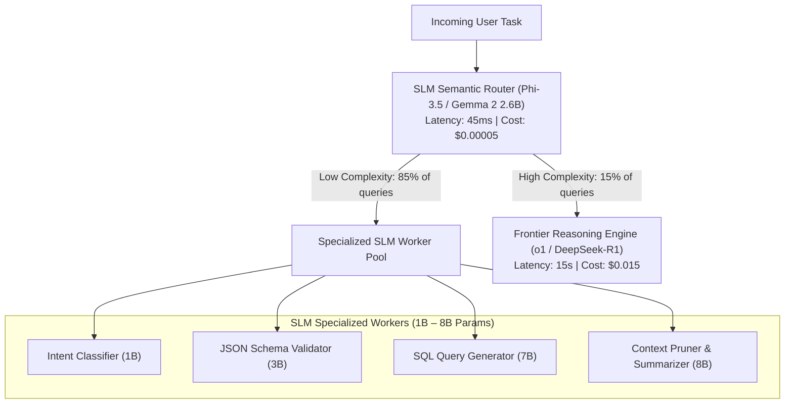
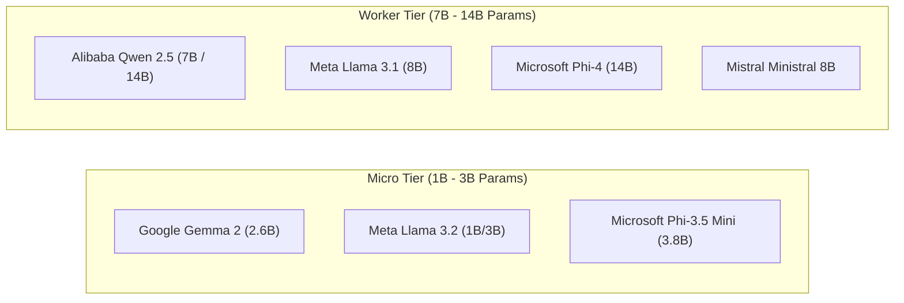

# Module 1: Frontier AI Models & The Intelligence Layer
## Chapter 3: Small Language Models (SLMs) & Inference Efficiency

> *"An enterprise agent architecture that routes every single heartbeat, tool parameter validation, and user greeting through a 671-billion-parameter reasoning model is economically and architecturally broken. Elite multi-agent swarms rely on Small Language Models (SLMs) as specialized sub-millisecond task workers."*

---

## 1. The Role of SLMs in Multi-Agent Swarms

While frontier models (Claude 3.5 Sonnet, o1, DeepSeek-R1) act as the **Chief Architects and Planners**, running them on repetitive operational micro-tasks creates catastrophic latency bottlenecks and financial waste.



### 1.1 The Operational Economics of SLMs
- **Latency Advantage:** SLMs deliver **sub-50ms Time To First Token (TTFT)** and generation speeds of **120–250 tokens per second** on modest hardware, compared to 10–30 tokens per second on massive MoE clusters.
- **Edge & Air-Gapped Deployability:** An 8B parameter model quantized to 4-bit INT4 occupies less than 6 GB of VRAM, running easily on commodity edge devices, developer laptops, or local branch servers without cloud egress.
- **Dedicated Task Specialization:** Through targeted fine-tuning (LoRA / QLoRA), an SLM can achieve **99.5%+ accuracy** on a single deterministic task (such as extracting regex entities or writing SQL) matching a 700B model while using 1/100th the compute.

---

## 2. Leading Small Language Model Contenders



### 2.1 Microsoft Phi-4 & Phi-3.5 Mini
- **Architectural Philosophy:** *"Textbooks Are All You Need"*. Trained primarily on high-quality synthetic textbooks, formal mathematical logic, and curated educational web corpora.
- **Capabilities:** **Phi-4 (14B)** outperforms many 70B parameter models on STEM, MATH, and Python benchmarks through synthetic data curation. **Phi-3.5 Mini (3.8B)** supports a 128k context window and delivers exceptional reasoning in a mobile footprint.

### 2.2 Google Gemma 2 (2.6B & 9B)
- **Architectural Highlights:** Built on the same research foundation as the Gemini models. Employs alternating local and global attention layers and **knowledge distillation from massive teacher models** during training.
- **Agentic Strengths:** The 9B model punches significantly above its weight class on LMSYS Chatbot Arena, matching original GPT-4 (0613) scores.

### 2.3 Meta Llama 3.2 (1B & 3B) and Llama 3.1 8B
- **Capabilities:** Llama 3.2 models are purpose-built for on-device agentic workflows, featuring native support for tool calling, function argument validation, and mobile edge deployment via Qualcomm and Apple silicon runtimes.

### 2.4 Alibaba Qwen 2.5 (7B & 14B)
- **Capabilities:** Widely acknowledged as the open-weights leader in the 7B–14B bracket for coding, structured JSON extraction, and multilingual translation.

---

## 3. High-Throughput Inference Optimization Technologies

To run autonomous multi-agent loops at scale, systems employ modern hardware acceleration techniques:

### 3.1 Quantization Formats: FP8 vs. INT4 AWQ vs. GPTQ
Quantization reduces the bit-precision of model weights and activations, shrinking memory bandwidth demands:

$$\text{Memory Reduction Factor} \approx \frac{16 \text{ bits}}{\text{Target Bits}}$$

| Quantization Format | Target Bits | Memory Reduction | Perplexity Degradation | Best Hardware Target |
| :--- | :---: | :---: | :---: | :--- |
| **FP16 / BF16** | 16 | $1.0\times$ (Baseline) | $0.0\%$ (None) | A100 / H100 |
| **FP8 (E4M3 / E5M2)** | 8 | $2.0\times$ | $<0.1\%$ (Imperceptible) | NVIDIA Hopper / Blackwell, Ada |
| **AWQ (Activation-Aware)** | 4 | $3.5\times$ | $<0.5\%$ (Extremely Low) | Consumer GPUs, Edge Servers |
| **GPTQ** | 4 | $3.5\times$ | $<0.8\%$ (Low) | Data center inference clusters |
| **GGUF (llama.cpp)** | 2 – 8 | $2.0\times – 5.0\times$ | Variable | CPU / Mac Apple Silicon |

### 3.2 Speculative Decoding: The Asymmetric Acceleration Engine
In autoregressive generation, a 70B model must execute an entire memory pass over its weights for every single token output. **Speculative Decoding** solves this by pairing a fast SLM "Draft Model" with a large "Target Model":

```mermaid
sequenceDiagram
    autonumber
    participant Draft as SLM Draft Model (e.g. Llama 3.2 1B)
    participant Target as Large Target Model (e.g. Llama 3.3 70B)
    participant Output as Final Token Stream

    Draft->>Draft: Generate K candidate tokens rapidly: [T1, T2, T3, T4, T5]
    Draft->>Target: Pass prompt + candidate tokens in a single batch
    Target->>Target: Execute SINGLE parallel forward pass evaluating all K tokens
    Target->>Target: Accept T1, T2, T3; Reject T4 (sample replacement T4')
    Target->>Output: Commit verified tokens [T1, T2, T3, T4'] (4x Speedup!)
```

**Key Benefit:** Because memory bandwidth—not FLOPs—is the primary bottleneck in text generation, verifying $K$ tokens in a single parallel target pass takes almost the same wall-clock time as generating 1 token, achieving a **$2\times$ to $3.5\times$ latency speedup** with mathematical equivalence to the target model.

---

## 4. The Production Semantic Routing Cascade

In an enterprise swarm, an incoming task traverses a multi-tiered decision tree:

```
[ Incoming Task ]
       │
       ▼
[ Layer 1: Heuristic / Regex Match ] (0ms, $0) ──► Cached Ping / Simple Heartbeat
       │ (Unmatched)
       ▼
[ Layer 2: SLM Intent Classifier ] (25ms, <$0.0001)
       │
       ├──► Tier A: SQL Generation ────────► Qwen 2.5 Coder 7B (Local Node)
       ├──► Tier B: Document Summarization ─► Gemma 2 9B (Local Node)
       ├──► Tier C: Tool Argument Validator ─► Llama 3.2 3B (Edge)
       └──► Tier D: Multi-Hop Reasoning ───► Frontier o1 / Claude 3.5 / DeepSeek-R1
```

By filtering 80%–90% of routine operations at Layers 1 and 2, enterprise agent architectures reduce operational cloud expenses by up to **92%** while delivering a responsive, instantaneous user experience.
