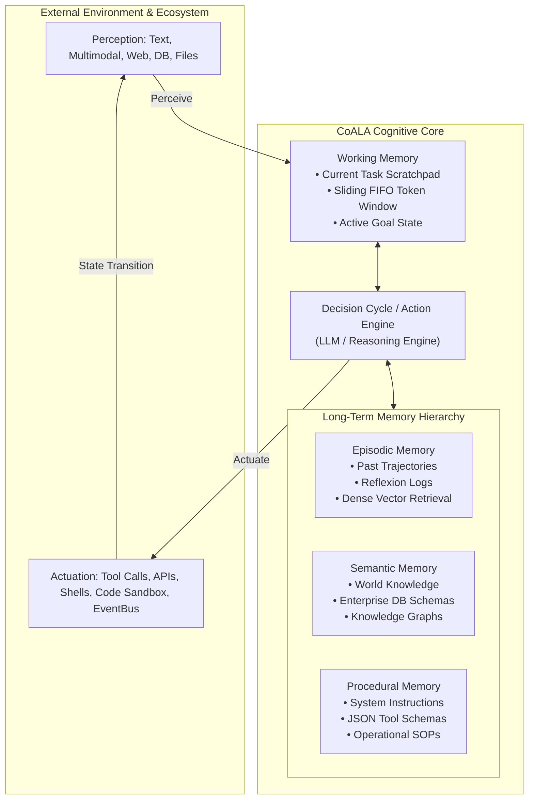
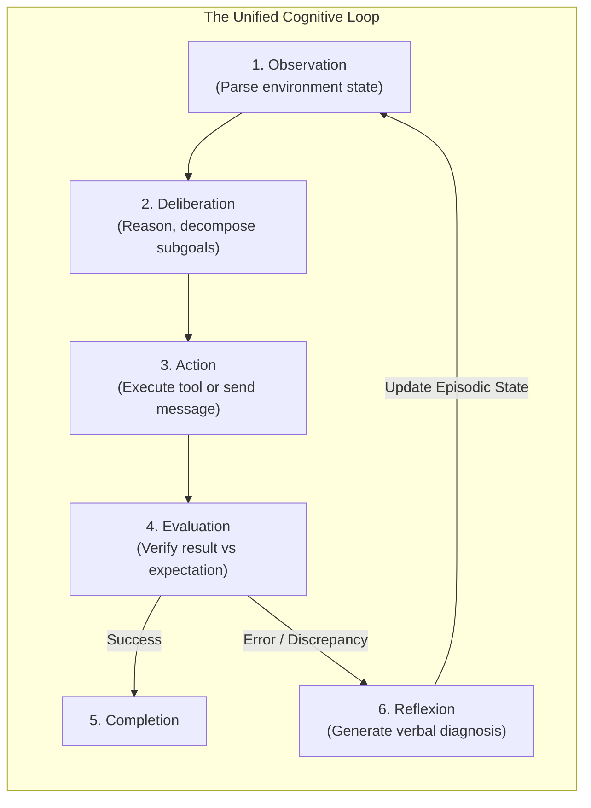
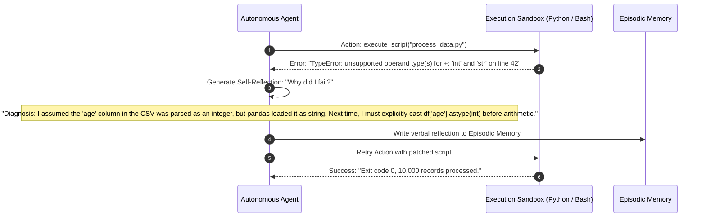
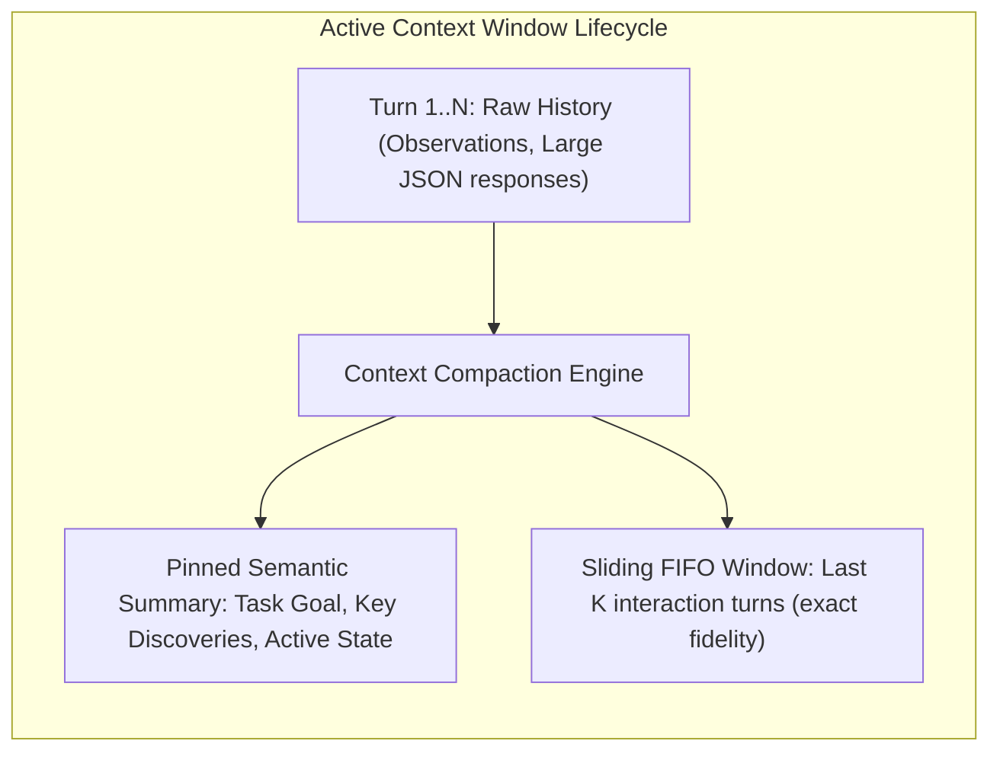

# Module 2: Multi-Agent Architectures & Designs
## Chapter 1: Cognitive Foundations — The CoALA Framework & Dynamic Agent Loops

> *"An autonomous agent is not defined by its model parameters, but by its cognitive architecture: how it stores and retrieves experience, how it perceives and acts upon an environment, and how it reflects upon errors to self-correct."*

---

## 1. The CoALA Cognitive Blueprint

Formalized by researchers at Princeton and Google DeepMind (Sumers et al., 2023), the **CoALA (Cognitive Architectures for Language Agents)** framework provides the canonical theoretical taxonomy for autonomous agency.



### 1.1 The Memory Hierarchy
1. **Working Memory (Short-Term / Active Scratchpad):**
   - Resides directly within the model's active context window.
   - Holds the current conversation turns, immediate observations, active scratchpad calculations, and pinned system constraints.
   - *Challenge:* Finite token budgets and attention degradation over long horizons require strict token pruning.
2. **Episodic Memory (Experience & Trajectory Storage):**
   - Stores autobiographical execution history—what actions were taken, what failed, and why.
   - Indexed via dense vector embeddings (e.g. text-embedding-3-small, BGE-M3) in vector stores (Chroma, PGVector, Vertex AI Vector Search).
   - Enables few-shot in-context learning retrieved dynamically based on similarity to current failure modes.
3. **Semantic Memory (Static & Grounded World Facts):**
   - The agent's knowledge base: enterprise documentation, relational database schemas, API specs, and domain knowledge graphs.
   - Grounded via RAG (Retrieval-Augmented Generation) or formal ontology graphs.
4. **Procedural Memory (Rules, Skills & Schemas):**
   - Represents the agent's implicit and explicit skills: system instructions, tool definitions (OpenAPI / MCP schemas), and operational constraints.

---

## 2. Dynamic Cognitive Loops

An agent cannot solve complex multi-step problems in a single monologue. It must execute continuous closed-loop observation, reasoning, and environmental manipulation.



### 2.1 The ReAct Loop (Yao et al., ICLR 2023)
The **ReAct (Reason + Act)** loop alternates between internal reasoning thoughts and external tool calls:

```
[User Objective]: "Calculate the year-over-year revenue growth for Tenant A and alert Slack if below 10%."

Iteration 1:
Thought: I need to query the PostgreSQL financial database to find Tenant A's 2024 and 2025 revenue.
Action: execute_sql(query="SELECT year, revenue FROM financials WHERE tenant_id = 'A' ORDER BY year DESC LIMIT 2;")
Observation: [{"year": 2025, "revenue": 12500000}, {"year": 2024, "revenue": 11800000}]

Iteration 2:
Thought: The 2024 revenue was $11.8M and 2025 was $12.5M. Growth = (12.5 - 11.8) / 11.8 = 0.7 / 11.8 = 5.93%.
Since 5.93% is below the 10% threshold, I must trigger a Slack webhook alert.
Action: post_slack_alert(channel="#exec-alerts", message="⚠️ Tenant A YoY revenue growth is 5.93%, below 10% KPI.")
Observation: {"status": "ok", "timestamp": "1728045600"}

Iteration 3:
Thought: The alert has been delivered successfully. I can now report completion.
Final Answer: Tenant A generated 5.93% YoY growth ($11.8M to $12.5M). An alert has been published to #exec-alerts.
```

### 2.2 Reflexion: Verbal Reinforcement Learning (Shinn et al., NeurIPS 2023)
When an agent encounters a runtime failure (a compilation error, unit test failure, or database constraint violation), standard LLMs tend to blindly retry the exact same hallucinated action. **Reflexion** interrupts this loop by enforcing verbal self-correction:



---

## 3. Context Management & Sliding Window Engineering

In production agentic systems, long-running agent loops quickly saturate the model's context window. System architects employ three active compaction techniques:



1. **Selective Tool Output Pruning:** When an agent inspects a 10,000-line log or a 200-row SQL table, the raw observation is evicted from working memory after the agent extracts the necessary insight, replaced by an observation pointer: `[Observation: Extracted 3 matching user IDs from 10,000 rows. Full output stored in /tmp/cache_812]`.
2. **Hierarchical Summarization:** When context reaches 80% capacity, a fast SLM worker summarizes past steps into structured bullet points (Active Hypotheses, Verified Invariants, Completed Steps), appending the summary to the system prompt and clearing old turns.
3. **Prompt Cache Pinning:** System instructions, tool schemas, and static enterprise context are placed at the beginning of the prompt to maximize KV cache reuse across turns.
