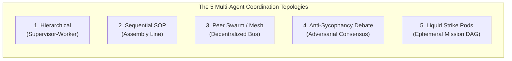
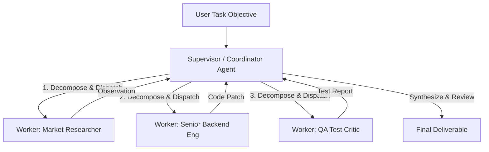
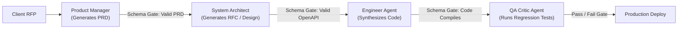
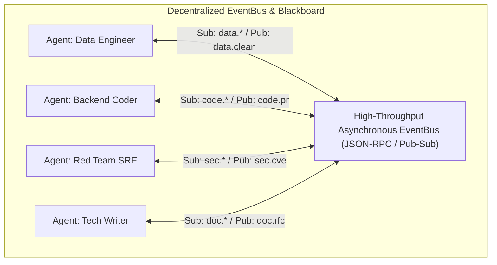
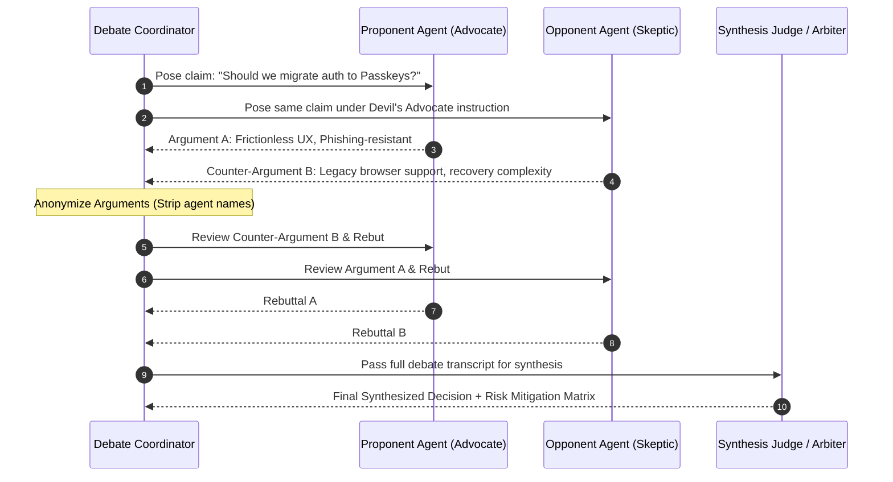
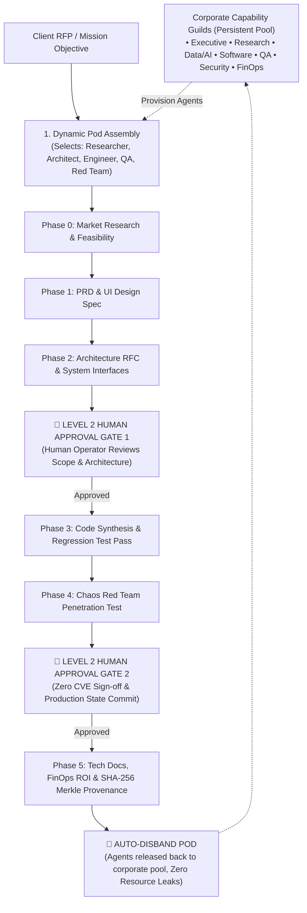

# Module 2: Multi-Agent Architectures & Designs
## Chapter 2: Multi-Agent Coordination Topologies & System Patterns

> *"Single-agent systems hit a complexity ceiling when tasks require diverse specialized competencies, conflicting perspectives, or extensive execution state. Multi-agent systems decompose complexity across specialized cognitive entities, but their success depends entirely on coordination topology."*

---

## 1. Taxonomy of Multi-Agent Topologies

Multi-agent coordination patterns fall into five canonical architectural paradigms:

---

## 2. In-Depth Architectural Profiles

### 2.1 Hierarchical (Supervisor-Worker / Orchestrator-Subagent)
- **Mental Model:** A military command structure or corporate executive team.
- **Topology:** Star / Tree graph with a central root node.

- **Operational Mechanics:**
  - The Supervisor receives the high-level objective, decomposes it into a Directed Acyclic Graph (DAG) of sub-tasks, assigns each sub-task to a specialized worker agent, and collects the results.
  - Workers do not communicate directly with each other; all state transitions flow through the supervisor.
- **Strengths:** High controllability, clear ownership, easy observability, centralized rate-limiting and token budgeting.
- **Weaknesses:** Single point of failure (if supervisor hallucinates, entire mission fails); supervisor context window quickly becomes a token bottleneck.

---

### 2.2 Sequential SOP Pipeline (The Assembly Line)
- **Mental Model:** Industrial manufacturing line with strict quality gates (standardized by **MetaGPT** and **ChatDev**).
- **Topology:** Linear directed pipeline.

- **Operational Mechanics:**
  - Standard Operating Procedures (SOPs) are encoded directly into the system.
  - Agent $N+1$ cannot begin until Agent $N$ outputs a verified, typed artifact conforming to a formal schema (e.g. JSON schema, OpenAPI spec, unit test suite).
- **Strengths:** Drastically minimizes error cascades; guarantees enterprise artifact compliance; high reproducibility.
- **Weaknesses:** Rigid and brittle; poorly suited for dynamic exploratory research or ad-hoc tasks requiring iterative backtracking.

---

### 2.3 Peer-to-Peer Swarm & Blackboard Mesh
- **Mental Model:** A trading floor, decentralized open-source community, or academic seminar.
- **Topology:** Fully connected or topic-routed asynchronous network.

- **Operational Mechanics:**
  - Agents subscribe to specific event topics on a shared message bus (e.g., `git.commit`, `pipeline.failed`).
  - Employs classical distributed protocols such as the **Contract Net Protocol (CNP)**: When a task appears, agents calculate capability bids; the task manager awards the contract to the best bidder.
  - Uses **Blackboard Architecture**: A shared memory board where agents asynchronously post partial solutions and refine hypotheses.
- **Strengths:** Maximum flexibility, natural parallelization, dynamic self-organization, zero central bottleneck.
- **Weaknesses:** Susceptible to conversational drift, infinite looping, chaotic emergent behavior, and explosive token consumption without strict round bounds.

---

### 2.4 Anti-Sycophantic Multi-Agent Debate
- **Mental Model:** Supreme Court judicial conference or peer-reviewed scientific referee panel.
- **Topology:** Iterative cyclic adversarial tournament.

- **The Sycophancy Problem:** LLMs exhibit strong sycophancy—they tend to agree with whichever agent or user spoke last, causing multi-agent consensus to collapse into false unanimity.
- **The Anti-Sycophancy Solution:**
  1. **Anonymized Claims:** Arguments are stripped of agent names before cross-critique to prevent prestige bias.
  2. **Bounded Rounds:** Enforcing $K \le 3$ rounds to prevent cyclic fatigue.
  3. **Independent Arbiter:** A separate judge agent evaluates the strength of empirical evidence, calculating a sycophancy penalty score.

---

### 2.5 Liquid Strike Pods (The Acinonyx Enterprise Blueprint)
- **Mental Model:** An elite, cross-functional military or SWAT strike team assembled for an objective, delivering verified outcomes, and disbanding cleanly.
- **Topology:** Ephemeral mission-driven DAG with Level-2 Human Gateways.

- **Architectural Invariants:**
  1. **Dynamic Ephemeral Lifecycle:** Pods exist only for the lifespan of the mission, preventing idle memory footprint.
  2. **Level-2 Human-in-the-Loop Gating:** Read/research actions are autonomous; destructive write/deploy actions halt for human sign-off.
  3. **Cryptographic Merkle Provenance:** Every intermediate deliverable is hashed into a SHA-256 Merkle DAG root, guaranteeing complete auditability.

---

## 3. Comprehensive Topology Trade-Off Matrix

| Coordination Topology | Token Efficiency | Hallucination Resistance | Scalability | Adaptability | Enterprise Compliance |
| :--- | :---: | :---: | :---: | :---: | :---: |
| **Hierarchical (Supervisor)** | Medium | High | High | Medium | High |
| **Sequential (SOP Pipeline)** | High | **Very High** | Medium | Low | **Very High** |
| **Peer Swarm (Mesh / Bus)** | Low | Low | **Very High** | **Very High** | Low |
| **Multi-Agent Debate** | Low | **Very High** | Low | Medium | High |
| **Liquid Strike Pods** | **High** | **Very High** | **Very High** | **Very High** | **Highest (SOC2/Merkle)** |
