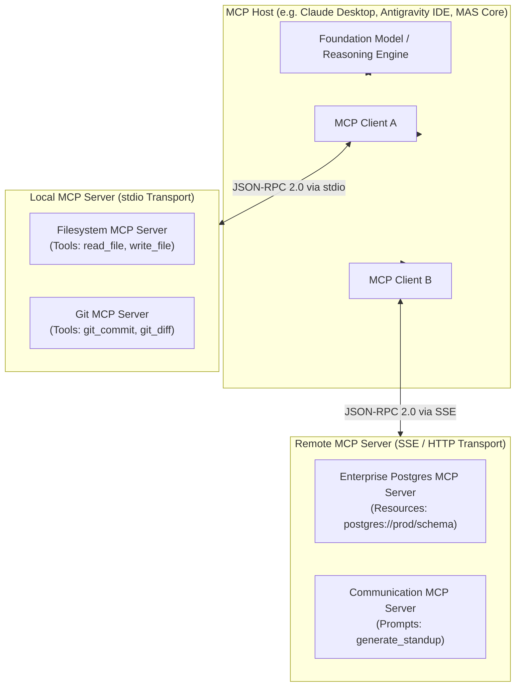
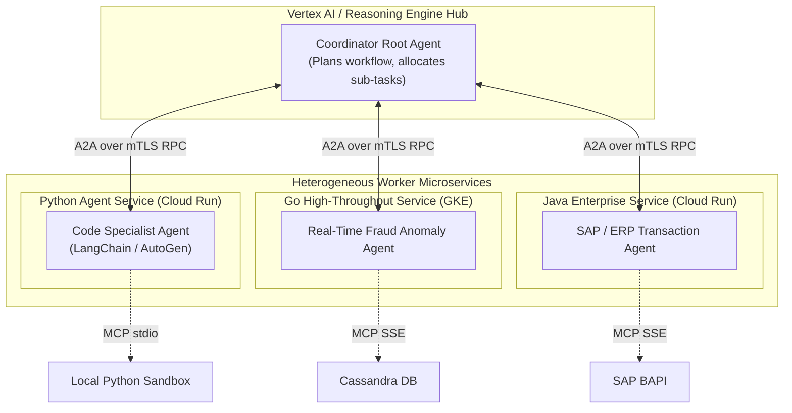
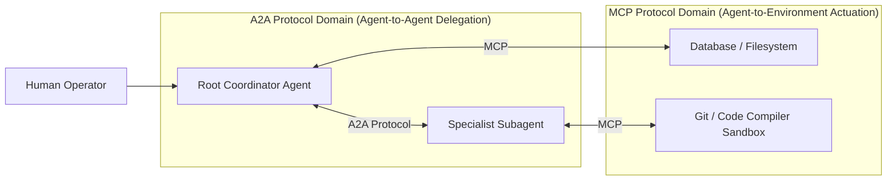

# Module 2: Multi-Agent Architectures & Designs
## Chapter 3: Open Interoperability Protocols — Anthropic MCP & Google Cloud A2A

> *"The early internet was fragmented across proprietary networking stacks until TCP/IP established universal interoperability. The agentic ecosystem has reached its TCP/IP moment with the emergence of the Model Context Protocol (MCP) for tool/data integration and Agent2Agent (A2A) for cross-agent collaboration."*

---

## 1. The Interoperability Crisis in Agent Systems

Prior to late 2024, every AI agent framework (LangChain, AutoGen, CrewAI, Semantic Kernel) implemented proprietary tool abstractions, custom JSON schemas, and ad-hoc communication wrappers:

```
[LangChain @tool] ──X── [AutoGen AssistantAgent] ──X── [CrewAI Task] ──X── [Custom REST API]
```

This fragmentation resulted in:
1. **Severe Vendor Lock-in:** Moving an agent from one framework to another required rewriting dozens of tool integrations.
2. **Security Vulnerabilities:** Ad-hoc tool execution lacked standardized authentication, sandboxing, and permission scopes.
3. **Impeded Cross-Language Agency:** A Python-based agent could not easily delegate a sub-task to a high-throughput Go or Java agent service.

The industry resolved this through two complementary open standards: **Anthropic MCP** and **Google Cloud A2A**.

---

## 2. Anthropic Model Context Protocol (MCP)

Released by Anthropic in November 2024, the **Model Context Protocol (MCP)** is an open-source standard enabling AI models to securely discover, authenticate, and interact with external data sources and execution tools.



### 2.1 The Three Core Primitives of MCP
An MCP Server exposes capabilities through three standardized primitives:

1. **Tools (Model-Controlled Executable Actions):**
   - Callable functions that allow the model to take actions in the real world (e.g., `execute_sql`, `run_python`, `fetch_web_page`, `create_github_pr`).
   - Exposed with strict JSON Schema definitions describing input parameters and expected return types.
2. **Resources (Application-Controlled Structured Data):**
   - Read-only data payloads exposed via URI schemes (e.g., `file:///workspace/repo/main.py`, `postgres://cluster/prod_users/schema`).
   - Similar to file attachments or database dumps; can be actively read by the client or subscribed to for real-time change notifications.
3. **Prompts (User-Controlled Reusable Templates):**
   - Parameterized prompt templates managed server-side (e.g., `code_review(pull_request_id="412")`, `engagement_brief(client="AcmeCorp")`).

### 2.2 Wire Protocol: JSON-RPC 2.0 Lifecycle
MCP communications strictly follow the **JSON-RPC 2.0 specification**:

```mermaid
sequenceDiagram
    autonumber
    participant Host as MCP Client / Host
    participant Server as MCP Server

    Note over Host,Server: Phase 1: Initialization Handshake
    Host->>Server: {"jsonrpc": "2.0", "method": "initialize", "params": {"protocolVersion": "2024-11-05", "capabilities": {"tools": {}}}}
    Server-->>Host: {"jsonrpc": "2.0", "result": {"protocolVersion": "2024-11-05", "capabilities": {"tools": {}, "resources": {}}, "serverInfo": {"name": "postgres-mcp", "version": "1.0.0"}}}
    Host->>Server: {"jsonrpc": "2.0", "method": "notifications/initialized"}

    Note over Host,Server: Phase 2: Dynamic Tool Discovery
    Host->>Server: {"jsonrpc": "2.0", "method": "tools/list", "params": {}}
    Server-->>Host: {"jsonrpc": "2.0", "result": {"tools": [{"name": "execute_query", "description": "Run read-only SQL", "inputSchema": {"type": "object", "properties": {"sql": {"type": "string"}}, "required": ["sql"]}}]}}

    Note over Host,Server: Phase 3: Tool Execution
    Host->>Server: {"jsonrpc": "2.0", "method": "tools/call", "params": {"name": "execute_query", "arguments": {"sql": "SELECT count(*) FROM users;"}}}
    Server-->>Host: {"jsonrpc": "2.0", "result": {"content": [{"type": "text", "text": "{\"count\": 84120}"}]}}
```

### 2.3 Supported Transports
- **stdio Transport:** The MCP Host launches the server as an isolated child subprocess, communicating over standard input and standard output pipes. Ideal for local tools (filesystem, git, local shell).
- **Server-Sent Events (SSE) over HTTP:** The MCP Client connects to a remote HTTP endpoint receiving server-sent events with bi-directional POST messages. Ideal for cloud-hosted microservices and enterprise SaaS.

---

## 3. Google Cloud Agent2Agent (A2A) Protocol

While MCP standardizes the connection between an **Agent and its Tools/Data**, Google Cloud's **Agent2Agent (A2A) protocol** standardizes the connection between **Agents and other Agents**.



### 3.1 Architectural Principles of A2A
1. **Cross-Language Interoperability:** A coordinator agent in Python can delegate tasks seamlessly to subagents written in Go or Java.
2. **Mutual TLS (mTLS) & Identity Attribution:** Every agent possesses an enterprise service account identity. A2A requests enforce mTLS and propagate authorization tokens across the call graph.
3. **Typed Delegation Contracts:** Subagents advertise their specific capabilities using strict interface definitions (input payload schema, expected response format, SLA timeout guarantees).
4. **VPC-SC Network Isolation:** A2A traffic remains securely within Google Cloud's private network using Private Service Connect (PSC) and Internal Application Load Balancers.

---

## 4. MCP vs. A2A: Architectural Synthesis



| Dimension | Model Context Protocol (MCP) | Agent2Agent (A2A) Protocol |
| :--- | :--- | :--- |
| **Primary Steward** | Anthropic | Google Cloud Architecture Center |
| **Primary Purpose** | Connecting Agents to **Tools, Data & Prompts** | Connecting Agents to **Other Specialized Agents** |
| **Target Participants** | Client $\leftrightarrow$ Tool Server | Root Agent $\leftrightarrow$ Subagent Services |
| **Wire Protocol** | JSON-RPC 2.0 (stdio / SSE) | gRPC / REST with mTLS & Service Directory |
| **Granularity** | Micro-operations (`read_file`, `query_db`) | Macro-tasks (`audit_repository`, `process_claim`) |
| **Security Mechanism** | Process isolation, capability negotiation | Cloud IAM, Service Account Tokens, VPC-SC |
| **Enterprise Standard** | Universal client-tool ecosystem | Multi-tenant cloud-native swarm deployments |
