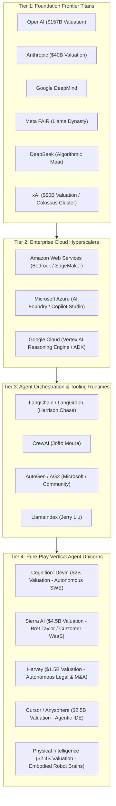

# Module 3: The Industrial Landscape, Platforms & Compute
## Chapter 1: Leading Companies, Frontier Labs & Market Ecosystem

> *"The agentic era is not merely an algorithmic competition; it is an industrial restructuring involving hundreds of billions of dollars in capital expenditure, enterprise market disruption, and the rapid emergence of pure-play agentic unicorns."*

---

## 1. The Multi-Tier Industrial Ecosystem

The agentic ecosystem has organized into four distinct competitive tiers:

---

## 2. In-Depth Profiles of Leading Industrial Players

### 2.1 The Frontier Labs

#### 1. OpenAI
- **Leadership:** Sam Altman (CEO), Mark Chen (SVP Research), Greg Brockman (President).
- **Core Assets:** GPT-4o, OpenAI o1, OpenAI o3, Operator (autonomous computer use), ChatGPT enterprise platform.
- **Strategic Moat:** Global consumer distribution (>300 million weekly active users), exclusive multi-gigawatt cloud partnership with Microsoft Azure, first-mover brand dominance.
- **Enterprise Agent Strategy:** Pushing from conversational interfaces into autonomous computer operation and long-horizon test-time reasoning.

#### 2. Anthropic
- **Leadership:** Dario Amodei (CEO), Daniela Amodei (President), Chris Olah (Interpretability).
- **Core Assets:** Claude 3.5 Sonnet, Claude 3.5 Haiku, Model Context Protocol (MCP), Computer Use API.
- **Strategic Moat:** Recognized gold standard for software engineering reasoning; structural safety leadership via Constitutional AI; open governance of the MCP protocol.
- **Enterprise Agent Strategy:** Positioning Claude as the enterprise-grade cognitive engine powering third-party agent builders (AWS Bedrock, GitHub Copilot, Cursor).

#### 3. Google DeepMind & Google Cloud
- **Leadership:** Sir Demis Hassabis (CEO DeepMind), Jeff Dean (Chief Scientist).
- **Core Assets:** Gemini 2.0 series, Vertex AI Reasoning Engine, Agent Development Kit (ADK), TPU v5p & Trillium hardware.
- **Strategic Moat:** Vertically integrated stack from silicon (TPUs) to research (DeepMind) and global enterprise distribution (Google Cloud & Workspace). Unmatched 2M+ token native multimodal context window.

#### 4. DeepSeek
- **Leadership:** Liang Wenfeng (Founder & Architect).
- **Core Assets:** DeepSeek-V3, DeepSeek-R1, DualPipe, Multi-Head Latent Attention (MLA).
- **Strategic Moat:** Extreme algorithmic and thermodynamic compute efficiency; proving that open-weights models trained for ~$6M can match multi-billion-dollar proprietary clusters. Catalyst for open-weights commoditization.

---

### 2.2 The Pure-Play Vertical Agent Pioneers

#### 1. Cognition AI (Devin)
- **Founders:** Scott Wu, Walden Yan, Steven Hao.
- **Valuation:** ~$2 Billion.
- **Core Product:** **Devin**, the world’s first autonomous software engineering agent.
- **Architecture:** Operates within a sandboxed virtual machine equipped with a shell, code editor, and browser. Capable of reading GitHub issues, planning multi-file refactors, executing terminal commands, fixing compilation errors, and submitting verified pull requests.
- **Impact:** Scored 13.86% on SWE-bench Unassisted at launch (early 2024), jumpstarting the autonomous software development industry.

#### 2. Sierra AI
- **Founders:** Bret Taylor (former Co-CEO of Salesforce and Chairman of OpenAI), Clay Bavor (former VP of Google Labs).
- **Valuation:** ~$4.5 Billion.
- **Core Product:** Enterprise conversational agent platform powering Fortune 500 consumer operations (SiriusXM, WeightWatchers, Sonos).
- **Architecture:** Combines deterministic finite-state business workflows with generative natural language, guaranteeing zero hallucinations on policy, returns, and inventory rules.
- **Business Model:** **Outcome-based pricing**—charging clients per successful, verified customer inquiry resolution rather than per seat.

#### 3. Harvey AI
- **Founders:** Winston Weinberg, Gabriel Pereyra.
- **Valuation:** ~$1.5 Billion (backed by OpenAI Startup Fund, Sequoia, Kleiner Perkins).
- **Core Product:** Legal intelligence agent for top global law firms (PwC, Allen & Overy).
- **Architecture:** Specialized retrieval and multi-agent cross-referencing across case law, regulatory filings, and complex corporate M&A contracts.
- **Impact:** Compresses contract due diligence review cycles from weeks to minutes, identifying indemnification liabilities and regulatory exposure.

#### 4. Anysphere (Cursor)
- **Founders:** Michael Truell, Sualeh Asif, Aman Sanger, Arvid Lunnemark.
- **Valuation:** ~$2.5 Billion.
- **Core Product:** **Cursor**, an AI-native fork of VS Code.
- **Architecture:** Multi-file indexing, semantic codebase search, dynamic multi-line diff synthesis, and agentic Composer mode allowing agents to edit multiple files in parallel across a workspace.

#### 5. Physical Intelligence ($\pi$)
- **Founders:** Karol Hausman, Sergey Levine, Chelsea Finn, Lachy Groom.
- **Valuation:** ~$2.4 Billion (backed by Jeff Bezos, Thrive Capital, Lux).
- **Core Product:** $\pi_0$ (Physical Intelligence Zero), a generalist robot foundation model.
- **Architecture:** Vision-Language-Action (VLA) flow-matching diffusion policies translating video and language into continuous 50Hz motor joint trajectories across diverse humanoid and robotic hardware.

---

## 3. Comparative Market Map: Valuation, Focus & Capitalization

| Company | Focus Area | Flagship Asset | Est. Valuation / Cap | Primary Strategic Partners |
| :--- | :--- | :--- | :---: | :--- |
| **OpenAI** | General Frontier AI | o1 / o3 / GPT-4o | $157 Billion | Microsoft Azure, Apple |
| **Anthropic** | Safety & Enterprise AI | Claude 3.5 Sonnet / MCP | $40 Billion | Amazon AWS, Google Cloud |
| **xAI** | Frontier Compute | Grok-2 / Grok-3 | $50 Billion | X (Twitter), Memphis Colossus |
| **DeepSeek** | Algorithmic Efficiency | DeepSeek-R1 / V3 | Private / High-Flyer | Global Open-Source Community |
| **Sierra AI** | Enterprise Customer WaaS | Conversational Agent Platform | $4.5 Billion | Benchmark, Sequoia |
| **Cursor (Anysphere)** | Agentic Software Dev | Cursor IDE / Composer | $2.5 Billion | Andreessen Horowitz (a16z) |
| **Physical Intelligence**| Embodied Physical AI | $\pi_0$ VLA Model | $2.4 Billion | Jeff Bezos, OpenAI |
| **Cognition** | Autonomous SWE | Devin | $2.0 Billion | Founders Fund |
| **Harvey** | Legal Agent Workflows | Legal Copilot / Due Diligence | $1.5 Billion | OpenAI Startup Fund, Sequoia |
| **CrewAI** | Multi-Agent Orchestration | CrewAI Enterprise | $100M+ | Insight Partners |
| **LangChain** | StateGraph Runtimes | LangGraph / LangSmith | $200M+ | Sequoia, Benchmark |
