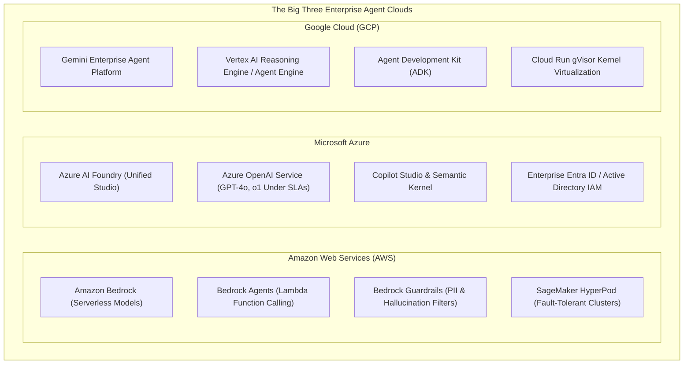
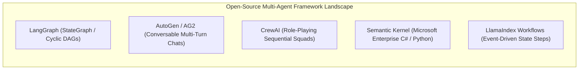

# Module 3: The Industrial Landscape, Platforms & Compute
## Chapter 2: Cloud Hyperscaler Stacks & Multi-Agent Frameworks

> *"Enterprise agent deployment requires far more than an API key; it demands identity lifecycle management, state persistence, private VPC networking, deterministic sandboxing, and compliance governance."*

---

## 1. The Cloud Hyperscaler Triad

Enterprise adoption of agentic AI is anchored in the big three cloud hyperscalers, each constructing complete vertically integrated agentic platforms:

### 1.1 Amazon Web Services (AWS)
- **Flagship Services:** **Amazon Bedrock**, **Bedrock Agents**, **SageMaker HyperPod**.
- **Architectural Philosophy:** Multi-model marketplace with tight serverless AWS Lambda integration.
- **Key Capabilities:**
  - *Bedrock Agents:* Automatically parses user goals, generates API calling plans, queries Amazon OpenSearch vector stores, and invokes AWS Lambda functions to execute enterprise transactions.
  - *Bedrock Guardrails:* Enforces strict compliance by filtering harmful topics, redacting PII, blocking competitor keywords, and computing hallucination confidence scores against grounded context.
  - *SageMaker HyperPod:* Prevents multi-million-dollar training and inference cluster failures by detecting hardware anomalies, saving state checkpoints, and automatically swapping replacement GPU/Trainium instances in minutes.

### 1.2 Microsoft Azure
- **Flagship Services:** **Azure AI Foundry**, **Azure OpenAI Service**, **Microsoft Copilot Studio**, **Semantic Kernel**.
- **Architectural Philosophy:** Deep enterprise integration with Microsoft 365, GitHub, and corporate Active Directory (Entra ID).
- **Key Capabilities:**
  - *Azure OpenAI Service:* Exclusive cloud SLA for GPT-4o, o1, and DALL-E models, guaranteeing that customer data is never retained or used to retrain foundation weights.
  - *Semantic Kernel:* Open-source enterprise SDK in C#, Python, and Java for building agent plugins, native vector memory, and multi-agent chats.
  - *Azure AI Search:* Leading enterprise hybrid retrieval system combining BM25 keyword matching with dense vectors and neural semantic re-ranking.

### 1.3 Google Cloud Platform (GCP)
- **Flagship Services:** **Gemini Enterprise Agent Platform**, **Vertex AI Reasoning Engine**, **Agent Development Kit (ADK)**.
- **Architectural Philosophy:** Fully managed Python runtime with native 2M+ token multimodal processing and containerized gVisor execution.
- **Key Capabilities:**
  - *Vertex AI Reasoning Engine:* Serverless runtime managing agent memory, session state, and LangChain/ADK code execution behind private endpoints.
  - *Grounding with Google Search:* Allows agents to cite verified real-time public web facts directly within response payloads.
  - *gVisor Sandboxed Execution:* Cloud Run containers utilize Google's user-space gVisor kernel, neutralizing container breakouts during agent code execution.

---

## 2. The Leading Multi-Agent Orchestration Frameworks

Developers rely on open-source frameworks to construct, evaluate, and deploy multi-agent cognitive topologies:

### 2.1 LangGraph (LangChain Ecosystem)
- **Creator:** Harrison Chase & the LangChain team.
- **Mental Model:** **StateGraph** — a graph where nodes represent agent or tool functions, and edges represent conditional transitions based on state.
- **Core Strengths:**
  - First-class support for **cyclic graphs** (essential for reflection, review-correction loops, and iterative refinement).
  - Built-in **checkpointers** (PostgreSQL, SQLite) saving complete state snapshots after every node execution, enabling time-travel debugging and human-in-the-loop interrupts.
  - High determinism: Developers have total control over state schema definitions and conditional routing logic.
- **Weaknesses:** Steep learning curve; requires significant boilerplate code compared to higher-level frameworks.

### 2.2 AutoGen / AG2 (Microsoft Research)
- **Creator:** Qingyun Wu, Chi Wang, Gagan Bansal et al. (Microsoft Research).
- **Mental Model:** **Conversable Agents** interacting through multi-turn asynchronous dialog.
- **Core Strengths:**
  - High conversational flexibility: Agents seamlessly integrate LLMs, human input, and tool execution.
  - Native support for dynamic GroupChats, multi-agent debates, and hierarchical supervisor-worker chats.
  - Strong integration with code interpreters and Jupyter execution environments.
- **Weaknesses:** Unconstrained group chats can wander off-topic, consuming large token volumes; hard to enforce rigid enterprise compliance gates without custom termination conditions.

### 2.3 CrewAI
- **Creator:** João Moura.
- **Mental Model:** **Role-Playing Squads** mimicking a corporate department.
- **Core Strengths:**
  - Intuitive, high-level abstraction: Developers define agents with a `role`, `goal`, and `backstory`, assigning them sequential or hierarchical `tasks`.
  - Built-in memory systems (short-term, long-term, and entity memory using ChromaDB).
  - Extensive community ecosystem and pre-built tool library.
- **Weaknesses:** Less flexible for complex non-linear branching logic or low-level state manipulation than LangGraph.

### 2.4 LlamaIndex Workflows
- **Creator:** Jerry Liu & the LlamaIndex team.
- **Mental Model:** **Event-Driven Step Functions**.
- **Core Strengths:** Superior integration with advanced RAG architectures, knowledge graphs, and complex document parsing pipelines. Clean async event passing between discrete steps.

---

## 3. Comprehensive Framework Comparison Matrix

| Feature / Dimension | LangGraph | AutoGen / AG2 | CrewAI | Semantic Kernel | Acinonyx MAS |
| :--- | :---: | :---: | :---: | :---: | :---: |
| **Primary Abstraction** | StateGraph (Cyclic DAG) | Conversable Agents | Role-Playing Squad | Plugins & Planners | **Liquid Strike Pods** |
| **State Persistence** | Native Checkpointers | In-Memory / File | Memory Buffers | Session Memory | **Episodic SQLite Vector** |
| **Human-in-the-Loop** | Native Interrupt Nodes | HumanInputMode | Task Delegation Gate | Manual Step Approval | **Level-2 Gated Gateways** |
| **Protocol Support** | LangServe / REST | Custom JSON-RPC | REST APIs | Microsoft Graph | **Anthropic MCP + A2A** |
| **Auditability** | LangSmith Traces | Print logs | Logging Callbacks | Azure Monitor | **SHA-256 Merkle DAG** |
| **Sandboxing** | Custom Docker/Subproc | Native Python / Docker | Subprocess Exec | Azure Functions | **AST Import Denial + Jail** |
| **Enterprise Readiness** | Very High | High | High | Very High (Microsoft) | **Highest (Bank-Grade)** |
