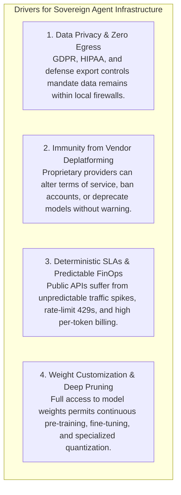
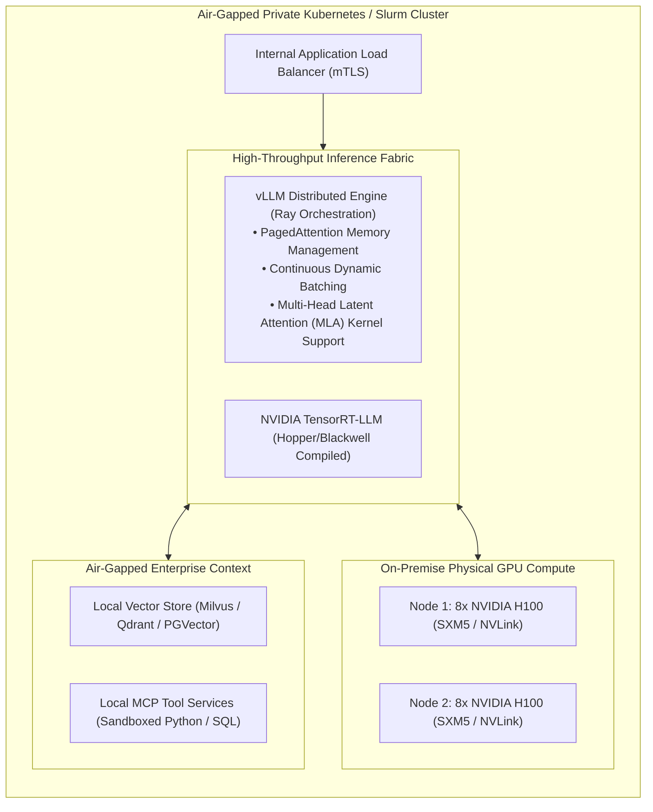

# Module 3: The Industrial Landscape, Platforms & Compute
## Chapter 3: Self-Hosted, Sovereign & Air-Gapped Infrastructure

> *"For national defense ministries, healthcare conglomerates, and global investment banks, sending proprietary code, patient records, or financial trading books over public REST APIs to third-party providers is a non-starter. True enterprise sovereignty requires self-hosted agent clusters operating within air-gapped perimeters."*

---

## 1. The Imperative for Sovereign Agentic Infrastructure

While commercial cloud APIs offer rapid prototyping, mission-critical enterprise environments mandate self-hosted infrastructure driven by five non-negotiable vectors:



---

## 2. The Core Open-Source Inference Serving Stack

Deploying self-hosted frontier models (such as Llama 3.3 70B, DeepSeek-V3, and Qwen 2.5 Coder) requires specialized serving engines optimized for high concurrency:



### 2.1 vLLM: The Standard for Distributed Serving (UC Berkeley)
- **The PagedAttention Innovation:** Traditional inference engines allocate contiguous blocks of GPU memory for each request's Key-Value (KV) cache. Due to unpredictable output lengths, this wastes 60%–80% of VRAM through internal fragmentation. **PagedAttention** partitions the KV cache into non-contiguous virtual memory pages (inspired by OS virtual memory), increasing serving throughput by **$2\times$ to $4\times$**.
- **Continuous Batching:** Dynamically injects newly arriving agent prompts into active forward passes without waiting for prior sequences to complete.
- **Multi-LoRA Serving:** Serves hundreds of fine-tuned domain-specific agent adaptors (e.g. SQL agent, Python agent, Compliance agent) concurrently from a single base foundation model checkpoint.

### 2.2 TensorRT-LLM (NVIDIA)
- Highly optimized C++ inference runtime utilizing custom Tensor Core kernels, FlashAttention-3, and native FP8/FP4 support for Blackwell and Hopper architectures, providing the lowest latency per token for large batch sizes.

### 2.3 Ollama & llama.cpp (Georgi Gerganov)
- **Edge & Local Worker Deployment:** Employs the **GGUF** format for quantized CPU and Apple Silicon / consumer GPU execution. Widely utilized for deploying lightweight SLM task workers (Llama 3.2 3B, Gemma 2 2.6B) directly onto analyst workstations.

---

## 3. Air-Gapped Multi-Agent Deployment Blueprint

An enterprise air-gapped agent environment enforces strict physical and network isolation:

```
[ Developer / Analyst Workstation ]
                │
                ▼ (mTLS / Internal Corporate VPN)
┌────────────────────────────────────────────────────────────────────────┐
│                   AIR-GAPPED PRIVATE GPU PERIMETER                     │
│                                                                        │
│  [ Agent Orchestration Layer: MAS Liquid Strike Pods / LangGraph ]     │
│                                │                                       │
│          ┌─────────────────────┴─────────────────────┐                 │
│          ▼                                           ▼                 │
│  [ vLLM Inference Pods ]                     [ Local Storage Fabric ]  │
│  • DeepSeek-R1 (Quantized FP8)               • PGVector / Milvus DB    │
│  • Qwen 2.5 Coder 32B                        • Git Mirror (Air-Gapped) │
│  • Llama 3.3 70B                             • S3/MinIO Object Storage │
│          │                                                             │
│          ▼ (Zero Internet Egress / Strict iptables Drop)               │
│  [ Isolated MCP Tool Execution Sandboxes ]                             │
│  • Linux Bubblewrap / gVisor MicroVMs                                  │
│  • PostgreSQL Read-Only Replicas                                       │
└────────────────────────────────────────────────────────────────────────┘
```

### 3.1 Security Hardening Measures
1. **Zero External DNS / Egress Filtering:** Firewall rules (`iptables`) drop all outbound TCP/UDP traffic to public IP addresses, preventing data exfiltration during indirect prompt injection attacks.
2. **Local Model Weight Registry:** Weights are verified via cryptographic SHA-256 checksums from an internal air-gapped Artifactory/MinIO registry.
3. **Hardware Sandboxing:** Agent code execution is strictly imprisoned in ephemeral Linux namespaces or microVMs with dedicated CPU/RAM quotas.
