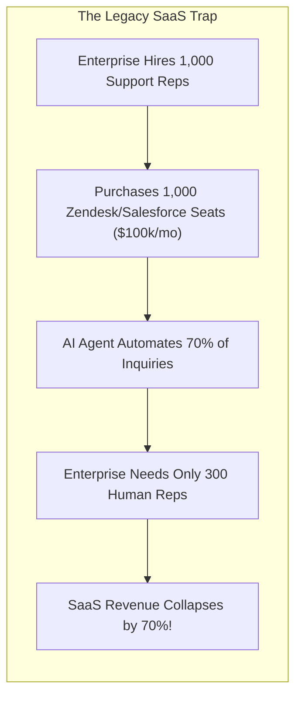
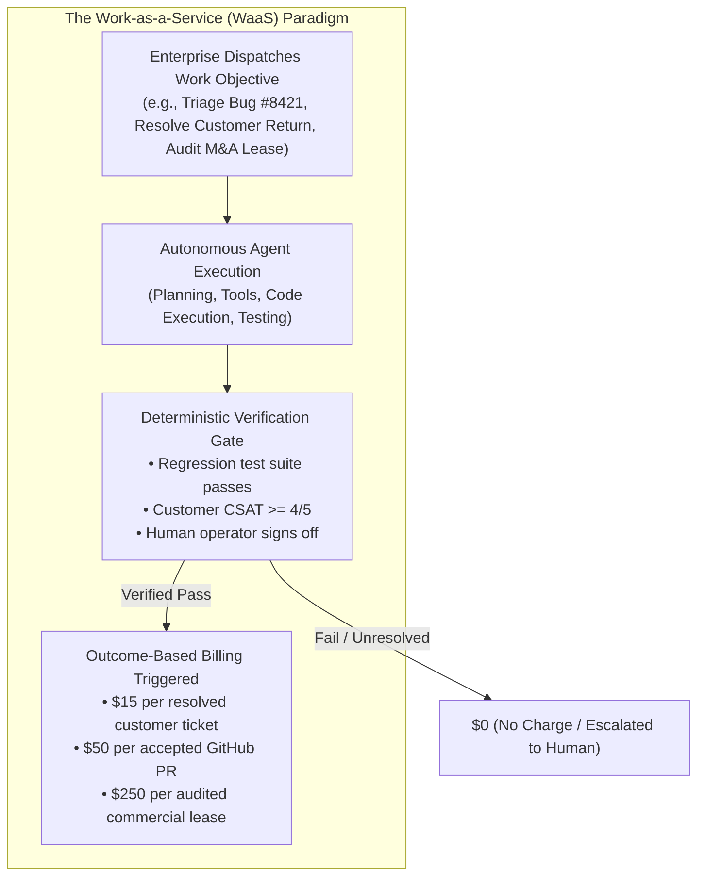
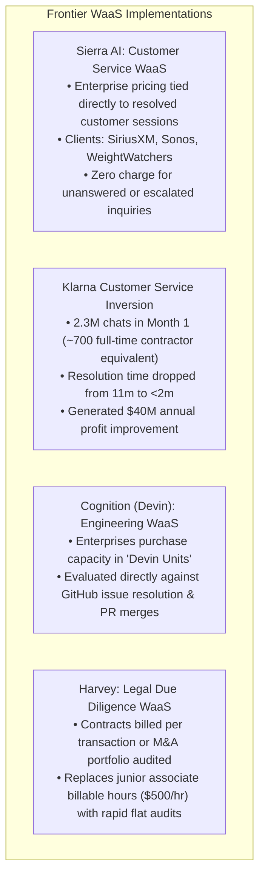

# Module 4: Business Models, Economics & FinOps
## Chapter 1: The Economic Paradigm Shift — From SaaS to Work-as-a-Service (WaaS)

> *"For thirty years, enterprise enterprise software followed the SaaS model: charge $50 per employee per month for a tool they use to do work. Agentic AI breaks this model: when software does the work directly, selling human seats penalizes software creators for making their systems more efficient. The future belongs to Work-as-a-Service (WaaS)."*

---

## 1. The Breakdown of the Seat-Based SaaS Model

The Software-as-a-Service (SaaS) business model relies on a fundamental economic assumption: **more employees = more licenses = higher software revenues**.

### 1.1 The Cannibalization Dilemma
Under seat-based pricing, an AI vendor who automates human work destroys their own addressable market. Consequently, the commercial pricing of software is undergoing an irreversible inversion toward **Work-as-a-Service (WaaS)** and **Outcome-Based Contracting**.

---

## 2. The Mechanics of Work-as-a-Service (WaaS)

In a WaaS model, customers do not pay for software access or compute tokens; they pay for **verified work completed**:

### 2.1 The Concept of the "Digital FTE"
Enterprises are increasingly framing agent deployments not as IT software line-items, but as **digital labor procurement**:

$$\text{Digital FTE ROI} = \frac{\text{Human Salary + Benefits + Overhead}}{\text{Annual Cost of Agent Swarm + Human Oversight}} - 1$$

- A human software engineer in the United States costs an enterprise ~$200,000/year (fully loaded).
- A specialized agent pod (e.g. Devin or an Acinonyx Liquid Strike Pod) capable of resolving 5–10 bug issues daily at an annual infrastructure cost of $15,000–$25,000 yields a **$8\times$ to $12\times$ economic multiplier**.

---

## 3. Real-World WaaS Implementation Case Studies

---

## 4. Structuring Service Level Agreements (SLAs) for AI Labor

Because language models are inherently probabilistic, enterprise WaaS contracts require strict deterministic verification gates to validate work before billing:

### 4.1 Verification Mechanisms by Domain
1. **Software Engineering:** The billing event triggers only when an agent-generated branch passes an automated CI/CD pipeline, generates new unit tests exceeding a code-coverage threshold, and receives human code-owner merge approval.
2. **Customer Support:** Billed only when an inquiry ends with the customer receiving affirmative order confirmation or explicit issue resolution without re-opening a ticket within 48 hours.
3. **Legal & Compliance:** Billed per validated lease or contract, with automated confidence scoring and human partner sign-off gateways.

---

## 5. Summary: SaaS vs. WaaS Comparative Economics

| Metric / Dimension | Traditional SaaS (e.g., Salesforce, Jira) | Work-as-a-Service (WaaS) (Agentic Era) |
| :--- | :--- | :--- |
| **Pricing Metric** | Per User Seat / Month ($/seat/mo) | Per Verified Outcome / Resolution ($/outcome) |
| **Value Proposition** | *"We make your human employees more productive."* | *"We execute the task autonomously on your behalf."* |
| **Buyer Budget** | Enterprise IT / Software Budget | Enterprise Labor / Staffing / BPO Budget |
| **Scale Dynamic** | Revenue caps when hiring slows | Revenue scales directly with enterprise business volume |
| **Incentive Alignment** | Wants bloated human headcount | Wants maximal autonomous resolution efficiency |
| **Customer Risk** | High upfront software commitment, user adoption risk | Low risk: Pay only for verified successful work |
