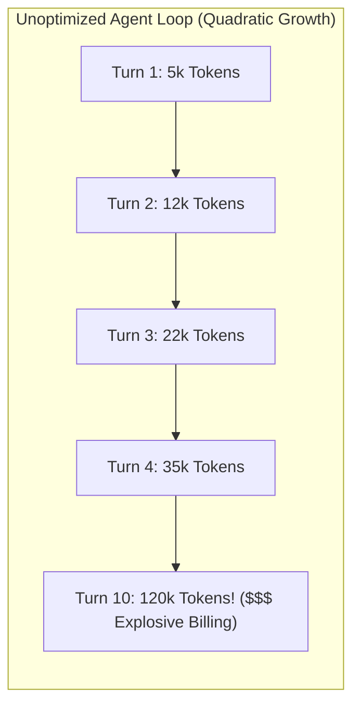
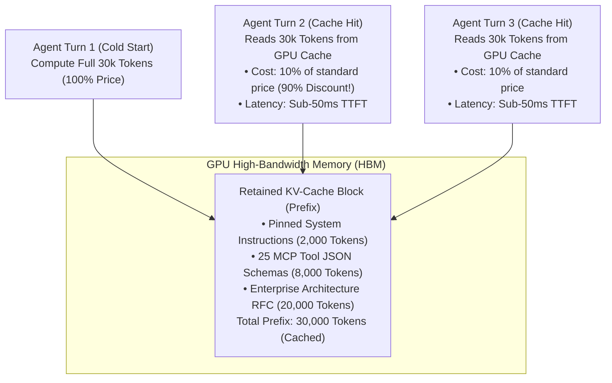
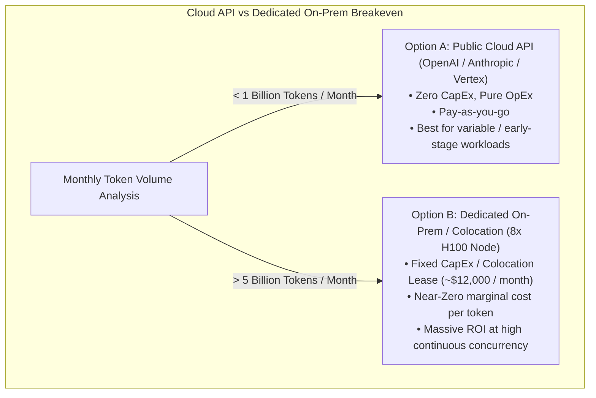

# Module 4: Business Models, Economics & FinOps
## Chapter 2: Enterprise Token FinOps, Prompt Caching & TCO Breakeven Analysis

> *"In generative AI, unoptimized agent loops can burn thousands of dollars in tokens overnight without producing a single working line of code. Enterprise AI FinOps transforms token economics from an uncontrolled cloud cost-center into an engineered, high-margin ROI engine."*

---

## 1. The Anatomy of Enterprise Token Costs

In an autonomous multi-turn agent loop, token consumption scales non-linearly because the agent must resend past conversation turns, tool schemas, and environment observations on every subsequent forward pass:

$$\text{Total Tokens Billed} = \sum_{t=1}^T \left( \text{System Prompt} + \text{Tool Schemas} + \sum_{i=1}^{t-1} (\text{Turn}_i + \text{Observation}_i) + \text{Turn}_t \right)$$

Without rigorous optimization, a 10-turn coding task can consume over 500,000 tokens for a single $50 deliverable, completely obliterating gross margins.

---

## 2. The Prompt Caching Revolution

The single most impactful FinOps optimization in production agent systems is **Prompt Caching** (standardized across Anthropic, DeepSeek, and OpenAI).

### 2.1 Economic & Latency Impact
- **Cost Reduction:** Cached input tokens receive an automatic **$75\%$ to $90\%$ price discount** (e.g. Anthropic charges $3.75/1M tokens for base Claude 3.5 Sonnet inputs, but only $0.30/1M tokens for cached inputs; DeepSeek charges only $0.014/1M cached tokens).
- **Latency Acceleration:** Because the attention Key-Value matrices for the prefix already exist in GPU VRAM, the engine skips the expensive pre-fill computation, slashing Time To First Token (TTFT) by up to **$85\%$**.

### 2.2 Golden Rules for Prompt Cache Engineering
1. **Strict Prefix Invariance:** Any change to a single character in the prompt invalidates the cache for all subsequent tokens. Place static system instructions and tool schemas at the very top of the prompt.
2. **Append-Only History:** Append new user messages and tool observations strictly to the end of the prompt.
3. **Minimum Cache Thresholds:** Ensure prompts exceed provider minimums (e.g. 1,024 tokens for Anthropic, 64 tokens for DeepSeek) to trigger caching logic.

---

## 3. Total Cost of Ownership (TCO) Breakeven Model: Cloud API vs. On-Prem GPU Cluster

A critical strategic decision for enterprise CTOs and FinOps directors is determining when to transition from public hyperscaler APIs to a dedicated, self-hosted on-premise GPU cluster:

### 3.1 Mathematical Breakeven Formula
Let:
- $V$: Monthly input + output token volume (in millions of tokens).
- $P_{\text{API}}$: Weighted blended API cost per million tokens (e.g., ~$3.00 / 1M tokens for mixed frontier + cached models).
- $C_{\text{server}}$: Monthly fully-loaded cost of an 8x NVIDIA H100 node (hardware amortization over 3 years + colocation power + cooling + networking + sysadmin overhead $\approx \$14,000 / \text{month}$).

$$\text{Monthly Cloud Cost} = V \times P_{\text{API}}$$
$$\text{Breakeven Volume } V^* = \frac{C_{\text{server}}}{P_{\text{API}}}$$

$$\text{For } P_{\text{API}} = \$3.00 / \text{1M tokens: } V^* = \frac{\$14,000}{\$3.00} \approx 4,667 \text{ Million Tokens} \approx 4.67 \text{ Billion Tokens / Month}$$

### 3.2 Strategic Guidance
- **Under 3–4 Billion Tokens/Month:** Rely on managed cloud APIs (Claude 3.5, Gemini Flash, OpenAI o1) with prompt caching and semantic SLM routing. The capital expenditure, hardware depreciation, and operational overhead of maintaining a physical cluster do not justify self-hosting.
- **Over 5 Billion Tokens/Month:** Deploy an enterprise self-hosted vLLM cluster running **DeepSeek-R1, DeepSeek-V3, and Llama 3.3 70B**. The marginal cost per token drops to near zero, yielding millions of dollars in annual savings while securing total data privacy.
