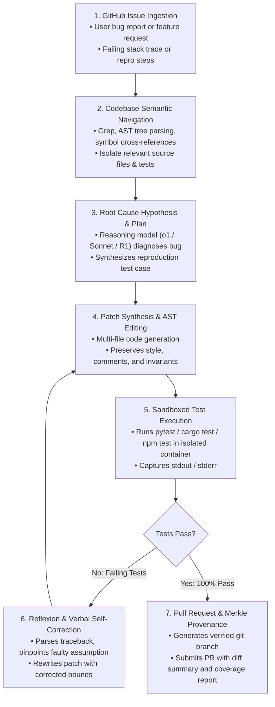

# Module 5: Vertical Use Cases & Production Architectures
## Chapter 1: Autonomous Software Engineering & DevOps Operations

> *"Software engineering is the tip of the spear for the agentic revolution. Code provides the ultimate formal verification substrate: an agent can generate a hypothesis, execute it in a sandboxed compiler, observe the exact error traceback, and self-correct deterministically."*

---

## 1. The Autonomous Software Engineering (SWE) Lifecycle

Unlike human developers who read code sequentially, an autonomous software engineering pod operates via structured, cyclic cognitive loops:

---

## 2. Benchmark Standards: SWE-bench Verified

The definitive evaluation benchmark for autonomous coding agents is **SWE-bench Verified** (Princeton & OpenAI, 2024):
- **Structure:** 500 curated, human-validated software engineering problems extracted from popular open-source Python repositories (Django, SymPy, Flask, Matplotlib).
- **Execution Protocol:** The agent is placed into the unpatched git repository with only the issue description. It must navigate the directory, edit the source code, and have its patch pass hidden regression test suites without human assistance.
- **State-of-the-Art (2025–2026):** Frontier agentic systems (Claude 3.5 Sonnet + Aider/Cursor, DeepSeek-R1, and specialized scaffolding) achieve **49% to 54% resolution rates**, transforming software engineering productivity metrics globally.

---

## 3. High-Impact Enterprise Use Cases

### 3.1 Legacy Code Modernization (COBOL to Cloud-Native Microservices)
- **The Enterprise Crisis:** Major global banks, airlines, and government administrations run critical infrastructure on billions of lines of legacy COBOL and Fortran code. Human COBOL engineers are aging out, and manual rewrites cost hundreds of millions with high failure rates.
- **Agentic Multi-Stage Solution:**
  1. *Decompiler Agent:* Parses legacy COBOL copybooks into abstract AST syntax trees.
  2. *Architect Agent:* Maps monolithic COBOL business rules into clean REST/gRPC API schemas.
  3. *Synthesizer Agent:* Writes idiomatic Java (Spring Boot) or Python (FastAPI) microservices.
  4. *Equivalence Verification Agent:* Replays historical transaction inputs across both legacy COBOL and modern services, verifying byte-for-byte output equivalence before approving cutovers.

### 3.2 Self-Healing CI/CD Deployment Pipelines
- **Architecture:** Autonomous SRE agents attached to GitHub Actions or GitLab CI.
- **Workflow:** When a nightly build or regression pipeline fails:
  - The SRE Agent intercepts the webhook, parses the failure traceback, and runs `git bisect` to isolate the offending commit.
  - Spins up an ephemeral Docker container, reproduces the test failure, writes a regression patch, verifies the build, and opens an automated hotfix PR with zero human intervention.

### 3.3 Automated Code Review & Security Hardening
- Agents act as automated senior code reviewers, enforcing architecture boundaries, blocking SQL injection patterns, catching memory leaks, and ensuring new functions include comprehensive unit test suites.
