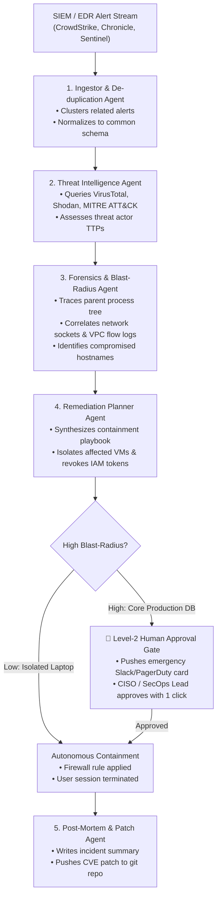

# Module 5: Vertical Use Cases & Production Architectures
## Chapter 2: Autonomous Cybersecurity & SecOps Incident Response

> *"Cyberattacks operate at machine speed. Defending against state-sponsored adversaries and automated exploit swarms using human analysts triaging alerts on eight-hour shifts is an asymmetrical disaster. Autonomous SecOps agents compress Mean Time to Respond (MTTR) from hours down to milliseconds."*

---

## 1. The Enterprise Security Operations (SOC) Crisis

Modern enterprise Security Operations Centers (SOCs) face catastrophic alert fatigue:
- A typical Global 2000 enterprise receives **10,000 to 50,000 security alerts daily** across SIEM, EDR, and cloud infrastructure logs (Splunk, Google Chronicle, CrowdStrike, Palo Alto Networks).
- Over **95% of alerts are false positives**, yet human analysts spend 15–30 minutes investigating each alert.
- **The Asymmetry:** Attackers execute lateral movement, privilege escalation, and data exfiltration in under 15 minutes, while average enterprise Mean Time to Remediate (MTTR) exceeds **4.5 hours**.

---

## 2. Multi-Agent Autonomous SecOps Architecture

Autonomous SecOps replaces manual alert queues with a coordinated, specialized agent swarm:

---

## 3. Key Capabilities & Production Workflows

### 3.1 Autonomous Threat Hunting & Log Correlation
- Agents continuously execute hypothesis-driven hunts across petabytes of historical VPC flow logs and audit events (e.g. searching for unusual DNS tunneling, suspicious `gcloud iam` service account key creations, or abnormal S3/Cloud Storage egress spikes).
- Unlike static rule engines, reasoning agents correlate subtle, disparate low-fidelity signals across days into a coherent attack narrative.

### 3.2 Automated Vulnerability Patching & Virtual Patching
- When a new zero-day vulnerability (such as Log4j or an SSH RCE) is publicly disclosed:
  1. *Scanner Agent:* Scans enterprise git repositories and SBOMs (Software Bill of Materials) to locate all vulnerable dependencies.
  2. *Synthesizer Agent:* Writes targeted configuration overrides, web application firewall (WAF) regex filters, or dependency version upgrades.
  3. *Validation Agent:* Runs regression suites in an isolated sandbox and pushes automated pull requests across all affected microservices within minutes of public disclosure.

### 3.3 Autonomous Adversarial Red-Teaming (Chaos Engineering)
- Specialized red-team agents (e.g., Acinonyx `AdversarialRedTeamAgent`) continuously execute non-destructive simulated attacks against staging infrastructure, probing for open ports, misconfigured IAM roles, expired TLS certificates, and prompt injection vulnerabilities in public-facing LLM endpoints.
