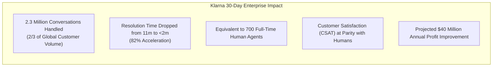
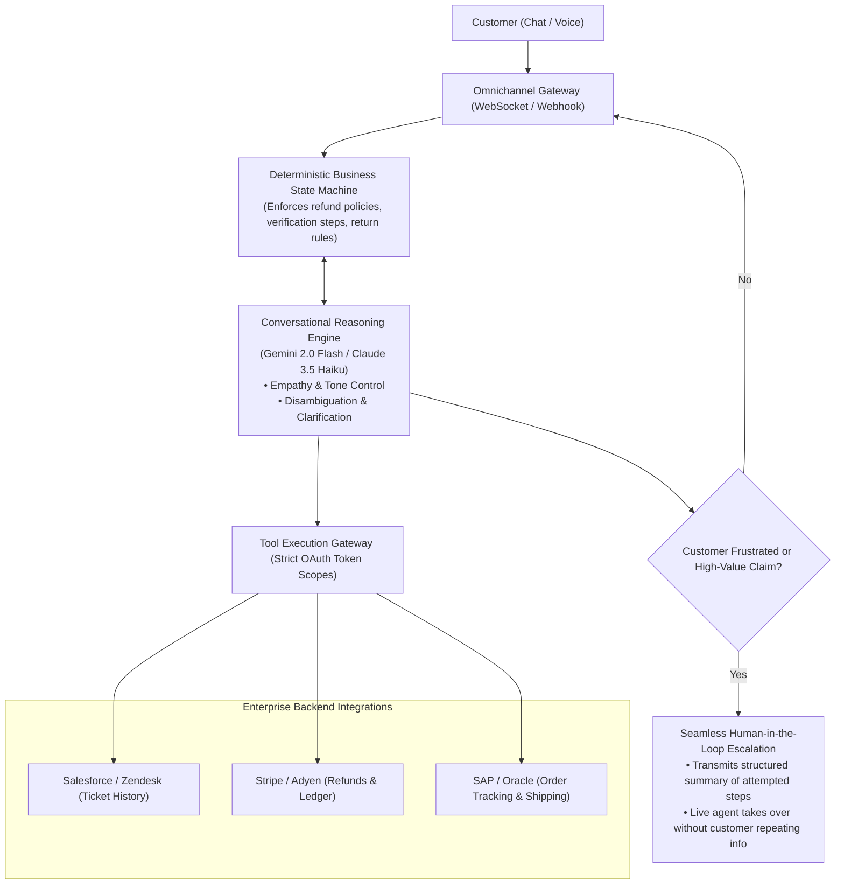
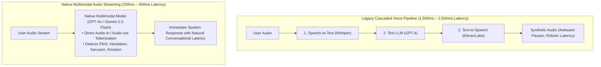

# Module 5: Vertical Use Cases & Production Architectures
## Chapter 3: Customer Experience, Ambient Voice & Conversational Agency

> *"Customer service has evolved from rigid, infuriating IVR phone trees ('Press 1 for Billing') into intelligent, empathetic conversational agents capable of executing complex business transactions in natural spoken dialog with sub-500ms latency."*

---

## 1. The Customer Experience Inversion: The Klarna Benchmark

In February 2024, Swedish fintech giant **Klarna** released audited data from the first 30 days of deploying its OpenAI-powered customer service agent, establishing the global benchmark for enterprise customer operations:

---

## 2. Production Customer Agent Architecture

Consumer-facing enterprise agents cannot rely on raw, unconstrained prompt-completion models. A hallucinated return policy or an accidental $10,000 refund can cause severe financial and brand damage.

Production platforms (such as **Sierra AI** and **Google Cloud Gemini Enterprise**) utilize a **Hybrid State-Machine & Tool Architecture**:

### 2.1 The Hybrid Guardrail Principle
- **Deterministic Bounds:** Core business logic (e.g. *"Refunds over $100 require receipt photo upload"*, *"Account password changes require SMS OTP verification"*) is coded into deterministic Python/Go state machines, not left to model discretion.
- **Generative Fluency:** The foundation model is responsible solely for natural language comprehension, empathetic communication, and translating customer intent into structured tool parameter calls.

---

## 3. Real-Time Ambient Voice & Low-Latency Streaming

The customer service frontier has shifted from text chat to **natural spoken voice-to-voice agency**:

### 3.1 Architectural Breakthroughs in Real-Time Voice
1. **Sub-400ms Latency:** Matches human conversational response latency (typically 250–350ms), eliminating robotic pauses.
2. **Natural Interruption Handling (Barge-In):** The model listens continuously; if the customer speaks while the agent is talking, the agent immediately halts speech generation, listens, and adapts its response.
3. **Paralinguistic Perception:** The model detects emotional cues (frustration, anxiety, excitement) directly from raw audio waveforms rather than relying on flat transcribed text.
