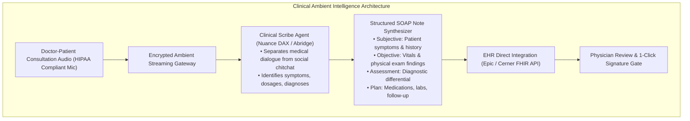
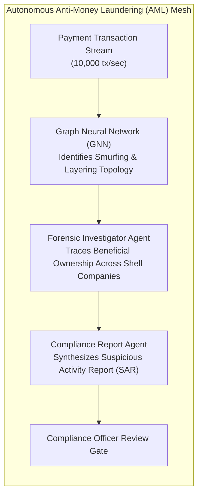
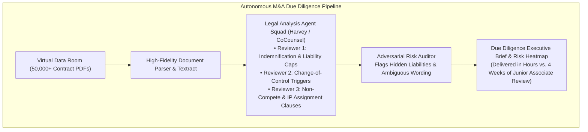

# Module 5: Vertical Use Cases & Production Architectures
## Chapter 4: Healthcare, Financial Services & Legal Enterprise Disruption

> *"High-stakes regulated industries—healthcare, investment banking, and corporate law—are being fundamentally transformed by multi-agent architectures that augment human judgment with exhaustive verification, clinical precision, and deterministic compliance."*

---

## 1. Healthcare & Life Sciences

Healthcare represents one of the largest economic sectors globally ($4.5 trillion in the US alone), yet clinicians spend up to **50% of their workday** on electronic paperwork and EHR data entry rather than patient care.

### 1.1 Empirical Clinical Impact
- **Burnout Mitigation:** Clinical studies report physician burnout reduced by **70%**.
- **Time Savings:** Doctors save an average of **2 hours per clinician per day**, allowing hospitals to expand patient throughput while improving work-life balance.
- **Biotech & Molecular Design:** Multi-agent architectures coordinate biological foundation models (AlphaFold 3, ESM-2) to design novel antibody binding targets, compress preclinical drug candidate screening from 4 years to months, and match eligible oncology patients to active clinical trial protocols.

---

## 2. Financial Services & Capital Markets

Financial institutions operate under strict regulatory scrutiny (Basel III, FINRA, SEC, Dodd-Frank). Multi-agent systems provide continuous surveillance, auditability, and fraud mitigation:

### 2.1 Production Financial Agent Workflows
1. **Real-Time Fraud Ring Detection:** Multi-agent systems analyze transactional graphs in sub-10ms latency, identifying circular payment rings and layered smurfing accounts designed to evade static rule thresholds.
2. **SEC 10-K & Regulatory Auditing:** Financial analyst agents ingest hundreds of corporate 10-K, 10-Q, and 8-K filings, automatically cross-referencing balance-sheet debt covenants against earnings-call transcripts and macroeconomic interest-rate exposures.
3. **Algorithmic Credit Underwriting:** Synthesizing unstructured bank statements, tax returns, and commercial real-estate lease schedules into formal credit-committee approval memos.

---

## 3. Legal & Corporate Governance

Corporate legal departments and top law firms manage massive document volumes where missed clauses carry multi-million-dollar liabilities:

### 3.1 Contract Redlining & Negotiation Agents
- When an enterprise receives a 60-page Master Services Agreement (MSA) from a vendor, the Legal Agent automatically compares every clause against the company's internal negotiation playbook:
  - Automatically accepts standard clauses.
  - Redlines aggressive indemnification language with pre-approved corporate fallback terms.
  - Generates an executive summary highlighting points of commercial friction for the General Counsel.
