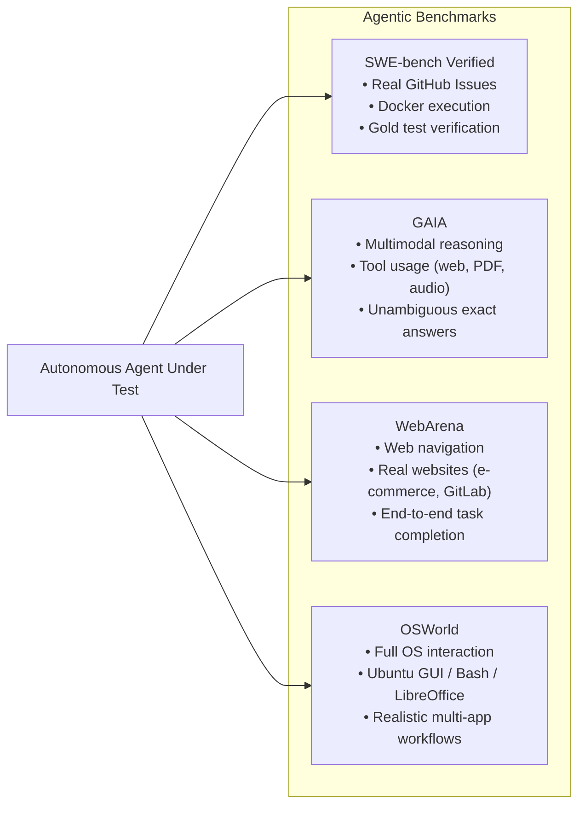
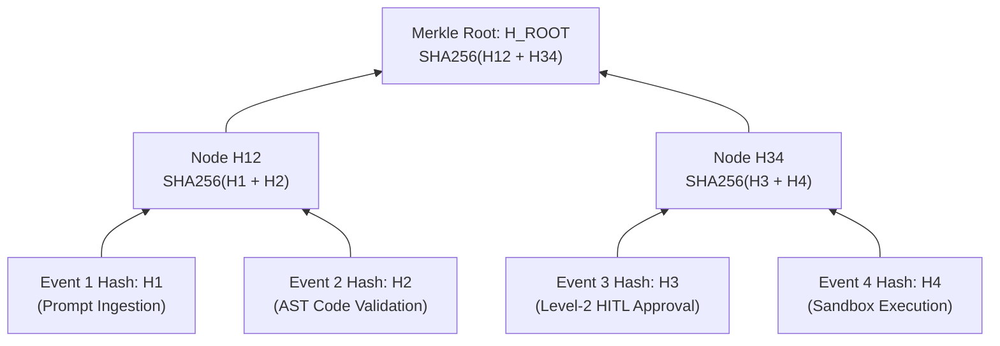
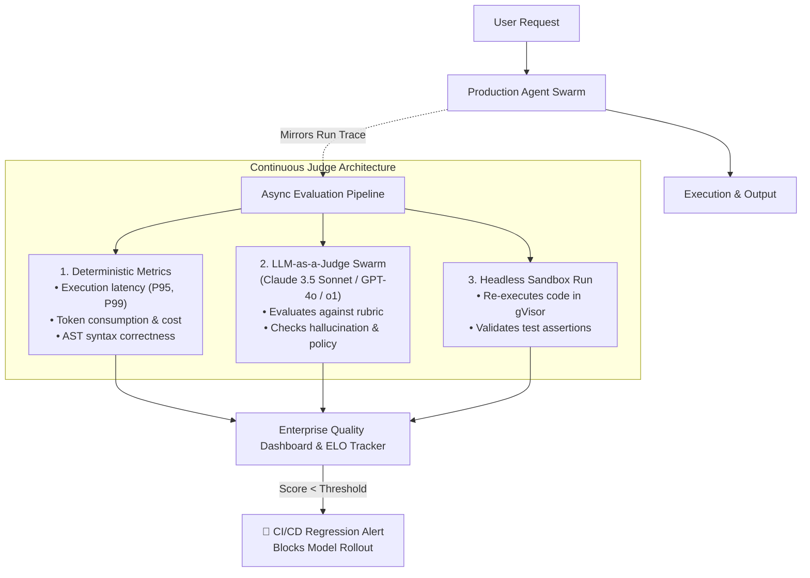

# Module 6: Governance, Security, Evaluation & Production Sandboxing
## Chapter 2: Evaluation Benchmarks, Dynamic ELO & Cryptographic Provenance

> *"If you cannot measure an agentic system against verifiable ground-truth environments, you are merely deploying unconstrained stochastic processes into production. Modern evaluation requires moving beyond static multiple-choice QA benchmarks (MMLU) toward interactive, multi-modal, environment-based execution suites and cryptographically verifiable audit trails."*

---

## 1. The Paradigm Shift in AI Evaluation

Traditional LLM evaluations (such as MMLU, GSM8K, and HumanEval) suffered from severe data contamination, memorization, and passive evaluation biases. An agent that memorizes a Python function snippet does not have the capacity to navigate a 500,000-line enterprise code repository, reproduce an ambiguous bug, run a Docker container, inspect stack traces, and submit a regression-free patch.

**Agentic Benchmarks** evaluate systems along four fundamental axes:
1. **Interactive Statefulness:** The agent must issue commands across tens or hundreds of turns, receiving feedback from intermediate terminal outputs or browser DOM changes.
2. **Multi-Modal Grounding:** Navigating realistic operating systems, web interfaces, and terminal sessions.
3. **Execution-Based Verification:** Evaluation is determined by whether the environment reaches a verified target state (e.g., unit tests pass, database records match, files exist), not by LLM string comparison.
4. **Tool Orchestration & Planning:** Complex tool chaining and dynamic recovery from runtime errors.

---

## 2. Frontier Agentic Benchmark Suites

### 2.1 SWE-bench & SWE-bench Verified
- **Origin & Purpose:** Developed by Princeton University; extracts real GitHub pull requests and issues from prominent Python repositories (Django, SymPy, scikit-learn, astropy, matplotlib).
- **Verification Mechanism:** The agent receives only the problem description (issue text). It must locate the relevant files, modify the codebase, and produce a git patch. The benchmark runs `git apply` inside an isolated Docker container and executes the repository's test suite:
  - **FAIL_TO_PASS:** Tests that failed before the fix and must now pass.
  - **PASS_TO_PASS:** Regression tests that passed before and must continue to pass.
- **SWE-bench Verified:** A human-validated subset of 500 tasks filtered by human software engineers to eliminate underspecified issues, impossible test environments, or flaky unit tests.
- **State-of-the-Art Progression (2024–2026):**
  - GPT-4 (Zero-Shot Baseline, early 2024): **~1.9% to 3.8%**
  - Claude 3.5 Sonnet + Custom Scaffolding (mid 2024): **~49.0%**
  - OpenAI o3 / Claude 3.7 Reasoning Agents (2025/2026): **>70% to 80%**

### 2.2 GAIA (General AI Assistants)
- **Design Philosophy:** Developed by Meta FAIR, Hugging Face, and AutoGPT; deliberately designed so that tasks are simple for human generalists (92% human success rate) but exceptionally difficult for frontier LLMs without robust tool integration and multi-step reasoning.
- **Key Characteristics:** 466 questions across three difficulty levels. Tasks require multi-modal handling (parsing Excel spreadsheets, extracting tables from scanned PDFs, executing audio transcriptions, and web search).
- **Ground Truth:** Each question has a single, unambiguous fact-based answer (e.g., an exact integer, string, or list of values), eliminating subjective judge grading.

### 2.3 WebArena & OSWorld
- **WebArena:** A dynamic, reproducible web environment featuring live, self-hosted instances of GitLab, Shopping (e-commerce), Reddit-like forums, and Wikipedia. Agents must execute end-to-end goals (e.g., *"Post a reply to the newest issue on the repository and assign it to Alice"*).
- **OSWorld:** A real operating system environment (Ubuntu Linux) where agents interact via GUI (mouse clicks, keyboard strokes) or terminal commands across desktop applications (LibreOffice, Chrome, VS Code, GIMP).

---

## 3. Dynamic Evaluation: The Bradley-Terry ELO Rating Engine

For subjective tasks or open-ended multi-agent debates where no binary unit test exists, systems utilize crowdsourced or automated pairwise comparisons modeled after the **Bradley-Terry (BT) probability model** (popularized by LMSYS Chatbot Arena).

### 3.1 Mathematical Formulation
Given two models or agent configurations $M_i$ and $M_j$ with latent skill ratings $R_i$ and $R_j$, the probability that $M_i$ defeats $M_j$ in a head-to-head match is modeled as:

$$P(M_i > M_j) = \frac{1}{1 + 10^{(R_j - R_i) / 400}} = \frac{e^{R_i / \xi}}{e^{R_i / \xi} + e^{R_j / \xi}}$$

where $\xi = \frac{400}{\ln(10)} \approx 173.7$.

### 3.2 Maximum Likelihood Estimation (MLE)
Given a dataset of $N$ pairwise match outcomes $D = \{(i_k, j_k, y_k)\}_{k=1}^N$ where $y_k \in \{1, 0, 0.5\}$ (win, loss, tie), the optimal ratings $\mathbf{R} = [R_1, R_2, \dots, R_K]$ are estimated by minimizing the negative log-likelihood:

$$\mathcal{L}(\mathbf{R}) = - \sum_{k=1}^N \left[ y_k \ln P(M_{i_k} > M_{j_k}) + (1 - y_k) \ln P(M_{j_k} > M_{i_k}) \right]$$

Using L-BFGS or logistic regression solvers with a reference anchor (e.g., setting baseline model rating $R_{\text{baseline}} = 1000$), dynamic ELO scores and 95% bootstrap confidence intervals are computed.

---

## 4. Cryptographic Provenance & Tamper-Proof Auditability

In regulated industries (banking, healthcare, defense, aviation) governed by compliance frameworks such as **EU AI Act, SOC 2 Type II, ISO/IEC 42001, and HIPAA**, enterprises cannot treat autonomous agent actions as black boxes. Every tool invocation, planning state, and human approval must be cryptographically anchored.

### 4.1 Merkle Tree State Provenance
During an agent's execution lifecycle, every intermediate action $A_t$ produces an immutable event record:

$$E_t = \text{Timestamp} \parallel \text{AgentID} \parallel \text{StateHash}_{t-1} \parallel \text{ToolCall} \parallel \text{ToolResult}$$

Each event is hashed using SHA-256:

$$H_t = \text{SHA256}(E_t)$$

The sequence of events is rolled up into a **Merkle Tree**:

### 4.2 Benefits of Merkle Root Provenance
1. **Tamper Evidence:** If an adversary or insider alters a single log entry (e.g., deleting a record of an unauthorized database query), the resulting Merkle Root changes, immediately invalidating the cryptographic audit trail.
2. **Efficient Zero-Knowledge / Third-Party Audits:** An enterprise can prove to an external auditor that a specific security check or human approval occurred without exposing proprietary intellectual property or PII, simply by providing a Merkle inclusion proof.
3. **Legal Non-Repudiation:** When signed by an HSM (Hardware Security Module) private key or cloud KMS (AWS KMS, Google Cloud Cloud KMS, Azure Key Vault), agent execution traces become legally binding forensic evidence.

---

## 5. Enterprise Continuous Evaluation Pipeline (LLM-as-a-Judge)

In production multi-agent systems, continuous evaluation runs asynchronously alongside live traffic:

---

## 6. Key Takeaways & Operational Checklists

| Evaluation Dimension | Traditional LLMs | Autonomous Agent Swarms |
| :--- | :--- | :--- |
| **Primary Metric** | Perplexity, Next-Token Accuracy, MMLU | Task Completion Rate, Environment State Verification |
| **Execution Environment** | Static text prompt | Sandboxed OS / Browser / Terminal Docker containers |
| **Cost of Failure** | User sees incorrect paragraph | System drops table, creates rogue VM, breaches IAM |
| **Compliance Requirement** | Basic prompt log | Cryptographic Merkle provenance and signed execution traces |
| **Feedback Mechanism** | Human feedback (RLHF) | Unit tests, compiler errors, tool return codes, and verbal Reflexion |
