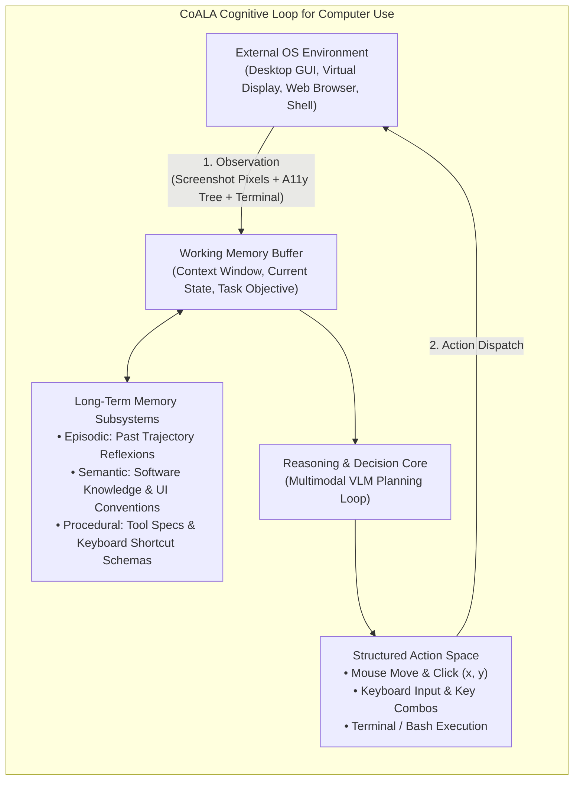
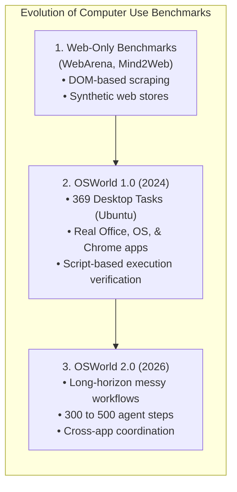
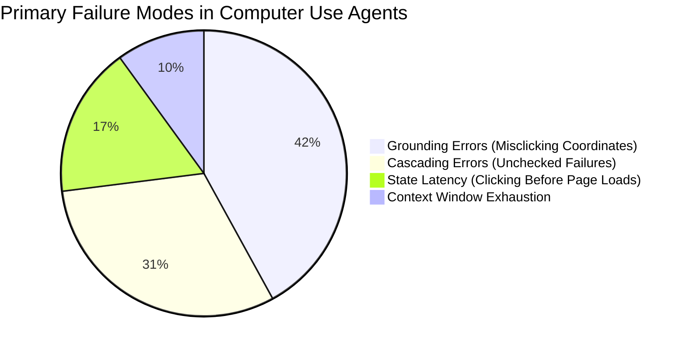

# Module 7: Computer Use & Autonomous OS Agents
## Chapter 1: Theoretical Foundations, Cognitive Architectures & Benchmarks

> *"A general-purpose agent cannot rely on clean APIs alone. In the real world, human software is visual, stateful, and interactive. An agent must perceive pixel states and manipulate operating systems as an embodied digital worker."*

---

## 1. Theoretical Foundations: Cognitive Architecture of Computer-Using Agents (CUAs)

Autonomous computer use represents the transition from **disembodied conversational AI** to **embodied digital agency**. 

### 1.1 The CoALA Framework (Cognitive Architectures for Language Agents)
Proposed by Sumers, Yao, Narasimhan, and Griffiths (Princeton / NeurIPS), the **CoALA framework** provides the formal theoretical model for language agents interacting with digital environments:

Under CoALA, a Computer-Using Agent is governed by four core subsystems:
1. **The Action Space:** A dual interface consisting of continuous/discrete physical manipulation (mouse coordinates, keystrokes) and discrete textual commands (bash scripts).
2. **Modular Memory:**
   * **Working Memory:** Maintains the immediate visual frame and task goal.
   * **Episodic Memory:** Stores previous trajectory failures and *Reflexion* critiques so the agent doesn't repeat circular loops.
   * **Procedural Memory:** The code schemas and API signatures for operating OS tools (e.g., Anthropic `computer` tool, MCP specifications).
   * **Semantic Memory:** World knowledge about user interfaces (e.g., that an 'X' at top right closes a window, that blue underlined text is a hyperlink).
3. **The Decision-Making Cycle:** An iterative **Observe $\rightarrow$ Reason $\rightarrow$ Act $\rightarrow$ Verify** loop.

---

### 1.2 Russell & Norvig Environment Taxonomy for Operating Systems
In Stuart Russell and Peter Norvig's foundational *Artificial Intelligence: A Modern Approach (4th Ed.)*, computer operating systems represent the most challenging class of agent environments:

| Environment Property | Operating System Reality | Challenge for AI Agents |
|:--- |:--- |:--- |
| **Observability** | **Partially Observable** | The agent only sees what is currently on the screen. Background processes, hidden windows, and network buffers are invisible. |
| **Determinism** | **Stochastic** | Popups, network latency, system dialogs, and OS updates introduce non-deterministic state changes. |
| **Episodic vs. Sequential** | **Sequential** | Every click permanently alters system state (e.g. deleting a file or submitting a form). Early errors cascade over time. |
| **Static vs. Dynamic** | **Dynamic** | The environment changes while the agent is "thinking" (spinners finish loading, notifications arrive, timers expire). |
| **Discrete vs. Continuous** | **Hybrid** | Mouse movements and pixel coordinates are continuous; keypresses, bash commands, and buttons are discrete. |

---

## 2. The Benchmark Landscape: Evaluating Computer Use

Measuring an agent's ability to operate a computer requires execution-driven, real-world benchmarks rather than static multiple-choice questions.

### 2.1 OSWorld (The Gold Standard Benchmark)
Developed by the XLANG Lab (University of Hong Kong / NeurIPS), **OSWorld** is the primary industry standard for testing multimodal agents in real operating systems (Ubuntu, Windows, macOS).

* **Architecture:** Deploys a full virtualized OS inside Docker/QEMU with real applications (VS Code, LibreOffice Calc/Writer, Chrome, GIMP, VLC, Thunderbird, OS settings).
* **Execution-Based Scoring:** Instead of checking LLM text, OSWorld executes verification scripts directly in the OS after the agent finishes (e.g., checking if cell B12 in a spreadsheet has the correct calculated average, or if an email attachment was actually saved to `/home/user/Downloads`).
* **The Benchmark Results (Human vs. AI Gap):**

| Evaluator / Model | OSWorld 1.0 Success Rate | OSWorld 2.0 (Long-Horizon) | Notes |
|:--- |:---:|:---:|:--- |
| **Human Expert Baseline** | **72.4%** | **68.2%** | Humans easily recover from errors and visual quirks. |
| **Claude 3.5 Sonnet (Computer Use)** | **22.0% – 28.5%** | **12.4%** | First frontier model with native pixel coordinate output. |
| **GPT-4o + OmniParser** | **18.9% – 24.1%** | **9.8%** | Requires external parsing to detect interactive bounding boxes. |
| **OpenAI Operator (2025/2026)** | **38.2%** | **21.5%** | Frontier computer-using agent trained on task trajectories. |

---

### 2.2 ScreenSpot & WindowsAgentArena
* **ScreenSpot (SeeClick):** Evaluates fine-grained **visual grounding** across 1,200+ interfaces (Mobile, Web, Desktop). It measures whether an agent can output the exact $(X, Y)$ coordinate of an element when instructed (e.g. *"Click the filter icon"*).
* **WindowsAgentArena (Microsoft):** Evaluates agentic interaction across native Windows applications (PowerPoint, Excel, Notepad, File Explorer, System Settings) within Azure VMs.

---

## 3. The 3 Primary Failure Modes of Computer Use Agents

Empirical analysis across thousands of benchmark trials reveals why computer-using agents fail:

1. **Grounding Errors (Coordinate Drift):** The model understands *what* to click, but predicts $(X: 420, Y: 680)$ instead of $(X: 420, Y: 710)$, clicking 30 pixels below the button.
2. **Cascading Failure Loops:** The agent clicks a button, nothing happens (or a popup blocks it), but the agent assumes it succeeded and blindly executes the next 5 steps.
3. **Temporal Race Conditions (Latency):** The agent clicks a dropdown and immediately takes a screenshot before the dropdown animation completes, perceiving an empty screen and getting confused.

---

## 4. Key Takeaway for Project ACINONYX (MAS)

In MAS-Core, we do not build a naive open loop. We must implement:
1. **Deterministic Verification Gates:** Take a screenshot *before* and *after* each action to confirm state change.
2. **Coordinate Normalization:** Automatically map model vision coordinate spaces (e.g. $1024 \times 768$) to actual display resolutions ($1920 \times 1080$).
3. **Reflexion Error Trapping:** If an action fails twice, trigger our `EpisodicMemory` to inject a contrarian review and back out of the loop.
