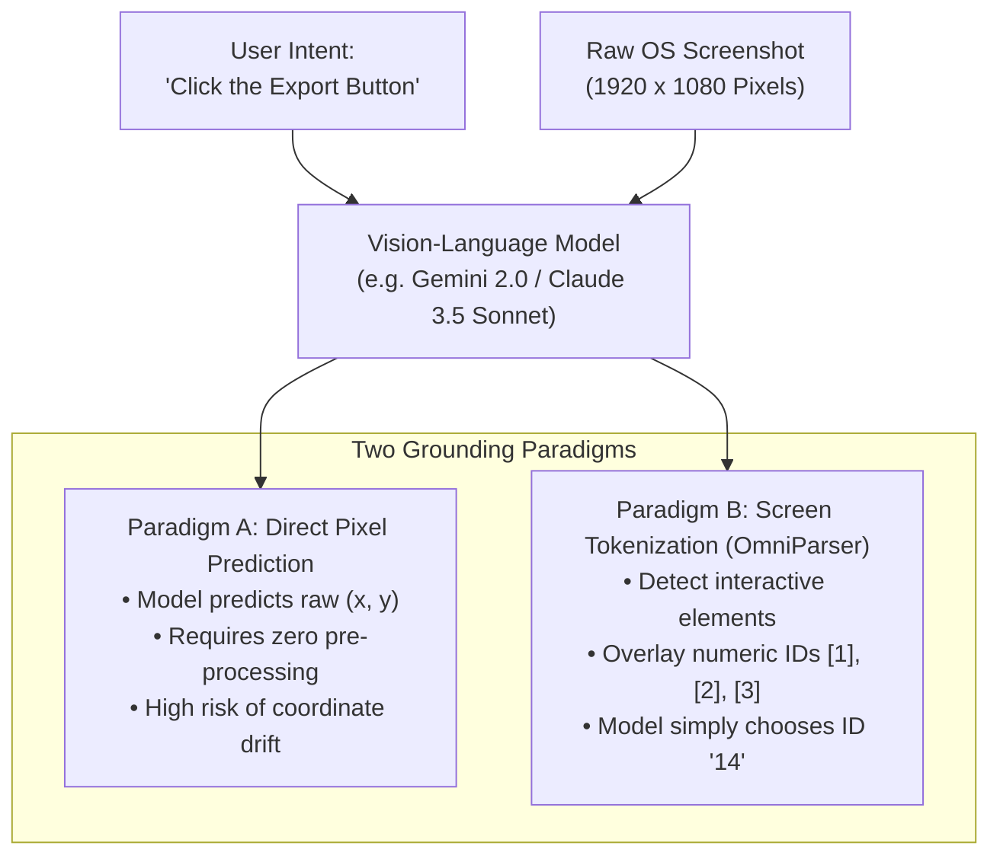
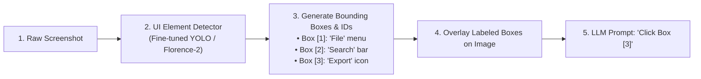
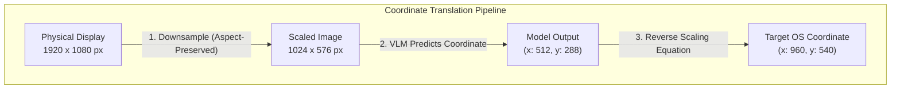

# Module 7: Computer Use & Autonomous OS Agents
## Chapter 2: GUI Grounding, Visual Perception & Action Spaces

> *"To operate a graphical interface, an artificial intelligence must bridge continuous optical pixel space and discrete symbolic intent. This bridge is called GUI Grounding."*

---

## 1. The Core Engineering Challenge: GUI Grounding

**GUI Grounding** is the capability of a Vision-Language Model (VLM) to translate a high-level natural language instruction (e.g. *"Click the 'Export to CSV' button in the top right"*) into exact, executable screen coordinates:

$$(x, y) \in [0, W_{\text{display}}] \times [0, H_{\text{display}}]$$



---

## 2. Paradigm Comparison: Direct Coordinates vs. Screen Parsing

### 2.1 Paradigm A: Native Coordinate Prediction (Anthropic Computer Use Style)
In this approach, the vision model is trained end-to-end to output pixel coordinates directly within a tool call:

```json
{
  "name": "computer",
  "input": {
    "action": "left_click",
    "coordinate": [1420, 85]
  }
}
```

* **Advantage:** Fast, zero-overhead, operates on any arbitrary visual application (games, video players, custom enterprise software).
* **Limitation:** Small buttons (e.g. $12 \times 12$ pixel icons) have high miss rates due to spatial token discretization inside vision transformers (ViT patches are typically $14 \times 14$ or $16 \times 16$ pixels).

---

### 2.2 Paradigm B: Microsoft OmniParser (Set-of-Mark Tokenization)
Developed by Microsoft Research, **OmniParser** solves the coordinate drift problem by converting raw screens into structured, machine-interpretable data before the model reasons:



1. **Step 1 (Icon & Widget Detection):** A specialized object detection model scans the screen and locates all interactive elements (buttons, text fields, checkboxes).
2. **Step 2 (Local Captioning):** A small vision model generates semantic descriptions for icons that lack text (e.g. identifying a floppy disk icon as *"Save"*).
3. **Step 3 (Set-of-Mark Overlay):** Bounding boxes with high-contrast colored numeric tags are drawn over the screenshot.
4. **Step 4 (Discrete Selection):** Instead of calculating floating-point $(X, Y)$ math, the model simply outputs: `"Click element [14]"`. The parser automatically clicks the center of bounding box 14.

* **Benchmark Impact:** On benchmarks like *ScreenSpot*, OmniParser boosted standard GPT-4o success rates from **18.9% to over 39.5%**.

---

## 3. The Industrial Standard: Anthropic Computer Use API Specification

Anthropic's `computer_20241022` and `computer_20251124` tool schemas established the canonical action vocabulary used across the industry.

### 3.1 The Complete Action Space Matrix

| Action Name | Parameters | Description |
|:--- |:--- |:--- |
| `screenshot` | *(None)* | Captures the current display state as a base64 image. |
| `mouse_move` | `coordinate: [x, y]` | Moves the cursor to target coordinates without clicking. |
| `left_click` | `coordinate: [x, y]` *(optional)* | Moves to $(X, Y)$ (or clicks current position) with left button. |
| `right_click` | `coordinate: [x, y]` *(optional)* | Opens context menus. |
| `double_click` | `coordinate: [x, y]` *(optional)* | Opens files, selects words. |
| `triple_click` | `coordinate: [x, y]` *(optional)* | Selects entire text lines or paragraphs. |
| `middle_click` | `coordinate: [x, y]` *(optional)* | Opens tabs in background. |
| `left_click_drag` | `coordinate: [x, y]` *(destination)* | Drags from current cursor position to destination $(X, Y)$. |
| `cursor_position` | *(None)* | Returns current $(X, Y)$ coordinates of the pointer. |
| `type` | `text: "string"` | Types a string of characters sequentially into active focus. |
| `key` | `text: "string"` | Triggers single keypresses or combinations (e.g. `ctrl+c`, `Return`, `BackSpace`, `Alt+Tab`). |

---

### 3.2 Coordinate Scaling Mathematics
Vision models cannot process raw $4\text{K}$ or $1440\text{p}$ images without hitting extreme token limits. Therefore, images are scaled down (typically to a maximum dimension of $1024$ or $1280$ pixels) before model ingestion.

When the model outputs coordinates in downsampled space, the runtime must translate them back to physical OS display pixels:



#### The Exact Scaling Formula:

$$S_x = \frac{W_{\text{physical}}}{W_{\text{scaled}}}, \quad S_y = \frac{H_{\text{physical}}}{H_{\text{scaled}}}$$

$$X_{\text{target}} = \text{round}(X_{\text{model}} \times S_x)$$

$$Y_{\text{target}} = \text{round}(Y_{\text{model}} \times S_y)$$

* **Boundary Safety:** The runtime must clamp coordinates within $[0, W_{\text{physical}} - 1]$ and $[0, H_{\text{physical}} - 1]$ to prevent cursor out-of-bounds exceptions.

---

## 4. Token FinOps & Image Downsampling Strategy

Feeding uncompressed desktop screenshots into multimodal LLMs can bankrupt a project within hours if unmanaged.

| Resolution | Tokens per Frame (Approx) | Cost per 100 Actions (Claude 3.5 Sonnet / Gemini 1.5 Pro) | Recommendation |
|:--- |:---:|:---:|:--- |
| **$3840 \times 2160$ ($4\text{K}$ Raw)** | $\sim 6,400$ tokens | \$1.92 per step $\rightarrow$ **\$192.00** | ❌ **PROHIBITED** |
| **$1920 \times 1080$ ($1080\text{p}$ Native)** | $\sim 1,600$ tokens | \$0.48 per step $\rightarrow$ **\$48.00** | ⚠️ Expensive |
| **$1024 \times 768$ (Normalized)** | $\sim 800$ tokens | \$0.24 per step $\rightarrow$ **\$24.00** | ✅ **Standard Baseline** |
| **$1024 \times 768$ (WebP Quality 75)** | $\sim 800$ tokens | \$0.24 per step (Lower network transfer) | 🚀 **Production Best Practice** |

---

## 5. Architectural Invariants for MAS-Core

When implementing the Computer Use tool in `mas/tools/`:
1. **Never send unscaled native screenshots.** Always downsample to max width $1024\text{px}$.
2. **Enforce automatic coordinate scaling:** The model must never have to know about the host monitor's physical display scaling.
3. **Always pair action with state change verification:** An action without a follow-up screenshot is a blind action.
