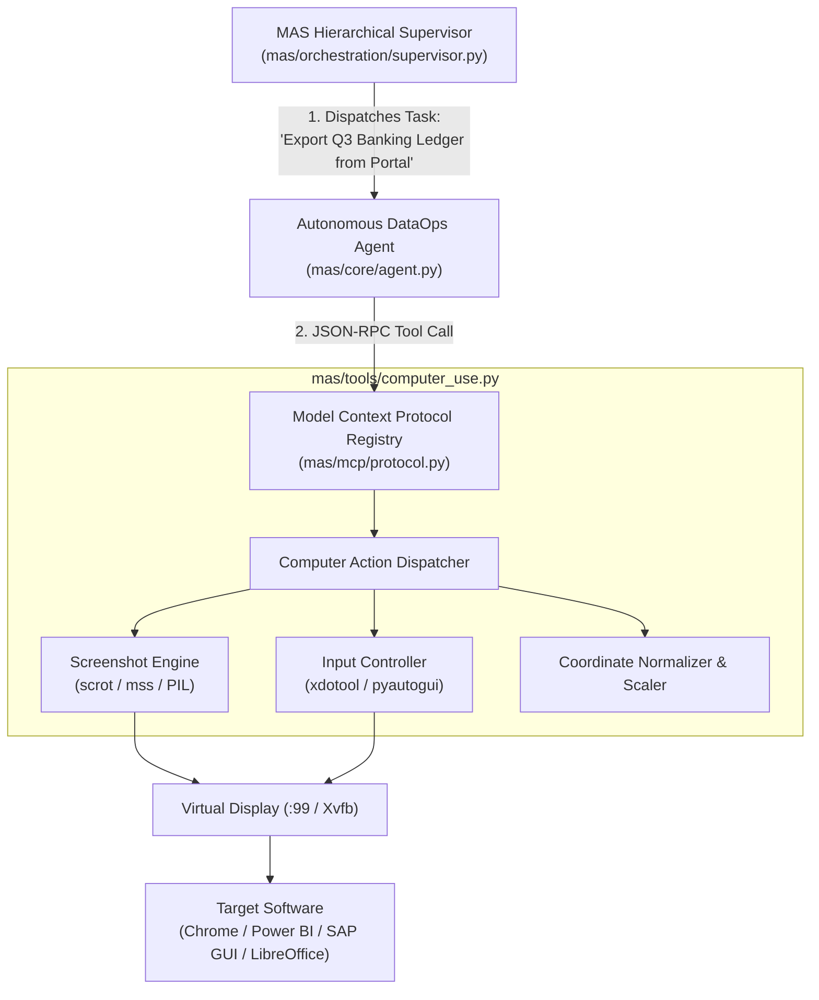

# Module 7: Computer Use & Autonomous OS Agents
## Chapter 4: MAS-Core Implementation Blueprint & DataOps Workflows

> *"The purpose of computer use in MAS-Core is not to play video games. It is to unlock legacy, un-API'd enterprise systems and execute end-to-end Work-as-a-Service workflows."*

---

## 1. Architectural Integration in MAS-Core

In MAS-Core, the Computer Use subsystem is implemented as a native **Model Context Protocol (MCP)** tool module within `mas/tools/`:



---

## 2. Concrete Python Tool Specification for MAS

Below is the production blueprint for `mas/tools/computer_use.py`, ready to register with `MCPRegistry`:

```python
"""
mas.tools.computer_use: Native Model Context Protocol (MCP) Computer Use Tool.
Provides screen perception, coordinate scaling, and mouse/keyboard dispatching.
"""

import os
import subprocess
import base64
from io import BytesIO
from typing import Dict, Any, List, Optional
from PIL import Image

class ComputerUseController:
    """
    Manages low-level virtual desktop input and screen capture.
    Works natively on Linux with X11 / Xvfb virtual displays.
    """
    def __init__(self, display: str = ":99", target_width: int = 1024):
        self.display = display
        self.target_width = target_width
        self.env = {**os.environ, "DISPLAY": self.display}

    def get_physical_resolution(self) -> tuple[int, int]:
        """Query physical screen resolution using xdotool / xrandr."""
        try:
            out = subprocess.check_output(["xdotool", "getdisplaygeometry"], env=self.env).decode()
            w, h = map(int, out.strip().split())
            return w, h
        except Exception:
            return 1920, 1080  # Default fallback

    def capture_screenshot(self) -> Dict[str, Any]:
        """Capture display, downsample for token efficiency, and return base64."""
        import mss
        with mss.mss(display=self.display) as sct:
            monitor = sct.monitors[1]
            sct_img = sct.grab(monitor)
            img = Image.frombytes("RGB", sct_img.size, sct_img.bgra, "raw", "BGRX")
            
            orig_w, orig_h = img.size
            scale_ratio = self.target_width / orig_w
            scaled_h = int(orig_h * scale_ratio)
            scaled_img = img.resize((self.target_width, scaled_h), Image.Resampling.LANCZOS)
            
            buf = BytesIO()
            scaled_img.save(buf, format="JPEG", quality=80)
            b64_data = base64.b64encode(buf.getvalue()).decode("utf-8")
            
            return {
                "base64_image": b64_data,
                "orig_dimensions": [orig_w, orig_h],
                "scaled_dimensions": [self.target_width, scaled_h],
                "scale_factor": scale_ratio
            }

    def click(self, x_model: int, y_model: int, button: str = "left", double: bool = False):
        """Scale model coordinates back to physical display and dispatch click."""
        orig_w, orig_h = self.get_physical_resolution()
        scale_ratio = self.target_width / orig_w
        
        real_x = int(x_model / scale_ratio)
        real_y = int(y_model / scale_ratio)
        
        btn_code = {"left": "1", "middle": "2", "right": "3"}.get(button, "1")
        repeat = ["--repeat", "2", "--delay", "50"] if double else []
        
        cmd = ["xdotool", "mousemove", str(real_x), str(real_y), "click"] + repeat + [btn_code]
        subprocess.run(cmd, env=self.env, check=True)

    def type_text(self, text: str):
        """Type text into the currently focused window."""
        subprocess.run(["xdotool", "type", "--delay", "12", text], env=self.env, check=True)

    def press_key(self, key_combo: str):
        """Send specific key combination (e.g. Return, ctrl+c, alt+Tab)."""
        subprocess.run(["xdotool", "key", key_combo], env=self.env, check=True)
```

---

## 3. High-Value Enterprise Use Case: The "API-less Data Ingestion Pod"

Here is how Mpho can deploy Computer Use commercially for South African enterprise clients (banks, retail, supply chains):

### The Scenario:
* A mid-sized logistics firm runs a legacy internal desktop ERP application with **no API**.
* Every morning, a human data clerk spends **2 hours** logging in, clicking through 4 menus, selecting date ranges, exporting CSVs, and saving them into a shared folder so Power BI can refresh.

### The Autonomous MAS Strike Pod Workflow:
1. **05:00 AM Trigger:** MAS wakes up in a headless Docker/Xvfb container.
2. **Step 1 (Perceive & Login):** Captures screenshot, identifies login form, types credentials, clicks *"Log In"*.
3. **Step 2 (Navigate Menus):** Identifies *"Reports $\rightarrow$ Inventory Ledger"*, selects yesterday's date filter, and clicks *"Export CSV"*.
4. **Step 3 (Verification Gate):** MAS inspects the download directory to confirm `ledger_20261005.csv` exists and has non-zero byte size.
5. **Step 4 (Data Ingestion & BigQuery Upload):** A Python subagent ingests the CSV, runs data quality checks (null counts, duplicate invoice IDs), and executes:
   ```bash
   bq load --source_format=CSV my_dataset.inventory_ledger ledger_20261005.csv
   ```
6. **Step 5 (Executive Delivery):** Power BI dataset refreshes automatically, and MAS posts an executive summary to Slack/Teams:
   > *"✅ Nightly inventory ledger extracted, validated against 14,200 rows, and loaded to BigQuery. Zero human intervention."*

* **The Economic Impact:** The client happily pays \$3,000/month to eliminate 40 hours of manual human data entry and eradicate human copy-paste errors.

---

## 4. Summary: The Path to Mastery in MAS

By integrating Computer Use with MAS-Core's existing SQL, memory, and debate engines:
* Your agents can operate **both** modern APIs (BigQuery, REST) and legacy GUIs (Power BI Desktop, SAP, portal downloads).
* You bridge the gap between abstract AI prototypes and gritty, messy enterprise realities.
