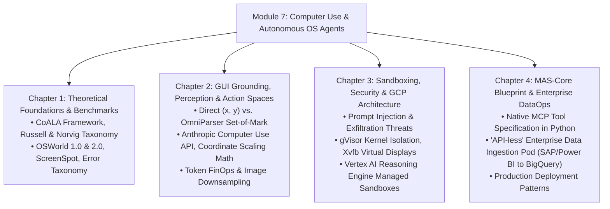

# Module 7: Computer Use & Autonomous OS Agents
## Master Research Compendium & Architectural Curriculum

> *"The ultimate frontier of software agency is not generating text; it is the autonomous operation of human operating systems, graphical applications, and un-API'd legacy infrastructure."*

---

## 🏛️ Module Overview

This module provides an exhaustive, production-grade research dossier on **Computer-Using Agents (CUAs)**, GUI visual grounding, sandboxing architectures, and enterprise Work-as-a-Service applications for **Project ACINONYX (MAS-Core)**.

---

## 📚 Deep Links to Chapters

1. **[Chapter 1: Theoretical Foundations, Cognitive Architectures & Benchmarks](01_theoretical_foundations_and_benchmarks.md)**
   * Formalizing CUAs under the **CoALA framework** (Sumers et al.).
   * The **OSWorld 1.0 vs. 2.0** benchmark breakdown (why human experts achieve 72% while early AI achieved <30%).
   * Analysis of failure modes: grounding drift, cascading errors, and temporal race conditions.

2. **[Chapter 2: GUI Grounding, Visual Perception & Action Spaces](02_gui_grounding_perception_and_action_spaces.md)**
   * The visual grounding gap and Set-of-Mark (SoM) prompting.
   * **Microsoft OmniParser** vs. **SeeClick**: how bounding box tokenization doubles VLM accuracy.
   * Canonical action schemas: `mouse_move`, `left_click`, `left_click_drag`, `type`, `key`, `screenshot`.
   * The exact coordinate scaling equations mapping downsampled model space to physical displays.

3. **[Chapter 3: Sandboxing, Adversarial Threats & Google Cloud Architecture](03_sandboxing_security_and_gcp_cloud_workstations.md)**
   * Threat vectors: Indirect prompt injection through web/email, rogue popups, credential exfiltration.
   * **gVisor user-space kernel isolation** vs. standard container virtualization.
   * Headless execution using **Xvfb virtual framebuffers** on `:99`.
   * Google Cloud Vertex AI Reasoning Engine Computer Use sandbox architecture, VPC Service Controls, and CMEK.

4. **[Chapter 4: MAS-Core Implementation Blueprint & DataOps Workflows](04_mas_implementation_blueprint.md)**
   * Complete, copy-paste production Python blueprint for `mas/tools/computer_use.py`.
   * Native Model Context Protocol (MCP) tool bindings over JSON-RPC 2.0.
   * High-value commercial use case: **The API-less Data Ingestion Pod** (extracting data from legacy desktop ERPs/portals into Google BigQuery).

---

## 📖 Key Academic Papers, Books & Authoritative Documentation

### 1. Seminal Textbooks
* **Stuart Russell & Peter Norvig** — *Artificial Intelligence: A Modern Approach (4th Edition)*, Chapter 2: "Intelligent Agents" (PEAS framework, Partially Observable Stochastic Continuous Environments).
* **Richard S. Sutton & Andrew G. Barto** — *Reinforcement Learning: An Introduction (2nd Edition)*, Chapter 3: "Finite Markov Decision Processes" (State-Action-Reward formulation for continuous GUI control).

### 2. Seminal Research Papers
* **Sumers et al. (Princeton / DeepMind, 2023)** — [*Cognitive Architectures for Language Agents (CoALA)*](https://arxiv.org/abs/2309.02427). The definitive model for memory, action spaces, and decision-making in language agents.
* **Xie et al. (XLANG Lab, HKU / NeurIPS, 2024)** — [*OSWorld: Benchmarking Multimodal Agents on Open-Ended Desktop Tasks*](https://arxiv.org/abs/2404.07972). The gold standard OS benchmark.
* **Lu et al. (Microsoft Research, 2024)** — [*OmniParser: A Screen Parsing Model for Pure Vision Based GUI Agents*](https://arxiv.org/abs/2411.07727). Tokenizing interfaces with bounding boxes and icon captions.
* **Cheng et al. (2024)** — [*SeeClick: Harnessing GUI Grounding for Advanced Visual Agents*](https://arxiv.org/abs/2401.10935). Pre-training VLMs on screen spot datasets.
* **Yang et al. (2024)** — [*Cradle: Empowering Foundation Agents towards General Computer Control*](https://arxiv.org/abs/2403.03186). General computer control for complex applications and open-world games.
* **Zhou et al. (Carnegie Mellon, 2023)** — [*WebArena: A Realistic Web Environment for Building Autonomous Agents*](https://arxiv.org/abs/2307.13854). End-to-end web interaction benchmark.

### 3. Industry Documentation
* **Google Cloud Architecture Center** — [*Vertex AI Reasoning Engine: Computer Use Sandbox Documentation*](https://cloud.google.com/vertex-ai/generative-ai/docs/reasoning-engine/overview) & [*GKE Agent Sandbox with gVisor*](https://gvisor.dev/).
* **Anthropic Engineering** — [*Developing with Claude Computer Use API (Beta)*](https://docs.anthropic.com/en/docs/build-with-claude/computer-use).
* **Microsoft WindowsAgentArena** — [*Windows OS Benchmarking Framework on Azure*](https://github.com/microsoft/WindowsAgentArena).
