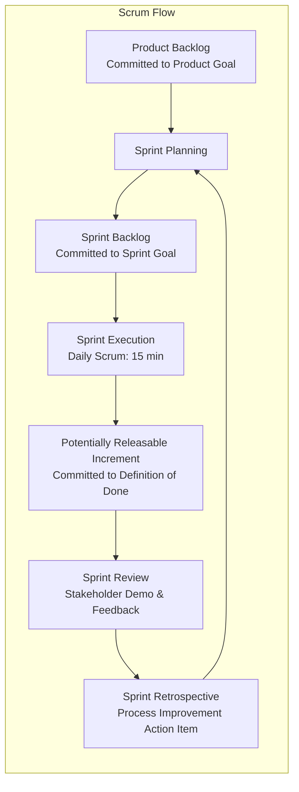

# Agile & Scrum Foundations: Empirical Process Control & Operational Rigor

> **Acinonyx Enterprise Systems Research Directorate**  
> **Compendium Series:** Agile, Kanban & Lean Frameworks  
> **Module Code:** `RES-AGILE-2026-CH01`  
> **Core Focus:** The Agile Manifesto, Empirical Process Control, The Scrum Guide (2020), Backlog Engineering, and Anti-Patterns

---

## 1. The Historical Genesis & Philosophy

In February 2001, seventeen software luminaries (including Kent Beck, Martin Fowler, Ken Schwaber, Jeff Sutherland, Ward Cunningham, and Alistair Cockburn) gathered at the Snowbird ski resort in Utah. Frustrated by the pervasive failure of heavyweight, document-driven "Waterfall" processes and military-style CMMI specifications that treated software like civil construction, they authored **The Manifesto for Agile Software Development**.

```
                THE 4 VALUES OF THE AGILE MANIFESTO
  ┌────────────────────────────────────────────────────────┐
  │  Individuals and interactions  OVER  Processes and tools│
  │  Working software              OVER  Comprehensive doc │
  │  Customer collaboration        OVER  Contract neg.    │
  │  Responding to change          OVER  Following a plan  │
  └────────────────────────────────────────────────────────┘
  While there is value in the items on the right, we value 
                 the items on the left more.
```

### Empirical Process Control vs. Defined Process Control
The philosophical foundation of Agile is the distinction between:
- **Defined Process Control (The Manufacturing Fallacy):** Assumes an industrial process can be fully modeled, specified upfront, and executed deterministically with zero deviations (e.g., assembling an automobile on an assembly line).
- **Empirical Process Control (The Software Reality):** Acknowledges that software engineering is an exercise in complex, nonlinear discovery under incomplete information. It requires three pillars:
  1. **Transparency:** System state, code quality, and backlog items must be openly visible to all participants.
  2. **Inspection:** Frequent, automated, and human inspection of artifacts to detect unacceptable deviations.
  3. **Adaptation:** The immediate adjustment of the process or product when inspection reveals variances.

---

## 2. The Scrum Framework (Scrum Guide 2020 Standard)

Scrum is an iterative framework designed for small, cross-functional teams ($\le 10$ people) solving complex adaptive problems.



### 2.1 The Three Accountabilities (Roles)
1. **The Product Owner (PO):** Accountable for maximizing the business value of the product resulting from the work of the Scrum Team. Owns, clarifies, and orders the Product Backlog.
2. **The Scrum Master (SM):** Accountable for establishing Scrum according to the Scrum Guide and for the team’s effectiveness. Acts as a servant-leader, coach, and organizational impediment remover—**not a project manager or taskmaster**.
3. **The Developers:** Accountable for creating a plan for the Sprint (Sprint Backlog), instilling quality by adhering to a Definition of Done, adapting their plan each day toward the Sprint Goal, and holding each other accountable as professionals.

### 2.2 The Five Events (Ceremonies)
- **The Sprint (The Container):** A fixed-length event of 1 month or less (typically 2 weeks) to create consistency. A new Sprint starts immediately after the conclusion of the previous Sprint.
- **Sprint Planning (Max 8 hrs for 1-month sprint; 2–4 hrs for 2-week sprint):**
  - *Topic 1: Why is this Sprint valuable?* (Crafting the Sprint Goal).
  - *Topic 2: What can be done in this Sprint?* (Selecting Product Backlog items).
  - *Topic 3: How will the chosen work get done?* (Decomposing items into technical tasks).
- **Daily Scrum (15 minutes):** A daily inspection meeting for the Developers to inspect progress toward the Sprint Goal and adapt the Sprint Backlog as necessary.
- **Sprint Review (Max 4 hrs for 1-month; 1–2 hrs for 2-week):** The Scrum Team presents the results of their work to key stakeholders, evaluating what was accomplished against the Sprint Goal and adapting the Product Backlog.
- **Sprint Retrospective (Max 3 hrs for 1-month; 1–1.5 hrs for 2-week):** The team inspects how the last Sprint went with regards to individuals, interactions, processes, tools, and their Definition of Done, identifying at least one actionable improvement for the next sprint.

### 2.3 The Three Artifacts & Their Commitments
Scrum binds each artifact to a non-negotiable formal commitment:

| Scrum Artifact | Definition & Nature | Explicit Commitment |
|---|---|---|
| **Product Backlog** | An emergent, ordered list of what is needed to improve the product. The single source of work. | **The Product Goal:** Describes a future state of the product which can serve as a target for the Scrum Team to plan against. |
| **Sprint Backlog** | The set of Product Backlog items selected for the Sprint, plus a plan for delivering the Increment. | **The Sprint Goal:** The single, overarching objective for the Sprint that provides focus and coherence. |
| **The Increment** | A concrete stepping stone toward the Product Goal. Must be usable and tested. | **The Definition of Done (DoD):** A formal description of the state of the Increment when it meets the quality measures required for the product. |

---

## 3. Backlog Engineering & User Stories

### 3.1 The Anatomy of a User Story
User stories are not detailed specifications; they are **placeholders for future conversation**.

* **The Canonical Template (Mike Cohn):**
  $$\text{As a } [\text{type of user}], \text{ I want } [\text{capability}], \text{ so that } [\text{business benefit}].$$
* **Ron Jeffries’ 3 C's:**
  1. **Card:** The physical index card or Jira ticket capturing the essence of the requirement.
  2. **Conversation:** The verbal and collaborative dialogue between the developers, product owner, and users to negotiate details.
  3. **Confirmation:** The acceptance tests (acceptance criteria) that prove the story operates correctly.

### 3.2 The INVEST Criteria (Bill Wake)
To ensure stories can be planned and executed within a single sprint, every story must be evaluated against **INVEST**:

```
I - Independent   │ Minimized dependencies; can be developed in any sequence.
N - Negotiable    │ Not an ironclad contract; details are negotiated.
V - Valuable      │ Delivers measurable value to an end-user or business stakeholder.
E - Estimable     │ Understandable enough to size relative complexity.
S - Small         │ Sized to fit comfortably within a fraction of a single sprint.
T - Testable      │ Clear, unambiguous acceptance criteria (Given-When-Then).
```

### 3.3 Definition of Ready (DoR) vs. Definition of Done (DoD)
- **Definition of Ready (DoR):** The entry gate. A backlog item is ready for sprint planning if dependencies are identified, wireframes/schemas are drafted, and acceptance criteria are clear.
- **Definition of Done (DoD):** The exit gate. A story is done only when it is code-complete, unit-tested, peer-reviewed, merged to trunk, passes automated CI/CD scans, and is deployed to a staging/production environment.

---

## 4. Estimation fallacies & Velocity Dysfunction

### 4.1 Planning Poker & Relative Sizing
Instead of estimating in calendar hours (which suffer from developer optimism bias and varying skill levels), Agile introduced **Story Points** using the modified Fibonacci sequence ($1, 2, 3, 5, 8, 13, 21$):
- Story points quantify **relative complexity, uncertainty, and effort** rather than raw time.
- A 5-point story is roughly $2.5\times$ more complex than a 2-point story.

### 4.2 Goodhart’s Law & Velocity as a Weapon
$$\text{"When a measure becomes a target, it ceases to be a good measure."} \quad — \text{Goodhart's Law}$$

* **The Anti-Pattern:** Management compares the "Velocity" (story points completed per sprint) of Team A (45 points) against Team B (25 points), or demands velocity increase by 10% every quarter.
* **The Inevitable Consequence:** **Story Point Inflation.** Team B simply re-estimates 2-point stories as 5-point stories to satisfy management metrics without delivering a single extra line of real value.
* **Modern Best Practice:** Velocity is a localized planning calibration tool for an individual team, never an organizational KPI or cross-team evaluation metric.

---

## 5. Classic Agile Anti-Patterns

| Anti-Pattern | Operational Manifestation | Root Cause | Concrete Antidote |
|---|---|---|---|
| **"Water-Scrum-Fall"** | Sprints are used for coding, but requirements take 3 months upfront, and QA takes 6 weeks of manual "hardening sprints" at the end. | Lack of CI/CD automation; organizational distrust; siloed QA/Ops departments. | Embed QA directly into the dev squad; mandate automated unit/integration tests in CI; deploy an Increment every sprint. |
| **The "Feature Factory"** | The team celebrates high sprint velocity and tickets closed, but customer churn increases and business KPIs remain flat. | Output-oriented culture rather than outcome-oriented value stream mapping. | Align sprint goals with business outcomes (e.g., "reduce checkout drop-off by 5%") rather than ticket counts. |
| **Scrum Master as Secretary** | The Scrum Master spends their entire day updating Jira statuses, booking calendar meetings, and taking notes. | Misunderstanding of the Scrum Master accountability. | Coach the team on self-organization; Scrum Master must focus on architectural and organizational impediment removal. |
| **Zombie Scrum** | Daily standups are mechanical status reports ("Yesterday I worked on ticket 101, today ticket 102"); zero customer interaction. | Lack of psychological safety; disconnect from real users. | Focus the Daily Scrum exclusively on: *"What is blocking us from achieving the Sprint Goal today?"* |

---

*Authored by Project ACINONYX Research Directorate.*
