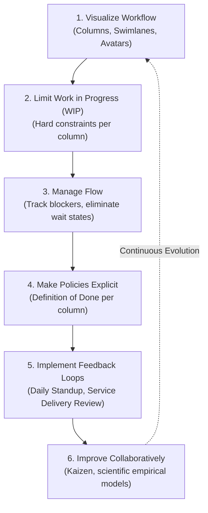
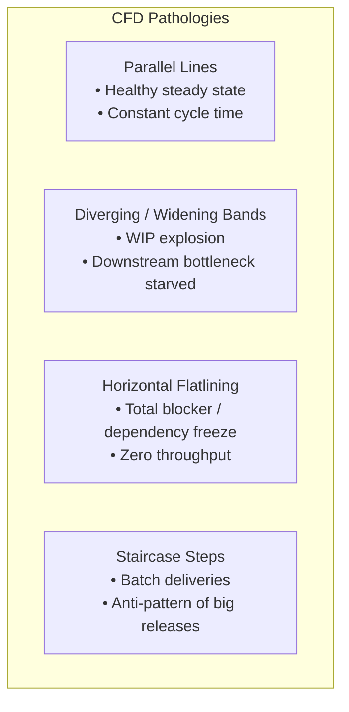
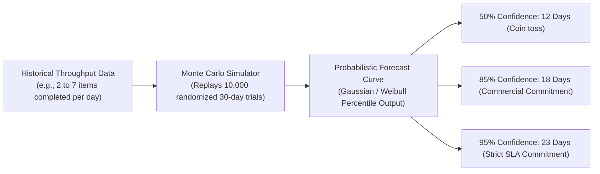

# Kanban & Flow Systems: The Mathematics of Lean Knowledge Work

> **Acinonyx Enterprise Systems Research Directorate**  
> **Compendium Series:** Agile, Kanban & Lean Frameworks  
> **Module Code:** `RES-AGILE-2026-CH02`  
> **Core Focus:** The Toyota Production System, David J. Anderson's Kanban Method, Little's Law, Cumulative Flow Diagrams (CFD), and Probabilistic Forecasting

---

## 1. Origins & Conceptual Shift: From Push to Pull

Kanban (Japanese: 看板, meaning "visual signboard" or "billboard") originated in the late 1940s at the Toyota Motor Corporation, conceived by industrial engineer **Taiichi Ohno** as the core mechanism of the **Toyota Production System (TPS)**. Ohno drew inspiration from American supermarkets, where shelves are not flooded with random inventory; instead, customers "pull" what they need, and clerks restock only the specific items consumed.

In 2010, **David J. Anderson** formalized the application of Kanban to knowledge work and software development:

```
PUSH SYSTEM (Traditional IT & Broken Scrum):
Manager / Backlog ──[Pushes 50 tickets into sprint]──► [Developers Overwhelmed with Multitasking]
                                                      └──► High Cycle Time, Starvation, Burnout

PULL SYSTEM (Kanban Standard):
Backlog ──► [Buffer] ──[Pulled ONLY when WIP Capacity Opens]──► [In Progress (WIP: 3)] ──► [Done]
                                                              └──► Fast Flow, High Quality
```

Unlike Scrum, which requires adopting new roles (Scrum Master, Product Owner) and time-boxed sprint iterations, Kanban is an **evolutionary change management method**:
> *"Start with what you do now; agree to pursue improvement through evolutionary change; and encourage acts of leadership at all levels."*

---

## 2. The 6 Core Practices of Kanban



1. **Visualize the Workflow:** Map every state a work item traverses from customer commitment to delivery (e.g., `Analysis`, `Development`, `Code Review`, `Automated Verification`, `Production`).
2. **Limit Work-in-Progress (WIP):** Set strict numerical caps on the number of items permitted in active columns simultaneously.
3. **Manage Flow:** Monitor the movement of work across states, diagnose queue bottlenecks, and prioritize unblocking stuck items over starting new ones ("Stop starting, start finishing").
4. **Make Process Policies Explicit:** Post clear, objective criteria on the board governing when an item is permitted to transition from one column to the next.
5. **Implement Feedback Loops (The Kanban Cadences):** Operational reviews including the Daily Kanban (15 min), System/Service Delivery Review (bi-weekly), Operations Review (monthly), and Risk Review (monthly).
6. **Improve Collaboratively, Evolve Experimentally (Kaizen):** Use scientific metrics (Little's Law, throughput distributions) to introduce and test incremental process changes.

---

## 3. The Mathematics of Flow: Little's Law

The operational engine of Kanban is governed by **Little’s Law** (formulated by mathematician John D.C. Little in 1961):

$$L = \lambda W$$

When translated to software delivery:

$$\text{Work-in-Progress (WIP)} = \text{Throughput} \times \text{Cycle Time}$$

$$\text{Cycle Time} = \frac{\text{Work-in-Progress (WIP)}}{\text{Throughput}}$$

Where:
- **Cycle Time ($W$):** The average elapsed time from when an item enters an active development state to when it is delivered.
- **Work-in-Progress ($L$):** The total number of items currently being worked on within the system boundary.
- **Throughput ($\lambda$):** The average number of work items completed per unit of time (e.g., items delivered per day/week).

```
         THE EXPONENTIAL IMPACT OF WIP ON CYCLE TIME
Cycle Time (Days)
 ▲
 │                                                          ████
 │                                                    ██████
 │                                              ██████
 │                                        ██████ [High WIP = Massive Queue Delays]
 │                                  ██████
 │                            ██████
 │                      ██████
 │                ██████ [Optimal WIP Limit]
 │          ██████
 └─────────────────────────────────────────────────────────────► WIP (Number of Items)
```

### The Inevitable Mathematical Implication
If a team wants to deliver software faster (reduce Cycle Time), there are only two mathematical levers:
1. Increase Throughput ($\lambda$): Highly constrained by human cognitive capacity and communication complexity.
2. **Reduce WIP ($L$): Instantaneous and completely within management control.**

*By cutting Work-In-Progress in half, an engineering team cuts its cycle time in half without hiring a single extra developer.*

---

## 4. Cumulative Flow Diagrams (CFD)

The **Cumulative Flow Diagram (CFD)** is the premier diagnostic instrument for flow systems. It plots the cumulative number of work items in each workflow state over time:

```
Items (Cumulative)
 ▲
 │                                             Total Completed (Done)
 │                                        ─────────────────────────►
 │                                   /   /   /   /   /
 │                              /   /   /   /   / [In Verification]
 │                         /   /   /   /   /
 │                    /   /   /   /   / [In Development]
 │               /   /   /   /   /
 │          /   /   /   /   / [In Analysis]
 │     /   /   /   /   /
 │    ─────────────────────────────────────────────────► Backlog
 └─────────────────────────────────────────────────────────────► Time (Days)
```

### Geometric Interpretation of the CFD
1. **Vertical Distance between Lines:** Represents the exact **Work-in-Progress (WIP)** in that specific state at any given point in time.
2. **Horizontal Distance between Lines:** Represents the approximate **Cycle Time / Lead Time** for an item to traverse that state.
3. **Slope of the Lines:** Represents the **Arrival Rate** (top line) or **Throughput / Delivery Rate** (bottom line).

### Diagnosing Pathologies on a CFD



---

## 5. Flow Metrics & The Anatomy of Lead Time

```
|◄─────────────────────────── Lead Time ────────────────────────►|
|                      |◄─────────── Cycle Time ────────►|
┌──────────────────────┬──────────────────────┬──────────┬───────┐
│ Customer Request     │ Active Development   │ Code Rev │ Prod  │
│ (Backlog / Wait)     │ (Touch Time)         │ (Wait)   │ Live  │
└──────────────────────┴──────────────────────┴──────────┴───────┘
```

* **Lead Time:** The elapsed time from the moment a user submits a request to the moment value is running in production.
* **Cycle Time:** The elapsed time from when an engineer pulls an item into the first active working column to production release.
* **Touch Time (Active Work Time):** The actual hours a human or agent spends typing code, designing schemas, or analyzing logs.
* **Wait Time (Queue Latency):** The hours/days a ticket sits idle waiting for peer review, client feedback, or CI runner capacity.

### The Shocking Reality of Flow Efficiency
$$\text{Flow Efficiency} = \frac{\text{Active Touch Time}}{\text{Total Lead Time}} \times 100\%$$

In traditional enterprise IT organizations, **Flow Efficiency is typically between 5% and 15%**. A ticket that takes 30 days to deliver often involves only **12 hours of actual active coding**; the remaining 29.5 days are spent waiting in queues, handoff handovers, and approval gates. Kanban targets the 85% of waste (wait time) rather than attempting to force developers to code faster.

---

## 6. Probabilistic Forecasting vs. Story Point Estimation

Traditional Agile teams waste thousands of hours in "Planning Poker" sessions arguing whether a ticket is a 3-point or 5-point story. 

Modern Kanban rejects deterministic estimation in favor of **Monte Carlo Probabilistic Forecasting**:



### The Service Level Expectation (SLE)
Instead of promising an executive: *"This feature will take 3 weeks,"* a high-maturity Kanban team states:
> *"Based on our empirical flow data over the last 180 days, there is an **85% probability** this item will be delivered in **8 days or fewer**, and a **95% probability** in **14 days or fewer**."*

This grounds commercial commitments in verifiable probability distributions rather than developer optimism.

---

*Authored by Project ACINONYX Research Directorate.*
