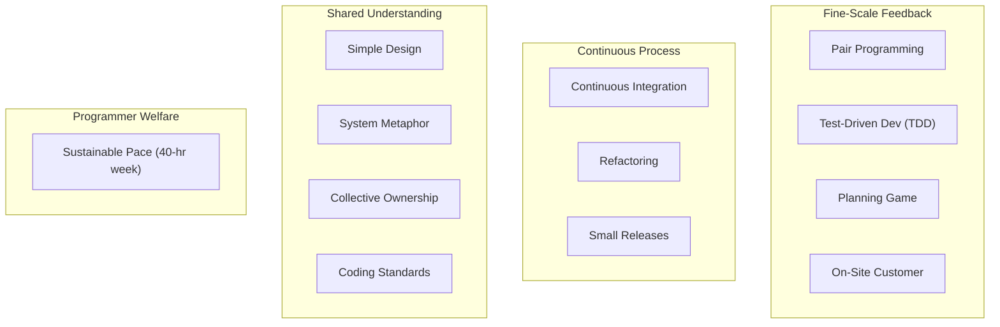
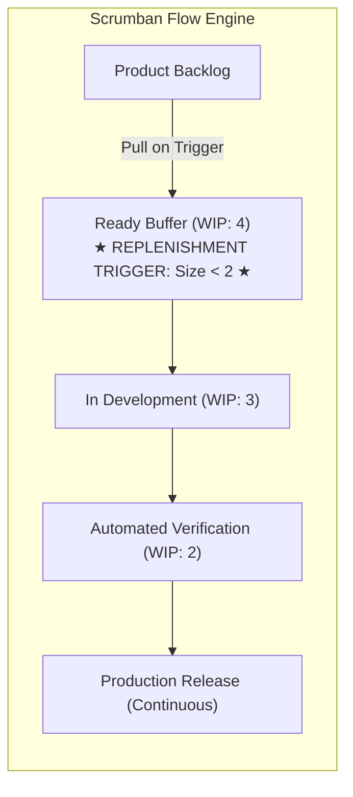

# Advanced Agile Frameworks: Extreme Programming (XP), Scrumban & Basecamp Shape Up

> **Acinonyx Enterprise Systems Research Directorate**  
> **Compendium Series:** Agile, Kanban & Lean Frameworks  
> **Module Code:** `RES-AGILE-2026-CH03`  
> **Core Focus:** Extreme Programming (XP 12 Practices), Scrumban Pull-Replenishment, and Basecamp's Shape Up Methodology

---

## 1. Extreme Programming (XP): The Technical Heart of Agility

While Scrum focused heavily on managerial roles and meetings, **Extreme Programming (XP)**—created by Kent Beck, Ward Cunningham, and Ron Jeffries—focused on **hard engineering practices**. XP posits that Agile project management without technical excellence inevitably produces brittle, unmaintainable legacy code.

```
       KENT BECK'S FOUR VARIABLES OF SOFTWARE DEVELOPMENT
                         Cost
                           ▲
                           │
             Scope ◄───────┼───────► Time
                           │
                           ▼
                        Quality
     (XP Invariant: Quality is NEVER a negotiable variable!)
```

### 1.1 The 12 Canonical Practices of XP



1. **Test-Driven Development (TDD):** Red-Green-Refactor. Write a failing automated unit test first; write minimal code to make it pass; refactor mercilessly.
2. **Pair Programming:** Two engineers work side-by-side on one machine (Driver writes code; Navigator reviews, thinks architecturally, and considers edge cases). In modern agentic engineering, this is replicated via **Human-AI / Multi-Agent Pairing**.
3. **Continuous Integration (CI):** Code is integrated and tested against the mainline multiple times a day. Broken builds are treated as organizational emergencies.
4. **Refactoring:** Constant restructuring of code to improve readability and remove duplication without altering external functionality.
5. **Small Releases:** Ship valuable software increments into production in the shortest possible time-horizon (days to weeks).
6. **Simple Design (Kent Beck’s 4 Rules):**
   - *Rule 1:* Passes all tests.
   - *Rule 2:* Expresses programmer intent (clear naming, readable code).
   - *Rule 3:* Contains no duplicate logic (DRY).
   - *Rule 4:* Contains the fewest possible classes and methods.
7. **System Metaphor:** A shared naming convention and conceptual vision unifying technical implementation with domain reality.
8. **Collective Code Ownership:** Any engineer has the authority and responsibility to modify, improve, or fix any line of code across any module in the repository.
9. **Coding Standards:** Strict, automated styling, linting, and formatting rules enforced across the codebase.
10. **Sustainable Pace:** Elimination of "crunch mode" and chronic overtime. A tired engineer writes buggy code that takes twice as long to debug.
11. **On-Site Customer:** Continuous, immediate access to commercial decision-makers and real end-users throughout the build cycle.
12. **The Planning Game:** Business decides scope and timing; engineering estimates technical cost and effort. Neither dictates both.

---

## 2. Scrumban: The Evolutionary Hybrid

Created by **Corey Ladas** in 2008, **Scrumban** bridges the gap for teams transitioning from rigid Scrum sprints toward continuous flow Kanban, or for hybrid teams handling both planned product features and unpredictable maintenance/operational tickets.



### 2.1 The Key Innovations of Scrumban
1. **Pull-Based Replenishment Instead of Sprint Planning Meetings:**  
   Instead of forcing a 4-hour sprint planning meeting every alternate Monday regardless of need, Scrumban sets an **Order-Point Trigger**. When the `Ready` buffer drops below a set threshold (e.g., $< 2$ items), the Product Owner and Tech Lead meet for 15 minutes to pull the next priority items from the backlog.
2. **Elimination of Artificial Sprint Deadlines:**  
   Stories do not need to artificially fit inside a 2-week box. An item is worked on continuously, pulled through WIP-limited stages, and deployed immediately upon passing the Definition of Done.
3. **Preservation of Cadenced Retrospectives:**  
   While sprint planning is event-driven, team retrospectives remain on a regular time-boxed cadence (e.g., bi-weekly) to maintain organizational Kaizen (continuous improvement).

---

## 3. Shape Up: Basecamp's Product Development Framework

Authored by **Ryan Singer** (Head of Strategy at Basecamp), **Shape Up** is a radical departure from both Scrum and Kanban, designed specifically for product companies tired of "running on two-week hamster wheels."

```
┌────────────────────────────────────────────────────────────────────────┐
│                        THE SHAPE UP 8-WEEK CYCLE                       │
├──────────────────────────────────────────┬─────────────────────────────┤
│        6 WEEKS: UNINTERRUPTED BUILD      │     2 WEEKS: COOL-DOWN      │
│  • Autonomous 2-person builder squads    │  • Bug fixes & exploration  │
│  • No daily standups; no Jira backlogs   │  • Leaders shape next cycle │
│  • Fixed time, variable scope            │  • Betting table meets      │
└──────────────────────────────────────────┴─────────────────────────────┘
```

### 3.1 The Three Core Phases of Shape Up

#### A. Shaping (Leadership & Architecture Layer)
Before any project is handed to developers, senior leaders spend weeks "shaping" the work behind closed doors:
- **Appetite vs. Estimates:** Instead of asking engineers *"How long will this feature take?"*, leadership defines an **Appetite**: *"How much time is this problem worth to the business?"* (Typically a Small Batch: 1–2 weeks, or Big Batch: 6 weeks).
- **Breadboarding & Fat Marker Sketches:** Designing prototypes at the right level of abstraction. Breadboards outline places and affordances without visual design; fat marker sketches avoid pixel-perfect mockups so engineers retain implementation autonomy.
- **De-risking Rabbit Holes:** Identifying tricky technical dependencies or edge cases upfront and defining explicit **"No-Go" boundaries** (what the squad is strictly forbidden from building).

#### B. Betting (The Betting Table vs. The Backlog)
$$\text{"Backlogs are big time wasters. Backlogs are where good ideas go to die."} \quad — \text{Ryan Singer}$$
- Shape Up has **zero central backlogs**.
- At the end of every 6-week cycle, leadership meets at the **Betting Table** to review written **Pitches**.
- If a pitch is approved, it is scheduled for the upcoming cycle. If it is not selected, **it is discarded**. If the idea is genuinely critical, someone will re-pitch it in the future with better framing.

#### C. Building (Autonomous Execution)
- Work is given to small, dedicated squads (typically **1 senior designer and 1 or 2 senior programmers**).
- The squad has full autonomy: no daily standups, no sprint backlog grooming, no middle management interruption.
- **Hill Charts (Visualizing Uncertainty):** Progress is tracked on a Hill Chart rather than percentage completion:

```
                      TOP OF THE HILL: Known territory
                             ▲
                            / \
      UPHILL:              /   \          DOWNHILL:
      Figuring it out     /     \         Executing & shipping
      Unsolved questions /       \        Known implementation
                        /         \
   ────────────────────/           \────────────────────►
```
- **The Circuit Breaker:** If a project does not ship within its allocated 6-week appetite, **it does not get an automatic extension**. By default, it is canceled and removed. This forces squads to aggressively scope-hammer non-essential edge cases and prevents zombie projects from draining enterprise capital.

---

## 4. Synthesis: Choosing the Right Framework

| Organizational Context | Recommended Framework | Rationale |
|---|---|---|
| **Early-stage product discovery with high technical risk** | **Extreme Programming (XP)** | High test coverage, rapid refactoring, and pair programming ensure the codebase does not rot while iterating. |
| **Established product team with clear multi-month roadmap** | **Scrum** | Time-boxed sprints and stakeholder reviews provide cross-functional alignment and predictable cadence. |
| **Cloud infrastructure, DataOps, platform & SRE teams** | **Kanban** | Unpredictable, high-frequency operational requests cannot wait for sprint boundaries; flow and WIP limits are paramount. |
| **Hybrid feature development + production maintenance** | **Scrumban** | Pull-based replenishment handles incoming bugs while preserving focus on core feature increments. |
| **Senior, high-trust SaaS product teams** | **Shape Up** | Eliminates backlog overhead and micro-management; empowers autonomous squads to ship full features in 6 weeks. |

---

*Authored by Project ACINONYX Research Directorate.*
