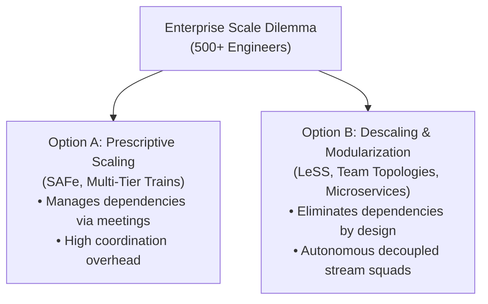
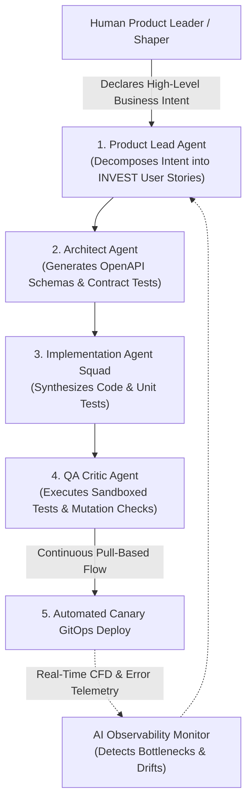

# Enterprise Scaling, Industry Critique & The 2026 AI-Augmented Frontier

> **Acinonyx Enterprise Systems Research Directorate**  
> **Compendium Series:** Agile, Kanban & Lean Frameworks  
> **Module Code:** `RES-AGILE-2026-CH04`  
> **Core Focus:** SAFe vs. LeSS vs. Spotify Model Critique, The NoEstimates Movement, Team Topologies, and AI-Augmented Multi-Agent Agility

---

## 1. The Enterprise Scaling Dilemma: Scaling Agility vs. Descaling Complexity

Agile frameworks were designed for small, colocated, cross-functional teams of 5 to 9 people. When an organization scales to 500 or 5,000 engineers, it faces a fundamental architectural choice:
1. **The Prescriptive Scaling Route (e.g., SAFe):** Install massive, multi-tiered coordination frameworks, synchronization meetings, and bureaucratic release trains to manage cross-team dependencies.
2. **The "Descaling" Route (e.g., LeSS, Team Topologies):** Simplify the organization, break dependencies through decoupled system architecture and microservices, and eliminate the need for cross-team coordination meetings.



---

## 2. Comparative Analysis of Enterprise Scaling Frameworks

### 2.1 Scaled Agile Framework (SAFe)
* **Creator:** Dean Leffingwell (Scaled Agile, Inc.).
* **Core Mechanisms:**
  - **Agile Release Train (ART):** A cross-functional team-of-teams (50–125 people) that plans, commits, and deploys together.
  - **PI Planning (Program Increment Planning):** A 2-day cadence-based event held every 8–12 weeks where all 100+ members of an ART gather to map out cross-team dependencies on physical or digital boards.
  - **Four Configuration Levels:** Essential SAFe, Large Solution SAFe, Portfolio SAFe, and Full SAFe.
* **Why Enterprises Adopt It:** Matches legacy corporate governance, budgeting cycles, and hierarchical management titles; provides clear certification tracks.

### 2.2 Large-Scale Scrum (LeSS)
* **Creators:** Craig Larman and Bas Vodde.
* **Core Philosophy:** *"LeSS is Scrum applied to many teams working together on one product."*
  - **Single Product Backlog:** No matter how many teams (up to 8 teams in standard LeSS), there is **only one Product Backlog** and **only one Product Owner**.
  - **Sprint Synchronization:** All teams execute on the exact same sprint cadence and deliver a single, integrated product increment every sprint.
  - **Descaling:** Rejects additional management layers. Instead of creating a "Chief Product Owner" hierarchy, teams collaborate directly across team boundaries.

### 2.3 The "Spotify Model"
* **Authors:** Henrik Kniberg & Anders Ivarsson (2012 Whitepaper).
* **Taxonomy:**
  - **Squad:** A small, autonomous cross-functional unit (like a Scrum team).
  - **Tribe:** A collection of squads working in a related business domain (typically $< 100$ people, adhering to Dunbar's Number).
  - **Chapter:** Functional specialists across squads within a tribe (e.g., all QA engineers or all frontend developers) led by a Chapter Lead.
  - **Guild:** An informal community of interest spanning the entire enterprise.

---

## 3. The Empirical Critique & Modern Backlash

In 2025–2026, the technology industry witnessed a widespread backlash against heavy scaling frameworks—often referred to as the collapse of the **"Agile Industrial Complex."**

```
CRITIQUE OF THE SCALING MONOPOLIES:
"SAFe is the opposite of Agile. It takes the very bureaucracy, 
central planning, and top-down command-and-control that Agile 
sought to destroy, slaps the word 'Agile' on it, and sells it 
to risk-averse executives." 
                 — Broad Industry Consensus & Manifesto Signatories
```

### 3.1 Why Spotify Abandoned the "Spotify Model"
Engineering retrospectives from former Spotify leaders (such as Jeremiah Lee) revealed that copying the Spotify Model was an organizational catastrophe for hundreds of companies:
1. **The Model was Never a Framework:** It was an idealized snapshot of Spotify’s internal culture in 2012, not a proven operational framework.
2. **Matrix Management Paralysis:** Dividing an engineer’s allegiance between a "Squad Product Owner" (what to build) and a "Chapter Lead" (how to build and compensation) created massive political friction, uncoordinated technical debt, and zero clear accountability.
3. **Engineering Drift:** Squads diverged so radically in tooling, language choices, and architecture that internal mobility ceased, leading Spotify to systematically re-centralize platform engineering.

### 3.2 The NoEstimates Movement (Allen Holub, Vasco Duarte)
A growing movement across modern engineering challenges the utility of story point estimation:
* **The Core Argument:** Estimating software work is non-value-add waste (Muda). In complex knowledge work, estimates are inaccurate guesses that management turns into punitive deadlines.
* **The NoEstimates Alternative:**
  1. Break all work items into the smallest possible coherent vertical slice that can deliver value ($\le 1–2$ days of work).
  2. Measure empirical **Throughput** (items completed per week).
  3. Use historical throughput to run **Monte Carlo simulations**, generating probabilistic forecasts with zero estimation overhead.

### 3.3 Team Topologies as the Modern Structural Antidote
Instead of using frameworks like SAFe to manage cross-team coordination meetings, high-performing organizations use **Team Topologies** (Skelton & Pais) to eliminate the dependencies themselves:
- **Stream-Aligned Teams** own customer value slices.
- **Platform Teams** provide self-service developer infrastructure via APIs, eliminating handoff tickets.
- Conway’s Law is respected by aligning system microservice boundaries directly to team boundaries.

---

## 4. The 2026 Frontier: AI-Augmented Agile & Autonomous Swarms

The emergence of Generative AI, Large Language Models, and Autonomous Multi-Agent Systems is redefining how Agile workflows operate:



### 4.1 How AI Transforms Agile Ceremonies & Artifacts
1. **Automated Backlog Refinement:** LLMs analyze customer feedback, support transcripts, and Bugzilla/Jira tickets, automatically generating structured user stories conforming to the INVEST criteria, complete with edge-case Gherkin scenarios.
2. **Autonomous Multi-Agent Kanban Flow:**  
   In systems like **Project ACINONYX (MAS-Core)**, the 2-week human sprint cycle is compressed into a **continuous, pull-based agentic pipeline**:
   - The `product_lead` agent pulls items from the backlog when the WIP buffer allows.
   - The `lead_architect` specifies contracts.
   - The `senior_engineer` writes code.
   - The `qa_critic` verifies execution in a sandboxed runtime.
   - The entire loop completes in **minutes** rather than multi-week sprint intervals.
3. **Dynamic Cumulative Flow Analysis:** AI monitors repository telemetry (PR review turnaround, CI runner duration, commit frequency), identifying invisible bottlenecks before WIP explodes.
4. **Human-in-the-Loop (HITL) as the Ultimate "Betting Table":**  
   Human engineering leaders transition from updating Jira tickets and attending daily standups to acting as **Strategic Shapers and Evaluators**—setting the business appetite, evaluating agent-generated pull requests, and governing the high-blast-radius deployment gates.

---

*Compiled and published by Project ACINONYX Research Directorate.*
