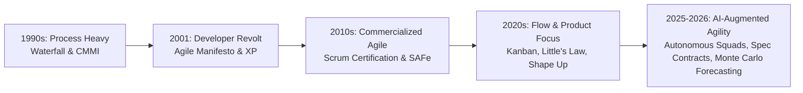

# Agile, Kanban & Lean Frameworks: Theory, Mathematics & Modern Practice

> **Acinonyx Enterprise Systems Research Directorate**  
> **Document Code:** `RES-AGILE-2026-v1`  
> **Standard Compliance:** The Agile Manifesto (2001), Kanban Guide for Knowledge Work, Scrum Guide (2020), Extreme Programming (XP), Shape Up  
> **Target Audience:** Engineering Leaders, Agile Coaches, Systems Architects & Autonomous Agent Collective Operators

---

## 1. Executive Summary: From Ceremonial Dogma to Flow & Outcomes

Over the past twenty-five years, the software industry’s approach to organizing human and machine effort has undergone a dramatic transformation. What began in 2001 as a radical, developer-led revolt against heavy, bureaucratic Waterfall specifications—**The Agile Manifesto**—gradually transformed into a multi-billion dollar commercial industry often termed the "Agile Industrial Complex."

As documented in 2025–2026 empirical studies, high-performing technology organizations are shedding ceremonial overhead ("doing Agile" through endless meetings, story point inflation, and rigid certification frameworks) in favor of **empirical flow systems, rigorous engineering practices, and outcome-based delivery ("being Agile")**:

Modern engineering leaders recognize that **process is a tool to eliminate waste, not a religious dogma**. Whether an organization utilizes Scrum, Kanban, Extreme Programming (XP), or Shape Up, the goal remains invariant: **minimizing the lead time from verified customer hypothesis to running production value while preserving system stability**.

---

## 2. Comparative Matrix: Agile, Kanban & Alternative Frameworks

| Framework | Core Mechanism | Cadence & Planning | Primary Units of Work | Roles & Ceremonies | Best Suited For |
|---|---|---|---|---|---|
| **Scrum** | Time-boxed iterative development. | Fixed 1–4 week sprints; sprint planning, daily scrum, review, retro. | User Stories, Story Points, Tasks. | Product Owner, Scrum Master, Developers. 5 formal ceremonies. | Product development with clear, medium-term release milestones and cross-functional teams. |
| **Kanban** | Continuous flow governed by Work-In-Progress (WIP) limits. | Continuous, event-driven; pull-based on-demand replenishment. | Work Items, Value Cards, Tickets. | No prescribed roles; focus on managing the board, policies, and flow. | Operations, platform engineering, data support, maintenance, and high-frequency teams. |
| **Scrumban** | Hybrid: Scrum's sprint cadence + Kanban's WIP limits. | Flexible 1–2 week iterations with continuous pull-replenishment. | User Stories & Work Items. | Optional Scrum roles; pull-driven planning triggered by WIP triggers. | Maturing Scrum teams shifting toward continuous flow and maintenance/feature hybrids. |
| **Extreme Programming (XP)** | Technical excellence and short feedback loops. | 1–2 week cycles with continuous integration and releases. | User Stories, Customer Tests. | On-site Customer, Tracker, Coach, Pair Programmers. | High-risk, complex software engineering where code quality is paramount. |
| **Shape Up (Basecamp)** | Fixed time, variable scope; appetite-based investment. | 6-week build cycles followed by 2-week cool-downs. | Scopes, Pitches, Hill Chart items. | Shapers (Leaders), 2-person autonomous builder squads; no daily standups. | Product-led tech companies and mature senior engineering squads seeking to avoid backlogs. |
| **Scaled Agile (SAFe)** | Hierarchical enterprise release planning across teams. | 8–12 week Program Increments (PIs); 2-week synchronized sprints. | Epics, Capabilities, Features, Stories. | Release Train Engineer (RTE), Solution Architect, Product Manager. Highly prescriptive. | Massive legacy enterprises (banks, defense, aerospace) with thousands of engineers. |
| **Large-Scale Scrum (LeSS)** | "Descaling" enterprise complexity through single backlogs. | Synchronized sprints across 2–8 teams. | Product Backlog Items (PBI). | Single Product Owner, multiple cross-functional teams, Scrum Masters. | Organizations scaling a single coherent product across multiple squads without bureaucracy. |

---

## 3. Compendium Directory & Deep Dive Modules

This compendium is structured into four detailed, operational modules:

| Module | Title | Core Subjects Covered |
|---|---|---|
| **[Module 1](01_agile_and_scrum_foundations.md)** | **[Agile & Scrum Foundations](01_agile_and_scrum_foundations.md)** | The Agile Manifesto (4 values, 12 principles), Empirical Process Control, Scrum Guide 2020 (roles, events, artifacts, commitments), User Story INVEST criteria, Definition of Ready/Done, and "Water-Scrum-Fall" anti-patterns. |
| **[Module 2](02_kanban_and_flow_systems.md)** | **[Kanban & Flow Systems: The Mathematics of Lean](02_kanban_and_flow_systems.md)** | Toyota Production System roots, David J. Anderson's Kanban, Little’s Law ($\text{Cycle Time} = \text{WIP}/\text{Throughput}$), Cumulative Flow Diagrams (CFD), bottleneck diagnosis, Service Level Expectations (SLE), and Monte Carlo probabilistic forecasting. |
| **[Module 3](03_advanced_frameworks_xp_scrumban_shape_up.md)** | **[Advanced Frameworks: XP, Scrumban & Shape Up](03_advanced_frameworks_xp_scrumban_shape_up.md)** | Extreme Programming (XP 12 practices, TDD, Pair Programming), Scrumban on-demand replenishment triggers, Basecamp Shape Up (shaping, pitching, betting table, appetite vs estimates, hill charts, circuit breakers). |
| **[Module 4](04_enterprise_scaling_critique_and_ai_frontier.md)** | **[Enterprise Scaling, Industry Critique & The AI Frontier](04_enterprise_scaling_critique_and_ai_frontier.md)** | Critique of the "Agile Industrial Complex", SAFe vs. LeSS vs. Spotify Model reality, NoEstimates movement, Team Topologies alignment, and the 2026 Frontier: AI-Augmented Agile and Autonomous Multi-Agent Squads (MAS-Core). |

---

*Authored by Project ACINONYX Research Directorate.*
