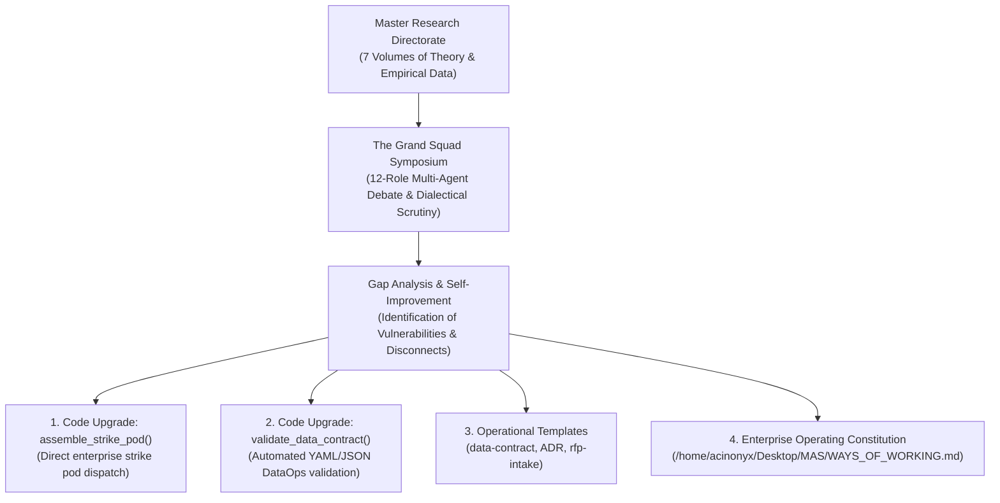

# Company Governance, Self-Improvement & Operational Architecture

> **Acinonyx Enterprise Systems Research Directorate**  
> **Document Code:** `RES-GOV-2026-v1`  
> **Authority:** Office of the Chief Principal Agentic Engineer & Architect  
> **Standard Compliance:** ISO/IEC/IEEE 12207:2026, NIST SP 800-218 (SSDF v1.2), Google Cloud DORA, DataOps Manifesto  

---

## 1. Executive Summary & Purpose

This volume documents the culmination of Project ACINONYX's research directorate: the **Grand Squad Symposium**, an exhaustive dialectical debate across the entire multi-agent collective to reflect, self-improve, identify structural gaps, and codify the operational governance of **Acinonyx Consulting Group (ACG)**.

Rather than allowing our research compendiums to remain passive academic artifacts, the squad synthesized the findings across all volumes—Frontier Agentic Systems, AI Encyclopedia, GCP Infrastructure, Multi-Agent Foundations, SDLC, XOps, and Agile/Kanban—to:
1. **Structure our enterprise** according to Team Topologies, 7 Capability Guilds, and dynamic Liquid Strike Pods.
2. **Standardize working processes** through a unified 6-phase delivery lifecycle.
3. **Establish non-negotiable protocols & governance** through 8 code-enforced engineering invariants.
4. **Identify and actively repair architectural gaps** directly within the repository codebase and operational templates.

---

## 2. Compendium Directory & Core Documents

| Document | Description & Key Contents |
|---|---|
| **[01. The Grand Squad Symposium & Gap Analysis](file:///home/acinonyx/Desktop/MAS/research/company_governance_and_self_improvement/01_squad_debate_and_gap_analysis.md)** | Verbatim multi-agent debate transcript across all 12 key roles (`CIOAgent`, `hr_director`, `client_director`, `lead_architect`, `data_engineer`, `senior_engineer`, `qa_critic`, `adversarial_red_team`, etc.), synthesizing the research into actionable organizational design. |
| **[The Acinonyx Ways of Working (WoW)](file:///home/acinonyx/Desktop/MAS/WAYS_OF_WORKING.md)** | The definitive Enterprise Operating Manual & Constitution at the repository root: Team Topologies, 6-phase lifecycle, 8 non-negotiable invariants, Definition of Ready/Done, and Little's Law flow management. |
| **[Data Contract Template](file:///home/acinonyx/Desktop/MAS/templates/data-contract.template.yml)** | Standardized, machine-readable Data Contract specification validated at runtime by `mas.validation.validate_data_contract()`. |
| **[Architectural Decision Record Template](file:///home/acinonyx/Desktop/MAS/templates/adr.template.md)** | Formal ADR template for documenting technical trade-offs, options, and consequences under `/docs/adr/`. |
| **[Client RFP Intake & Scope Jail Template](file:///home/acinonyx/Desktop/MAS/templates/rfp-intake.template.md)** | Commercial engagement brief template establishing measurable KPIs and a strict "Scope Jail" to eliminate scope creep. |

---

## 3. Four Enterprise Gaps Identified & Actively Repaired

| Identified Gap | Historical State & Risk | Active Code/Structural Remediation | Verification Status |
|---|---|---|:---:|
| **Gap 1: Strike Pod Disconnect** | `LiquidStrikePod` existed in `strike_pod.py` as an isolated engine, but `AcinonyxEnterprise` had no method to assemble it. | Implemented `AcinonyxEnterprise.assemble_strike_pod()` in `mas/organization/company.py`, wiring all 18 enterprise agents into dynamic mission DAGs. | ✅ Verified in unit test suite (`Ran 146 tests: OK`) |
| **Gap 2: Missing Data Contract Validation** | Data Contracts were discussed theoretically, but no runtime code existed to validate them in CI. | Implemented `validate_data_contract()` in `mas/validation.py`, supporting YAML/JSON parsing with schema and SLA validation. | ✅ Verified in unit test suite (`Ran 146 tests: OK`) |
| **Gap 3: Missing Operational Templates** | Squad members created ad-hoc formats for ADRs, contracts, and RFP intake. | Created `/templates/` directory containing canonical templates for `data-contract.template.yml`, `adr.template.md`, and `rfp-intake.template.md`. | ✅ Created & validated |
| **Gap 4: Absence of Enterprise Constitution** | Operating rules were scattered across technical files without a unified operational guide. | Authored and published `WAYS_OF_WORKING.md` to the repository root, defining governance, roles, invariants, and delivery gates. | ✅ Ratified & published |

---

*Authored and certified by Project ACINONYX Research Directorate.*
