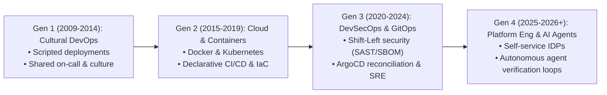
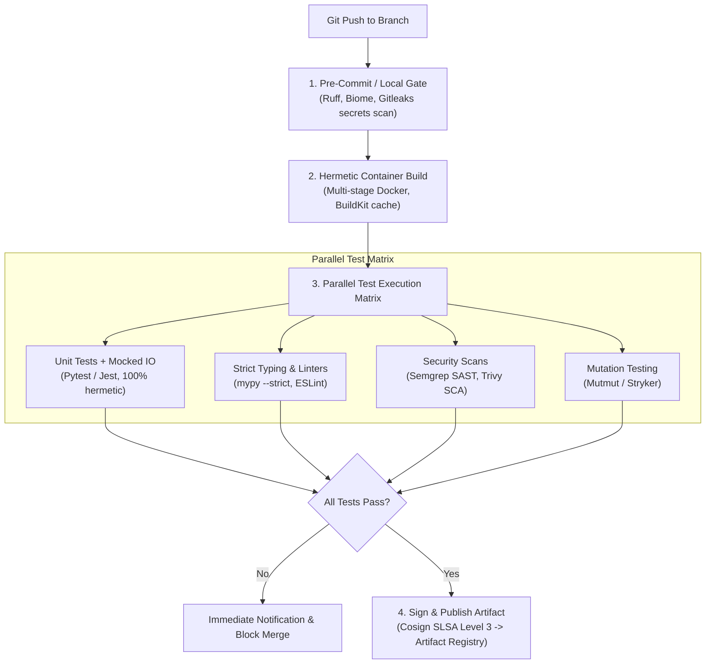
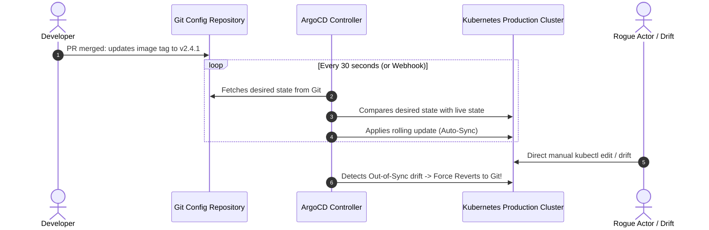

# DevOps & Platform Engineering: Architecture, SRE & DevSecOps

> **Acinonyx Enterprise Systems Research Directorate**  
> **Compendium Series:** The XOps Trinity (DevOps, DataOps & MLOps)  
> **Module Code:** `RES-XOPS-2026-CH01`  
> **Core Focus:** Continuous Delivery, GitOps, Infrastructure as Code, SRE, and DevSecOps

---

## 1. The Architectural Evolution of DevOps

DevOps emerged in 2009 to dismantle the catastrophic organizational wall separating software development ("ship features fast") from IT operations ("keep systems stable"). Over fifteen years, it has evolved across four architectural generations:



Today, high-performing enterprises do not expect developers to manually configure AWS/GCP IAM roles, raw Kubernetes manifests, and VPC peering. Instead, organizations deploy **Platform Engineering** teams who build an **Internal Developer Platform (IDP)**, delivering self-service APIs and abstractions that let developers deploy applications safely without operational friction.

---

## 2. Core Architectural Pillars

### 2.1 Trunk-Based Development vs. Legacy GitFlow

The empirical research from Google Cloud DORA (*Accelerate*) is decisive: **long-lived feature branches correlate with low deployment velocity and high failure rates**. 

```
LEGACY GITFLOW (Anti-Pattern):
main        ───────────────────────────────────────────────►
release-1.0            \─────────────/  (Merge Hell: 3 weeks)
develop     ───────────────────────────────────────────────►
feature-A        \─────────────────────────/ (2 months old branch)

TRUNK-BASED DEVELOPMENT (Elite Standard):
main ───────●───────●───────●───────●───────●───────●──────► (Deploys to Prod on Merge)
             \     / \     / \     /
              ●───●   ●───●   ●───● (Short-lived branches <= 24 hours, Feature Flags)
```

* **The Rule of Trunk-Based Development:** Every developer merges their work into `main` at least once per day. Branches live $\le 24$ hours.
* **Feature Flags (Decoupling Deployment from Release):** Incomplete features are hidden behind dynamic feature toggles (LaunchDarkly, Unleash). Code is continuously deployed to production servers, but activated only when ready.

### 2.2 Continuous Integration (CI): The Zero-Tolerance Quality Engine

A world-class CI pipeline must be **deterministic, hermetic, and fast ($\le 10$ minutes)**:



### 2.3 GitOps & Declarative Continuous Delivery (CD)

The industry standard for cloud-native delivery is **GitOps** (formalized by the OpenGitOps working group), implemented via engines like **ArgoCD** or **Flux**:



* **Why GitOps Replaces Push-Based CI/CD:**
  - **Zero Direct Cluster Credentials in CI:** The CI server does not need root administrative credentials to the Kubernetes cluster; it only commits the new image SHA to the Git config repo.
  - **Automatic Drift Remediation:** If someone manually modifies a pod or firewall rule via the GCP/AWS console or `kubectl`, ArgoCD immediately detects the divergence and overwrites it back to the Git baseline.
  - **Instant Rollbacks:** Rolling back production is simply running `git revert` on the repository commit.

### 2.4 Infrastructure as Code (IaC) & Policy-as-Code

All cloud infrastructure (VPCs, GKE clusters, Cloud SQL, BigQuery datasets, IAM bindings) must be defined as declarative code:
- **Tools:** Terraform, OpenTofu, Pulumi.
- **State Management:** Remote state stored in encrypted cloud buckets (GCS/S3) with distributed state locking (DynamoDB or native GCS object locking).
- **Policy-as-Code (Shift-Left Guardrails):** Tools like Open Policy Agent (OPA), Styra, or Conftest validate Terraform plans *before* provisioning to block insecure configurations (e.g., publicly accessible buckets, missing CMEK encryption, or unattached firewalls).

---

## 3. Shift-Left DevSecOps & Supply Chain Security

Following NIST SP 800-218 (SSDF) and the SLSA (Supply-chain Levels for Software Artifacts) framework, modern DevOps embeds security into every stage:

| Security Domain | Operational Toolchain | Pipeline Enforcement Point |
|---|---|---|
| **Secret Scanning** | Gitleaks, TruffleHog | Local pre-commit hook & CI pull request gate (blocks commits containing API keys/tokens). |
| **Static Application Security (SAST)** | Semgrep, SonarQube, CodeQL | CI pipeline (analyzes source code AST for OWASP Top 10 vulnerabilities). |
| **Software Composition Analysis (SCA)** | Trivy, Snyk, OSV-Scanner | CI pipeline (scans third-party library dependencies for known CVEs). |
| **Software Bill of Materials (SBOM)** | Syft, CycloneDX CLI | Build phase (generates a cryptographically verifiable manifest of all nested dependencies). |
| **Cryptographic Provenance** | Sigstore, Cosign | Container registry (signs the OCI image hash; Kubernetes admission controllers block unsigned images). |
| **Dynamic Application Security (DAST)** | OWASP ZAP, StackHawk | Ephemeral staging environment (fuzzes active HTTP endpoints for runtime vulnerabilities). |

---

## 4. Site Reliability Engineering (SRE) & Observability

Pioneered by Google, SRE is "what happens when you ask a software engineer to design an operations team."

### 4.1 The Golden Signals of Distributed Systems
1. **Latency:** The time it takes to service a request (differentiated between successful and error requests).
2. **Traffic:** A measure of how much demand is placed on the system (e.g., HTTP requests/second, streaming IOPS).
3. **Errors:** The rate of requests that fail (e.g., HTTP $5\text{xx}$ codes, database deadlocks).
4. **Saturation:** How "full" the service is (e.g., CPU memory headroom, thread pool usage, BigQuery slot capacity).

### 4.2 The Mathematics of Error Budgets

```
100% Availability is the Wrong Target.
Exceeding your SLO burns budget on over-engineering that users cannot perceive.
```

$$\text{SLO} = 99.9\% \implies \text{Allowable Downtime per Month} = 43.2 \text{ minutes}$$
$$\text{Error Budget} = 100\% - \text{SLO} = 0.1\%$$

* **The Error Budget Policy:**
  - **Budget $> 0\%$:** Product engineers have full green-light to deploy features rapidly.
  - **Budget $\le 0\%$:** Release freeze. All engineering bandwidth pivots exclusively to writing regression tests, optimizing queries, refactoring bottlenecks, and resolving technical debt.

### 4.3 OpenTelemetry (O-Tel) Standard
Modern observability rejects proprietary agent vendor lock-in. All microservices emit vendor-neutral telemetry:
- **Traces:** Distributed trace IDs (`trace_id`, `span_id`) propagated across HTTP/gRPC boundaries to trace a request through 15 microservices.
- **Metrics:** Aggregated time-series counters and histograms.
- **Structured Logs:** JSON logs containing contextual metadata (`user_id`, `tenant_id`, `trace_id`).

---

## 5. DORA & SPACE Performance Metrics

### 5.1 DORA 4 Core Metrics
* **Deployment Frequency:** Elite performers deploy multiple times per day.
* **Lead Time for Changes:** Elite performers transition code from commit to production in $< 1$ hour.
* **Change Failure Rate:** Elite performers maintain production incident rates between $0\%$ and $5\%$.
* **Time to Restore Service (MTTR):** Elite performers recover from incidents in $< 1$ hour.

### 5.2 The SPACE Framework
To balance velocity with developer human sustainability, high-performing engineering leaders measure:
- **S** - Satisfaction & Well-Being (Psychological safety, retention, low burnout).
- **P** - Performance (Outcome delivery, reliability).
- **A** - Activity (Work units, PR reviews, design specs).
- **C** - Communication & Collaboration (Knowledge sharing, PR review turnaround).
- **E** - Efficiency & Flow (Deep work blocks, minimal context switching).

---

*Authored by Project ACINONYX Research Directorate.*
