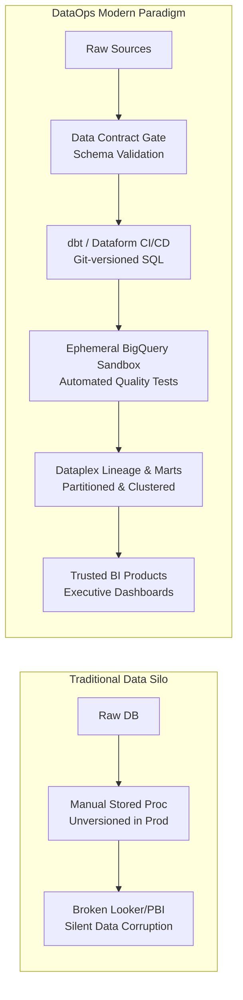
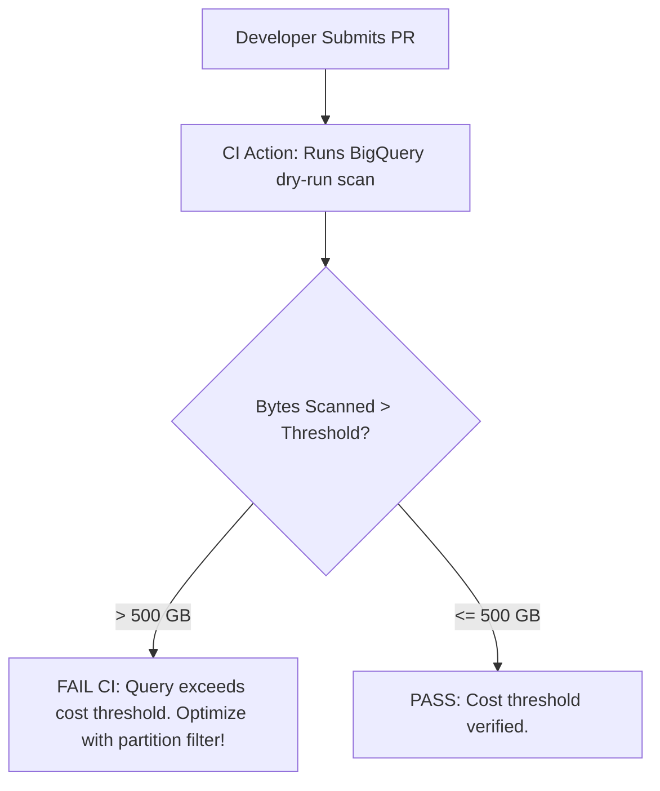
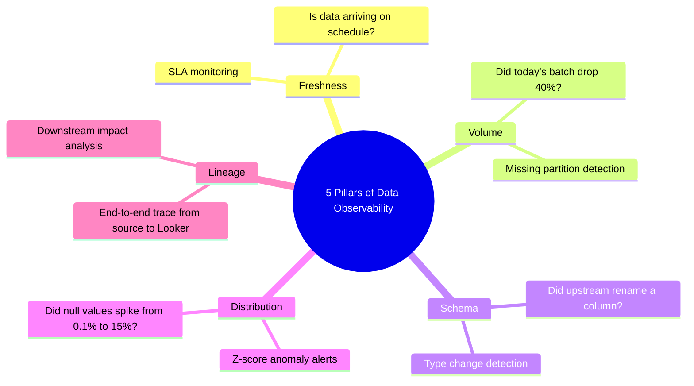

# DataOps & Analytical Engineering: BigQuery Architecture, Quality & Data Contracts

> **Acinonyx Enterprise Systems Research Directorate**  
> **Compendium Series:** The XOps Trinity (DevOps, DataOps & MLOps)  
> **Module Code:** `RES-XOPS-2026-CH02`  
> **Core Focus:** Modern Data Stack, Google Cloud BigQuery, dbt/Dataform, Data Contracts, and Data Observability

---

## 1. The Core Philosophy of DataOps

For decades, data teams operated under the "Data Factory" antipattern: business analysts filed tickets requesting custom CSVs or SQL queries, data engineers wrote fragile, unversioned stored procedures directly in production databases, and downstream BI reports silently corrupted whenever an upstream developer renamed a table column.

**DataOps** is the application of modern software engineering discipline (Agile development, DevOps automation, and Lean manufacturing quality control) to the creation, transformation, and governance of data products.



### The 5 Core Tenets of the DataOps Manifesto
1. **Continuous Delivery of Insights:** Focus on shipping small, incremental data model improvements rather than massive multi-month warehouse overhauls.
2. **Data as Code:** Every data transformation, schema definition, and access rule must be version-controlled in Git. No manual DDL executions in production consoles.
3. **Automated Quality Testing:** Validate data at every boundary. If data quality fails an assertion, the pipeline must break before corrupt data reaches downstream consumers.
4. **Reproducibility & Lineage:** Any historical data state or calculation must be reproducible from versioned code and audit logs.
5. **Disposable, Ephemeral Environments:** Developers must have access to isolated, automated sandbox environments that mirror production without exposing sensitive client data.

---

## 2. The Three-Tier BigQuery Architecture

In a modern enterprise data platform on Google Cloud Platform, data flows through three strictly partitioned transformation zones (often aligned with the Medallion Architecture: Bronze $\rightarrow$ Silver $\rightarrow$ Gold):

```
RAW SOURCES (Cloud Storage / PubSub / Fivetran)
                  │
                  ▼
┌────────────────────────────────────────────────────────┐
│ 1. STAGING TIER (Bronze) - Dataset: `raw_staging`       │
│ • 1:1 view of source systems                           │
│ • Column renaming, casting, JSON parsing               │
│ • STRICT RULE: Zero business logic; zero multi-table   │
│   joins. Fast, lightweight, ephemeral.                 │
└────────────────────────────────────────────────────────┘
                  │
                  ▼
┌────────────────────────────────────────────────────────┐
│ 2. INTERMEDIATE TIER (Silver) - Dataset: `analytics_int`│
│ • Enterprise business logic, joins, surrogate keys     │
│ • Deduplication and window calculations                │
│ • Materialization: Ephemeral views or incremental      │
│   tables.                                              │
└────────────────────────────────────────────────────────┘
                  │
                  ▼
┌────────────────────────────────────────────────────────┐
│ 3. MARTS TIER (Gold) - Dataset: `analytics_marts`      │
│ • Business-ready dimensional models (Star Schema)      │
│ • Fact tables (fct_*) & Dimension tables (dim_*)       │
│ • Materialization: Incremental partitioned & clustered │
│   tables optimized for Looker Studio & Power BI.       │
└────────────────────────────────────────────────────────┘
```

---

## 3. BigQuery FinOps & Performance Controls in CI

BigQuery’s serverless architecture provides infinite scalability, but without engineering guardrails, query costs can escalate uncontrollably. The DataOps SDLC enforces **BigQuery FinOps directly inside the CI/CD pipeline**:

### 3.1 Pre-Merge Dry-Run Query Validation
BigQuery allows queries to be executed in `dry_run=True` mode, returning the exact number of bytes that will be scanned without executing the query or incurring cost.



### 3.2 Partitioning and Clustering Engineering Standards
- **Mandatory Partitioning:** Any production table projected to exceed **10 GB** must be partitioned (typically by ingestion date or transaction timestamp). This restricts query scans to relevant time slices.
- **Clustering:** Tables must be clustered by up to 4 high-cardinality columns frequently used in `WHERE` filters and `JOIN` clauses (e.g., `client_id`, `status`, `country_code`). BigQuery automatically sorts data within partitions, eliminating redundant slot scans.
- **BI Engine Acceleration:** Attach BigQuery BI Engine in-memory caching to high-traffic Gold marts, reducing dashboard query latencies to sub-second speeds at zero incremental scan cost.

---

## 4. Ephemeral CI/CD Datasets (Zero Production Contamination)

A premier DataOps pipeline eliminates shared, dirty staging databases by leveraging **ephemeral, isolated BigQuery datasets**:

```yaml
# Sample GitHub Actions DataOps CI Workflow (.github/workflows/dataops-ci.yml)
name: DataOps BigQuery CI

on:
  pull_request:
    paths:
      - 'models/**'
      - 'macros/**'
      - 'dbt_project.yml'

jobs:
  dbt-test:
    runs-on: ubuntu-latest
    steps:
      - name: Checkout Code
        uses: actions/checkout@v4

      - name: Set Ephemeral Schema Name
        run: echo "DBT_SCHEMA=ci_scratch_pr_${{ github.event.pull_request.number }}" >> $GITHUB_ENV

      - name: Authenticate to Google Cloud
        uses: google-github-actions/auth@v2
        with:
          credentials_json: ${{ secrets.GCP_DATAOPS_SA_KEY }}

      - name: Compile & Run dbt on Ephemeral BigQuery Dataset
        run: |
          dbt deps
          dbt run --target ci --schema ${{ env.DBT_SCHEMA }}
          dbt test --target ci --schema ${{ env.DBT_SCHEMA }}

      - name: Clean up Ephemeral Dataset
        if: always()
        run: |
          bq rm -r -f -d ${{ secrets.GCP_PROJECT }}:${{ env.DBT_SCHEMA }}
```

1. Each Pull Request provisions `ci_scratch_pr_<number>` in BigQuery.
2. The pipeline executes dbt models and quality assertions in complete isolation.
3. The dataset is immediately and unconditionally destroyed upon pipeline completion (`bq rm -r -f`).

---

## 5. Automated Data Quality Testing: The 4-Tier Matrix

In DataOps, tests are not written solely for code syntax; they validate the **data payload itself**:

| Test Tier | Focus & Method | Implementation Tooling |
|---|---|---|
| **1. Structural Tests** | Schema validation, data types, column nullability. | `dbt test` (`not_null`, `unique`, `accepted_values`), JSON Schema. |
| **2. Referential Integrity** | Foreign key relationships between fact and dimension tables. | `dbt test` (`relationships: to: ref('dim_clients'), field: client_id`). |
| **3. Custom Business Assertions** | Domain logic (e.g., "refund amount cannot exceed original transaction amount"). | dbt Singular Tests (custom SQL queries that must return 0 rows to pass). |
| **4. Statistical Distribution & Drift** | Outlier detection, row-count volume anomalies, null-rate spikes. | Great Expectations (`expect_column_mean_to_be_between`), dbt-expectations. |

---

## 6. Data Observability: The 5 Pillars

Modern data reliability engineering (embodied in tools like **Google Cloud Dataplex**, Monte Carlo, and Acceldata) continuously monitors the **5 Pillars of Data Health**:



1. **Freshness:** Has the table been updated within its designated SLA? (e.g., hourly updates).
2. **Volume:** Did today's batch ingest 1 million rows as expected, or only 5,000 due to an upstream API outage?
3. **Schema:** Have columns been added, removed, or changed type without prior notification?
4. **Distribution:** Are the statistical values within expected parameters (e.g., average purchase value between $20 and $50)?
5. **Lineage:** Complete end-to-end visualization tracing every data point from source API to executive BI dashboard, enabling instantaneous blast-radius analysis when pipelines break.

---

## 7. Data Contracts & Schema Migration Safety

To prevent upstream application engineering teams from breaking downstream analytics, organizations implement **Data Contracts**:

### 7.1 The Data Contract Agreement
A formal, machine-readable contract declaring:
- Exact schema, field descriptions, and nullability.
- Update frequency SLAs and historical availability commitments.
- Contact owners and downstream consumers.
- Breaking change notification protocols.

### 7.2 The Expand-Contract (Parallel Run) Migration Pattern
Breaking schema changes (e.g., splitting `customer_name` into `first_name` and `last_name`) must never be applied in place:

```
Step 1 (Expand):  Deploy new columns (first_name, last_name) alongside legacy customer_name.
                  Populate both simultaneously in pipeline.
Step 2 (Migrate): Update downstream Looker Studio / Power BI reports to point to new columns.
Step 3 (Contract):Deprecate customer_name; drop legacy column after verified 30-day grace period.
```

---

*Authored by Project ACINONYX Research Directorate.*
