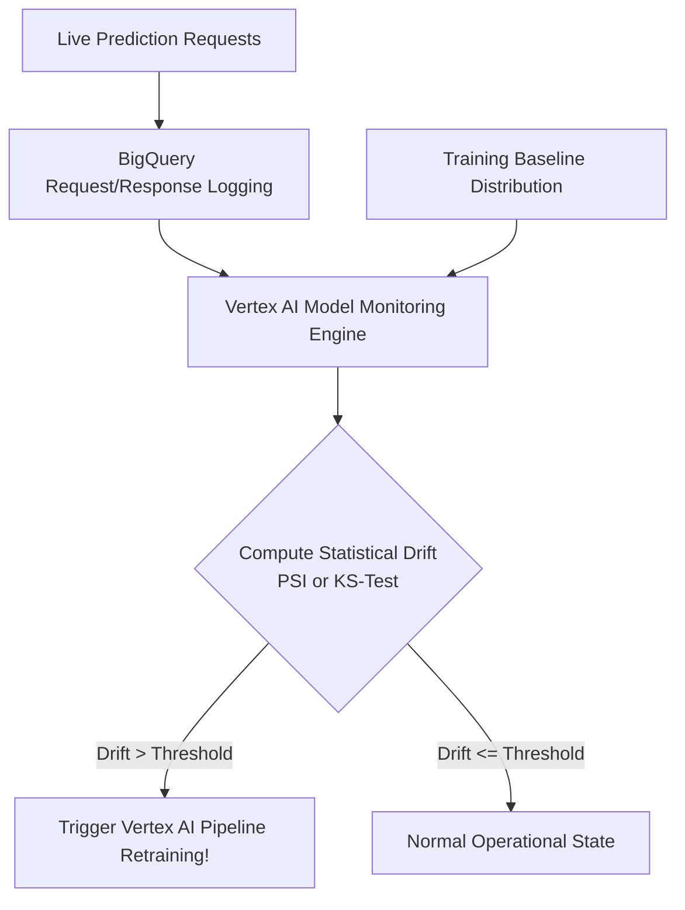

# MLOps & LLMOps Production Architectures: Google Cloud Vertex AI & GenAI Operations

> **Acinonyx Enterprise Systems Research Directorate**  
> **Compendium Series:** The XOps Trinity (DevOps, DataOps & MLOps)  
> **Module Code:** `RES-XOPS-2026-CH03`  
> **Core Focus:** Google Cloud Vertex AI, Kubeflow Pipelines, Continuous Training (CT), Drift Detection, and GenAI/LLMOps

---

## 1. The Core Challenge of Machine Learning Operations

Traditional DevOps assumes software behavior is entirely determined by source code:
$$\text{Output} = f_{\text{code}}(\text{Input})$$

Machine Learning breaks this paradigm. The behavior of a machine learning system is determined by the nonlinear synthesis of **code, training data, and hyperparameters**:
$$\text{Model Weights } (\theta) = \text{Train}(f_{\text{code}}, \text{Dataset}_{\text{time}=t}, \text{Hyperparameters})$$
$$\text{Prediction } (\hat{y}) = f_{\theta}(\text{Live Input})$$

Because the physical world is dynamic, the statistical distribution of live inputs inevitably drifts from the historical training baseline. A machine learning model that achieved 96% accuracy on Monday will silently decay to 60% accuracy by Friday without throwing a single software exception.

```
       DEVOPS: Code is King              MLOPS: The Triple Dependency
     ┌───────────────────────┐             ┌─────────────────────────┐
     │      Source Code      │             │       Source Code       │
     └───────────┬───────────┘             └────────────┬────────────┘
                 ▼                                      │
     ┌───────────────────────┐                          ▼
     │   Compiled Binary     │             ┌─────────────────────────┐
     └───────────────────────┘             │  Training Data (t = 0)  │
     (Deterministic: Runs until            └────────────┬────────────┘
      a software bug crashes)                           ▼
                                           ┌─────────────────────────┐
                                           │ Model Weights (theta)   │
                                           └────────────┬────────────┘
                                                        ▼
                                           [Decays Silently Due to Drift!]
```

---

## 2. Google's Three Levels of MLOps Maturity

Google Cloud formalizes MLOps maturity into three progressive operational levels:

```mermaid
graph TD
    subgraph Level 0: Manual Process
        L0_1[Ad-hoc Jupyter Notebooks] --> L0_2[Manual CSV Extraction]
        L0_2 --> L0_3[Manual Local Training]
        L0_3 --> L0_4[Pushed pkl File to Server]
        L0_4 --> L0_5[No Drift Monitoring / Frequent Outages]
    end

    subgraph Level 1: ML Pipeline Automation (Continuous Training - CT)
        L1_1[Automated Data Pipeline] --> L1_2[Vertex AI Pipelines / Kubeflow]
        L1_2 --> L1_3[Automated Validation Gate]
        L1_3 --> L1_4[Model Registry]
        L1_5[Drift Alert Trigger] -.->|Triggers Retraining| L1_2
    end

    subgraph Level 2: CI/CD/CT Full Automation
        L2_1[Git Commit on Pipeline Source] --> L2_2[Automated CI: Unit & Data Tests]
        L2_2 --> L2_3[CD: Deploys Pipeline to Vertex AI]
        L2_3 --> L2_4[CT: Retrains & Validates Model]
        L2_4 --> L2_5[Canary Model Rollout to Endpoint]
    end
```

### Level 0: Manual Process (The "Jupyter Notebook Trap")
- Data scientists write custom Python scripts in disconnected Jupyter notebooks.
- Data extraction is manual (running ad-hoc SQL queries and saving CSVs locally).
- Model artifacts (`model.pkl`) are manually handed off to backend engineers to wrap in a Flask API.
- **Consequences:** Zero experiment reproducibility, high training-serving skew, inability to explain historical predictions, and slow release cycles (months per model).

### Level 1: ML Pipeline Automation (Continuous Training - CT)
- The entire ML workflow (data extraction, validation, feature engineering, model training, and evaluation) is orchestrated as a directed acyclic graph (DAG) via **Vertex AI Pipelines (Kubeflow / TFX)**.
- **Continuous Training (CT):** The pipeline executes automatically on a schedule or when model monitoring alerts detect statistical data drift.
- Features are managed via a centralized **Feature Store**, guaranteeing point-in-time correctness.

### Level 2: CI/CD/CT Full Automation
- Both the ML model *and* the ML pipeline code are version-controlled and continuously integrated.
- Changes to pipeline code trigger automated unit tests, component validation, and deployment to staging/production pipeline runners via Cloud Build.
- Models pass automated shadow-deployment or canary testing before receiving production traffic.

---

## 3. End-to-End MLOps Architecture on Google Cloud Vertex AI

A production-grade MLOps system integrates six core components:

```
┌────────────────────────────────────────────────────────────────────────┐
│               GOOGLE CLOUD VERTEX AI MLOPS ARCHITECTURE                │
└────────────────────────────────────────────────────────────────────────┘
  DATA & FEATURES     ORCHESTRATION         REGISTRY & SERVE      OBSERVABILITY
 ┌─────────────────┐ ┌───────────────────┐ ┌───────────────────┐ ┌───────────────┐
 │ • BigQuery /    │ │ • Vertex AI       │ │ • Vertex Model    │ │ • Vertex Model│
 │   Cloud Storage │ │   Pipelines       │ │   Registry        │ │   Monitoring  │
 │ • Vertex Feature│ │   (Kubeflow/TFX)  │ │ • Vertex Endpoints│ │ • Data Drift  │
 │   Store         │ │ • Vertex Custom   │ │ • Cloud Run /     │ │ • Concept     │
 │ • Point-in-time │ │   Training        │ │   GKE Serving     │ │   Drift       │
 └─────────────────┘ └───────────────────┘ └───────────────────┘ └───────────────┘
```

### 3.1 Vertex AI Feature Store & Point-in-Time Correctness
A primary failure mode in ML engineering is **Data Leakage (Lookahead Bias)**: training a model on features that include information from the future that would not be available at inference time.
- **Vertex AI Feature Store** provides:
  - **Offline Store (BigQuery):** High-throughput historical feature snapshots with point-in-time joins for model training.
  - **Online Store (Bigtable / Redis):** Low-latency ($< 10\text{ ms}$) feature retrieval for real-time inference.
  - **Zero Training-Serving Skew:** Guarantees that feature calculation logic is identical in training and production.

### 3.2 Vertex AI Pipelines (Kubeflow Pipelines DSL)
Pipelines are written as declarative Python components compiled to containerized execution steps:

```python
from kfp.v2 import dsl
from kfp.v2.dsl import component, Output, Model, Metrics

@dsl.pipeline(name="customer-churn-mlops-pipeline")
def churn_training_pipeline(project_id: str, dataset_uri: str):
    # Step 1: Ingest & Validate Data
    data_op = extract_and_validate_data(dataset_uri=dataset_uri)
    
    # Step 2: Distributed Training on GPU/TPU
    train_op = train_model(
        training_data=data_op.outputs["train_data"],
        hyperparameters={"max_depth": 6, "n_estimators": 200}
    )
    
    # Step 3: Model Evaluation Gate
    eval_op = evaluate_model(
        model=train_op.outputs["model"],
        test_data=data_op.outputs["test_data"]
    )
    
    # Step 4: Conditional Deployment Gate
    with dsl.Condition(eval_op.outputs["accuracy"] >= 0.85):
        deploy_op = deploy_model_to_vertex_endpoint(
            model=train_op.outputs["model"],
            endpoint_name="prod-churn-predictor"
        )
```

### 3.3 Model Registry & Provenance Tracking
- **Vertex AI Model Registry:** Manages model versions, deployment targets, and lifecycle tags (`staging`, `canary`, `production`).
- **Vertex ML Metadata:** Automatically records the complete lineage graph: linking the exact Git commit, BigQuery dataset snapshot SHA, hyperparameter JSON, training duration, and evaluation metrics to the resulting model binary.

---

## 4. Monitoring & Drift Detection: Mathematical Foundations

Vertex AI Model Monitoring continuously compares the distribution of live incoming features against the baseline training distribution:



### 4.1 Data Drift (Covariate Shift)
Data drift occurs when the input distribution $P(X)$ changes while the underlying relationship $P(Y|X)$ remains constant (e.g., inflation shifts customer transaction amounts higher, but purchasing propensity remains identical).

* **Continuous Features:** Evaluated using the **Two-Sample Kolmogorov-Smirnov (KS) Test** or **Wasserstein Distance**.
* **Categorical Features:** Evaluated using the **Population Stability Index (PSI)** or **Chi-Square Test**:
  $$\text{PSI} = \sum_{i=1}^{k} \left( \text{Actual}_i - \text{Expected}_i \right) \times \ln\left( \frac{\text{Actual}_i}{\text{Expected}_i} \right)$$
  - $\text{PSI} < 0.1$: No significant change; model is stable.
  - $0.1 \le \text{PSI} < 0.2$: Moderate drift; warning alert triggered.
  - $\text{PSI} \ge 0.2$: Severe drift; automatic pipeline retraining triggered.

### 4.2 Concept Drift
Concept drift occurs when the statistical relationship between features and the target variable changes ($P(Y|X)$ shifts). For example, consumer behavior shifts fundamentally during a macroeconomic crisis. Concept drift is measured by comparing model predictions against delayed ground-truth labels.

---

## 5. Frontier 2026: LLMOps & GenAIOps

With the dominance of Large Language Models (Gemini 2.0, Claude 3.5 Sonnet, DeepSeek-R1) and Autonomous Multi-Agent Systems, MLOps has expanded into **LLMOps**:

```
┌────────────────────────────────────────────────────────────────────────┐
│                        LLMOPS OPERATIONAL STACK                        │
└────────────────────────────────────────────────────────────────────────┘
  PROMPT & MODEL       VECTOR & RAG          EVALUATION            FINOPS & SAFETY
 ┌─────────────────┐ ┌───────────────────┐ ┌───────────────────┐ ┌───────────────┐
 │ • Vertex Model  │ │ • Vertex Vector   │ │ • RAGAS Framework │ │ • Semantic    │
 │   Garden        │ │   Search          │ │ • TruLens Triad   │ │   Caching     │
 │ • Prompt Studio │ │ • Embeddings API  │ │ • LLM-as-a-Judge  │ │ • Token Budget│
 │ • Git Prompt    │ │ • Chunking        │ │ • Hallucination   │ │ • LlamaGuard/ │
 │   Versioning    │ │   Optimization    │ │   Detection       │ │   NeMo Rails  │
 └─────────────────┘ └───────────────────┘ └───────────────────┘ └───────────────┘
```

### 5.1 RAG Operations & The RAGAS Evaluation Framework
In Retrieval-Augmented Generation (RAG), systems are evaluated using the four **RAGAS Core Metrics**:
1. **Faithfulness:** Is the generated answer grounded exclusively in the retrieved context? (Hallucination detection).
2. **Answer Relevance:** Does the response directly address the user's inquiry?
3. **Context Precision:** Are the retrieved document chunks relevant to the user query, ranked with the highest signal at the top?
4. **Context Recall:** Did the vector search retrieve all the necessary facts required to answer the query?

### 5.2 Token FinOps & Semantic Routing
Frontier LLM inference is expensive. LLMOps enforces intelligent cost management:
- **Semantic Caching:** If an incoming user query is semantically identical ($\ge 0.96$ cosine similarity) to a cached query, the system serves the cached response without invoking the model.
- **Model Cascade Routing:** Direct simple queries (80% of traffic) to Small Language Models (e.g., Gemini Flash or SLMs), escalating only complex reasoning tasks to expensive frontier models (Gemini Pro, o1/o3, Sonnet).

---

*Authored by Project ACINONYX Research Directorate.*
