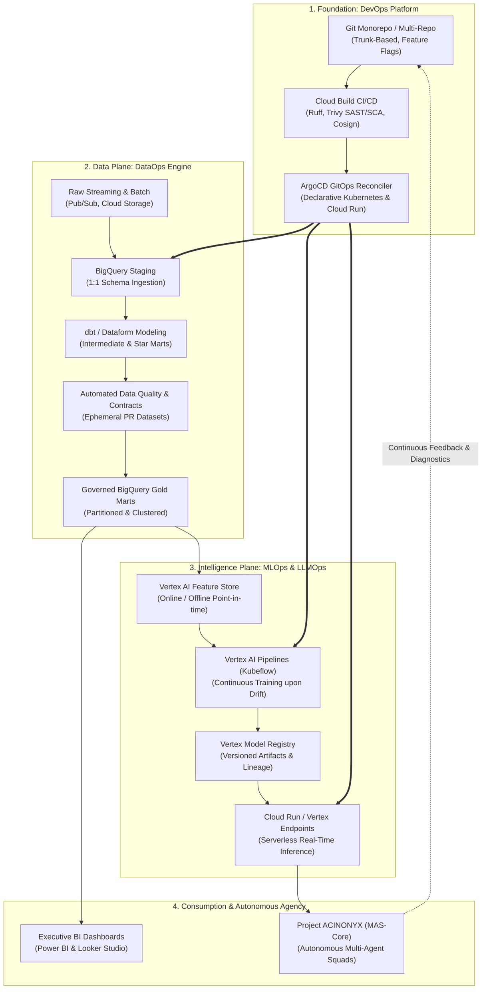
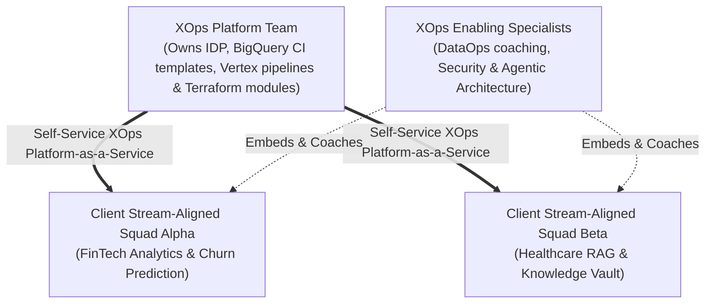

# Enterprise XOps Convergence: The Acinonyx Implementation Blueprint

> **Acinonyx Enterprise Systems Research Directorate**  
> **Compendium Series:** The XOps Trinity (DevOps, DataOps & MLOps)  
> **Module Code:** `RES-XOPS-2026-CH04`  
> **Target Enterprise Archetype:** Acinonyx Consulting Group (ACG) / Cloud Data, AI & Multi-Agent Practices

---

## 1. Executive Vision: The Unified XOps Operating Model

In high-performing modern technology firms, operating DevOps, DataOps, and MLOps as separate departments with incompatible tools produces **fractured ownership, communication overhead, and delivery bottlenecks**.

The **Acinonyx XOps Operating Model** unifies all three disciplines into a single continuous delivery pipeline on Google Cloud Platform:



---

## 2. The End-to-End Google Cloud Reference Stack

| Layer | Functional Capability | Primary GCP / Cloud Tool | Open-Source / Alternative |
|---|---|---|---|
| **DevOps** | Version Control & CI/CD | GitHub Enterprise + Cloud Build | GitLab CI |
| **DevOps** | Infrastructure as Code | Terraform (Google Provider) | OpenTofu |
| **DevOps** | Deployment & GitOps | ArgoCD + Cloud Run / GKE | Flux CD |
| **DevOps** | Security & Supply Chain | Artifact Registry + Sigstore/Cosign | Trivy / Grype |
| **DataOps** | Storage & Analytics Warehouse | Google Cloud BigQuery | Snowflake / Databricks |
| **DataOps** | Transformation & Modeling | dbt-core / Dataform | SQLMesh |
| **DataOps** | Data Catalog & Observability | Google Cloud Dataplex | Monte Carlo / DataHub |
| **DataOps** | Orchestration & DAGs | Cloud Composer (Apache Airflow 2/3) | Dagster |
| **MLOps** | Feature Management | Vertex AI Feature Store | Feast |
| **MLOps** | Pipeline Orchestration | Vertex AI Pipelines | Kubeflow Pipelines |
| **MLOps** | Model Registry & Tracking | Vertex AI Model Registry + Experiments | MLflow |
| **MLOps** | Serving & Inference | Vertex AI Endpoints + Cloud Run | vLLM / Triton |
| **LLMOps** | Vector Database & RAG | Vertex Vector Search | pgvector / Qdrant |
| **Agentic** | Autonomous Multi-Agent Runtime | Project ACINONYX (`mas/`) | LangGraph / CrewAI |

---

## 3. Team Topologies for Enterprise XOps

Following the **Team Topologies** organizational framework, Acinonyx structures human engineers and autonomous agents to eliminate siloed handoffs:



1. **The XOps Platform Team:** Maintains the Internal Developer Platform (IDP), reusable Terraform modules, ephemeral BigQuery dataset actions, and Vertex AI Kubeflow pipeline templates. They treat internal developers as customers.
2. **Stream-Aligned Client Squads:** Cross-functional teams composed of data analysts, ML engineers, software developers, and domain consultants dedicated to an end-to-end client engagement.
3. **Enabling Specialists:** Elite subject matter experts who temporarily embed with client squads to resolve complex technical hurdles (e.g., zero-downtime database cutovers or adversarial LLM security).

---

## 4. Multi-Agent Autonomous Roles in the XOps Lifecycle

In Project ACINONYX, autonomous agent squads participate directly across the XOps lifecycle, functioning as force multipliers for human consultants:

```
┌────────────────────────────────────────────────────────────────────────┐
│             ACINONYX MULTI-AGENT SQUAD XOPS RESPONSIBILITIES           │
├──────────────────┬─────────────────────────────────────────────────────┤
│ AGENT            │ XOPS RESPONSIBILITY                                 │
├──────────────────┼─────────────────────────────────────────────────────┤
│ client_director  │ Ingests client RFP, locks scope jail, maps business │
│                  │ KPIs to technical SLOs.                             │
├──────────────────┼─────────────────────────────────────────────────────┤
│ product_lead     │ Defines Gherkin acceptance criteria, data dictionary│
│                  │ schemas, and business metric formulas.              │
├──────────────────┼─────────────────────────────────────────────────────┤
│ lead_architect   │ Defines OpenAPI contracts, C4 diagrams, ADRs, and   │
│                  │ BigQuery partitioning/clustering specifications.    │
├──────────────────┼─────────────────────────────────────────────────────┤
│ data_engineer    │ Authors dbt models, SQL staging transformations,    │
│                  │ Great Expectations suites, and Data Contracts.      │
├──────────────────┼─────────────────────────────────────────────────────┤
│ VectorRAGArch    │ Manages vector chunking, embedding generation,      │
│                  │ and RAGAS hallucination evaluation benchmarks.      │
├──────────────────┼─────────────────────────────────────────────────────┤
│ senior_engineer  │ Synthesizes Python microservices, Cloud Run         │
│                  │ Dockerfiles, and unit test suites.                  │
├──────────────────┼─────────────────────────────────────────────────────┤
│ qa_critic        │ Runs sandboxed tests, mutation testing, BigQuery    │
│                  │ dry-run cost checks, and dialectical critiques.     │
├──────────────────┼─────────────────────────────────────────────────────┤
│ CIOAgent         │ Performs infrastructure audits, secret detection,   │
│                  │ dependency vulnerability scans, and DORA tracking.  │
└──────────────────┴─────────────────────────────────────────────────────┘
```

---

## 5. Master Implementation Roadmap for Acinonyx Consulting

To execute client engagements with world-class velocity and zero defects, execute this standard 6-phase operational protocol:

### Phase 1: Intake & Scope Locking (Days 1–3)
- `client_director` ingests RFP and client architecture documents.
- Lock the **Scope Jail**: Explicitly document deliverables, non-functional requirements, and excluded items.
- Define client data boundary and IAM least-privilege service accounts.

### Phase 2: Architecture & Contract Definition (Days 4–7)
- `lead_architect` and `data_engineer` author formal **Data Contracts** (`data-contract.yml`) and **OpenAPI 3.1 specifications**.
- Author Architectural Decision Records (ADRs) under `/docs/adr/`.
- Specify BigQuery partitioning and clustering criteria.

### Phase 3: DataOps Pipeline & Ephemeral CI (Weeks 2–3)
- Scaffold dbt / Dataform models across the three tiers (`staging` $\rightarrow$ `intermediate` $\rightarrow$ `marts`).
- Configure GitHub Actions with BigQuery dry-run cost validation and ephemeral PR dataset provisioning.
- Deploy Cloud Composer DAGs for automated production scheduling.

### Phase 4: MLOps / LLMOps Model Pipeline (Weeks 4–5)
- Orchestrate Vertex AI Pipelines (Kubeflow) for model training or RAG vector indexing.
- Configure Vertex AI Model Monitoring to track statistical feature drift (PSI $\ge 0.2$ trigger).
- Deploy inference endpoints to Cloud Run or Vertex Endpoints with canary routing.

### Phase 5: Client UAT & Dual-Run Reconciliation (Week 6)
- Connect Power BI and Looker Studio to BigQuery Gold marts.
- Execute dual-run reconciliation queries comparing new pipeline outputs against legacy client databases ($\ge 99.99\%$ match).
- Secure formal client sign-off on executive dashboards.

### Phase 6: Handover, Observability & Managed SRE (Week 7+)
- Publish automated data lineage in Google Cloud Dataplex.
- Configure PagerDuty / SRE alerts on BigQuery slot saturation and pipeline failure.
- Deliver client technical runbooks and conduct operational handover training.

---

*Compiled and published by Project ACINONYX Research Directorate.*
