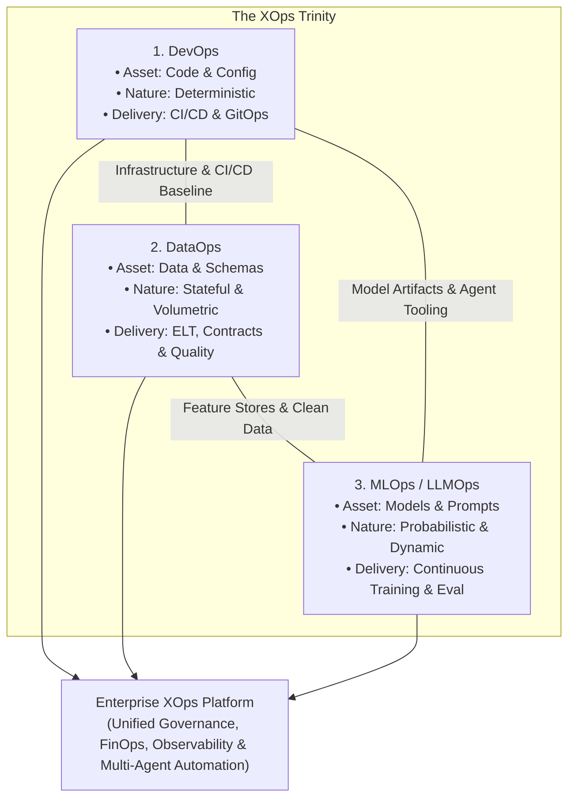

# The XOps Trinity: DevOps, DataOps & MLOps Master Compendium

> **Acinonyx Enterprise Systems Research Directorate**  
> **Document Code:** `RES-XOPS-2026-v1`  
> **Standard Alignment:** ISO/IEC/IEEE 12207:2026, Google MLOps Maturity Model, DataOps Manifesto, NIST SP 800-218  
> **Target Architecture:** Google Cloud Platform (BigQuery, Vertex AI, Cloud Run, GKE) & Multi-Agent Autonomous Practices

---

## 1. Executive Summary: The Convergence of the Operational Disciplines

In modern enterprise software and AI engineering, high velocity and operational stability cannot be achieved by treating software, data, and machine learning as disconnected silos. Over the past decade, three operational paradigms have emerged from Agile and Lean principles to govern these distinct assets:

1. **DevOps (Development & Operations):** Optimizes the lifecycle of **deterministic, stateless application code** through continuous integration, automated testing, containerization, and GitOps delivery.
2. **DataOps (Data Operations):** Optimizes the lifecycle of **stateful, distributed data pipelines** through schema contracts, modular transformation tiers, automated data quality assertions, and ephemeral staging environments.
3. **MLOps & LLMOps (Machine Learning Operations):** Optimizes the lifecycle of **probabilistic machine learning models and generative AI agents** through continuous training, feature stores, experiment tracking, drift detection, and evaluation harnesses.

As of 2026, leading organizations are transitioning from isolated toolchains to a **converged Platform Engineering and XOps model**. DevOps provides the foundational infrastructure and CI/CD engine; DataOps supplies verified, governed datasets; and MLOps/LLMOps operationalizes intelligent predictive models and autonomous multi-agent systems.

---

## 2. Comparative Matrix: DevOps vs. DataOps vs. MLOps

| Architectural Dimension | DevOps | DataOps | MLOps & LLMOps |
|---|---|---|---|
| **Primary Asset** | Source code, compiled binaries, container images. | Data tables, streaming events, database schemas. | Weights, hyperparameters, training datasets, prompts, embeddings. |
| **Asset Nature** | **Deterministic:** Code executed with identical inputs yields identical outputs. | **Stateful & Volumetric:** Data accumulates, mutates, and changes distribution over time. | **Probabilistic:** Models output probabilistic distributions; non-deterministic inference. |
| **Core Artifact Versioning** | Git commits, semantic tags, OCI image hashes (SHA-256). | Git for DDL/SQL; time-travel snapshots (Iceberg, Delta, BigQuery). | Git for pipeline code + DVC/MLflow/Vertex Metadata for model weights and dataset versions. |
| **Pipeline Cadence** | **CI/CD:** Continuous Integration & Continuous Delivery (minutes to hours). | **ELT / Orchestration:** Continuous streaming or scheduled batches (hourly, daily). | **CI/CD/CT:** Continuous Integration, Delivery, and **Continuous Training (CT)** upon drift. |
| **Primary Failure Modes** | Syntax errors, broken builds, memory leaks, unhandled exceptions. | Silent data corruption, null spikes, schema drift, stale data, query cost explosion. | Concept drift, data drift, training-serving skew, model hallucinations, adversarial prompt injection. |
| **Automated Testing Focus** | Unit, integration, contract (Pact), mutation, end-to-end UI tests. | Schema integrity, uniqueness, non-null, referential integrity, row-count anomaly tests. | Accuracy/F1 score, latency, fairness/bias, perplexity, RAG hallucination checks (RAGAS). |
| **Production Monitoring** | CPU/RAM utilization, error rates ($5\text{xx}$), P95/P99 latency, request volume. | Freshness, schema changes, distribution shifts, row volume, BigQuery slot usage. | Data drift (PSI, KS-test), prediction drift, ground truth accuracy decay, token spend. |
| **Core Standards & Frameworks** | DORA Metrics, NIST SP 800-218 (SSDF), SLSA, OpenGitOps. | DataOps Manifesto, Great Expectations, dbt Testing Matrix, Data Contracts. | Google MLOps Maturity Model (Levels 0–2), MLflow, Vertex AI Pipelines, Kubeflow. |

---

## 3. Compendium Directory & Deep Dive Modules

This compendium is partitioned into four exhaustive reference treatises:

| Module | Title | Primary Architectural Focus |
|---|---|---|
| **[Module 1](file:///home/acinonyx/Desktop/MAS/research/devops_dataops_mlops/01_devops_deep_dive_and_platform_engineering.md)** | **[DevOps & Platform Engineering](file:///home/acinonyx/Desktop/MAS/research/devops_dataops_mlops/01_devops_deep_dive_and_platform_engineering.md)** | CI/CD automation, trunk-based development, GitOps with ArgoCD, Infrastructure as Code (Terraform), Shift-Left DevSecOps (NIST SSDF), SRE error budgets, OpenTelemetry, DORA 4 metrics. |
| **[Module 2](file:///home/acinonyx/Desktop/MAS/research/devops_dataops_mlops/02_dataops_lifecycle_and_analytical_engineering.md)** | **[DataOps & Modern Analytics Engineering](file:///home/acinonyx/Desktop/MAS/research/devops_dataops_mlops/02_dataops_lifecycle_and_analytical_engineering.md)** | DataOps Manifesto, three-tier BigQuery modeling (`staging`, `intermediate`, `marts`), dbt/Dataform testing, dry-run query cost validation, ephemeral PR datasets, Data Contracts, Dataplex observability. |
| **[Module 3](file:///home/acinonyx/Desktop/MAS/research/devops_dataops_mlops/03_mlops_and_llmops_production_architectures.md)** | **[MLOps & LLMOps Production Architectures](file:///home/acinonyx/Desktop/MAS/research/devops_dataops_mlops/03_mlops_and_llmops_production_architectures.md)** | Google MLOps 3-level maturity model, Vertex AI Pipelines (Kubeflow), Feature Stores, Model Registries, Data/Concept drift detection (PSI, KS-test), Continuous Training (CT), LLMOps RAG evaluation & FinOps. |
| **[Module 4](file:///home/acinonyx/Desktop/MAS/research/devops_dataops_mlops/04_enterprise_convergence_and_acg_implementation.md)** | **[Enterprise Convergence & The ACG Blueprint](file:///home/acinonyx/Desktop/MAS/research/devops_dataops_mlops/04_enterprise_convergence_and_acg_implementation.md)** | Unified implementation for **Acinonyx Consulting Group (ACG)**: End-to-end reference architecture uniting BigQuery DataOps, Vertex AI MLOps, Cloud Run serving, Looker BI, and MAS-Core autonomous agent squads. |

---

*Authored by Project ACINONYX Research Directorate.*
