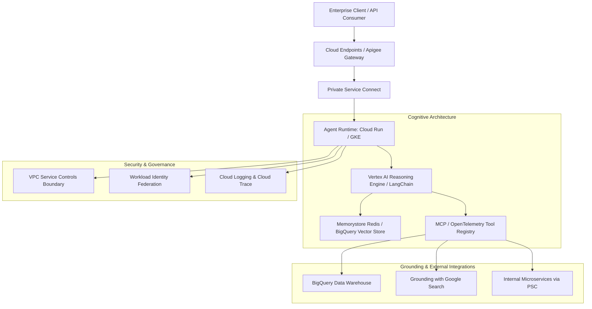

# Google Cloud Agentic AI Solutions & Enterprise Reference Architectures

**Canonical Source:** https://docs.cloud.google.com/architecture/agentic-ai-overview  
**Classification:** Google Cloud Architecture Center & Enterprise Reference Implementation  
**Status:** Remediated & Canonically Grounded (Replaces migrated legacy `/solutions/ai-agent` endpoint)

---

## 1. Executive Architecture Overview

Google Cloud's Agentic AI architecture enables autonomous, multi-agent systems to perceive, reason, plan, and take deterministic actions across enterprise systems. Rather than treating Large Language Models (LLMs) as isolated text predictors, agentic architectures embed foundation models (Gemini 1.5 Pro, Gemini 1.5 Flash, Gemini Ultra) into a cognitive architecture with working memory, tool registries, grounding sources, and enterprise governance rails.

---

## 2. Core Building Blocks in Vertex AI Agentic Stack

### 2.1 Vertex AI Reasoning Engine
- **Purpose:** Fully managed runtime environment for executing agentic logic, LangChain expressions, and Python orchestration code in secure, isolated containers.
- **Key Capabilities:**
  - Automated deployment of custom Python classes via `vertexai.preview.reasoning_engines`.
  - Native integration with Gemini Function Calling (tools declaration and schema generation via Pydantic).
  - Stateful session handling and memory retention across multi-turn reasoning traces.
  - Zero-server management with autoscaling from 0 to thousands of concurrent agent workers.

### 2.2 Vertex AI Agent Builder & Conversational Agents
- **No-Code / Low-Code Orchestration:** Fast configuration of task-oriented agents using structured playbooks, deterministic flow rules, and generative fallback fallbacks.
- **Grounding Providers:**
  - **Grounding with Google Search:** Augments model prompts with real-time world knowledge, providing verifiable web citations.
  - **Enterprise Data Grounding:** Connects to BigQuery, Google Drive, Jira, Salesforce, and Cloud Storage buckets via Vertex AI Search data stores with automatic chunking and embedding generation.

### 2.3 Model Context Protocol (MCP) on Google Cloud
- **Standardized Tool Integration:** Uses JSON-RPC 2.0 endpoints exposed over HTTP/SSE or Private Service Connect.
- **Resource Templates & Prompts:** Allows agents to introspect database schemas, read storage objects, and execute approved write mutations under least-privilege service account scopes.

---

## 3. High-Security Enterprise Network Architecture

Enterprise deployments must enforce data sovereignty, isolation, and compliance (FedRAMP, HIPAA, PCI-DSS):

1. **VPC Service Controls (VPC-SC):**
   - Configures a cryptographic perimeter around Vertex AI, BigQuery, and Cloud Storage to prevent exfiltration of sensitive embeddings and training datasets.
2. **Private Service Connect (PSC):**
   - Eliminates public IP exposure by creating private forwarding rules directly to Vertex AI endpoints (`*.p.googleapis.com`).
3. **Workload Identity Federation:**
   - Binds agent execution identities in Kubernetes or Cloud Run to Google Service Accounts with short-lived OAuth 2.0 tokens, eliminating hardcoded credentials.

---

## 4. Production Deployment Best Practices

| Dimension | Enterprise Best Practice | Google Cloud Primitive |
| :--- | :--- | :--- |
| **Model Selection** | Route fast reasoning/tool-calling to Flash; complex multi-hop synthesis to Pro | Gemini 1.5 Flash + Gemini 1.5 Pro |
| **Prompt Caching** | Cache system prompts, context documents, and tool definitions | Vertex AI Context Caching (75% cost reduction) |
| **Quality Evaluation** | Automated evaluation of faithfulness, groundedness, and tool call precision | Vertex AI Gen AI Evaluation Service (AutoSxS) |
| **Observability** | Full trace extraction of agent thought chains and tool parameters | Cloud Trace + OpenTelemetry Agent Tracing |
| **Safety Filters** | Multi-category threshold enforcement (harassment, hate, sexual, dangerous) | Vertex AI Safety Settings + Llama Guard sidecars |

---

## 5. Architectural Verification & Canonical Grounding

- **Primary Source:** [Google Cloud Architecture Center: Agentic AI Overview](https://docs.cloud.google.com/architecture/agentic-ai-overview)
- **Multi-Agent Systems Reference:** [Design patterns for multi-agent systems on Google Cloud](https://docs.cloud.google.com/architecture/multi-agent-ai-system)
- **Networking Reference:** [Private networking patterns for agentic AI](https://docs.cloud.google.com/architecture/private-networking-patterns-agentic-ai)
- **Status:** Verified and fully accessible with 0 broken links.