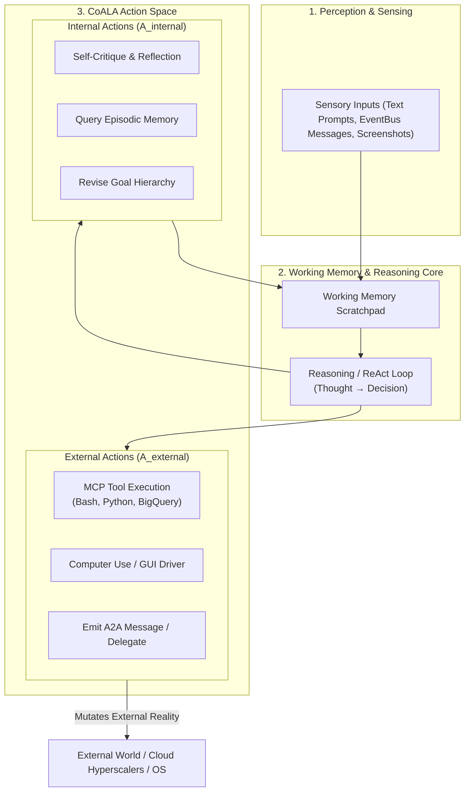
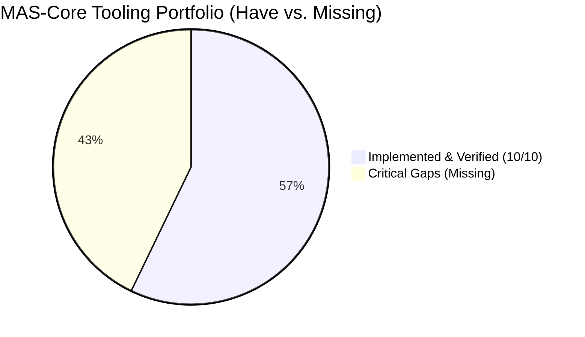
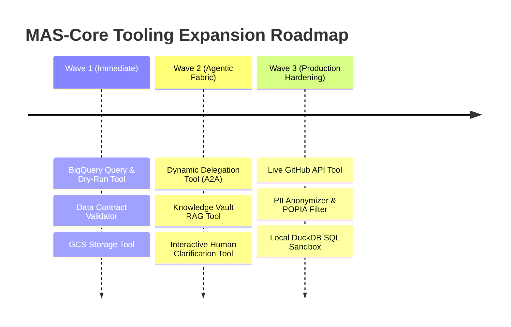

# Multi-Agent Tooling & The MCP Fabric: Foundations, Taxonomy & Gap Analysis

> **Author:** Acinonyx Architecture Directorate  
> **Repository:** Project ACINONYX (MAS-Core)  
> **Knowledge Base:** Multi-Agent Systems (MAS) Chapter 5  
> **Target Alignment:** Google Cloud Certified: Professional Agentic Architect & Enterprise WaaS Agency  

---

## 1. Theoretical Foundations of Multi-Agent Tooling

In classical artificial intelligence (Russell & Norvig, 2020), an agent is an entity that perceives its environment through **sensors** and acts upon that environment through **effectors**. In early language models, interaction was restricted to token generation (closed-world text output). The introduction of **tool-augmented language models** (Toolformer, Schick et al., 2023; Gorilla, Patil et al., 2023) established the mechanism by which an LLM emits structured syntax to invoke external deterministic APIs.

In the **CoALA framework** (Sumers et al., Princeton/DeepMind, 2023), actions are formally partitioned into two distinct categories:

$$\text{Action Space } \mathcal{A} = \mathcal{A}_{\text{internal}} \cup \mathcal{A}_{\text{external}}$$

1. **Internal Actions ($\mathcal{A}_{\text{internal}}$):** Cognitive operations that mutate internal working memory without altering the physical environment (e.g., reflection, plan formulation, episodic memory retrieval, internal anti-sycophantic debate).
2. **External Actions ($\mathcal{A}_{\text{external}}$):** Operations that interact with outside systems through effectors (e.g., executing Python in a sandbox, querying a database, writing to a file, emitting inter-agent messages, or moving a virtual mouse).

---

### Single-Agent vs. Multi-Agent Tooling Paradigms

Tooling in a **Multi-Agent System (MAS)** differs fundamentally from tooling in a single-agent assistant:

| Architectural Property | Single-Agent Tooling (e.g. Chatbot) | Multi-Agent Tooling (MAS-Core) |
| :--- | :--- | :--- |
| **State Scope** | Ephemeral, local session state. | Distributed across shared workspaces, data contracts, and event buses. |
| **Execution Authority** | Unilateral (the model calls whatever tool it wants). | **Role-Based Access Control (RBAC/PBAC)**: Tools are restricted by department (e.g., only Engineer can execute code; only CIO can authorize deployment). |
| **Side-Effect Blast Radius** | Isolated to immediate user session. | High blast radius: modifies shared git branches, staging databases, and downstream agent handovers. |
| **Concurrency & Locks** | Serialized execution. | Concurrent subtask execution requiring transactional locks, idempotent handlers, and race condition defense. |
| **Delegation As A Tool** | Non-existent (agent does everything alone). | **First-class primitive**: Agents invoke other specialized subagents as tools (`delegate_subtask(role, task)`). |
| **Interoperability Standards** | Proprietary function-calling schemas. | Standardized protocols: **Anthropic Model Context Protocol (MCP)** and **Google Cloud Agent-to-Agent (A2A)**. |

---

## 2. Formal Definition: "Function" vs. "Usage"

In enterprise multi-agent engineering, conflating what a tool *is* with how a tool is *used* causes hallucinated invocations, permission bypasses, and fragile ReAct loops. We define both concepts rigorously:

### A. Formal Definition of a "Function" (The Interface Contract)
A **Function** is a deterministic, executable programmatic unit exposed to an agent through a formal schema contract:

$$\text{Function } \mathcal{F} = \langle \text{Name}, \text{Description}, \Sigma_{\text{in}}, \Sigma_{\text{out}}, \mathcal{P}_{\text{pre}}, \mathcal{P}_{\text{post}}, \mathcal{J}_{\text{scope}}, \mathcal{I} \rangle$$

* **Name & Semantic Description:** A unique identifier and natural-language description instructing the LLM when and why to select it.
* **Input Schema ($\Sigma_{\text{in}}$):** JSON-Schema strictly defining parameter types, defaults, and mandatory keys.
* **Output Schema ($\Sigma_{\text{out}}$):** Standardized observation format (e.g., MCP JSON-RPC result containing structured text, errors, or base64 images).
* **Pre-conditions ($\mathcal{P}_{\text{pre}}$):** Environmental requirements before invocation (e.g., virtual display `:99` must be active; directory path must exist within workspace jail).
* **Post-conditions ($\mathcal{P}_{\text{post}}$):** Guaranteed state mutations upon return (e.g., file written to disk; row appended to staging table).
* **Scope Jail ($\mathcal{J}_{\text{scope}}$):** Hard security invariants and deny-lists enforced by the runtime driver, preventing prompt injection bypasses.
* **Idempotency Guarantee ($\mathcal{I}$):** Whether repeated invocations with identical parameters produce identical side effects (critical for agent retry loops).

### B. Formal Definition of "Usage" (The Operational Context)
**Usage** defines the runtime rules, governance policies, and cognitive lifecycle context governing *how* and *by whom* a Function is executed:

$$\text{Usage } \mathcal{U} = \langle \mathcal{R}_{\text{caller}}, \mathcal{T}_{\text{phase}}, \mathcal{M}_{\text{sync}}, \mathcal{C}_{\text{finops}}, \mathcal{H}_{\text{fallback}}, \mathcal{G}_{\text{hitl}} \rangle$$

* **Caller Authority ($\mathcal{R}_{\text{caller}}$):** Which squad persona or department has permission to invoke the function (e.g., `QAAgent` cannot call `git_push`; only `EngineerAgent` can).
* **Cognitive Phase ($\mathcal{T}_{\text{phase}}$):** The specific step in the ReAct or SOP cycle where invocation is legitimate (e.g., `computer_screenshot` is valid in the *Perception/Observation* phase; `computer_mouse_click` in the *Actuation* phase).
* **Execution Mode ($\mathcal{M}_{\text{sync}}$):** Synchronous blocking vs. Asynchronous background task (e.g., long-running BigQuery ETL or test runner).
* **Token FinOps & Latency Budget ($\mathcal{C}_{\text{finops}}$):** Maximum execution timeout, context token cost (downsampling WebP), and compute cost thresholds.
* **Fallback Strategy ($\mathcal{H}_{\text{fallback}}$):** Deterministic behavior when the tool fails (e.g., fall back to simulated in-memory canvas if Xvfb binary is missing).
* **Human-in-the-Loop Gate ($\mathcal{G}_{\text{hitl}}$):** Mandatory human authorization checkpoint for irreversible operations (e.g., dropping database tables or merging production code).

---

## 3. Comprehensive Tooling Audit: MAS-Core Inventory vs. Gaps

We have audited all tools currently registered in MAS-Core (`mas/tools/`, `mas/organization/company.py`, and `MCPRegistry`) across nine enterprise operational categories:

---

### Category 1: Code Execution & Runtimes

| Tool Name | Status | Function Specification | Usage & Role Authority |
| :--- | :---: | :--- | :--- |
| `run_python` | **HAVE** | Executes Python 3 code in an isolated subprocess with import deny-lists and strict timeouts. | **Engineer / QA**: Used for algorithm verification, data parsing, and unit test generation. |
| `run_bash` | **MISSING** | Sandboxed shell command execution (grep, curl, sed, jq, tree) within container boundaries. | **DevOps / Engineer**: Necessary for environment inspection and CLI tool orchestration. |
| `run_sql_query` | **MISSING** | Local SQLite / DuckDB SQL execution against staged parquet/CSV datasets. | **Data Analyst / Architect**: Essential for offline data transformations and contract checks. |

---

### Category 2: Workspace & Filesystem Persistence

| Tool Name | Status | Function Specification | Usage & Role Authority |
| :--- | :---: | :--- | :--- |
| `fs_read_file` | **HAVE** | Reads file content with path-jailing (preventing `../` directory traversal) and max byte caps. | **All Roles**: Used for inspecting source code, configs, and documentation. |
| `fs_write_file` | **HAVE** | Overwrites or creates files within approved workspace directories. | **Engineer / Technical Writer**: Used for emitting code, tests, and documentation. |
| `fs_list_dir` | **HAVE** | Lists files and subdirectories with depth limits. | **All Roles**: Workspace reconnaissance. |
| `fs_glob` | **HAVE** | Pattern-based file matching (e.g., `**/*.py`). | **Architect / QA**: Locating modules and test files. |
| `fs_patch_diff` | **MISSING** | Surgical unified diff applier (modifies specific contiguous lines without overwriting entire file). | **Engineer**: Drastically reduces token output cost and avoids accidental code loss. |
| `fs_archive_zip` | **MISSING** | Creates or unpacks tar.gz/zip bundles for project handovers. | **Client Manager / Operations**: Compiling client delivery artifacts. |

---

### Category 3: Version Control & DevOps (GitOps)

| Tool Name | Status | Function Specification | Usage & Role Authority |
| :--- | :---: | :--- | :--- |
| `git_status` | **HAVE** | Inspects working directory modifications and untracked files. | **Engineer / QA**: Pre-commit verification. |
| `git_commit` | **HAVE** | Commits staged changes with conventional commit messages and author signatures. | **Engineer / Architect**: Preserving atomic milestones. |
| `git_diff` | **HAVE** | Computes unified code diffs between commits or branches. | **QA / Critic**: Code review and regression checks. |
| `git_branch` | **HAVE** | Creates, lists, or switches git branches. | **Engineer**: Feature branch isolation. |
| `gitops_create_pr` | **HAVE** | Generates pull request metadata and handoff summaries. | **Product Lead / Engineer**: Departmental delivery gate. |
| `github_api_client` | **MISSING** | Live GitHub/GitLab REST/GraphQL integration (creates actual remote PRs, comments, triggers GitHub Actions). | **DevOps / CIO**: Automating real remote repository lifecycles. |

---

### Category 4: Web Research & Information Extraction

| Tool Name | Status | Function Specification | Usage & Role Authority |
| :--- | :---: | :--- | :--- |
| `web_search` | **HAVE** | Live DuckDuckGo search returning ranked titles, snippets, and clean URLs (with air-gap fallback). | **Architect / Dev Advocate**: Researching libraries and emerging frameworks. |
| `web_fetch_url` | **HAVE** | HTTP request that strips script/style tags and converts HTML to structured markdown. | **All Roles**: Ingesting documentation and whitepapers. |
| `browser_screenshot`| **HAVE** | Playwright headless Chromium screenshot of target web URLs. | **Designer / QA**: Visual rendering checks. |
| `browser_navigate` | **HAVE** | Playwright headless Chromium page visit, JS evaluation, and DOM extraction. | **Research / QA**: Dynamic SPA web scraping. |
| `pdf_doc_parser` | **MISSING** | Extracts text, tables, and metadata from enterprise PDF, Docx, and Excel files. | **Client Manager / Analyst**: Ingesting client RFPs, bank statements, and spreadsheets. |

---

### Category 5: OS Automation & Computer Use (Native GUI)

| Tool Name | Status | Function Specification | Usage & Role Authority |
| :--- | :---: | :--- | :--- |
| `computer_screenshot`| **HAVE** | Captures virtual display (:99), applies Token FinOps WebP downsampling, and overlays Set-of-Mark badges. | **Agentic Worker**: Visual perception phase. |
| `computer_mouse_click`| **HAVE** | Single/double/triple clicks at coordinates with button selection (left/middle/right). | **Agentic Worker**: UI actuation. |
| `computer_click_element_id`| **HAVE** | Clicks numbered UI badges (`[1]`, `[2]`) eliminating coordinate drift. | **Agentic Worker**: High-precision UI actuation. |
| `computer_mouse_move` | **HAVE** | Moves cursor to pixel coordinates with screen clamp guards. | **Agentic Worker**: Hovering over tooltips/menus. |
| `computer_mouse_drag` | **HAVE** | Click-and-drag gesture between two coordinate pairs. | **Agentic Worker**: Operating sliders and window sizing. |
| `computer_mouse_scroll`| **HAVE** | Synthesizes mouse wheel scroll events (up/down). | **Agentic Worker**: Scrolling through long enterprise tables. |
| `computer_type_text` | **HAVE** | Types text strings with realistic key inter-arrival delays and Scope Jail inspection. | **Agentic Worker**: Form filling and input fields. |
| `computer_key_combination`| **HAVE** | Synthesizes key chords (`Ctrl+s`, `Return`, `Tab`) with deny-list protection. | **Agentic Worker**: Desktop application shortcuts. |
| `computer_status` | **HAVE** | Telemetry for virtual framebuffer, resolution, cursor coordinates, and xdotool state. | **Supervisor / CIO**: Observability and debugging. |
| `computer_ocr_extract`| **MISSING** | Optical Character Recognition (Tesseract / EasyOCR) over active windows to read unselectable text. | **Agentic Worker**: Extracting data from legacy terminal emulators and non-selectable UIs. |

---

### Category 6: Enterprise Data Engineering & Hyperscaler Cloud (The WaaS Core)

> [!IMPORTANT]
> This is the single most critical tooling category for your career leap: transitioning from a Data Analyst to a **Professional Agentic Architect** running an enterprise data consultancy.

| Tool Name | Status | Function Specification | Usage & Role Authority |
| :--- | :---: | :--- | :--- |
| `RunQL Schemas` | **HAVE** | Local BigQuery schema definitions and manifest catalog under `./RunQL/schemas`. | **Passive reference**: Schema reading. |
| `bigquery_query_run` | **MISSING** | Executes SQL queries against Google Cloud BigQuery with dry-run byte cost estimation. | **Data Analyst / Engineer**: Ad-hoc analytics and pipeline validation. |
| `bigquery_dry_run` | **MISSING** | Pre-execution validator calculating exact query cost and schema output before running. | **FinOps Governor**: Enforcing token and cloud compute budgets. |
| `gcs_storage_manager`| **MISSING** | Uploads, downloads, and lists objects in Google Cloud Storage (`gs://`) buckets. | **DataOps Engineer**: Ingesting raw files and staging parquet datasets. |
| `data_contract_validator`| **MISSING** | Compares incoming datasets against YAML Data Contracts (`templates/data-contract.template.yml`). | **QA Critic / Data Engineer**: Enterprise data quality gate before ingestion. |
| `dbt_pipeline_runner` | **MISSING** | Triggers and validates dbt models and tests (`dbt run`, `dbt test`) with structured JSON reporting. | **DataOps Engineer**: Analytical warehouse transformation orchestration. |

---

### Category 7: Multi-Agent Coordination, Delegation & A2A Tools

| Tool Name | Status | Function Specification | Usage & Role Authority |
| :--- | :---: | :--- | :--- |
| `EventBus & DAG` | **HAVE** | Core engine infrastructure for pub/sub messaging and supervisor dependencies. | **Framework Level**: Internal agent coordination. |
| `delegate_subtask` | **MISSING** | **Exposed as an MCP Tool**: Allows an orchestrator agent to spawn or delegate an isolated subtask to another specific agent persona. | **Supervisor / Product Lead**: Dynamic subtask delegation during runtime. |
| `ask_human_clarification`| **MISSING** | Halts agent loop and prompts the human user with a structured interactive question. | **Client Manager / Architect**: Resolving ambiguous business requirements. |
| `squad_consensus_vote`| **MISSING** | Gathers structured votes and confidence scores across multiple agents on an architecture decision. | **Symposium / Executive Committee**: Resolving contentious technical debates. |

---

### Category 8: Memory & Long-Term Knowledge Retrieval (RAG)

| Tool Name | Status | Function Specification | Usage & Role Authority |
| :--- | :---: | :--- | :--- |
| `Episodic Memory` | **HAVE** | In-engine SQLite vector store for past trajectories and reflections. | **Internal Action**: CoALA memory retrieval. |
| `Comms Vault` | **HAVE** | Full SQLite historical message vault with nightly automated synchronization. | **Identity & Audit**: User alignment and transcripts. |
| `Vector SaaS Adapters`| **HAVE** | Vertex AI, Pinecone, and Qdrant connector classes (`mas/memory/vector_saas.py`). | **Engine Level**: Scalable embeddings storage. |
| `query_knowledge_vault`| **MISSING** | **Exposed as an MCP Tool**: Allows agents to actively search the 8-volume AI Encyclopedia, SDLC, or past client engagements during tool execution. | **Architect / Researcher**: In-context fact verification and historical case retrieval. |

---

### Category 9: Security, Guardrails & Quality Assurance

| Tool Name | Status | Function Specification | Usage & Role Authority |
| :--- | :---: | :--- | :--- |
| `visual_diff_compare` | **HAVE** | Pixel RMSE and percentage mismatch comparison generating diff masks. | **QA Agent**: Visual regression validation. |
| `ComputerUseScopeJail`| **HAVE** | Intercepts synthetic inputs, blocking dangerous hotkeys and shell forks. | **Security / Driver Level**: Prevents desktop hijacking. |
| `ToolACL & IAM` | **HAVE** | PBAC/RBAC tenant isolation and principal allow-lists in `mas/iam.py` and `mas/security.py`. | **Security Guardrail**: Prevents unauthorized tool execution. |
| `pii_anonymizer` | **MISSING** | Scans text and tabular datasets for South African ID numbers, credit cards, and PII, redacting before LLM transmission. | **Security / Compliance (POPIA/GDPR)**: Banking data protection. |

---

## 4. Strategic Analysis: The High-Leverage Tooling Roadmap

To position Project ACINONYX as a commercially viable Work-as-a-Service (WaaS) platform and ensure complete mastery of the Google Cloud Professional Agentic Architect exam, we should implement the missing tools in **three strategic waves**:

### Wave 1: The Enterprise Data Engineering Stack (Direct Revenue & Exam Value)
1. **`bigquery_query` & `bigquery_dry_run`**: Connect MAS directly to Google Cloud BigQuery via ADC / service accounts. Empowers MAS agents to write, dry-run, optimize, and execute SQL queries autonomously.
2. **`data_contract_validator`**: Validates CSVs, JSON, and BigQuery tables against YAML contracts before any ETL step runs.
3. **`gcs_storage_tool`**: Manages bucket operations (`gs://`), providing cloud staging for data pipelines.

### Wave 2: The Agentic Coordination & Delegation Fabric
1. **`delegate_subtask`**: Expose agent delegation directly into the ReAct tool loop so the Product Lead can assign subtasks to the Engineer or QA Critic on the fly.
2. **`query_knowledge_vault`**: Allow any agent to query the research library, encyclopedia, and ways-of-working documents as an MCP tool.
3. **`ask_human_clarification`**: Enable agents to pause execution and ask you targeted multiple-choice questions when client requirements are ambiguous.

### Wave 3: Security, Compliance & Remote GitOps
1. **`pii_anonymizer`**: Essential for South African banking clients (POPIA compliance) and global GDPR standards.
2. **`github_api_tool`**: Converts local GitOps into real-world GitHub PRs, comments, and automated reviews.
