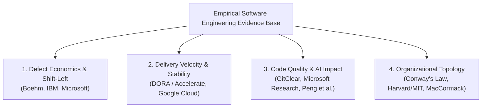
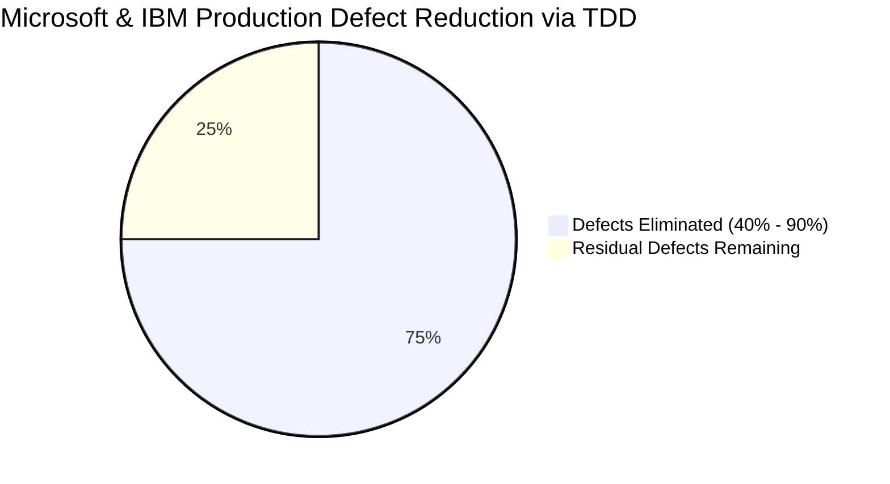
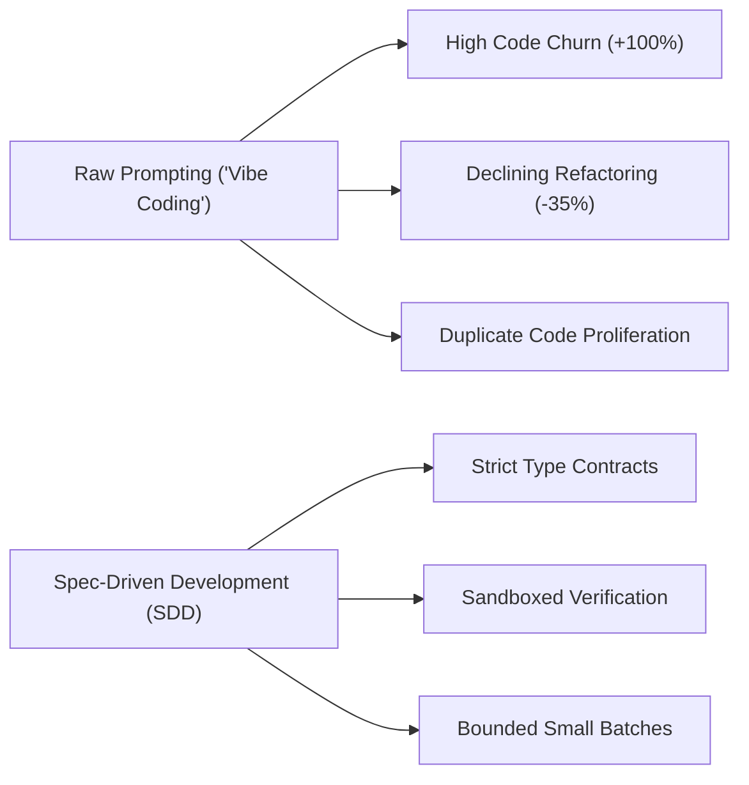

# Empirical Studies & Academic Foundations of the SDLC

> **Acinonyx Enterprise Systems Research Directorate**  
> **Compendium Series:** System Development Life Cycle (SDLC)  
> **Module Code:** `RES-SDLC-2026-CH01`  
> **Focus:** Quantitative Benchmarks, Statistical Correlations, and Seminal Software Engineering Research

---

## 1. Introduction: Moving from Dogma to Empirical Evidence

Software engineering has historically been plagued by methodological tribalism—heated debates over methodologies (Waterfall vs. Agile, Scrum vs. Kanban, TDD vs. Test-Last) conducted on intuition rather than empirical evidence. Over the past three decades, rigorous empirical software engineering research, spearheaded by organizations like IEEE, ACM, Microsoft Research, Google Cloud DORA, and academic institutions, has replaced subjective dogma with **statistically significant, replicable findings**.

This document indexes and synthesizes the seminal empirical studies that define what actually works in software development life cycles, what fails, and how emerging AI technologies alter these mathematical dynamics.



---

## 2. The Cost of Defect Curve: Boehm’s Law & The Economics of Shift-Left

### 2.1 Seminal Research: Barry Boehm (1981, 2001)
* **Citation:** Boehm, B. W. (1981). *Software Engineering Economics*. Prentice-Hall. Updated in Boehm, B., & Basili, V. R. (2001). *Software Defect Reduction Top 10 List*. IEEE Computer, 34(1), 135-137.
* **Sample Size & Methodology:** Meta-analysis of 63 industrial software projects across aerospace, telecommunications, government, and commercial sectors (TRW, IBM, GTE).
* **Core Empirical Finding:**
  The relative cost of finding and correcting a software defect increases **exponentially** the later it is discovered in the SDLC.
  
| Phase of Defect Discovery | Relative Cost to Repair (Normalized) | Empirical Cost Multiplier |
|---|:---:|:---:|
| **Requirements / Inception** | $1\times$ | Baseline ($100–$500) |
| **Architectural Design** | $3\times – 6\times$ | $300–$3,000 |
| **Implementation (Coding)** | $10\times$ | $1,000–$5,000 |
| **Integration / CI Testing** | $15\times – 40\times$ | $1,500–$20,000 |
| **System / Acceptance Testing** | $40\times – 100\times$ | $4,000–$50,000 |
| **Production / Post-Release** | $\mathbf{100\times – 200\times+}$ | $\mathbf{\$10,000 – \$1,000,000+}$ (Includes outage, data fix, SLA penalties) |

```
Cost to Repair Defect ($)
▲
│                                                          ████ [Production: 100x - 200x]
│                                                    ██████
│                                              ██████
│                                        ██████ [Acceptance Test: 40x - 100x]
│                                  ██████
│                            ██████ [Integration: 15x - 40x]
│                      ██████ [Coding: 10x]
│                ██████ [Architecture: 3x - 6x]
│          ██████ [Requirements: 1x]
└─────────────────────────────────────────────────────────────► SDLC Phase
```

### 2.2 Modern Relevance
Boehm's curve is the mathematical foundation for **Shift-Left Security (DevSecOps)** and **Spec-Driven Development (SDD)**. Catching an API contract mismatch or an authorization flaw during specification or pre-commit costs two orders of magnitude less than patching a live production vulnerability.

---

## 3. Test-Driven Development (TDD) and Defect Density

### 3.1 The Landmark Microsoft & IBM Industrial Case Study (2008)
* **Citation:** Nagappan, N., Maximilien, E. M., Bhat, T., & Williams, L. (2008). *Realizing quality improvement through test driven development: results and experiences of four industrial teams*. Empirical Software Engineering, 13(3), 289-302.
* **Context & Methodology:** Empirical investigation conducted across four independent product teams:
  - Three Microsoft product teams (Windows, MSN, Visual Studio).
  - One IBM product team (IBM WebSphere device software).
  - Comparative analysis against prior legacy baselines and sibling non-TDD teams using identical architectures.
* **Key Findings:**
  1. **Production Defect Reduction:** Production defect density dropped by **40% to 90%** across all four teams:
     - IBM Team: **40% reduction** in defect density.
     - Microsoft Team A: **62% reduction**.
     - Microsoft Team B: **76% reduction**.
     - Microsoft Team C: **91% reduction**.
  2. **Development Overhead:** TDD increased initial development time by **15% to 35%**.
  3. **Net Economic Return:** The 15–35% initial coding penalty was dramatically outweighed by an 80%+ drop in post-release maintenance, triage, emergency hotfixes, and customer support tickets.



### 3.2 Erdogmus, Morisio, & Torchiano Controlled Experiment (2005)
* **Citation:** Erdogmus, H., Morisio, M., & Torchiano, M. (2005). *On the effectiveness of the test-first approach to programming*. IEEE Transactions on Software Engineering, 31(3), 226-237.
* **Finding:** Programmers utilizing a test-first approach wrote statistically more tests and produced higher quality code without any statistically significant difference in overall task completion time compared to test-last developers.

---

## 4. Delivery Throughput, Stability, and DORA (Accelerate Research)

### 4.1 The Science of Lean Software and DevOps (2014–2024)
* **Citation:** Forsgren, N., Humble, J., & Kim, G. (2018). *Accelerate: The Science of Lean Software and DevOps: Building and Scaling High Performing Technology Organizations*. IT Revolution Press. Continued in annual Google Cloud *DORA State of DevOps Reports*.
* **Methodology:** 10+ years of cross-industry survey research encompassing over **36,000 software professionals globally**, analyzed using rigorous psychometric structural equation modeling (SEM) and latent construct clustering.
* **Primary Empirical Breakthrough:**  
  **Debunking the Speed vs. Quality False Dichotomy.**  
  Traditional IT management assumed that moving faster necessarily increases defects and outages. The DORA data mathematically disproved this: **High performers simultaneously achieve elite throughput (speed) AND elite stability (quality)**.

| Performance Tier | Deployment Frequency | Lead Time for Changes | Change Failure Rate | Time to Restore (MTTR) |
|---|:---:|:---:|:---:|:---:|
| **Elite Performers** | Multiple per day (on-demand) | $< 1$ hour | 0% – 5% | $< 1$ hour |
| **High Performers** | Once per week to once per month | 1 day to 1 week | 0% – 15% | $< 1$ day |
| **Medium Performers** | Once per month to every 6 months | 1 month to 6 months | 16% – 30% | 1 day to 1 week |
| **Low Performers** | Fewer than once every 6 months | $> 6$ months | 46% – 60% | 1 week to 1 month |

*Elite performers deploy **973x more frequently**, have a **6,570x faster lead time**, a **3x lower change failure rate**, and recover from downtime **2,604x faster** than low performers.*

### 4.2 Key Architectural Drivers Identified by DORA
The research proved that the following technical practices are causal drivers of high delivery performance:
1. **Trunk-Based Development:** Merging code into `main` at least daily; branches lasting $< 24$ hours. Long-lived feature branches showed statistically negative correlations with delivery velocity.
2. **Comprehensive Test Automation:** Automated test suites maintained by developers (not outsourced to separate QA silos).
3. **Loosely Coupled Architecture:** Service architectures allowing teams to deploy and test their services independently without coordination with 10 other teams.
4. **Shift-Left Security:** Integrating security checks directly into the continuous integration developer workflow.

---

## 5. The Empirical Impact of AI in the SDLC (2023–2026)

### 5.1 The DORA 2024–2025 Findings: "The AI Amplifier"
* **Citation:** Google Cloud DORA (2024). *Accelerate State of DevOps Report*. Google Cloud DORA (2025). *State of AI-Assisted Software Development Report*.
* **Key Findings:**
  1. **AI as an Amplifier:** AI does not fix defective software engineering processes. In high-performing teams with strong version control, small batch sizes, and automated testing, AI accelerated delivery by 30–45%. In low-performing teams with fragmented architectures and weak testing, AI **amplified instability and increased the Change Failure Rate**.
  2. **The "Speed vs. Stability" Warning:** 90% of developers use AI tools daily. However, teams that focused solely on raw code generation speed suffered higher failure rates. "Speed without stability is just accelerated chaos."
  3. **The 7 Systemic Prerequisites:** DORA's 2025 report identified 7 mandatory capabilities required to extract value from AI without degrading stability:
     - Clear organizational AI policy
     - Healthy internal data ecosystems
     - AI-accessible internal knowledge bases
     - Strict version control and branch discipline
     - User-centric feature validation
     - Quality internal developer platforms (IDP)
     - Working in small batches ($\le 200$ LOC PRs)

### 5.2 The GitClear Empirical Code Quality Study (2024)
* **Citation:** GitClear Research (2024). *Coding on Copilot: 2023 Data Shows Downward Pressure on Code Quality*.
* **Methodology:** Longitudinal analysis of **153 million lines of changed code** committed across thousands of open-source and commercial Git repositories between 2020 and 2023.
* **Empirical Findings:**
  1. **Skyrocketing Code Churn:** Code churn (the percentage of code pushed and reverted, modified, or deleted within two weeks) doubled from 2021 to 2023, correlating with widespread generative AI adoption.
  2. **Decline in Refactoring:** The percentage of "refactored" or updated existing code dropped significantly; the percentage of "added" (net-new) code surged. Developers were accepting verbose AI-generated code blocks rather than reusing existing modular abstractions.
  3. **Copy-Paste Proliferation:** A massive spike in duplicate and near-duplicate code blocks, increasing long-term maintenance overhead.



### 5.3 Microsoft Research & GitHub Copilot Productivity Experiment (Peng et al., 2023)
* **Citation:** Peng, S., Kalliamvakou, E., Cihon, P., & Demirer, M. (2023). *The Impact of AI on Developer Productivity: Evidence from GitHub Copilot*. arXiv:2302.06590.
* **Methodology:** Randomized controlled trial (RCT) with 95 professional software developers tasked with implementing an HTTP server in JavaScript.
* **Finding:** Developers assigned to use GitHub Copilot completed the task **55.8% faster** (71.1 minutes vs. 160.9 minutes) than the control group, with higher self-reported task completion rates (78% vs. 70%).

---

## 6. Organizational Design: Conway’s Law & Team Architecture

### 6.1 Melvin Conway’s Thesis (1968)
* **Citation:** Conway, M. E. (1968). *How Do Committees Invent?* Datamation, 14(4), 28-31.
* **Formulation:**  
  > *"Organizations which design systems are constrained to produce designs which are copies of the communication structures of these organizations."*

### 6.2 Empirical Validation: Harvard Business School & MIT (2012)
* **Citation:** MacCormack, A., Baldwin, C., & Rusnak, J. (2012). *Exploring the duality between product and organizational architectures: A test of the "mirroring" hypothesis*. Research Policy, 41(8), 1309-1324.
* **Methodology:** Detailed dependency-structure matrix (DSM) analysis comparing commercial closed-source software products against open-source products across matching functional categories.
* **Empirical Finding:**  
  Commercial software built by centralized, tightly coupled corporate teams was **significantly more monolithic and tightly coupled** across module boundaries. Software developed by loosely coupled, distributed open-source communities was **dramatically more modular and loosely coupled**.
* **Modern Implication (The Inverse Conway Maneuver):**  
  To achieve a modular, decoupled microservice or multi-agent architecture, an organization must first restructure its teams into small, independent, cross-functional stream-aligned squads (as formalized in *Team Topologies*).

---

## 7. Synthesis: The Empirical Axioms of Modern SDLC

Based on 50+ years of statistical, academic, and industrial research, any successful SDLC implementation must adhere to these empirical axioms:

1. **Axiom of Early Detection:** Defect resolution cost scales exponentially. Every automated test, linter, or formal spec shifted left saves $10\times$ to $100\times$ in production remediation costs.
2. **Axiom of Speed-Stability Unity:** High deployment frequency and low lead times correlate with higher stability, not lower stability, provided automated testing and trunk-based development are enforced.
3. **Axiom of Batch Size:** Large batch sizes (massive PRs, multi-month releases) exponentially increase change failure rates and cognitive review fatigue. Small batches ($\le 200$ LOC) are mandatory.
4. **Axiom of AI Governance:** Generative AI dramatically increases code synthesis speed, but without contract-driven specifications and automated mutation/security test gates, it rapidly degrades codebase maintainability through code churn and duplication.
5. **Axiom of Team Decoupling:** Software architecture will mirror organizational communication lines. High-velocity systems require autonomous, stream-aligned teams supported by self-service platform engineering.

---

*Compiled and verified by Project ACINONYX Research Directorate.*
