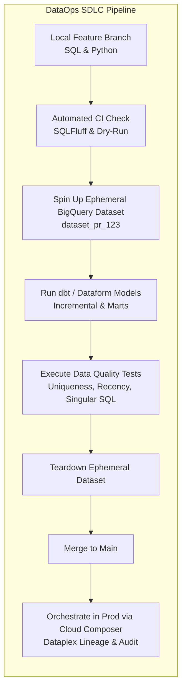
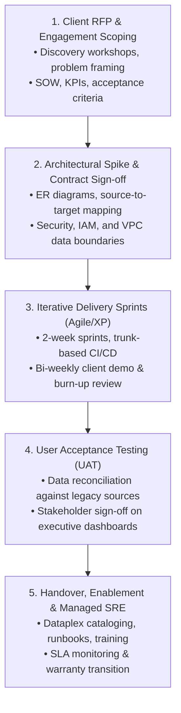
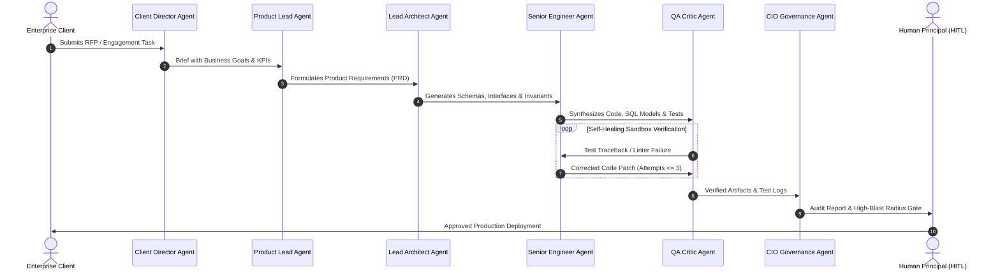

# SDLC Implementation in Cloud Data, AI & Consulting Enterprises

> **Acinonyx Enterprise Systems Research Directorate**  
> **Compendium Series:** System Development Life Cycle (SDLC)  
> **Module Code:** `RES-SDLC-2026-CH02`  
> **Target Enterprise Archetype:** Cloud Data & AI Consulting Firms, Professional Services & Autonomous Agentic Practices (Acinonyx Consulting Group Model)

---

## 1. Context: The Modern Data & AI Consulting Firm

A firm operating at the intersection of **Cloud Data Engineering (GCP / BigQuery / Looker / Power BI)**, **Enterprise IT Consulting / Professional Services**, and **Autonomous Multi-Agent Systems (Project ACINONYX)** faces unique SDLC requirements that traditional software engineering handbooks fail to address:

```
┌────────────────────────────────────────────────────────────────────────┐
│                   ENTERPRISE VALUE DELIVERY TRINITY                    │
└────────────────────────────────────────────────────────────────────────┘
              ▲                                      ▲
              │                                      │
   ┌──────────────────────┐              ┌──────────────────────┐
   │ 1. DATAOPS LIFECYCLE │              │ 2. CONSULTING SOW    │
   │  • BigQuery / dbt    │              │  • RFP Intake        │
   │  • Data Contracts    │              │  • SOW Scoping       │
   │  • Ephemeral Datasets│              │  • Client Handover   │
   └──────────────────────┘              └──────────────────────┘
              │                                      │
              └──────────────────┬───────────────────┘
                                 │
                     ┌──────────────────────┐
                     │ 3. AGENTIC SQUADS    │
                     │  • MAS-Core Roster   │
                     │  • Deterministic Sandbox│
                     │  • HITL Governance   │
                     └──────────────────────┘
```

1. **Data is Stateful & Probabilistic:** Unlike stateless web application code, data pipelines depend on historical state, changing distributions, upstream schema drifts, and multi-terabyte BigQuery compute costs.
2. **Client Consulting Dynamics:** Work is governed by Statements of Work (SOWs), strict data privacy boundaries, non-disclosure agreements, and client User Acceptance Testing (UAT) sign-offs.
3. **Agentic Augmentation:** Autonomous software squads (Lead Architect, Data Engineer, QA Critic) execute repetitive boilerplate, migration scripts, and test synthesis, demanding strict guardrails to prevent hallucinated transformations or client data leakage.

---

## 2. Part I: The DataOps SDLC on Google Cloud Platform (BigQuery Stack)

Applying traditional SDLC principles to cloud data engineering is formalized as **DataOps**. In a Google Cloud Platform ecosystem, the SDLC is structured around **BigQuery, dbt (or Dataform), Cloud Composer (Airflow), and Dataplex**.



### 2.1 The Three-Tier BigQuery Data Modeling Layer

To maintain architectural integrity and auditability, all BigQuery transformations must follow a strict three-tier schema hierarchy:

| Layer | BigQuery Dataset Naming | Materialization | Purpose & Engineering Constraints |
|---|---|---|---|
| **Staging (Bronze)** | `raw_staging` | View / Ephemeral | 1:1 reflection of raw source ingestion. Cleans column names, casts data types, handles JSON unnesting. **Zero business logic or joins permitted.** |
| **Intermediate (Silver)** | `analytics_intermediate` | Ephemeral / Incremental Table | Complex joins, surrogate key generation, deduplication, and window functions. Enforces enterprise entity definitions across business silos. |
| **Marts (Gold)** | `analytics_marts` (or domain specific: `finance_marts`) | Partitioned & Clustered Table | Business-ready dimensional models (Star Schema / Fact & Dimension tables) optimized for Power BI, Looker Studio, and executive consumption. |

### 2.2 BigQuery Cost & Performance Governance in CI

BigQuery queries are billed by data scanned (or slots consumed). A defective query committed to production can incur thousands of dollars in unintended cloud spend. The DataOps SDLC enforces pre-commit cost verification:

1. **BigQuery Dry-Run Validation in CI:**
   Before any PR is merged, an automated GitHub Action or Cloud Build step executes a `dry_run=True` scan on all altered SQL queries. If an individual query scans more than an established threshold (e.g., $> 50\text{ GB}$ for staging or $> 500\text{ GB}$ for marts), the CI pipeline automatically fails.
2. **Mandatory Partitioning & Clustering Rules:**
   - Any production table projected to exceed **10 GB** must define a partition key (typically date/timestamp).
   - High-cardinality filter and join columns (e.g., `client_id`, `merchant_id`, `status`) must be configured as BigQuery cluster keys (up to 4 columns).
3. **Incremental Materialization with Merge:**
   Large datasets must use dbt's `incremental` strategy with a `unique_key`, compiling to BigQuery's native atomic `MERGE` statement:
   ```sql
   {{
     config(
       materialized='incremental',
       unique_key='transaction_id',
       partition_by={
         "field": "transaction_timestamp",
         "data_type": "timestamp",
         "granularity": "day"
       },
       cluster_by=["client_id", "status"]
     )
   }}

   SELECT
       transaction_id,
       client_id,
       amount,
       status,
       transaction_timestamp,
       CURRENT_TIMESTAMP() AS ingestion_timestamp
   FROM {{ ref('stg_transactions') }}
   
     WHERE transaction_timestamp >= (
       SELECT MAX(transaction_timestamp) FROM {{ this }}
     )
   
   ```

### 2.3 Ephemeral CI Datasets (Zero Production Contamination)

A fundamental failure mode in enterprise data teams is testing queries directly in the production BigQuery dataset or a shared, dirty staging environment. 

**The Best Practice Standard:**
1. A developer creates branch `feature/revenue-leakage-fix`.
2. On PR submission, the CI pipeline generates a unique, isolated BigQuery dataset: `ci_scratch_pr_4815`.
3. The pipeline seeds sample data or runs lightweight upstream staging slices into this dataset.
4. All dbt models are compiled and executed against `ci_scratch_pr_4815`.
5. Automated schema, uniqueness, and custom business logic assertions run.
6. The CI pipeline drops `ci_scratch_pr_4815` upon completion, ensuring zero residual storage cost and zero production interference.

### 2.4 Data Contracts & Schema Change Governance

When upstream systems alter schemas (e.g., renaming `user_id` to `customer_uuid`), downstream BI dashboards break silently.

```
Upstream Application Database ──(Schema Drift: Renamed Column)──► 
    [Data Contract Gate: FAILS BUILD IN CI] ──► Downstream Looker / Power BI Protected!
```

To eliminate schema drift:
- Enforce **Data Contracts** defined in YAML schemas (`schema.yml`).
- Adopt the **Expand-Contract (Parallel Run) Pattern** for breaking schema updates:
  - *Phase 1 (Expand):* Add the new column alongside the legacy column; populate both via pipeline.
  - *Phase 2 (Migrate):* Update downstream Power BI / Looker reports to consume the new column.
  - *Phase 3 (Contract):* Deprecate and drop the legacy column after a verified migration window.

---

## 3. Part II: The Client Consulting Delivery Lifecycle (Engagement SDLC)

In an IT SaaS & Data Consulting practice (like Acinonyx Consulting Group or RedM Professional Services), the SDLC must synchronize with the commercial client engagement lifecycle.



### Detailed Phase-by-Phase Delivery Protocol

| Phase | Core Deliverables | Quality & Verification Gates | Primary Responsible Role |
|---|---|---|---|
| **1. RFP & Discovery** | Client Engagement Brief, Problem Statement, SOW, Success KPIs. | Scope Jail Review: Clear boundaries of what is Out-of-Scope; Feasibility risk score. | Client Director & Product Lead |
| **2. Architecture & Data Contract** | Entity Relationship Diagrams (ERD), Source-to-Target Mapping (STTM), Architecture Decision Records (ADRs). | Formal sign-off on Data Contracts and security/IAM boundary specifications. | Lead Architect & Data Engineer |
| **3. Iterative Sprints** | Working data pipelines, transformed BigQuery marts, automated test suites. | 100% CI pass rate; $< 24$ hr branch lifespans; bi-weekly client demo acceptance. | Senior Engineer & QA Critic |
| **4. Client UAT & Verification** | Power BI / Looker dashboards, reconciliation audits against client legacy systems. | Dual-run reconciliation audit (byte-for-byte and aggregated balance match $\ge 99.99\%$). | QA Critic & Product Lead |
| **5. Handover & Operations** | Dataplex Data Catalog, technical runbooks, client team training, SRE alerts. | Final client sign-off, knowledge transfer completion, error budget alerts armed. | CIOAgent & Lead Architect |

---

## 4. Part III: The Autonomous Multi-Agent Squad (The MAS-Core Pattern)

In modern consulting firms, delivery velocity is multiplied by deploying **autonomous multi-agent engineering squads** governed by strict architectural interlocks. This is the exact architecture implemented in Project ACINONYX (`mas/`):



### 4.1 Roster Responsibilities in the Autonomous SDLC

1. **Client Director Agent (`client_director`):** Parses client RFP documents, extracts explicit business deliverables, and prevents scope creep by establishing a rigid "scope jail."
2. **Product Lead Agent (`product_lead`):** Translates high-level business goals into formal Gherkin acceptance criteria (`Given-When-Then`) and data dictionary specifications.
3. **Lead Architect Agent (`lead_architect`):** Designs the modular system hierarchy, defines OpenAPI 3.1 contracts, specifies BigQuery table partitioning/clustering schemes, and documents trade-offs in ADRs.
4. **Senior Implementation Engineer (`senior_engineer`):** Translates architectural contracts into clean, type-annotated Python or modular SQL (`dbt` models) with unit test fixtures.
5. **QA Critic Agent (`qa_critic`):** Executes generated code inside hermetic sandboxes (Bubblewrap/Docker), runs mutation tests, analyzes edge cases, and provides contrarian failure critiques.
6. **CIO Agent (`CIOAgent`):** Performs continuous hardware, package, dependency, and security audits across all execution nodes.

### 4.2 Critical Safety Invariants for Autonomous Operations

To prevent autonomous agent squads from hallucinating incorrect data transformations or breaching client data sovereignty, the following code-enforced invariants are mandatory:

* **Invariant 1: Staged Dispatch Interlock (`MAS_ENABLE_LIVE_DISPATCH`):**  
  All agent generation defaults to **STAGED (Preview / Dry-Run)** mode. Agents can synthesize code and execute tests within isolated local sandboxes, but cannot perform live cloud deployments, mutate production BigQuery datasets, or email clients without explicit human-in-the-loop (HITL) authorization.
* **Invariant 2: Filesystem Jail (`allowed_projects`):**  
  Agents are strictly sandboxed to registered project roots (`workspace/projects/client_name`). Any attempt to read or write paths outside this jail is blocked at the OS execution boundary.
* **Invariant 3: Bounded Dialectical Debates ($K \le 3$):**  
  Self-correction loops between the Senior Engineer and QA Critic are capped at 3 rounds. If an agent squad cannot resolve a compiler or data assertion error within 3 attempts, execution halts and escalates to the human principal with a diagnostic log.
* **Invariant 4: Append-Only Durable Audit Logging:**  
  Every inter-agent message, tool execution, and SQL dry-run query is serialized to an append-only JSONL audit log (`workspace/audit/events.jsonl`) for non-repudiation and enterprise compliance.

---

## 5. Summary Blueprint for Acinonyx Consulting Operations

```
┌────────────────────────────────────────────────────────────────────────┐
│               ACINONYX CONSULTING OPERATIONAL PLAYBOOK                 │
├────────────────────────────────────────────────────────────────────────┤
│ 1. INTAKE      │ Client RFP ingested via client_director;               │
│                │ scope boundary and KPIs locked.                       │
├────────────────┼────────────────────────────────────────────────────────┤
│ 2. CONTRACT    │ Data contracts, schemas, and ADRs defined prior to     │
│                │ writing a single line of SQL or Python.               │
├────────────────┼────────────────────────────────────────────────────────┤
│ 3. PIPELINE    │ Three-tier BigQuery modeling (staging, intermediate,   │
│                │ marts) with mandatory partitioning & clustering.      │
├────────────────┼────────────────────────────────────────────────────────┤
│ 4. CI/CD       │ Ephemeral PR datasets with automated dry-run cost and  │
│                │ dbt assertion gates.                                  │
├────────────────┼────────────────────────────────────────────────────────┤
│ 5. SQUAD LOOP  │ Multi-agent squad executes synthesis and sandboxed     │
│                │ self-repair, bounded by K <= 3 loops.                 │
├────────────────┼────────────────────────────────────────────────────────┤
│ 6. GOVERNANCE  │ Human Principal signs off before live cloud dispatch. │
│                │ DORA metrics track deployment velocity and stability. │
└────────────────┴────────────────────────────────────────────────────────┘
```

---

*Authored by Project ACINONYX Research Directorate.*
