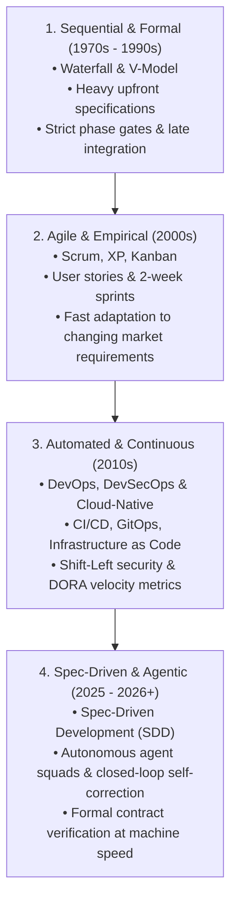
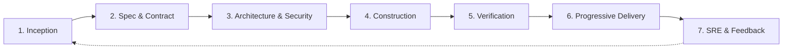
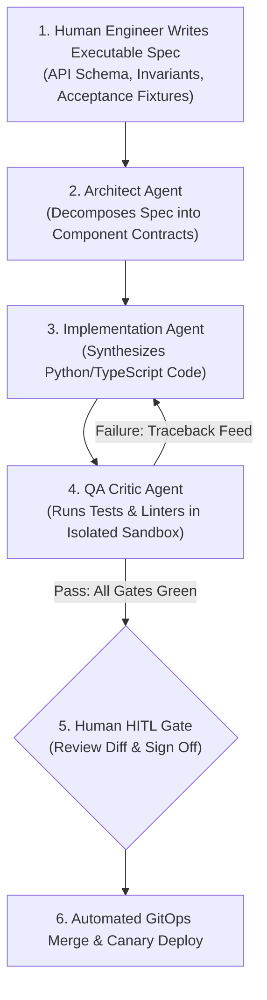

# System Development Life Cycle (SDLC): Master Compendium & Implementation Blueprint

> **Acinonyx Enterprise Systems Research Directorate**  
> **Document Code:** `RES-SDLC-2026-v1`  
> **Standard Compliance:** ISO/IEC/IEEE 12207:2026, ISO/IEC/IEEE 15288, NIST SP 800-218 (SSDF v1.2), DORA AI Capabilities Model  
> **Status:** Approved Reference Standard

---

## 1. Executive Summary & Evolutionary Arc

The **System Development Life Cycle (SDLC)** is the foundational framework governing how software systems are conceived, specified, architected, synthesized, verified, deployed, operated, and decommissioned. 

Over five decades, the SDLC has evolved across four distinct paradigms:



According to Google Cloud DORA's landmark *State of AI-Assisted Software Development* report, artificial intelligence is an **amplifier, not a fix**: it magnifies an organization's existing strengths while accelerating the chaos of defective architectures. Modern implementations must avoid "vibe coding" (ad-hoc, unverified AI prompting) by anchoring to **deterministic, contract-driven specifications, automated multi-layered verification, and immutable GitOps delivery**.

---

## 🏛️ Compendium Structure & Deep Dive Modules

This compendium is organized into three exhaustive, dedicated modules:

| Module | Title & Focus | Key Subjects Covered |
|---|---|---|
| **[Module 1](file:///home/acinonyx/Desktop/MAS/research/system_development_life_cycle/01_empirical_studies_and_academic_foundations.md)** | **[Empirical Studies & Academic Foundations](file:///home/acinonyx/Desktop/MAS/research/system_development_life_cycle/01_empirical_studies_and_academic_foundations.md)** | Boehm's Defect Cost Curve ($1\times \rightarrow 200\times$), Microsoft/IBM TDD study (40–90% defect reduction), DORA Accelerate throughput & stability science, GitClear 153M LOC AI churn analysis, Conway's Law empirical validation. |
| **[Module 2](file:///home/acinonyx/Desktop/MAS/research/system_development_life_cycle/02_implementation_in_data_ai_and_consulting_firms.md)** | **[Implementation in Cloud Data, AI & Consulting Enterprises](file:///home/acinonyx/Desktop/MAS/research/system_development_life_cycle/02_implementation_in_data_ai_and_consulting_firms.md)** | DataOps SDLC on Google Cloud Platform & BigQuery (dbt/Dataform, 3-tier modeling, dry-run cost controls, ephemeral PR datasets), Client Consulting Engagement Lifecycle (SOW to UAT), and Autonomous Multi-Agent Squads (MAS-Core). |
| **[Module 3](file:///home/acinonyx/Desktop/MAS/research/system_development_life_cycle/03_methods_and_frameworks_catalog.md)** | **[Master Catalog of SDLC Methods, Frameworks & Standards](file:///home/acinonyx/Desktop/MAS/research/system_development_life_cycle/03_methods_and_frameworks_catalog.md)** | Operational encyclopedia: Extreme Programming (XP), Scrum, Kanban/Lean, Shape Up, Spec-Driven Development (SDD), C4 Model, ADRs, Data Contracts, NIST SP 800-218 (SSDF), STRIDE/PASTA, GitOps, SRE, Team Topologies, Multi-Agent Debate. |

---

## 2. Foundational International Standards

High-performing enterprise engineering organizations implement the SDLC within international standard frameworks:

### 2.1 ISO/IEC/IEEE 12207:2026 (Software Life Cycle Processes)

ISO/IEC/IEEE 12207 establishes a comprehensive process architecture for software systems. It is deliberately **model-agnostic**, prescribing the necessary engineering processes regardless of whether an organization executes via Agile, Scrum, DevOps, or continuous agentic swarms:

1. **Agreement Processes:** Acquisition and supply protocols, supplier evaluation, and contractual acceptance.
2. **Organizational Project-Enabling Processes:** Life cycle model governance, infrastructure provisioning, portfolio management, quality assurance, and human resource/agent competency management.
3. **Technical Management Processes:** Planning, performance assessment, risk management, configuration control, and measurement frameworks.
4. **Technical Processes:**
   - *Stakeholder Needs & Requirements Definition*
   - *System/Software Requirements Analysis*
   - *Architecture & Detailed Design Definition*
   - *Implementation (Construction)*
   - *Integration & Verification (Verification: "Did we build the system right?")*
   - *Validation (Validation: "Did we build the right system?")*
   - *Transition (Deployment) $\rightarrow$ Operation $\rightarrow$ Maintenance $\rightarrow$ Disposal*

### 2.2 NIST SP 800-218 (Secure Software Development Framework - SSDF v1.2)

In accordance with U.S. Executive Order 14028, NIST SP 800-218 provides outcome-focused security practices embedded directly across the SDLC:

* **Prepare the Organization (PO):** Establish role-based security training, configure secret management vaults, and define automated compliance gates.
* **Protect the Software (PS):** Protect source code from unauthorized alteration, enforce cryptographically signed commits (Sigstore/Cosign), and maintain automated Software Bills of Materials (SBOMs) achieving SLSA Level 3+ provenance.
* **Produce Well-Secured Software (PW):** Shift-left automated vulnerability analysis (SAST, SCA, DAST) into local developer hooks and continuous integration workflows.
* **Respond to Vulnerabilities (RV):** Continuous vulnerability monitoring, rapid response patch pipelines, and blameless post-mortems.

---

## 3. Comparative Evaluation of SDLC Models

| Methodology | Core Philosophy | Primary Strengths | Critical Failure Modes | Ideal Use Case |
|---|---|---|---|---|
| **Waterfall** | Linear, phase-gated sequence (Plan $\rightarrow$ Design $\rightarrow$ Code $\rightarrow$ Test $\rightarrow$ Deploy). | Predictable cost/timelines when requirements are frozen; auditability. | High risk of total failure upon late integration; zero adaptability to market change. | Aerospace, medical implants, physical hardware co-design. |
| **V-Model** | Strict symmetry between each design level and its corresponding test tier. | Explicit verification & validation planning early in the life cycle. | Inflexible; changes in requirements require expensive cascading re-specifications. | Rail signaling, automotive safety systems (ISO 26262). |
| **Spiral (Boehm)** | Risk-driven iterations combining Waterfall discipline with prototyping. | Early risk identification and mitigation before expensive capital commitments. | Heavy managerial overhead; requires elite risk analysis talent. | Frontier research, moonshot defense R&D. |
| **Scrum** | Time-boxed iterations (1–4 week sprints) with cross-functional roles. | Rapid cadence, high team alignment, clear inspect-and-adapt cadence. | "Water-Scrum-Fall" anti-pattern; story point inflation; meeting fatigue. | Commercial consumer & SaaS applications. |
| **Kanban / Lean** | Continuous flow, Work-in-Progress (WIP) limits, elimination of waste. | Minimizes cycle time; zero batch delays; continuous delivery. | Lack of long-term milestone predictability without strong statistical forecasting. | Platform infrastructure, Site Reliability Engineering, maintenance. |
| **Shape Up** | 6-week fixed-time/variable-scope cycles with 2-week cool-downs; no daily standups. | Eliminates perpetual backlogs; high autonomy for 2-person builder squads. | Requires highly autonomous senior talent; struggles with complex enterprise cross-dependencies. | Product-led SaaS companies (Basecamp, small tech startups). |
| **DevSecOps / GitOps** | Continuous automated verification and delivery triggered by Git state changes. | Continuous feedback; automated security gates; instant rollbacks. | Requires sophisticated internal developer platforms (IDP); failure prone if tests are weak. | Cloud-native microservices, modern enterprise platforms. |
| **Spec-Driven Agentic (2026)** | Formal executable specifications executed by autonomous multi-agent squads in sandboxes. | 10x-50x implementation velocity; deterministic verification; self-healing code loops. | Catastrophic hallucination drift if specifications lack formal type contracts. | Frontier AI engineering, modern enterprise platforms. |

---

## 4. The Modern 7-Stage SDLC Re-Engineered



### Stage 1: Problem Inception, Discovery & Feasibility
- **Economic Prioritization:** Use Cost of Delay (CoD) and Opportunity Solution Trees instead of arbitrary feature requests.
- **Architectural Spikes:** Execute time-boxed proof-of-concepts to validate latency, bandwidth, and third-party API reliability.
- **Value Stream Mapping:** Map every step from concept to production to eliminate operational waste before writing code.

### Stage 2: Requirements & Formal Specification (Contract-First)
- **Spec-Driven Development (SDD):** Define formal OpenAPI 3.1, JSON Schema Draft 2020-12, or Protobuf schemas *before* writing application code.
- **Domain-Driven Design (DDD):** Establish bounded contexts, aggregates, and a ubiquitous language shared between product managers, domain experts, and engineers.
- **Executable Acceptance Criteria:** Express acceptance criteria as declarative Gherkin/BDD scenarios or JSON test fixtures directly usable by automated runners.

### Stage 3: Architecture, Modularity & Threat Modeling
- **Architectural Decision Records (ADRs):** Record technical decisions (e.g., choice of database, concurrency model) in version-controlled markdown under `/docs/adr/`.
- **C4 Architecture Visualizations:** Maintain Context, Container, Component, and Code diagrams directly in the repository via Mermaid or Structurizr.
- **Threat Modeling (STRIDE / PASTA):** Identify trust boundaries, data flows, and potential threat vectors before implementation.

### Stage 4: Code Construction & Trunk-Based Development
- **Trunk-Based Development:** Abandon long-lived feature branches. Merge small, atomic PRs ($\le 200$ LOC) into `main` daily. Hide incomplete work behind feature flags.
- **Test-Driven Development (TDD):** Red-Green-Refactor discipline forces decoupled architectures and clean dependency injection.
- **Strict Typing & Static Analysis:** Utilize zero-tolerance strict typing (`mypy --strict`, TypeScript `strict: true`) and fast linters (`ruff`, `biome`).

### Stage 5: Verification, Validation & DevSecOps Gateways
- **Testing Honeycomb:** Emphasize fast unit tests and comprehensive integration/contract tests (Pact) over brittle end-to-end browser tests.
- **Mutation Testing:** Employ mutation testing (e.g., `mutmut`, Stryker) to ensure tests catch actual logic faults.
- **Automated DevSecOps Pipeline:**
  - *SAST:* SonarQube, Semgrep, CodeQL.
  - *SCA / SBOM:* Trivy, Snyk, CycloneDX.
  - *Secret Scanners:* Gitleaks, TruffleHog.
- **Ephemeral Environments:** Automatically spin up dedicated preview environments per PR on Kubernetes or serverless containers.

### Stage 6: Progressive Delivery & GitOps
- **GitOps Engine:** Use ArgoCD or Flux to ensure that Git is the single source of truth for desired infrastructure state.
- **Canary Releases:** Shift traffic gradually (1% $\rightarrow$ 5% $\rightarrow$ 25% $\rightarrow$ 100%) using Argo Rollouts or Flagger, automatically rolling back if error rates spike.
- **Feature Flagging:** Decouple code deployment from feature release using LaunchDarkly or Unleash.
- **Expand-Contract Database Migrations:** Ensure all schema migrations remain backwards-compatible with active services.

### Stage 7: SRE, Observability & Continuous Evolution
- **OpenTelemetry Instrumentation:** Standardize on vendor-neutral distributed tracing, metrics, and structured logging.
- **SLOs & Error Budgets:** Align development velocity with system reliability. Freeze non-critical feature releases when the error budget is depleted.
- **Chaos Engineering:** Proactively validate system resilience using Chaos Mesh or Gremlin in staging environments.
- **Blameless Post-Mortems:** Transform production outages into actionable regression tests and architecture backlog items.

---

## 5. Frontier 2026: Spec-Driven Development & The Agentic SDLC

In modern software engineering, coding agents (such as Claude Code, Cursor, Devin, and MAS autonomous squads) write code at machine speed. Without strict guardrails, this creates massive technical debt.

**The Golden Rule of the Agentic SDLC:**  
*Human engineers write and govern the specifications and evaluation suites; autonomous agents execute the code synthesis within sandboxed verification loops.*



### The 7 Core Tenets of the Agentic SDLC
1. **Contract-First Authority:** Specifications are executable contracts, not informal chat prompts.
2. **Context-Rich Knowledge Repositories:** Agents are grounded with indexed architecture documentation, style guides, and episodic memory.
3. **Multi-Agent Dialectical Topology:** Specialized roles (Architect, Engineer, QA Critic) review each other's output with contrarian critique to eliminate sycophancy.
4. **Sandboxed Deterministic Verification:** All generated code runs inside hermetic execution sandboxes (Docker, Bubblewrap, gVisor).
5. **Human-in-the-Loop (HITL) Governance:** High-blast-radius operations (production deploys, billing modifications, database schema drops) require explicit human sign-off.
6. **Closed-Loop Self-Healing:** Tracebacks and compiler errors are fed back into the agent for automated repair ($K \le 3$).
7. **Small Batch Discipline:** Keep agent pull requests under 200 lines to ensure thorough human review.

---

## 6. The Enterprise Reference Toolchain

```
┌────────────────────────────────────────────────────────────────────────┐
│                        MODERN SDLC STACK MATRIX                        │
└────────────────────────────────────────────────────────────────────────┘
  PLAN & SPEC       SYNTHESIZE & CODE     TEST & VERIFY         DEPLOY & RUN
 ┌───────────────┐ ┌───────────────────┐ ┌───────────────────┐ ┌───────────────┐
 │ • Linear /    │ │ • Git (Trunk)     │ │ • PyTest / Jest   │ │ • Kubernetes  │
 │   Jira        │ │ • VSCode / Cursor │ │ • Semgrep / Sonar │ │ • ArgoCD      │
 │ • OpenAPI 3.1 │ │ • Claude / Copilot│ │ • Trivy / Snyk    │ │ • LaunchDarkly│
 │ • Structurizr │ │ • Pre-commit Hook │ │ • Playwright E2E  │ │ • Datadog /   │
 │ • ADR Repo    │ │ • uv / Docker     │ │ • Mutmut Mutation │ │   OpenTelemetry
 └───────────────┘ └───────────────────┘ └───────────────────┘ └───────────────┘
```

---

## 7. Metrics & Governance: DORA & SPACE

### DORA 4 Core Metrics
- **Deployment Frequency (DF):** Multiple times per day per team.
- **Lead Time for Changes (LTFC):** Less than 1 hour from commit to production.
- **Change Failure Rate (CFR):** Less than 5%.
- **Failed Deployment Recovery Time (FDRT):** Less than 1 hour.

### DORA AI Capabilities Model (7 Systemic Factors)
1. **Clear & Communicated AI Stance**
2. **Healthy Data Ecosystems**
3. **AI-Accessible Internal Data**
4. **Strong Version Control Practices**
5. **User-Centric Focus**
6. **Quality Internal Platforms**
7. **Working in Small Batches**

---

## 8. Enterprise Organizational Design: Team Topologies

To avoid Conway's Law anti-patterns, structure teams according to **Team Topologies**:
- **Stream-Aligned Teams:** Aligned to a single, continuous stream of customer-facing work.
- **Platform Teams:** Provide internal developer platforms (IDPs), ephemeral environments, and self-service APIs.
- **Enabling Teams:** Cross-functional coaches who embed to elevate team capabilities in DevSecOps, AI tooling, and testing.
- **Complicated-Subsystem Teams:** Specialist teams for high-complexity domains (cryptography, mathematical modeling).

---

*Compiled by Project ACINONYX Research Directorate.*
