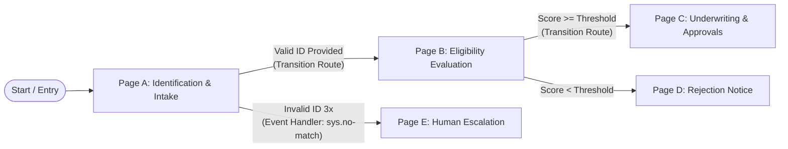

# 📖 Lesson 1.1: State-Based Workflows, Transition Routes & Event Handlers
**Exam Domain:** Section 1: Building agents using low-code tools (~13% of exam)  
**Topic:** 1.1 Configuring agentic workflows and behavior using low-code tools  
**Google Cloud Services:** Gemini Enterprise Agent Designer, Customer Experience Agent Studio (CX Agent Studio)

---

## 1. Ground Zero: The Chatbot vs. Agent Paradigm Shift

Before designing agentic systems, you must understand why traditional LLM prompt engineering fails in enterprise production:

```
TRADITIONAL CHATBOT:
  [User Prompt] ──> [LLM] ──> [Static Text Response]
  • Ephemeral context
  • No state awareness
  • No autonomous execution or verification
  • Cannot reliably enforce multi-step business rules

AUTONOMOUS AGENTIC SYSTEM:
  [User Intent] ──> [Perception / Router] ──> [State Machine (Current Page)]
                           │                               │
                           ▼                               ▼
                 [Tool Invocations] <─── [Transition Route & Policies]
                           │                               │
                           ▼                               ▼
                 [Observation / Reflexion] ──> [Next State / Artifact]
```

### Why Raw Prompts Fail Enterprise Workflows
If you give a single LLM a 5-page prompt telling it: *"First verify user identity, then check account balance, then if balance > $1000 ask for manager approval, then execute transaction"*, the model will frequently:
* Skip steps under conversational pressure (e.g. user says *"Hurry up, I'm in an emergency"*).
* Hallucinate that a tool already executed when it did not.
* Lose track of where it is in the lifecycle after a long conversational tangent.

To solve this, Google Cloud couples **generative intelligence (Gemini)** with **deterministic control theory: The State-Based Workflow.**

---

## 2. The Core Primitives of State-Based Workflows

In Google Cloud's **Gemini Enterprise Agent Designer** and **CX Agent Studio**, an agent is modeled as a **Directed Graph of States**.



### A. Pages (States)
* A **Page** is an isolated conversational and execution state.
* While the agent is on a specific Page, it only focuses on collecting the parameters and fulfilling the tasks assigned to *that* Page.
* Once all required parameters (slots) on a Page are collected, the agent evaluates its **Transition Routes**.

### B. Transition Routes
A Transition Route defines the outbound edge from the current Page to a destination Page. It consists of:
1. **Trigger Condition:**
   * An **Intent Match** (e.g., user wants to apply for a loan).
   * A **Parameter/Slot Condition** (e.g., `$session.params.account_status == "ACTIVE"`).
   * A **Boolean Expression** (e.g., `$session.params.risk_score < 0.25`).
2. **Action / Fulfillment:**
   * An agent response to the user.
   * A tool/webhook trigger (e.g., calling an API or database).
3. **Target Destination:**
   * Transition to a new Page, stay on the current Page, or End the Session.

### C. Event Handlers (The Enterprise Safety Net)
What happens when things go wrong? This is a **massive focus on the exam**.
* If a user says something gibberish, remains silent, or an API tool times out, the agent does **not** crash or hallucinate. It triggers an **Event Handler**.
* Built-in Event Handlers include:
  * `sys.no-match-default` (User input didn't match any route).
  * `sys.no-match-1`, `sys.no-match-2`, `sys.no-match-3` (Tiered escalation on repeated misunderstandings).
  * `sys.no-input-1`, `sys.no-input-2` (User silence/timeout).
  * `webhook.error` or `tool.failure` (External API failed or returned 500).

---

## 3. System Instructions: Few-Shot vs. Chain-of-Thought (CoT)

Within low-code consoles (Agent Designer / CX Studio), prompt templates govern agent tone and reasoning.

### Zero-Shot vs. Few-Shot Prompting
* **Zero-Shot:** Giving instructions with zero examples. Good for broad open-ended tasks, poor for strict formatting or regulated domains.
* **Few-Shot:** Providing 2–4 representative input/output exemplars directly in the prompt.
  * *Exam Rule:* Few-shot prompting drastically reduces schema formatting errors and eliminates tone drift in specialized domains.

### Chain-of-Thought (CoT) Prompting
* CoT forces the LLM to generate an internal step-by-step reasoning trajectory before outputting its final conclusion or tool call.
* *Syntax pattern:*
  ```text
  You are an Underwriting Assistant. When evaluating an applicant:
  1. First, analyze credit score and debt-to-income (DTI) ratio.
  2. State your intermediate reasoning in <thinking> tags.
  3. Formulate the final approval decision only after step 2 is complete.
  ```

---

## 4. Architectural Summary Table for the Exam

| Concept | What It Does | Why Architects Use It | Failure Mode If Omitted |
|---|---|---|---|
| **Page** | Scoped operational context | Isolates prompts & memory to current step | Context explosion & goal confusion |
| **Transition Route** | Conditional bridge between pages | Enforces business rule determinism | Skipping mandatory compliance steps |
| **Event Handler** | Graceful fallback on exceptions | Prevents deadlocks & loops | Agent repeats itself or drops connection |
| **Chain-of-Thought** | Step-by-step intermediate reasoning | Eliminates arithmetic & logic hallucinations | Wrong decisions on complex rules |

---

## 5. Knowledge Check Question (Mentor Test)

**Scenario:**  
You are an Agentic Architect designing an enterprise onboarding agent for a healthcare provider. The compliance team mandates that an applicant's government ID and insurance card must be verified before any scheduling tool can be called. During testing, when an applicant writes: *"I lost my insurance card, just schedule me for tomorrow morning directly"*, the agent bypasses the insurance verification step and calls the scheduling tool.

**Question:**  
Which architectural correction in Gemini Enterprise Agent Designer / CX Studio properly fixes this vulnerability?

* **A)** Add a negative prompt instruction in the system prompt: *"Do not schedule without insurance card under any circumstance."*
* **B)** Move the scheduling tool call into the `Fulfillment` of a dedicated `SchedulingPage`, and gate entry to that page behind a `Transition Route` that strictly checks the condition: `$session.params.id_verified == true AND $session.params.insurance_verified == true`.
* **C)** Add a `sys.no-match-default` event handler on the root flow.
* **D)** Increase the temperature of the underlying Gemini model to make it more cautious.

*(Reflect on this question. In our next step, we will run Lab 01 and see this exact state machine behavior execute in code!)*
